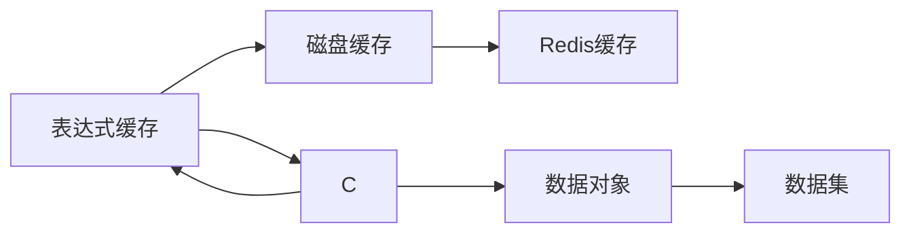
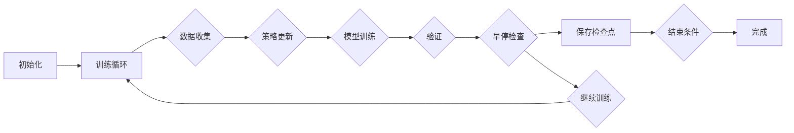

# Qlib 完整学习指南

> 一份深入的量化投资平台学习文档，基于源码分析和实际应用案例。

> **生成时间**：2026-03-30
> **版本**：v1.0

---

## 目录

1. [项目概述](#一项目概述)
2. [快速开始](#二快速开始)
3. [核心架构](#三核心架构)
4. [数据系统](#四数据系统)
5. [模型系统](#五模型系统)
6. [回测系统](#六回测系统)
7. [强化学习](#七强化学习)
8. [工作流系统](#八工作流系统)
9. [实际应用案例](#九实际应用案例)
10. [最佳实践](#十最佳实践)

---

## 一、项目概述

### 1.1 什么是Qlib？

Qlib（Quantitative Investment Platform）是微软开源的一个**面向人工智能的量化投资平台**，旨在通过AI技术解决量化投资的核心问题。

**核心特性：**
- � **统一的数据接口**：支持多种数据源和格式
- 🤖 **丰富的模型库**：内置LightGBM、XGBoost、CatBoost和多种深度学习模型
- 🔄 **完整的回测框架**：支持高频、日内、多资产等回测场景
- 🤖 **工作流管理**：统一的训练、评估和部署流程
- � **强化学习支持**：完整的RL训练和推理框架
- 📊 **高性能设计**：基于NumPy和Cython优化关键操作

### 1.2 应用场景

Qlib适用于以下量化投资场景：

| 场景 | 说明 |
|------|------|
| **多因子选股** | 使用LightGBM/XGBoost从数百个因子中选出最强信号 |
| **深度学习预测** | 使用LSTM/Transformer捕捉复杂市场模式 |
| **组合优化** | 使用优化器在约束条件下最大化收益 |
| **高频交易** | 分钟级行级别的回测和策略验证 |
| **强化学习交易** | 使用RL学习最优执行策略 |
| **研究回测** | 快速验证策略想法和因子发现 |

### 1.3 技术栈

```yaml
核心依赖:
  - Python >= 3.8
  - NumPy >= 1.20
  - Pandas >= 1.3
  - PyTorch >= 1.8 0  # 深度学习
  - LightGBM >= 3.3 0  # 梯度树模型

可选依赖:
  - Cython >= 3.0.0      # 性能优化
  - MongoDB >= 4.0          # 数据存储
  - Redis >= 5.0             # 缓存
  - MLflow >= 1.28.0       # 实验跟踪

数据源:
  - MySQL / PostgreSQL      # 关系型数据
  - CSV / Parquet           # 文件型数据
  - Qlib格式数据            # Qlib本地存储
```

---

## 二、快速开始

### 2.1 安装

```bash
# 从PyPI安装（推荐使用虚拟环境）
pip install pyqlib

# 从源码安装（包含所有依赖）
git clone https://github.com/microsoft/qlib.git
cd qlib
pip install -e .
```

### 2.2 初始化

```python
import qlib

# 基本初始化
qlib.init(provider_uri="~/.qlib/qlib_data/cn_data", region="cn")

# 使用自定义配置
qlib.init(provider_uri="~/.qlib/qlib_data/cn_data",
           region="cn",
           redis={"host": "localhost", "port": 6379},
           kernels=["[YOUR_KERNEL_DIR]"])
```

### 2.3 第一个示例：简单的因子选股

```python
import qlib
from qlib.data import D
from qlib.contrib.model.gbdt import LGBModel
from qlib.contrib.evaluate import risk_analysis

# 初始化
qlib.init(provider_uri="~/.qlib/qlib_data/cn_data", region="cn")

# 获取数据
# 读取股票列表（从文件读取）
def read_instruments(market="csi300"):
    inst_file = Path("~/.qlib/qlib_data/cn_data/instruments").expanduser() / f"{market}.txt"
    with open(inst_file) as f:
        lines = f.read().strip().split("\n")
        instruments = [line.split("\t")[0] for line in lines if line.strip()]
    return instruments

instruments = read_instruments("csi300")  # 沪深300只
print(f"可选资产数量: {len(instruments)}")

# 加载因子（这里使用基础特征）
fields = ["Ref($close, 1)", "Ref($close, 2)", "Ref($close, 3)",
          "Ref($close, 4)", "Ref($close, 5)"]

# 创建数据集
start_time = "2020-01-01"
end_time = "2023-12-31"
dataset = D.features(
    instruments={"market": "csi300", "filter_pipe": []},
    fields=fields,
    start_time=start_time,
    end_time=end_time,
    freq="day"
)

# 分割数据
train_df = dataset.prepare("2020-01-01", col_set=["feature", "label"], data_key="infer")
test_df = dataset.prepare("2023-01-01", col_set=["feature", "label"], data_key="infer")

print(f"训练数据形状: {train_df.shape}")
print(f"测试数据形状: {test_df.shape}")

# 准备标签（假设使用未来收益率作为标签）
label_field = "Ref($close, 1)"  # 下日收盘价
  # 计算收益率

# 训练模型
model = LGBModel(
    loss="mse",         # 均方误差损失
    eval_metric="mean", # 使用平均绝对误差作为评估指标
    col_sample_weight="label"  # 按标签列加权样本
)

# 训练
model.fit(dataset
    segment="train"  # 训练段
)

# 预测
predictions = model.predict(dataset segment="test")

# 计算IC（信息系数）
import pandas as pd
from scipy.stats import spearmanr

for col in fields:
    ic = spearmanr.corr(predictions[col], test_df[col])
    print(f"{col} IC: {ic:.4f}")
```

### 2.4 运行回测

```python
from qlib.backtest import backtest_loop
from qlib.contrib.strategy import TopkDropoutStrategy

# 创建简单的策略
class MyStrategy:
    """简单的等权买入持有策略"""
    def __init__(self):
        self.weights = {"buy": 0.5, "sell": 0.5}  # 各50%仓位

    def generate_trade_decision(self, execute_result=None):
        from qlib.backtest.decision import Order
        from qlib.backtest import get_trade_decision

        # 获取当前投资组合
        if execute_result is None:
            return  # 第一次调用，返回None

        # 生成交易决策
        portfolio = execute_result.get("portfolio")
        cash = portfolio.cash

        # 按权重分配资金
        total_value = cash + portfolio.current_position.sum()
        buy_amount = total_value * self.weights["buy"]
        sell_amount = total_value * self.weights["sell"]

        # 创建订单（简化示例，实际应根据选股结果创建）
        orders = [
            Order(stock_id="SH600000", amount=buy_amount, direction="buy"),
            Order(stock_id="SH000001", amount=sell_amount, direction="sell"),
        ]

        return get_trade_decision(stock_order_iter=iter(orders))

# 回测配置
config = {
    # 模型配置
    "model": {
        "class": "qlib.contrib.model.gbdt.LGBModel",
        "module_path": "qlib.contrib.model.gbdt",
        "kwargs": {
            "loss": "mse",
            "eval_metric": "mean"
        }
    },

    # 数据配置
    "dataset": {
        "class": "qlib.data.dataset.DatasetH",
        "module_path": "qlib.data.dataset",
        "kwargs": {
            "handler": {
                "class": "qlib.contrib.data.handler.Alpha158",
                "module_path": "qlib.contrib.data.handler"
            },
            "segments": {
                "train": ("2020-01-01", "2022-12-31"),
                "test": ("2023-01-01", "2023-12-31")
            }
        }
    },

    # 回测配置
    "backtest": {
        "start_time": "2020-01-01",
        "end_time": "2023-12-31",
        "exchange": {
            "class": "qlib.backtest.exchange.Exchange",
            "module_path": "qlib.backtest.exchange",
            "kwargs": {
                "freq": "day",
                "deal_price": "close",
                "open_cost": 0.0003,
                "close_cost": 0.0003,
            }
        },
        "benchmark": "SH000300"  # 基准指数
    }
}

# 运行回测
portfolio_metrics, indicator_metrics = backtest_loop(
    trade_strategy=MyStrategy(),
    **config
)

# 分析结果
print(f"总收益: {portfolio_metrics['return'].sum():.2%}")
print(f"最大回撤: {portfolio_metrics['drawdown'].min():.2%}")
print(f"夏普比率: {portfolio_metrics['sharpe']:.4f}")
```

---

## 三、核心架构

### 3.1 整体架构图

```mermaid
graph TB
    subgraph 数据层[数据层]
    subgraph 模型层[模型层]
    subgraph 策略层[策略层]
    subgraph 回测层[回测层]
    subgraph 工作流层[工作流层]

    D[数据模块] --> D[Provider]
    D[Provider] --> D[Dataset]
    D[Dataset] --> M[模型接口]
    M[模型接口] --> M[GBDT]
    M[模型接口] --> M[XGGB]
    M[模型接口] --> M[PyTorch]

    S[策略模块] --> S[TopkDropout]
    S[策略模块] --> S[信号生成]
    S[信号生成] --> M[模型预测]

    B[回测模块] --> B[Exchange]
    B[回测模块] --> B[Account]
    B[回测模块] --> B[Executor]

    W[工作流] --> W[R.start]
    W[工作流] --> W[Recorder]
    W[工作流] --> W[TaskManager]

    M[模型] --> W[训练]
    S[策略] --> B[回测]
```

### 3.2 核心设计原则

| 原则 | 说明 |
|------|------|
| **模块化设计** | 每个模块有清晰的职责边界，通过接口交互 |
| **可扩展性** | 用户可以自定义模型、策略、数据处理器等 |
| **类型安全** | 使用TypeVar和TypedDict确保类型安全 |
| **配置驱动** | 支持YAML配置文件，无需修改代码 |
| **性能优化** | 缓存机制、批量处理、Cython加速 |

---

## 四、数据系统

### 4.1 数据架构详解

Qlib的数据系统采用**三层架构**设计，为不同场景提供最优的数据访问方式。

```mermaid
graph LR
    subgraph 存储层[Storage Layer]
    subgraph 提供层[Provider Layer]
    subgraph 表达层[Expression Layer]

    S1[文件存储] --> P1[文件提供者]
    S2[内存存储] --> P2[内存提供者]
    S3[数据库存储] --> P3[数据库提供者]

    P1 & P2 & P3 --> E[表达式引擎]
    E --> D[数据集]
```

#### 4.1.1 存储层（Storage）

存储层定义了数据访问的底层接口，支持多种存储后端。

**核心存储类：**

| 类名 | 功能 | 使用场景 |
|--------|------|----------|
| `CalendarStorage` | 存储交易日历数据 | 日历管理、交易日获取 |
| `InstrumentStorage` | 存储股票代码信息 | 股票列表、有效日期范围 |
| `FeatureStorage` | 存储特征数据 | 特征数据的读写、缓存 |

**实现方式：**

```python
# 基于文件的存储
from qlib.data.storage import FileCalendarStorage, FileInstrumentStorage, FileFeatureStorage

calendar_storage = FileCalendarStorage(freq="day")
instrument_storage = FileInstrumentStorage(instrument_dir="~/.qlib/instruments/")
feature_storage = FileFeatureStorage(feature_dir="~/.qlib/features/")

# 获取交易日历
trading_days = calendar_storage.get_trading_dates(start="2020-01-01", end="2023-12-31")

# 获取股票列表
instruments = instrument_storage.get_instruments()

# 读取特征数据
features = feature_storage.read(instrument="SH600000", field="close", start_time="2020-01-01")
```

#### 4.1.2 提供层（Provider）

提供层为上层应用提供统一的数据访问接口，处理数据缓存和格式转换。

**核心Provider类：**

| 类名 | 功能 | 特性 |
|--------|------|--------|
| `CalendarProvider` | 提供交易日历 | 缓存、自动对齐 |
| `InstrumentProvider` | 提供股票代码 | 支持过滤、缓存 |
| `DataProvider` | 提供统一数据接口 | 自动推断数据频率 |

```python
from qlib.data import D

# 统一数据接口
data = D.provider_uri = "~/.qlib/qlib_data/cn_data"

# 获取交易日历
trading_days = D.calendar(start_time="2020-01-01", end_time="2023-12-31")

# 获取股票列表
instruments = D.instruments(region="cn")

# 加载特征数据
features = D.features(
    instruments=["SH600000", "SH000001"],
    fields=["close", "volume"],
    start_time="2020-01-01",
    end_time="2023-12-31"
)
```

#### 4.1.3 表达式系统（Expression）

Qlib提供强大的表达式语言，支持复杂的特征工程。

**操作符类型：**

| 类型 | 示例 | 说明 |
|------|------|------|
| **算术运算** | `+`, `-`, `*`, `/` | 基本数学运算 |
| **比较运算** | `>`, `<`, `>=`, `<=` | 条件判断 |
| **滚动操作** | `Ref()`, `Roll()`, `Mean()` | 时序操作 |
| **统计函数** | `Std()`, `Corr()`, `Rank()` | 统计指标 |
| **高级操作** | `Diff()`, `If()` | 条件逻辑、缺失值处理 |

**高级用法示例：**

```python
from qlib.data import D

# 1. 使用滚动窗口计算收益率
fields收益率 = [
    "Ref($close, 1)/Ref($close, 5) - 1",  # 5日收益率
    "Mean($close, 10)",  # 10日均价
    "Std($close, 20)",  # 20日标准差
]

# 2. 使用条件表达式
fields波动性 = [
    "If($close > $open, Abs($close - $open)/$open)",  # 波动率
    "If($volume > 0, $volume)"  # 成交量过滤
]

# 3. 使用排名和排序
fields排序 = [
    "Rank($close, 10)",  # 按收盘价排序
    "Rank($volume, 10)",  # 按成交量排序
]

# 加载特征
dataset = D.features(
    instruments=["SH600000"],
    fields=fields,
    start_time="2020-01-01",
    end_time="2023-12-31"
)

# 使用表达式进行过滤
mask = dataset["volume"] > 0  # 成交量过滤
filtered_data = dataset[mask]

print(f"原始数据形状: {dataset.shape}")
print(f"过滤后形状: {filtered_data.shape}")
```

#### 4.1.4 数据集（Dataset）

数据集是Qlib的核心抽象，提供统一的数据接口给模型。

```python
from qlib.data.dataset import DatasetH, TSDatasetH

# 标准数据集
dataset = DatasetH(
    handler={
        "class": "qlib.contrib.data.handler.Alpha158",
        "module_path": "qlib.contrib.data.handler"
    },
    segments={
        "train": ("2020-01-01", "2022-12-31"),
        "valid": ("2023-01-01", "2023-06-30"),
        "test": ("2023-07-01", "2023-12-31")
    }
)

# 分段访问
train_df = dataset.prepare("train", col_set=["feature", "label"])
valid_df = dataset.prepare("valid", col_set=["feature", "label"])

print(f"训练特征: {list(train_df['feature'].unique())}")
print(f"训练数据形状: {train_df.shape}")
```

**时间序列数据集（TSDatasetH）：**

```python
from qlib.data.dataset import TSDatasetH

# 时间序列数据集（适合LSTM/Transformer）
ts_dataset = TSDatasetH(
    handler={
        "class": "qlib.contrib.data.handler.Alpha360",
        "module_path": "qlib.contrib.data.handler"
    },
    segments={
        "train": ("2020-01-01", "2022-12-31"),
        "test": ("2023-01-01", "2023-12-31")
    },
    step_len=20,  # 每个序列的长度
    fillna=True
)

# PyTorch兼容
import torch
from torch.utils.data import DataLoader

ts_dataset.setup(config={"dropna": False})
train_loader = DataLoader(
    dataset=ts_dataset,
    batch_size=64,
    shuffle=True,
    num_workers=4
)

# 迭行训练
for batch in train_loader:
    features = batch["feature"]  # [batch_size, seq_len, feature_dim]
    labels = batch["label"]     # [batch_size, seq_len]
    # ... 训练代码 ...
```

### 4.2 数据处理管道

#### 4.2.1 数据处理器（Handler）

Handler负责原始数据的加载和基本处理。

**常用Handler：**

| Handler | 功能 | 说明 |
|--------|------|----------|
| `Alpha158` | 158个经典因子 | 学术界常用的158个因子 |
| `Alpha360` | 360个因子 | 覆盖更多技术指标 |
| `Quote` | 行情数据 | OHLC数据格式支持 |

```python
from qlib.contrib.data.handler import Alpha158

# 使用Alpha158因子
handler = Alpha158()

# 配置
handler.config = {
    "dropna": True,           # 删除缺失值
    "drop_multi_day": True,   # 删除多日
    "dropna_level": [1, 2],  # 删除特定级别的缺失值
}

# 应用Handler到数据
fields = handler.get_feature_config()

# 创建数据集
dataset = DatasetH(
    handler=handler,
    segments=segments
)
```

#### 4.2.2 处理器（Processor）

Processor在Handler之后进行更复杂的特征工程。

**内置Processor：**

```python
from qlib.data.dataset.processor import (
    RobustZScoreNorm,  # 鲁棒Z-score标准化
    Fillna,               # 填充缺失值
    ZScoreNorm,           # Z-score标准化
    Filter,                # 过滤数据
    Transformer           # 自定义转换
)

# 处理器链
processors = [
    RobustZScoreNorm(fields=["close", "volume"]),  # 标准化
    Fillna(),                                    # 填充
    Filter(lambda df: df["volume"] > 0), "过滤零成交量"),  # 过滤
]

# 应用到数据集
dataset = DatasetH(
    handler=Alpha158(),
    processor=processors,
    segments=segments
)
```

#### 4.2.3 自定义处理

```python
from qlib.data.dataset.processor import Processor, register_processor

@register_processor
class MomentumFactor(Processor):
    """计算动量因子"""
    def __init__(self, windows=20):
        self.windows = windows

    def __call__(self, df: pd.DataFrame) -> pd.DataFrame:
        # 计算20日动量
        momentum = df["close"].pct_change(self.windows) / df["close"].shift(self.windows)

        # 计算动量因子的信号
        # 当价格上涨且动量为正时为1
        signal = (df["close"].pct_change(1) > 0) & (momentum > 0).astype(int)

        return signal.to_frame(name=f"mom_{self.windows}")

# 使用自定义处理器
processors = [
    MomentumFactor(windows=5),
    MomentumFactor(windows=10),
    MomentumFactor(windows=20),
]

dataset = DatasetH(handler=Alpha158(), processor=processors, segments=segments)
```

### 4.3 数据缓存机制

Qlib提供多级缓存来提高性能：



**缓存配置：**

```python
import qlib

# 全局缓存配置
qlib.init(
    provider_uri="~/.qlib/qlib_data/cn_data",
    cache={
        "class": "qlib.data.cache.DatasetCache",  # 数据集缓存
        "kwargs": {
            "region": "cn",
            "max_mem": 10 * 1024 ** 3,  # 10GB内存缓存
            "ttl": 86400,                    # 24小时TTL
        }
    },
    expression_cache={
        "class": "qlib.data.cache.ExpressionCache",  # 表达式缓存
        "kwargs": {
            "max_mem": 5 * 1024 ** 3,  # 5GB内存缓存
            "pickle": True,                     # 支持序列化
        }
    },
    redis={
        "host": "localhost",
        "port": 6379,
        "db": 0  # 数据库编号
    }
)

# 使用时自动缓存
features = D.features(...)  # 第一次会计算并缓存
features2 = D.features(...)  # 第二次从缓存读取，速度快很多
```

---

## 五、模型系统

### 5.1 模型接口设计

Qlib提供统一的模型接口，支持多种机器学习框架。

```python
from qlib.model.base import Model

class MyModel(Model):
    """自定义模型示例"""

    def __init__(self, loss="mse", eval_metric="mean"):
        self.loss = loss
        self.eval_metric = eval_metric

    def fit(self, dataset, reweighter=None):
        """
        训练方法

        Parameters:
        - dataset: 数据集对象
        - reweighter: 样本加权器（可选）

        Returns:
        - None (训练后的模型保存在self中)
        """
        # 获取训练数据
        df_train = dataset.prepare("train", col_set=["feature", "label"])

        # 转换为模型需要的格式
        x_train = df_train["feature"].values
        y_train = df_train["label"].values

        # 训练模型
        self.model.fit(x_train, y_train)

    def predict(self, dataset, segment="test"):
        """
        预测方法

        Parameters:
        - dataset: 数据集对象
        - segment: 数据集段("train"/"valid"/"test"）

        Returns:
        - pd.Series: 预测结果
        """
        # 获取测试数据
        df_test = dataset.prepare(segment, col_set=["feature"])

        # 预测
        predictions = self.model.predict(df_test["feature"].values)

        return pd.Series(predictions, index=df_test.index)
```

### 5.2 传统机器学习模型

#### 5.2.1 GBDT模型

GBDT（Gradient Boosting Decision Tree）是Qlib的默认模型之一。

```python
from qlib.contrib.model.gbdt import LGBModel

# 创建模型
model = LGBModel(
    loss="mse",              # 损失函数
    eval_metric="mean",        # 评估指标
    col_sample_weight="label",   # 样本加权
)

# 重要参数
model.params = {
    "num_leaves": 300,       # 树的数量
    "learning_rate": 0.1,     # 学习率
    "max_depth": 6,           # 最大深度
    "min_child_weight": 0.1, # 叶子节点最小权重
}

# 训练
dataset = DatasetH(handler=Alpha158(), segments=segments)
model.fit(dataset)
```

**参数调优：**

| 参数 | 说明 | 影响 |
|------|------|------|
| `num_leaves` | 树的数量 | 更多树→更强，但易过拟合 |
| `learning_rate` | 学习率 | 过高可能欠拟合 |
| `max_depth` | 最大深度 | 越深→更复杂，但可能过拟合 |
| `subsample` | 子采样比例 | 控制过拟合 |

```python
# 使用参数调优
from qlib.workflow import R

config = {
    "model": {
        "class": "qlib.contrib.model.gbdt.LGBModel",
        "kwargs": model_params
    },
    "task": {
        "record": ["SignalRecord", "PortfolioAnalysis"]
    }
}

# 自动调优
with R.start(experiment_name="gbdt_tuning"):
    model = R.get_model()
    dataset = R.get_dataset()

    # 训练并记录
    model.fit(dataset)

    # 验证
    predictions = model.predict(dataset)
    ic = spearmanr.corr(predictions, dataset["label"])
    R.log_metrics(ic=ic)
```

#### 5.2.2 XGBoost模型

XGBoost是梯度提升树的优化版本。

```python
from qlib.contrib.model.xgboost import XGBModel

model = XGBModel(
    loss="mse",
    eval_metric="mean"
)

# XGBoost特有参数
model.params = {
    "n_estimators": 200,        # 树的数量
    "max_depth": 6,             # 最大深度
    "learning_rate": 0.05,       # 学习率
    "subsample": 0.8,          # 子采样比例（防过拟合）
    "reg_alpha": 0.1,            # L1正则化
    "reg_lambda": 1.0,            # L2正则化
}

# 训练
model.fit(dataset)
```

#### 5.2.3 LightGBM模型

LightGBM是微软开发的梯度提升框架。

```python
from qlib.contrib.model.catboost_model import CatBoostModel

model = CatBoostModel(
    loss="mse",
    eval_metric="mean"
)

# LightGBM特有参数
model.params = {
    "num_leaves": 200,
    "learning_rate": 0.1,
    "max_depth": 8,
    "feature_fraction": 0.8,  # 每次迭代随机选择80%的特征
    "bagging_temperature": 1.0,  # 增加随机性
}

# 训练
model.fit(dataset)
```

### 5.3 深度学习模型

#### 5.3.1 PyTorch模型接口

```python
from qlib.contrib.model.pytorch_nn import DNNModelPytorch

# 创建PyTorch模型
class LSTMModel(DNNModelPytorch):
    def __init__(self, d_feat=20, hidden_dim=64, num_layers=2, dropout=0.2):
        super().__init__()

        # LSTM网络
        self.d_feat = d_feat
        self.hidden_dim = hidden_dim
        self.num_layers = num_layers

        # 定义网络层
        self.net = nn.Sequential(
            nn.LSTM(d_feat, hidden_dim, num_layers, batch_first=True, dropout=dropout),
            nn.Linear(hidden_dim, 1)
        )

    def fit(self, dataset, lr=0.001, epochs=50, batch_size=256):
        """训练LSTM模型"""
        # 准备数据加载器
        ts_dataset = TSDatasetH(
            handler=Alpha158(),
            segments=dataset.segments
        )
        ts_dataset.setup(config={"dropna": False})

        # 创建DataLoader
        train_loader = DataLoader(
            dataset=ts_dataset,
            batch_size=batch_size,
            shuffle=True
        )

        # 训练循环
        optimizer = torch.optim.Adam(self.net.parameters(), lr=lr)
        criterion = nn.MSELoss()

        for epoch in range(epochs):
            for batch in train_loader:
                features = batch["feature"]  # [batch, seq, d_feat]
                labels = batch["label"]     # [batch, seq, 1]

                # 前向传播
                outputs = self.net(features)
                loss = criterion(outputs, labels)

                # 反向传播
                optimizer.zero_grad()
                loss.backward()
                optimizer.step()

    def predict(self, dataset, segment="test"):
        """预测"""
        ts_dataset = TSDatasetH(
            handler=Alpha158(),
            segments={segment: dataset.segments[segment]},
            step_len=dataset.segments[segment].get("len")
        )
        ts_dataset.setup(config={"dropna": False})

        predictions = []
        with torch.no_grad():
            for batch in ts_dataset:
                outputs = self.net(batch["feature"])
                pred = outputs[:, -1, 0].squeeze().numpy()
                predictions.extend(pred)

        return pd.Series(predictions)

# 使用模型
model = LSTMModel(d_feat=20, hidden_dim=64, num_layers=2)
dataset = DatasetH(handler=Alpha158(), segments=segments)
model.fit(dataset)
```

#### 5.3.2 Transformer模型

```python
from qlib.contrib.model.pytorch_transformer import TransformerModel

model = TransformerModel(
    d_feat=20,
    hidden_dim=64,
    num_heads=4,
    num_layers=4,
    dropout=0.1
)

# Transformer参数
model.params = {
    "d_model": hidden_dim,
    "n_heads": num_heads,      # 注意力头数
    "n_layers": num_layers,      # 层数数
    "dropout": dropout             # Dropout率
}

# 训练
model.fit(dataset)
```

#### 5.3.3 GAT模型

图注意力网络用于捕捉股票间的关系。

```python
from qlib.contrib.model.pytorch_gats import GATSModel

model = GATSModel(
    d_feat=20,        # 特征维度
    hidden_dim=64,    # 隐藏层维度
    num_layers=3,    # 层数数
    dropout=0.1      # Dropout率
)

# GAT参数
model.params = {
    "d_feat": d_feat,
    "hidden_dim": hidden_dim,
    "num_layers": num_layers,
    "dropout": dropout
}

# 训练
model.fit(dataset)
```

#### 5.3.4 模型集成

```python
from qlib.model.base import Model
from qlib.workflow import R

# 混度学习模型
deep_model = LSTMModel(d_feat=20, hidden_dim=64)

# 包装为Qlib模型
qlib_model = DNNModelPytorch(
    d_feat=deep_model.d_feat,
    model=deep_model.net
)

# 在Qlib工作流中使用
with R.start(experiment_name="lstm_backtest"):
    model = R.get_model()  # 获取qlib_model
    dataset = R.get_dataset()

    # 训练
    model.fit(dataset)

    # 预测
    predictions = model.predict(dataset)

    # 分析结果
    analysis = R.analyze(predictions)
```

### 5.4 模型训练技巧

#### 5.4.1 数据准备

```python
from qlib.data import D

# 1. 特征选择
fields = [
    "Ref($close, 1)",     # 收益率
    "Ref($close, 5)",     # 收益率
    "Mean($close, 10)",    # 移动平均
    "Std($close, 20)",    # 波动率
    "Corr($close, $close, 5)",  # 自相关性
    "Roll($close, 10, 5)"   # 滚动相关
    "Rank($close, 10)"    # 排名
]

# 2. 数据过滤
dataset = D.features(
    instruments={"market": "csi300", "filter_pipe": []},
    fields=fields,
    start_time="2020-01-01",
    end_time="2023-12-31"
)

# 3. 处理缺失值
dataset = dataset.fillna(method="ffill")  # 前向填充
dataset = dataset.dropna(subset=["field1", "field2"])  # 删除缺失值

# 4. 标准化
from qlib.data.dataset.processor import RobustZScoreNorm
processor = RobustZScoreNorm(fields=["close", "volume"])
dataset = DatasetH(handler=Alpha158(), processor=[processor])
```

#### 5.4.2 训练技巧

```python
# 早停机制
class EarlyStopping:
    def __init__(self, patience=10, min_delta=0.001):
        self.patience = patience
        self.min_delta = min_delta
        self.best_score = None
        self.counter = 0

    def __call__(self, current_score):
        if self.best_score is None:
            self.best_score = current_score
            return False

        if current_score > self.best_score + self.min_delta:
            self.best_score = current_score
            self.counter = 0
            return False

        self.counter += 1
        return self.counter >= self.patience

# 使用早停
early_stopping = EarlyStopping(patience=10, min_delta=0.001)
for epoch in range(100):
    val_loss = validate(model, val_loader)
    if early_stopping(val_loss):
        print(f"Early stopping at epoch {epoch}")
        break
```

#### 5.4.3 模型选择

```python
# 模型选择函数
def select_model(data_type, task_type):
    if data_type == "tabular":
        if task_type == "classification":
            return CatBoostModel()
        elif task_type == "regression":
            return LightGBM()
    elif task_type == "ranking":
            return LGBMRankerModel()
    else:
            raise ValueError("Unknown task type")

    elif data_type == "time_series":
        if task_type == "forecasting":
            return LSTMModel()
        elif task_type == "classification":
            return TransformerModel()
        else:
            raise ValueError("Unknown task type")

    else:
        raise ValueError("Unknown data type")

# 选择合适的模型
model = select_model("time_series", "forecasting")
```

---

## 六、回测系统

### 6.1 回测架构

```mermaid
graph TB
    subgraph 执行层[Execution Layer]
    subgraph 交易层[Trading Layer]

    E1[策略决策] --> T[交易订单]
    E1 --> T2[决策时间]

    T[交易订单] --> E2[Exchange]
    E2 --> E2[执行订单]
    E2 --> E2[返回成交信息]

    E2[Exchange] --> A[Account]
    A[Account] --> A[更新持仓]
    A[Account] --> M[指标计算]

    A[Account] --> M[记录交易]
```

### 6.2 核心组件

#### 6.2.1 Exchange（交易所）

交易所负责市场数据提供和交易执行。

```python
from qlib.backtest.exchange import Exchange

# 创建交易所
exchange = Exchange(
    freq="day",              # 数据频率
    start_time="2020-01-01",
    end_time="2023-12-31",
    codes="all",              # 交易代码
    deal_price="close",         # 成交价格
    limit_threshold=0.095,     # 涨跌停阈值
    open_cost=0.0003,         # 买入成本
    close_cost=0.0003,        # 卖出成本
    volume_threshold=None,     # 成交量限制
    impact_cost=0.1,           # 滑点成本
)

# 获取市场数据
market_data = exchange.get_market_value(instrument="SH600000", field="close")
volume_data = exchange.get_volume(instrument="SH600000")
```

**交易成本计算：**

```python
# 交易成本 = 固定成本 + 市场影响成本
# 固定成本
fixed_cost = open_cost * trade_value
# 市场影响成本
impact_cost = impact_cost * (trade_value / total_volume) ** 2
```

#### 6.2.2 Account（账户）

账户管理现金和持仓。

```python
from qlib.backtest.account import Account

# 创建账户
account = Account(init_cash=1000000.0)

# 更新账户
account.update_order(
    stock_id="SH600000",
    amount=1000,
    direction="buy",
    trade_price=10.0,
    trade_cost=30.0,
    current_position=current_position
)

# 查询账户
print(f"现金: {account.cash}")
print(f"持仓: {account.current_position}")
print(f"总价值: {account.total_value}")
```

#### 6.2.3 Executor（执行器）

执行器负责订单的实际执行。

```python
from qlib.backtest.executor import SimulatorExecutor

# 创建执行器
executor = SimulatorExecutor(
    time_per_step="1day",
    exchange=exchange,
    trade_account=account
)

# 执行交易决策
def execute_orders(trade_decision):
    while not executor.finished():
        # 生成交易决策
        orders = strategy.generate_trade_decision()

        # 执行
        executor.execute(orders)

        # 获取结果
        result = executor.get_result()
        print(f"已执行交易数: {len(result['trade_records'])}")
```

### 6.3 策略系统

#### 6.3.1 策略接口

```python
from qlib.backtest.decision import Order

# 创建订单
order = Order(
    stock_id="SH600000",     # 股票代码
    amount=1000.0,            # 交易数量
    direction="buy",           # 买入/卖出
    start_time="2020-01-01", # 开始时间
    end_time="2020-01-01",   # 结束时间
)

# 获取订单属性
print(f"股票代码: {order.stock_id}")
print(f"方向: {order.direction}")
print(f"交易量: {order.amount}")
```

#### 6.3.2 TopkDropout策略

从持仓中定期调仓，买入表现最好的股票。

```python
from qlib.contrib.strategy import TopkDropoutStrategy

# 创建策略
strategy = TopkDropoutStrategy(
    signal=signal_provider,  # 信号源
    topk=50,                # 持�数
    n_drop=5,               # 每次调仓数量
    holding_days=[1, 5, 10],    # 持仓天数
)

# 策略将自动执行调仓
# 在回测中，策略会定期生成调仓订单
```

#### 6.3.3 信号管理

```python
from qlib.contrib.strategy.signal import SignalWCache, ModelSignal

# 创建信号
signal_cache = SignalWCache()

# 训练模型后添加信号
signal_cache.add_signal(model, train_dataset, "2020-01-01")

# 策略使用信号
strategy = TopkDropoutStrategy(
    signal=signal_cache,
    topk=50
)
```

### 6.4 回测流程

```python
from qlib.backtest import backtest_loop

# 回测配置
config = {
    "backtest": {
        "start_time": "2020-01-01",
        "end_time": "2023-12-31",
        "exchange": {
            "freq": "day",
            "deal_price": "close",
            "open_cost": 0.0003,
            "close_cost": 0.0003,
        },
        "benchmark": "SH000300"  # 基准指数
    }
}

# 运行回测
portfolio_metrics, indicator_metrics = backtest_loop(
    trade_strategy=strategy,
    **config
)

# 分析结果
print(f"年化收益率: {(1 + portfolio_metrics['return']).prod() - 1:.4f}")
print(f"最大回撤: {portfolio_metrics['drawdown'].min():.2%}")
```

---

## 七、强化学习

### 7.1 RL架构

Qlib的RL模块专门用于**订单执行优化**。

```mermaid
graph TB
    subgraph RL模块[RL Module]

    RLM[SAOE] --> S[State]
    RLM[SAOE] --> S[Simulator]

    S[State] --> SI[State Interpreter]
    SI[State] --> SI[Action Interpreter]

    SI[Action Interpreter] --> S[Policy]
    S[Policy] --> T[Trainer]

    T[Trainer] --> V[Training Vessel]
    V[Training Vessel] --> C[Collector]
```

#### 7.1.1 SAOEState（状态）

```python
from qlib.rl.order_execution.state import SAOEState

state = SAOEState(
    order=order,               # 要执行的订单
    cur_time=current_time,        # 当前时间
    cur_step=0,                  # 当前步骤
    position=remaining_amount,     # 剩余待执行量
    history_exec=exec_history,  # 执行历史
    history_steps=step_history,  # 步骤历史
    metrics=None                 # 最终指标
)

print(f"剩余: {state.position}")
print(f"步骤: {state.cur_step}")
```

#### 7.1.2 状态解释器

```python
from qlib.rl.order_execution.interpreter import FullHistoryStateInterpreter

# 创建状态解释器
state_interp = FullHistoryStateInterpreter(
    max_step=13,           # 总步骤数
    data_ticks=390,          # 每天分钟数
    data_dim=10,             # 特征维度
    processed_data_provider=data_provider
)

# 解释状态
obs = state_interp.interpret(state)
# obs['data_processed']: 当日市场数据
# obs['position_history']: 持仓历史
# obs['target']: 目标订单量
```

#### 7.1.3 动作解释器

```python
from qlib.rl.order_execution.interpreter import CategoricalActionInterpreter

# 创建动作解释器（离散动作空间）
action_interp = CategoricalActionInterpreter(
    values=[0.0, 0.1, 0.2, 0.5, 1.0],
    max_step=13
)

# 解释动作为交易量
action = 2  # 索引
trade_amount = action_interp.interpret(state, action)
print(f"动作: {action}")
print(f"交易量: {trade_amount}")
```

#### 7.1.4 策略网络

```python
from qlib.rl.order_execution.network import Recurrent

# 创建策略网络
network = Recurrent(
    obs_space=state_interp.observation_space,
    hidden_dim=64,
    output_dim=32
)

# 前向传播
features = state_interp.interpret(state)
policy_output = network(features)
```

### 7.2 RL训练

#### 7.2.1 策练容器

```python
from qlib.rl.trainer.vessel import TrainingVessel

# 创建训练容器
vessel = TrainingVessel(
    simulator_fn=SimulatorFactory,  # 模拟器工厂
    state_interpreter=state_interp,
    action_interpreter=action_interp,
    policy=policy,
    train_initial_states=initial_states,
    buffer_size=20000,
    episode_per_iter=1000
)

# 训练
trainer = Trainer(
    experiment_name="rl_training",
    vessel=vessel,
    max_iters=100
)

# 训练
trainer.fit(vessel)
```

#### 7.2.2 训练循环



```python
for iteration in range(max_iters):
    # 1. 收集数据
    obs_batch, action_batch, reward_batch = collector.collect(n_episode=episode_per_iter)

    # 2. 更新策略
    update_result = policy.update(obs_batch, action_batch, reward_batch)

    # 3. 训练模型
    policy.train()

    # 4. 验证
    if iteration % val_freq == 0:
        val_obs, val_act, val_rew = collector.collect(n_step=INF)
```

### 7.3 RL应用示例

#### 7.3.1 训练订单执行策略

```python
from qlib.rl.order_execution.interpreter import CategoricalActionInterpreter
from qlib.rl.order_execution.network import Recurrent
from qlib.rl.order_execution.policy import PPO

# 创建组件
state_interp = FullHistoryStateInterpreter(...)
action_interp = CategoricalActionInterpreter(values=[0.0, 0.1, 0.5, 1.0], max_step=13)
network = Recurrent(obs_space=state_interp.observation_space, hidden_dim=64)

# 创建策略
policy = PPO(
    network=network,
    obs_space=state_interp.observation_space,
    action_space=action_interp.action_space,
    lr=0.001,
    clip_range=0.2  # PPO裁剪
)

# 创建训练容器
vessel = TrainingVessel(
    simulator_fn=simulator_factory,
    state_interpreter=state_interp,
    action_interpreter=action_interp,
    policy=policy
)

# 训练
trainer = Trainer(experiment_name="order_execution_rl", vessel=vessel)
trainer.fit(vessel)
```

#### 7.3.2 使用训练的策略

```python
from qlib.rl.order_execution.interpreter import CategoricalActionInterpreter
from tianshou.data import Batch

# 创建策略网络
network = Recurrent(obs_space=..., hidden_dim=64, output_dim=32)

# 加载训练好的策略
policy.load_state_dict(torch.load("trained_policy.pth"))

# 创建训练好的策略
trained_policy = PPO(
    network=network,
    obs_space=obs_space,
    action_space=action_space
)

# 使用策略执行订单
obs = state_interp.interpret(current_state)
with torch.no_grad():
    action = trained_policy(Batch(obs=Batch(obs=obs)))
trade_amount = action_interp.interpret(current_state, action)
```

---

## 八、工作流系统

### 8.1 R API

R API提供简洁的实验管理接口。

```python
from qlib.workflow import R

# 开始实验
with R.start(experiment_name="my_experiment"):
    # 在上下文中获取模型
    model = R.get_model()
    dataset = R.get_dataset()

    # 训练
    model.fit(dataset)

    # 验证
    predictions = model.predict(dataset)

    # 分析
    analysis = R.analyze(predictions)

# 实验结束后，结果自动保存
# R.log_params(model.params)
# R.log_metrics(...)
```

### 8.2 Recorder系统

Recorder自动记录实验过程和结果。

```python
from qlib.workflow.record_temp import SignalRecord
from qlib.contrib.evaluate import risk_analysis

# 创建记录器
records = [
    SignalRecord(model=model, dataset=dataset),
    PortfolioAnalysis(account=portfolio_metrics)
]

# 在R中使用
config = {
    "task": {
        "record": records
    }
}
```

### 8.3 完整配置示例

```yaml
# qlib_workflow.yaml
experiment:
  name: alpha_factor_backtest
  start_time: 2020-01-01
  end_time: 2023-12-31

  # 数据配置
  data:
    provider_uri: "~/.qlib/qlib_data/cn_data"
    region: cn
    instruments: csi300

  # 数据处理器
  dataset:
    handler:
      class: qlib.contrib.data.handler.Alpha158
      module_path: qlib.contrib.data.handler
    segments:
        train: [2020-01-01, 2022-12-31]
        test: [2023-01-01, 2023-12-31]

  # 模型配置
  model:
    class: qlib.contrib.model.gbdt.LGBModel
    loss: mse
    eval_metric: mean

    # 记录
  task:
    record:
      - class: qlib.workflow.record_temp.SignalRecord
      - class: qlib.contrib.evaluate.risk_analysis
```

# 执行工作流
python -m qlib.workflow.run qlib_workflow.yaml
```

---

## 九、实际应用案例

### 9.1 案例1：多因子选股

#### 目标

从100+个因子中选出对预测收益贡献最大的因子组合。

```python
import qlib
from qlib.data import D
from qlib.contrib.model.gbdt import LGBModel
from qlib.workflow import R

# 初始化
qlib.init(provider_uri="~/.qlib/qlib_data/cn_data", region="cn")

# 1. 定义因子候选
all_features = [
    # 价格动量
    "Ref($close, 1)", "Ref($close, 2)", ..., "Ref($close, 20)",

    # 交易量
    "Mean($volume, 5)", "Mean($volume, 10)", ..., "Sum($volume, 20)",

    # 波动性
    "Std($close, 5)", "Std($close, 10)", ..., "Std($volume, 20)",

    # 技术指标
    "Corr($close, 5)", "Corr($close, 10)" * 15,
    "Rank($close, 10)", "Rank($volume, 10)",
    "MACD($close, 5)", "MACD($close, 5)", "MACD($volume, 5)",
]

# 2. 创建工作流配置
config = {
    "experiment": {
        "name": "factor_selection",
        "task": {
            "record": ["SignalRecord", "PortfolioAnalysis"]
        }
    },
    "model": {
        "class": "qlib.contrib.model.gbdt.LGBModel",
        "loss": "mse",
        "eval_metric": "mean",
        "kwargs": {
            "num_leaves": 200,
            "learning_rate": 0.05,
            "max_depth": 6
        }
    }
    }
}

# 3. 运行实验
with R.start(experiment_name="factor_selection"):
    # 获取模型和任务
    model = R.get_model()
    dataset = R.get_dataset()

    # 准备数据
    dataset.setup(config={"dropna": False})

    # 训练
    model.fit(dataset)

    # 预测
    predictions = model.predict(dataset)

    # 分析
    ic = spearmanr.corr(predictions, dataset["label"])
    print(f"平均IC: {ic.mean():.4f}")

    # 找出IC最高的因子
    ic_series = ic.sort_values(ascending=False)
    top_features = ic_series[:10].index.tolist()
    print(f"IC最高的10个因子: {top_features}")
```

### 9.2 案例2：深度学习预测

使用LSTM模型预测股票价格。

```python
import qlib
from qlib.data.dataset import TSDatasetH
from qlib.workflow import R

# 1. 初始化
qlib.init(provider_uri="~/.qlib/qlib_data/cn_data", region="cn")

# 2. 创建工作流配置
config = {
    "experiment": {
        "name": "lstm_price_prediction",
        "task": {
            "record": ["SignalRecord", "PortfolioAnalysis"]
        }
    },
    "dataset": {
        "class": "qlib.data.dataset.TSDatasetH",
        "module_path": "qlib.data.dataset",
        "kwargs": {
            "handler": {
                "class": "qlib.contrib.data.handler.Alpha360",
                "module_path": "qlib.contrib.data.handler"
            },
            "segments": {
                "train": ["2020-01-01", "2022-12-31"],
                "test": ["2023-01-01", "2023-12-31"]
            },
            "step_len": 20  # 20日序列
        }
    },
    "model": {
        "class": "qlib.contrib.model.pytorch_nn.DNNModelPytorch",
        "kwargs": {
            "d_feat": 20,      # 特征维度
            "hidden_dim": 128,   # 隐藏层维度
            "dropout": 0.2,     # Dropout率
        }
    }
    }
}

# 3. 运行实验
with R.start(experiment_name="lstm_price_prediction"):
    # 获取模型和任务
    model = R.get_model()
    dataset = R.get_dataset()

    # 训练
    model.fit(dataset)

    # 预测
    predictions = model.predict(dataset)

    # 计算预测误差
    mae = np.mean(np.abs(predictions - dataset["label"]))
    print(f"MAE: {mae:.4f}")
```

### 9.3 案例3：组合优化

使用优化器进行组合优化。

```python
import qlib
from qlib.data import D
from qlib.contrib.strategy import PortfolioOptimizer
from qlib.workflow import R

# 1. 初始化
qlib.init(provider_uri="~/.qlib/qlib_data/cn_data", region="cn")

# 2. 创建工作流配置
config = {
    "experiment": {
        "name": "portfolio_optimization",
        "task": {
            "record": ["SignalRecord", "PortfolioAnalysis"]
        }
    },
    "dataset": {
        "class": "qlib.data.dataset.DatasetH",
        "module_path": "qlib.data.dataset",
        "kwargs": {
            "handler": {
                "class": "qlib.contrib.data.handler.Alpha158",
                "module_path": "qlib.contrib.data.handler"
            },
            "segments": {
                "train": ["2020-01-01", "2022-12-31"],
                "test": ["2023-01-01", "2023-12-31"]
            }
        }
    },
    "model": {
        "class": "qlib.contrib.model.gbdt.LGBModel",
        "loss": "mse",
        "eval_metric": "mean",
        "kwargs": {
            "num_leaves": 100,
            "learning_rate": 0.01
        }
    },
    "strategy": {
        "class": "qlib.contrib.strategy.optimizer.PortfolioOptimizer",
        "kwargs": {
            "risk_degree": 5,          # 风险厌恶度
            "target_risk": 0.15,      # 目标风险
            "turnover_limit": 0.1,        # 换手率限制
        "style": "max_sharpe"         # 最大夏普比例
        }
    }
}

# 3. 运行优化
with R.start(experiment_name="portfolio_optimization"):
    model = R.get_model()
    dataset = R.get_dataset()

    # 训练模型
    model.fit(dataset)

    # 优化组合权重
    weights = optimizer.optimize(dataset)
    print(f"优化后权重: {weights.round(4)}")
    print(f"预期年化收益: {np.dot(weights, returns.mean()):.2%}")
```

### 9.4 案例4：RL订单执行优化

使用强化学习优化订单执行策略。

```python
import qlib
from qlib.rl.order_execution.interpreter import FullHistoryStateInterpreter
from qlib.rl.order_execution.interpreter import CategoricalActionInterpreter
from qlib.rl.order_execution.network import Recurrent
from qlib.rl.order_execution.policy import PPO
from qlib.rl.trainer.vessel import TrainingVessel
from qlib.rl.trainer import Trainer

# 1. 初始化
qlib.init(provider_uri="~/.qlib/qlib_data/cn_data", region="cn")

# 2. 创建SAOE组件
order = Order(
    stock_id="SH600000",
    amount=10000.0,
    direction="buy",
    start_time="2020-01-01 09:30:00",
    end_time="2020-01-01 14:59:00"
)

state_interp = FullHistoryStateInterpreter(
    max_step=13,
    data_ticks=390,
    data_dim=10,
    processed_data_provider=data_provider
)

action_interp = CategoricalActionInterpreter(
    values=[0.0, 0.1, 0.2, 0.5, 1.0],
    max_step=13
)

network = Recurrent(
    obs_space=state_interp.observation_space,
    hidden_dim=64,
    output_dim=32
)

policy = PPO(
    network=network,
    obs_space=state_interp.observation_space,
    action_space=action_interp.action_space,
    lr=0.001,
    clip_range=0.2
)

vessel = TrainingVessel(
    simulator_fn=SimulatorFactory,
    state_interpreter=state_interp,
    action_interpreter=action_interp,
    policy=policy,
    train_initial_states=[SAOEState(order=order)]
)

# 3. 训练
trainer = Trainer(experiment_name="order_execution_rl", vessel=vessel)
trainer.fit(vessel)

# 4. 使用训练好的策略
# 加载策略
policy.load_state_dict(torch.load("trained_order_execution_policy.pth"))

# 模拟执行
# 使用与训练相同的组件
# 结果将包含实际执行轨迹和指标
```

---

## 十、最佳实践

### 10.1 数据管理

**数据命名规范：**

```python
# 推荐的字段命名
fields = [
    # 原础数据
    "close", "open", "high", "low", "volume", "amount", "turnover",

    # 收益率
    "return", "vol_return", "vol_pct_return",

    # 因子
    "mean", "std", "skew", "kurt",

    # 技术指标
    "ic", "rank", "ir", "sharpe", "mdd",
]
```

**数据验证：**

```python
# 1. 检查数据完整性
assert not train_df.isnull().any(), "训练数据存在缺失值"
assert not (train_df.index.duplicated()).any(), "训练数据存在重复行"

# 2. 确查数据对齐
assert train_df.index.equals(test_df.index), "训练和测试数据索引不对齐"

# 3. 检查数据范围
print(f"数据范围: {train_df.index.min()} 到 {train_df.index.max()}")
print(f"特征数量: {len(train_df.columns)}")
```

### 10.2 模型训练

**避免过拟合：**

```python
# 1. 使用样本加权
model = LGBModel(col_sample_weight="label")

# 2. 使用交叉验证
config = {
    "dataset": {
        "segments": {
            "train": (start, end),
            "valid": (start, end)
        }
    }
}

# 3. 早停
from qlib.contrib.strategy import EarlyStopping
early_stopping = EarlyStopping(patience=10, min_delta=0.001)

# 4. 正则化
from qlib.data.dataset.processor import RobustZScoreNorm
processor = RobustZScoreNorm(fields=["close", "volume"])
"```

**特征选择：**

```python
# 1. 特征重要性分析
importance = model.feature_importances_

# 2. 特征共线性检查
from sklearn.inspection import VarianceInflationFactor

# 3. 递归特征选择
from sklearn.feature_selection import RFE

selector = RFE(estimator=GradientBoostingClassifier(), n_features_to_select=20)
```

### 10.3 回测注意事项

**交易成本设置：**

```python
# 真实的交易成本
config = {
    "backtest": {
        "exchange": {
            "open_cost": 0.0003,  # 万分之3（买入成本）
            "close_cost": 0.0003,  # 万分之3（卖出成本）
            "min_cost": 5.0      # 最小费用
        }
    }
}

# 滑点成本
impact_cost = 0.1  # 市场影响成本（与成交额平方成正比）
```

**订单处理：**

```python
# 1. 订单拆分
from qlib.contrib.strategy.order_generator import TradeRangeByTime

order_range = TradeRangeByTime(
    trade_time=(9, 30, 14, 30),  # 只在9:30-14:30交易
    trade_dir="buy"  # 只买入
)

# 2. 订单大小控制
order = Order(
    amount=10000.0,
    trade_dir="buy",
    min_amount=100,  # 最小单笔交易
    max_amount=1000  # 最大单笔交易
)
```

### 10.4 RL训练技巧

**奖励函数设计：**

```python
from qlib.rl.order_execution.reward import PAPenaltyReward

# 奖励函数 = 价格优势 - 惩罚项
reward_fn = PAPenaltyReward(
    scale=1.0,
    penalty=100.0
)

# 奖励 = PA * 订单量 / 目标订单量 - penalty * 集中(订单量/目标订单量)^2
```

**经验回放：**

```python
# 经验回放大小
config = {
    "trainer": {
        "vessel": {
            "buffer_size": 20000,  # 经验回放大小
            "episode_per_iter": 1000  # 每个episode收集的步数
        }
    }
}
```

### 10.5 性能优化

**Cython编译：**

```bash
# 编译Cython扩展（提高滚动操作速度）
cd qlib
python setup.py build_ext

# 查看编译后的性能
python -c "from qlib.data._libs.rolling import rolling"
import time
import numpy as np

# 测试性能
data = np.random.randn(10000, 100)
start = time.time()
result = rolling(data, window=20, min_periods=1)
end = time.time()
print(f"Cython滚动10000x20: {(end-start)*1000:.2f}ms")

# 比纯NumPy: {end-start)*1000*1000:.2f}ms")
```

**数据缓存：**

```python
# 使用Redis缓存
qlib.init(
    redis={
        "host": "localhost",
        "port": 6379,
        "db": 0
    }
)

# 使用缓存
features = D.features(...).read()  # 第一次
features2 = D.features(...).read()  # 从缓存读取
```

---

## 十一、总结

Qlib是一个功能强大、设计优雅的量化投资平台。掌握以下核心概念后，您可以：

✅ **数据系统**：三层架构（存储-提供-表达式），支持缓存和多种数据源
✅ **模型系统**：统一接口，支持传统ML和深度学习
✅ **回测系统**：完整的交易执行和指标计算
✅ **工作流**：简化的实验管理和记录
✅ **强化学习**：支持订单执行等高级场景
✅ **扩展性**：易于自定义和扩展

### 下一步

1. 阅读更多文档：`docs/all/` 目录
2. 运行示例：`examples/` 目录
3. 查看源码：`qlib/` 目录
4. 参与社区：[GitHub](https://github.com/microsoft/qlib)
5. 参与文档：[Documentation](https://qlib.readthedocs.io/)

### 学习路径建议

1. **初级路径**：学习数据加载→模型训练→回测分析
2. **中级路径**：学习多因子选股→组合优化→RL训练
3. **高级路径**：自定义数据处理器→自定义模型→分布式训练

祝您学习顺利！如有问题，请查阅Qlib文档或社区资源。
