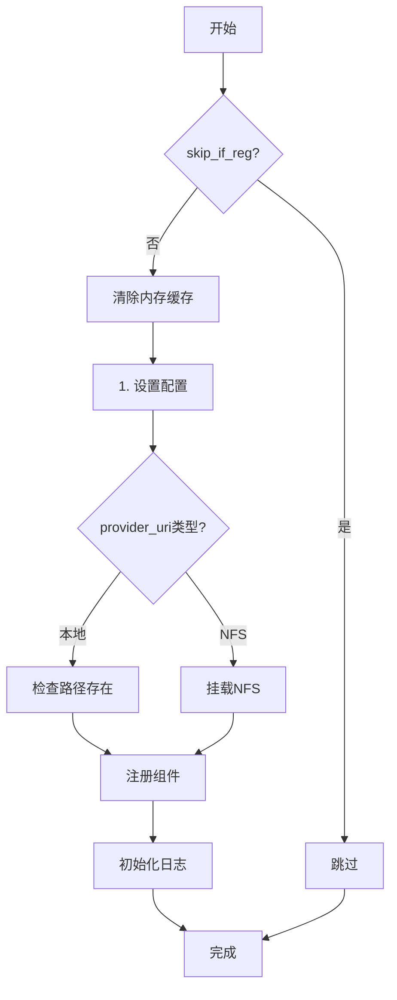
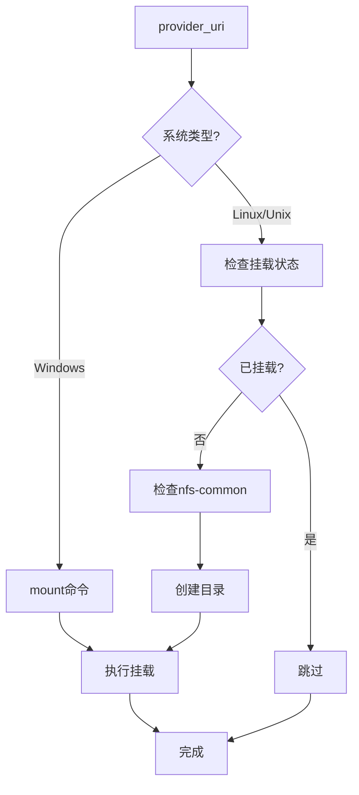
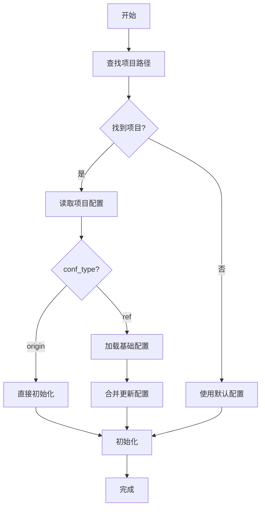

# __init__.py 模块文档

## 文件概述
Qlib的主入口文件，提供初始化、配置管理、路径解析等核心功能。

## 主要函数

### init 函数
**签名：** `init(default_conf="client", **kwargs)`

**功能：** 初始化Qlib系统

**参数：**
- `default_conf`: 默认配置模板（"client"或"server"）
- `**kwargs`: 其他配置参数
  - `clear_mem_cache`: 是否清除内存缓存（默认True）
  - `skip_if_reg`: 如果已注册是否跳过（默认True）

**执行流程：**
```
1. 检查skip_if_reg和注册状态
2. 清除内存缓存（如果需要）
3. 设置配置（default_conf + kwargs）
4. 挂载NFS（如果需要）
5. 注册全局组件
6. 初始化日志
```

**使用示例：**
```python
import qlib

# 基本初始化
qlib.init(
    provider_uri="~/.qlib/qlib_data/cn_data",
    region="cn"
)

# 服务器模式
qlib.init(
    default_conf="server",
    provider_uri="nfs://host/path",
    region="cn"
)
```

---

### _mount_nfs_uri 函数
**签名：** `_mount_nfs_uri(provider_uri, mount_path, auto_mount: bool = False)`

**功能：** 挂载NFS URI

**参数：**
- `provider_uri`: NFS URI格式（如"host:/data"）
- `mount_path`: 挂载目标路径
- `auto_mount`: 是否自动挂载（默认False）

**支持系统：**
- Windows: 使用mount命令
- Linux/Unix: 使用mount.nfs命令
- 检查nfs-common是否已安装

---

### init_from_yaml_conf 函数
**签名：** `init_from_yaml_conf(conf_path, **kwargs)`

**功能：** 从YAML配置文件初始化Qlib

**参数：**
- `conf_path`: 配置文件路径（None表示空配置）
- `**kwargs`: 额外的配置参数

**执行流程：**
```
1. 读取YAML配置文件（如果提供）
2. 合并kwargs到配置
3. 调用init初始化
```

---

### get_project_path 函数
**签名：** `get_project_path(config_name="config.yaml", cur_path=None) -> Path`

**功能：** 查找项目根路径

**参数：**
- `config_name`: 配置文件名（默认"config.yaml"）
- `cur_path`: 搜索起始路径（默认使用__file__）

**项目结构要求：**
```
<project_path>/
  - config.yaml
  - ...some folders...
    - qlib/
```

**返回：** 项目根路径（Path对象）

**异常：** FileNotFoundError（未找到项目路径）

**说明：** 不支持符号链接

---

### auto_init 函数
**签名：** `auto_init(**kwargs)`

**功能：** 自动初始化Qlib

**初始化优先级：**
```
1. 查找项目配置并初始化
2. 使用默认配置初始化
3. 如果已初始化则跳过
```

**参数：**
- `cur_path`: 查找项目路径的起始路径
- `skip_if_reg`: 如果已注册是否跳过（默认True）

**配置类型支持：**

**类型1: ref（引用配置）**
```yaml
conf_type: ref
qlib_cfg: '<shared_yaml_config_path>'  # 可选
qlib_cfg_update:
    exp_manager:
        class: "MLflowExpManager"
        module_path: "qlib.workflow.expm"
        kwargs:
            uri: "file://<path>"
            default_exp_name: "Experiment"
```

**类型2: origin（原始配置）**
```yaml
exp_manager:
    class: "MLflowExpManager"
    module_path: "qlib.workflow.expm"
    kwargs:
        uri: "file://<path>"
        default_exp_name: "Experiment"
```

## 初始化流程



## NFS挂载流程



## 自动初始化流程



## 模块导出

- `__version__`: Qlib版本号
- `__version__bak`: 版本备份（用于reset）
- `init`: 初始化函数
- `_mount_nfs_uri`: NFS挂载函数（内部）
- `init_from_yaml_conf`: 从YAML初始化
- `get_project_path`: 获取项目路径
- `auto_init`: 自动初始化

## 使用示例

### 基本初始化
```python
import qlib

# 初始化Qlib
qlib.init(
    provider_uri="~/.qlib/qlib_data/cn_data",
    region="cn"
)

# 使用Qlib
from qlib.data import D
data = D.features(['close'], '000001', '2020-01-01', '2020-12-31')
```

### 使用YAML配置
```python
import qlib

qlib.init_from_yaml_conf(
    "my_config.yaml",
    region="cn"
)
```

### 自动初始化
```python
import qlib

# 自动查找项目配置并初始化
qlib.auto_init()
```

### 服务器模式
```python
import qlib

qlib.init(
    default_conf="server",
    provider_uri="nfs://server/path",
    mount_path="/mnt/qlib_data",
    region="cn",
    auto_mount=True
)
```

## 与其他模块的关系
- `qlib.config`: 配置管理
- `qlib.log`: 日志系统
- `pathlib`: 路径处理
- `subprocess`: 进程管理（NFS挂载）
