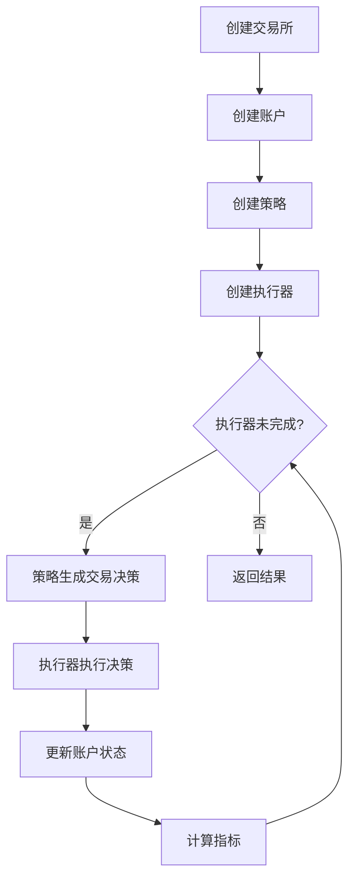
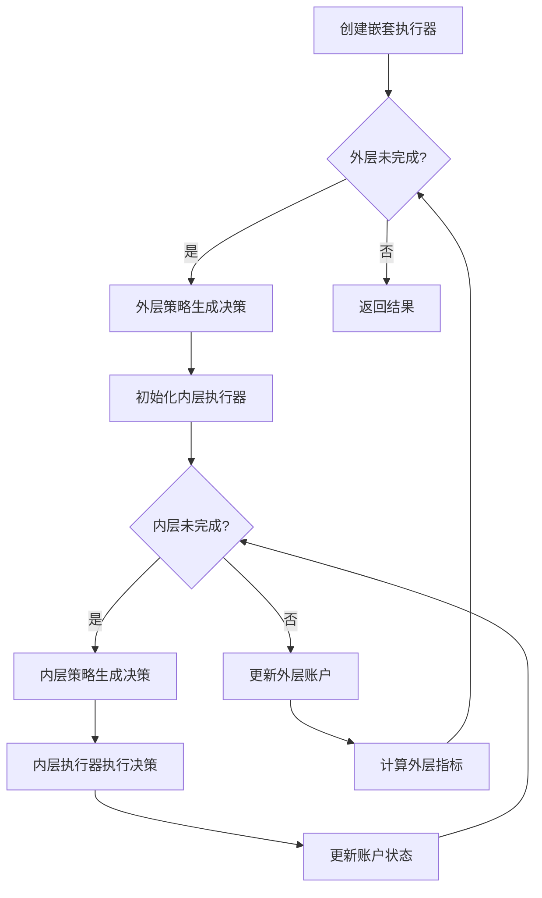

# Qlib Backtest 模块文档

## 模块概述

backtest模块是Qlib量化投资平台的核心回测系统，提供了完整的策略执行、订单管理、资金管理和性能分析功能。该模块支持单层和多层嵌套回测，能够模拟真实市场环境并评估投资策略表现。

## 模块架构

backtest模块采用分层架构设计，包含以下核心组件：

```
backtest/
├── __init__.py              # 回测循环（核心接口）
├── backtest_caller.py       # 高层API（用户友好的接口）
┌── account.py              # 账户管理（资金、持仓、收益）
├── decision.py             # 交易决策（订单、决策范围）
├── exchange.py             # 交易所（市场数据、订单执行）
├── executor.py             # 执行器（策略执行、嵌套回测）
├── high_performance_ds.py  # 高性能数据结构
├── position.py             # 持仓管理（股票持仓、计算价值）
┌── profit_attribution.py   # Brinson归因分析
├── report.py               # 指标报告（投资组合指标、交易指标）
├── signal.py               # 交易信号（策略输入数据）
└── utils.py                # 基础设施（日历、基础设施）
```

## 核心组件

### 1. 回测循环（backtest/__init__.py）

**主要功能:**
- `backtest_loop`: 执行完整回测并返回指标结果
- `collect_data_loop`: 收集交易决策数据（用于强化学习）

**特点:**
- 支持生成器模式逐步yield决策
- 自动管理多频率指标收集
- 集成tqdm进度条显示

### 2. 高层API（backtest/backtest_caller.py）

**主要功能:**
- `backtest`: 用户友好的回测入口
- `collect_data`: 收集数据用于强化学习
- `get_exchange`: 创建和配置交易所
- `create_account_instance`: 创建交易账户
- `get_strategy_executor`: 创建策略和执行器
- `format_decisions`: 格式化决策数据

**特点:**
- 简化配置流程
- 支持多种初始化方式
- 统一的接口设计

### 3. 账户管理（backtest/account.py）

**核心类:**
- `Account`: 交易账户类
  - 管理资金、持仓、收益、成本
  - 计算投资组合指标
  - 记录历史持仓状态
- `AccumulatedInfo`: 累积交易信息
  - 累积收益、成本、换手率

**核心概念:**
- **rtn（收益率）**: 从订单角度计算，不考虑成本
- **earning（收益）**: 从持仓价值角度计算，考虑成本
- 关系：`rtn - cost = earning`

### 4. 交易决策（backtest/decision.py）

**核心类:**
- `Order`: 订单数据类
  - 股票代码、数量、方向
  - 时间范围、成交结果
  - 交易限制因子
- `BaseTradeDecision`: 交易决策基类
  - 支持嵌套决策场景
  - 可限制内层执行时间范围
- `TradeDecisionWO`: 带订单的交易决策
- `TradeRange`: 交易范围基类
- `OrderHelper`: 订单辅助类

**支持的功能:**
- 订单方向（买入/卖出）
- 时间范围限制（IdxTradeRange, TradeRangeByTime）
- 决策动态更新
- 嵌套决策传播

### 5. 交易所（backtest/exchange.py）

**核心类:**
- `Exchange`: 交易所类
  - 提供市场数据访问
  - 执行订单并计算成本
  - 管理交易限制（涨跌停、成交量）

**交易成本:**
- 开仓成本率（open_cost）
- 平仓成本率（close_cost）
- 最小绝对成本（min_cost）
- 市场冲击成本（impact_cost）

**交易限制:**
- 涨跌停限制（limit_threshold）
- 成交量限制（volume_threshold）
- 交易单位（trade_unit，如100股/手）

### 6. 执行器（backtest/executor.py）

**核心类:**
- `BaseExecutor`: 执行器基类
  - 定义执行器接口
  - 管理交易日历
- `SimulatorExecutor`: 模拟执行器
  - 串行执行（先卖后买）
  - 并行执行（按方向排序）
- `NestedExecutor`: 嵌套执行器
  - 支持多层回测（日频决策+分钟执行）
  - 管理内层策略和执行器

**执行模式:**
1. **原子执行**: 单层执行，无内层执行器
2. **嵌套执行**: 多层执行，支持时间范围限制

### 7. 高性能数据结构（backtest/high_performance_ds.py）

**核心类:**
- `NumpyQuote`: 基于Numpy的高性行情数据
  - LRU缓存优化访问
  - 向量化计算支持
- `NumpyOrderIndicator`: 订单指标数据结构
  - 支持向量化聚合
  - 高效索引操作

**优化特性:**
- LRU缓存（maxsize=512）
- 单值数据快速路径
- IndexData向量化操作
- 跨执行器指标聚合

### 8. 持仓管理（backtest/position.py）

**核心类:**
- `Position`: 标准持仓类
  - 管理股票持仓和现金
  - 计算持仓价值
  - 支持持仓天数统计
- `BasePosition`: 持仓基类
- `InfPosition`: 无限持仓类（用于测试）

**持仓数据结构:**
```python
{
    <stock_id>: {
        'amount': <持股数量>,
        'price': <最新价格>,
        'weight': <权重>,
        'count_<bar>': <持仓天数>,
    },
    'cash': <现金金额>,
    'cash_delay': <待结算现金>,
    'now_account_value': <总价值>,
}
```

### 9. Brinson归因分析（backtest/profit_attribution.py）

**主要功能:**
- `brinson_pa`: 执行Brinson模型归因分析
- `get_benchmark_weight`: 获取基准权重分布
- `decompose_portfolio`: 分解投资组合

**归因分解:**
- **RAA（资产配置效应）**: 在不同资产类别间分配资金的能力
- **RSS（股票选择效应）**: 在同类资产内选择优质股票的能力
- **RIN（交互效应）**: 资产配置和股票选择的协同效应

**注意:** 该模块维护状态较差，不建议在生产环境使用。

### 10. 指标报告（backtest/report.py）

**核心类:**
- `PortfolioMetrics`: 投资组合指标类
  - 记录日频投资组合表现
  - 计算收益、换手率、成本等
- `Indicator`: 交易指标类
  - 计算订单级别指标
  - 支持FFR、PA、POS等指标

**投资组合指标:**
- account: 总资产价值
- return: 收益率（含成本）
- turnover: 换手率
- cost: 成本率
- value: 股票价值
- cash: 现金余额
- bench: 基准收益

**交易指标:**
- ffr: 充填率（deal_amount/amount）
- pa: 价格优势（（成交价/基准价-1）×方向）
- pos: 胜率（pa>0的比例）
- deal_amount: 总成交数量
- value: 总成交金额

### 11. 交易信号（backtest/signal.py）

**核心类:**
- `Signal`: 信号基类（抽象接口）
- `SignalWCache`: 基于缓存的信号类
- `ModelSignal`: 基于模型的信号类

**信号来源:**
- 准备好的数据（SignalWCache）
- 模型在线预测（ModelSignal）
- 自定义实现（继承Signal）

### 12. 基础设施（backtest/utils.py）

**核心类:**
- `TradeCalendarManager`: 交易日历管理器
  - 管理交易时间范围
  - 跟踪当前交易步
- `CommonInfrastructure`: 公共设施
  - 存储账户和交易所
- `LevelInfrastructure`: 层级设施
  - 存储日历和子层设施

**设施分层:**
```
CommonInfrastructure (全局共享)
    ├── LevelInfrastructure (外层)
    │   ├── TradeCalendarManager (外层)
    │   ├── LevelInfrastructure (内层)
    │   │   └── TradeCalendarManager (内层)
    │   └── ...
```

## 回测流程

### 基本回测流程



### 嵌套回测流程



## 使用示例

### 简单回测

```python
from qlib.backtest import backtest

portfolio_dict, indicator_dict = backtest(
    start_time="2020-01-01",
    end_time="2021-12-31",
    strategy={
        "class": "TopkDropoutStrategy",
        "module_path": "qlib.contrib.strategy",
        "kwargs": {
            "signal": "Ref($close, 1) / $close - 1",
            "topk": 50,
        }
    },
    executor={
        "class": "SimulatorExecutor",
        "module_path": "qlib.backtest.executor",
        "kwargs": {
            "time_per_step": "day",
        }
    },
    benchmark="SH000300",
    account=1e9,
)

# 获取结果
portfolio_metrics = portfolio_dict["day"][0]
indicator = indicator_dict["day"][1]
```

### 嵌套回测（日频决策+分钟执行）

```python
from qlib.backtest import backtest

portfolio_dict, indicator_dict = backtest(
    start_time="2020-01-01",
    end_time="2020-12-31",
    strategy={
        "class": "TopkDropoutStrategy",
        "module_path": "qlib.contrib.strategy",
        "kwargs": {
            "signal": "...",
            "topk": 50,
        }
    },
    executor={
        "class": "NestedExecutor",
        "module_path": "qlib.backtest.executor",
        "kwargs": {
            "time_per_step": "day",
            "inner_executor": {
                "class": "SimulatorExecutor",
                "module_path": "qlib.backtest.executor",
                "kwargs": {
                    "time_per_step": "1min",
                }
            },
            "inner_strategy": {
                "class": "TWAPStrategy",
                "module_path": "qlib.contrib.strategy",
                "kwargs": {
                    "risk_degree": 0.95,
                }
            },
        }
    },
)

# 获取不同频率的结果
day_metrics = portfolio_dict["day"][0]
one_min_indicator = indicator_dict["1min"][1]
```

## 重要特性

### 1. 多频率支持

- 支持日频、分钟级、秒级等多时间粒度
- 自动按频率组织回测结果
- 支持嵌套回测（不同频率间的交互）

### 2. 交易成本模型

**成本类型:**
- 比例成本（open_cost, close_cost）
- 最小成本（min_cost）
- 市场冲击成本（impact_cost）

**成本计算:**
```python
总成本 = max(交易金额 × 成本率, 最小成本)
```

### 3. 交易限制

**限制类型:**
- 涨跌停限制：基于涨跌幅或自定义表达式
- 成交量限制：实时或累积成交量限制

### 4. 指标体系

**投资组合指标:**
- 收益率、换手率、成本率
- 账户价值、持仓价值
- 基准收益

**交易指标:**
- 充填率（FFR）
- 价格优势（PA）
- 胜率（POS）
- 订单数量、成交金额

### 5. 数据优化

**优化策略:**
- NumpyQuote使用LRU缓存
- 单值数据快速访问路径
- IndexData向量化操作
- 批展器指标并行计算

## 相关模块

- `qlib.strategy.base`: 策略基类
- `qlib.contrib.strategy`: 预制策略实现
- `qlib.data.data`: 数据访问接口
- `qlib.model.base`: 模型基类

## 注意事项

1. **时间区间**: 所有时间参数都是闭区间（包含端点）
2. **账户共享**: 嵌套执行器间通过浅拷贝共享Position对象
3.**基準数据**: 需要提前准备好基準数据
4. **成本考虑**: 收益率考虑交易成本，rtn不考虑成本
5. **交易单位**: 中国A股默认100股/手，需要因子调整
6. **内存使用**: 大数据集回测注意内存使用，可分批处理
7. **指标启用**: 需要设置generate_portfolio_metrics=True才会收集投资组合指标

## 文档索引

- [module_backtest.md](./module_backtest.md) - 回测循环模块
- [module_backtest_caller.md](./module_backtest_caller.md) - 高层API模块
- [account.md](./account.md) - 账户管理模块
- [decision.md](./decision.md) - 交易决策模块
- [exchange.md](./exchange.md) - 交易所模块
- [executor.md](./executor.md) - 执行器模块
- [high_performance_ds.md](./high_performance_ds.md) - 高性能数据结构模块
- [position.md](./position.md) - 持仓管理模块
- [profit_attribution.md](./profit_attribution.md) - Brinson归因分析模块
- [report.md](./report.md) - 指标报告模块
- [signal.md](./signal.md) - 交易信号模块
- [utils.md](./utils.md) - 基础设施模块

## 参考资料

- [Qlib官方文档](https://qlib.readthedocs.io/)
- [回测系统设计](https://github.com/microsoft/qlib/tree/main/qlib/backtest)
