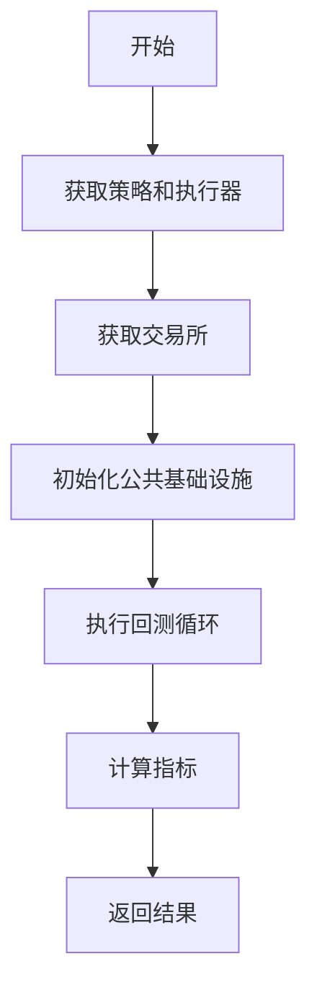
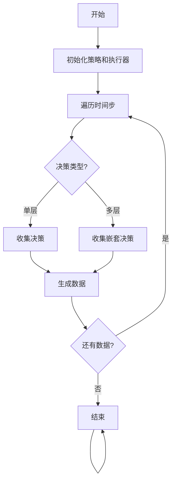
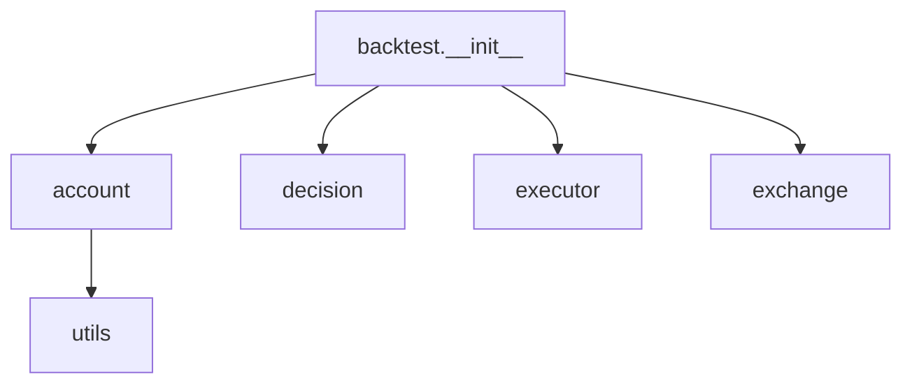
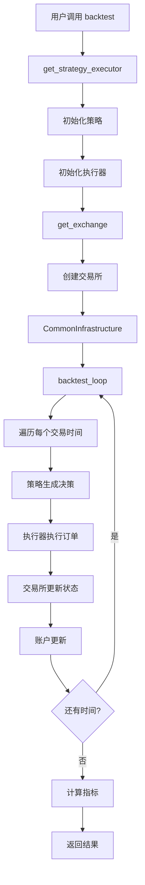

# backtest.__init__

**文件路径**: `qlib/backtest/__init__.py`

**模块名**: `qlib.backtest`

## 模块概述

该模块是 Qlib 回测框架的主入口点，提供了完整的回测功能。它整合了交易所、账户、策略和执行器等组件，为用户提供了简便的回测接口。

主要功能包括：
- 创建和配置交易所
- 管理交易账户
- 初始化策略和执行器
- 执行回测循环
- 收集和格式化交易决策数据
- 支持多层嵌套的决策执行

## 导入模块

### 标准库

- `copy` - 对象拷贝
- `logging` - 日志记录

### Qlib 内部模块

- `qlib.account.account` - 账户管理
- `qlib.backtest.decision` - 交易决策
- `qlib.backtest.executor` - 执行器
- `qlib.backtest.exchange` - 交易所
- `qlib.config` - 配置管理
- `qlib.log` - 日志系统
- `qlib.utils` - 工具函数
- `qlib.backtest.utils` - 回测工具
- `qlib.backtest.indicator` - 指标计算
- `qlib.backtest.executor` - 执行器

## 函数定义

### `get_exchange()`

**功能**: 创建并初始化交易所对象

**参数**:
| 参数名 | 类型 | 默认值 | 说明 |
|---------|------|---------|------|
| `exchange` | `Union[str, dict, object, Path]` | `None` | 交易所配置，可以是字符串、字典或已初始化的对象 |
| `freq` | `str` | `"day"` | 数据频率，如 "day"、"1min" 等 |
| `start_time` | `Union[pd.Timestamp, str]` | `None` | 回测开始时间 |
| `end_time` | `Union[pd.Timestamp, str]` | `None` | 回测结束时间 |
| `codes` | `Union[list, str]` | `"all"` | 股票代码列表，"all" 表示所有股票 |
| `subscribe_fields` | `list` | `[]` | 需要订阅的字段列表 |
| `open_cost` | `float` | `0.0015` | 开仓交易成本比例 |
| `close_cost` | `float` | `0.0025` | 平仓交易成本比例 |
| `min_cost` | `float` | `5.0` | 最小交易成本（绝对值） |
| `limit_threshold` | `Union[Tuple[str, str], float, None]` | `None` | 涨跌停限制阈值 |
| `deal_price` | `Union[str, Tuple[str, str], List[str]]` | `None` | 成交价格，支持多种格式 |
| `**kwargs` | `dict` | `{}` | 其他传递给 Exchange 的参数 |

**返回类型**: `Exchange` - 初始化的交易所对象

**说明**:
创建交易所对象是回测的第一步。交易所负责：
- 管理股票数据访问
- 处理交易订单
- 计算成交价格
- 管理涨跌停等限制

**成交价格支持格式**:
1. 字符串：`"$close"` - 使用收盘价
2. 元组：`("$close", "$open")` - 买入用开盘价，卖出用收盘价
3. 列表：`["$close", "$vwap"]` - 使用加权和平均价

**使用示例**:
```python
from qlib.backtest import get_exchange

# 基本用法 - 默认配置
exchange = get_exchange()

# 指定回测时间范围
exchange = get_exchange(
    start_time="2020-01-01",
    end_time="2020-12-31"
)

# 指定股票池
exchange = get_exchange(
    codes=["SH600000", "SH600001"],
    freq="1min"
)

# 自定义交易成本
exchange = get_exchange(
    open_cost=0.0003,  # 0.03% 开仓成本
    close_cost=0.0001,  # 0.01% 平仓成本
    min_cost=10.0  # 最少 10 元交易成本
)

# 使用成交价格格式
exchange = get_exchange(
    deal_price="$close",  # 统一使用收盘价
    deal_price=("$open", "$close"),  # 买入开盘，卖出收盘
    deal_price=["$close", "$vwap"]  # 使用加权和平均价
)

# 设置涨跌停限制
exchange = get_exchange(
    limit_threshold=0.1  # 10% 的涨跌停
)
```

---

### `create_account_instance()`

**功能**: 创建账户实例

**参数**:
| 参数名 | 类型 | 默认值 | 说明 |
|---------|------|---------|------|
| `start_time` | `Union[pd.Timestamp, str]` | `None` | 基准开始时间 |
| `end_time` | `Union[pd.Timestamp, str]` | `None` | 基准结束时间 |
| `benchmark` | `Optional[str]` | `None` | 基准股票代码，如 "SH000300" |
| `account` | `Union[float, int, dict]` | - | 账户配置 |
| `pos_type` | `str` | `"Position"` | 持仓类型，"Position" 或 "InfPosition" |

**返回类型**: `Account` - 初始化的账户对象

**说明**:
创建账户对象用于管理回测过程中的：
- 现金余额
- 持仓信息
- 交易成本
- 收益计算
- 投资组合指标

**账户配置格式**:
```python
# 使用浮点数指定初始资金
account = 1e8  # 1 亿

# 使用字典指定持仓（支持初始持仓）
account = {
    "cash": 1e8,
    "SH600000": 1000,  # 持有 1000 股
    "SH600001": {"amount": 2000, "price": 10.5},  # 指定价格的持仓
}

# 初始资金加初始持仓
account = {
    "SH600000": 1000
}
```

**使用示例**:
```python
from qlib.backtest import create_account_instance

# 基本账户
account = create_account_instance(
    account=1e8  # 初始资金 1 亿
)

# 带基准的账户
account = create_account_instance(
    start_time="2020-01-01",
    end_time="2020-12-31",
    benchmark="SH000300"  # 沪深 300 指数作为基准
    account=1e8
)

# 使用不同持仓类型
account = create_account_instance(
    account=1e8,
    pos_type="InfPosition"  # 使用无限持仓类型
)
```

---

### `get_strategy_executor()`

**功能**: 获取策略和执行器对象

**参数**:
| 参数名 | 类型 | 默认值 | 说明 |
|---------|------|---------|------|
| `start_time` | `Union[pd.Timestamp, str]` | `None` | 回测开始时间 |
| `end_time` | `Union[pd.Timestamp, str]` | `None` | 回测结束时间 |
| `strategy` | `Union[str, dict, object, Path]` | 必需 | 策略配置 |
| `executor` | `Union[str, dict, object, Path]` | 必需 | 执行器配置 |
| `benchmark` | `Optional[str]` | `"SH000300"` | 基准股票代码 |
| `account` | `Union[float, int, dict]` | `1e9` | 账户配置 |
| `exchange_kwargs` | `dict` | `{}` | 传递给交易所的额外参数 |
| `pos_type` | `str` | `"Position"` | 持仓类型 |

**返回类型**: `Tuple[BaseStrategy, BaseExecutor]` - (策略对象, 执行器对象)

**说明**:
该函数是回测的核心准备步骤，它：
1. 创建账户实例
2. 创建交易所实例
3. 初始化策略对象
4. 初始化执行器对象
5. 建立公共基础设施连接

**策略和执行器配置格式**:
- 字符串：`"my_strategy"` - 使用注册的策略名
- 字典：`{"class": "MyStrategy", "module_path": "custom/path"}` - 自定义策略
- 对象：直接传递已初始化的实例
- Path：`Path("config.yaml")` - 从配置文件加载

**使用示例**:
```python
from qlib.backtest import get_strategy_executor

# 使用字符串配置
strategy, executor = get_strategy_executor(
    strategy="TopkDropStrategy",
    executor="SimulatorExecutor"
)

# 使用字典配置
strategy, executor = get_strategy_executor(
    strategy={
        "class": "LightweightMlpStrategy",
        "module_path": "models/my_strategy.py"
    },
    executor={
        "class": "VWAPExecutor",
        "kwargs": {"window": 10}
    }
)

# 带账户配置
strategy, executor = get_strategy_executor(
    strategy="MyStrategy",
    executor="MyExecutor",
    account=1e8,
    benchmark="SH000300"
)
```

---

### `backtest()`

**功能**: 执行回测的主函数

**参数**:
| 参数名 | 类型 | 默认值 | 说明 |
|---------|------|---------|------|
| `start_time` | `Union[pd.Timestamp, str]` | 必需 | 回测开始时间 |
| `end_time` | `Union[pd.Timestamp, str]` | 必需 | 回测结束时间 |
| `strategy` | `Union[str, dict, object, Path]` | 必需 | 策略配置 |
| `executor` | `Union[str, dict, object, Path]` | 必需 | 执行器配置 |
| `benchmark` | `str` | `"SH000300"` | 基准股票代码 |
| `account` | `Union[float, int, dict]` | `1e9` | 账户配置 |
| `exchange_kwargs` | `dict` | `{}` | 传递给交易所的额外参数 |
| `pos_type` | `str` | `"Position"` | 持仓类型 |

**返回类型**: `Tuple[PORT_METRIC, INDICATOR_METRIC]` - (组合指标, 交易指标)

**说明**:
这是 Qlib 回测的主要入口函数，执行完整的回测流程。返回包含：
- 组合指标
- 交易指标
- 会计数据

**回测流程图**:


**使用示例**:
```python
from qlib.backtest import backtest

# 最简单回测示例
portfolio_metric, indicator_metric = backtest(
    start_time="2020-01-01",
    end_time="2020-12-31",
    strategy="TopkDropStrategy",
    executor="SimulatorExecutor"
)

# 带自定义账户配置
portfolio_metric, indicator_metric = backtest(
    start_time="2020-01-01",
    end_time="2020-12-31",
    strategy={
        "class": "MyCustomStrategy",
        "module_path": "custom/strategies.py"
    },
    executor="SimulatorExecutor",
    account={
        "cash": 1e8,
        "SH600000": 1000  # 初始持仓
    }
)

# 查看结果
print(portfolio_metric)
print(indicator_metric)
```

---

### `collect_data()`

**功能**: 收集强化学习训练数据

**参数**:
| 参数名 | 类型 | 默认值 | 说明 |
|---------|------|---------|------|
| `start_time` | `Union[pd.Timestamp, str]` | 必需 | 回测开始时间 |
| `end_time` | `Union[pd.Timestamp, str]` | 必需 | 回测结束时间 |
| `strategy` | `Union[str, dict, object, Path]` | 必需 | 策略配置 |
| `executor` | `Union[str, dict, object, Path]` | 必需 | 执行器配置 |
| `benchmark` | `str` | `"SH000300"` | 基准股票代码 |
| `account` | `Union[float, int, dict]` | `1e9` | 账户配置 |
| `exchange_kwargs` | `dict` | `{}` | 传递给交易所的额外参数 |
| `pos_type` | `str` | `"Position"` | 持仓类型 |
| `return_value` | `dict \| None` | `None` | 返回值配置 |

**返回类型**: `Generator[object, None, None]` - 生成器，每次返回一个决策数据

**说明**:
该函数用于强化学习的数据收集阶段。它：
1. 初始化策略和执行器
2. 执行回测循环，但不执行实际交易
3. 收集每个时间步的决策数据
4. 生成适合 RL 训练的数据格式

**数据收集流程图**:


**使用示例**:
```python
from qlib.backtest import collect_data

# 收集训练数据
data_generator = collect_data(
    start_time="2020-01-01",
    end_time="2020-03-31",
    strategy="MyStrategy",
    executor="SimulatorExecutor"
)

# 遍历生成数据
for data in data_generator:
    print(data)  # 每个数据是一个决策数据对象
```

---

### `format_decisions()`

**功能**: 格式化决策树结构

**参数**:
| 参数名 | 类型 | 默认值 | 说明 |
|---------|------|---------|------|
| `decisions` | `List[BaseTradeDecision]` | 必需 | 原始决策列表 |

**返回类型**: `Tuple[str, List[Tuple[BaseTradeDecision, Union[Tuple, None]]]]` | 格式化后的决策树

**说明**:
将扁平的决策列表转换为树状结构，便于理解多层级决策执行。返回格式为：
- 频率名称
- 每个频率下的决策列表
- 每个决策可能包含子决策（嵌套执行）

**决策格式示例**:
```python
{
    "day": [
        (Decision_1, None),
        (Decision_2, [
            (SubDecision_1, None),
            (SubDecision_2, None)
        ])
    ],
    "1min": [
        (MinDecision_1, None),
        (MinDecision_2, None)
    ]
}
```

**使用示例**:
```python
from qlib.backtest import backtest, format_decisions

# 执行回测
portfolio_metric, indicator_metric = backtest(
    start_time="2020-01-01",
    end_time="2020-12-31",
    strategy="TopkStrategy",
    executor="SimulatorExecutor"
)

# 格式化决策
formatted_decisions = format_decisions(
    indicator_metric['trade_decision']
)

# 查看格式化结果
for freq, decision_list in formatted_decisions:
    print(f"频率: {freq}")
    for i, (decision, sub_decisions) in enumerate(decision_list):
        print(f"  决策 {i}: {decision}")
        if sub_decisions:
            for j, (sub_decision, sub_sub_decisions) in enumerate(sub_decisions):
                indent = "    "
                print(f"{indent}子决策 {j}: {sub_decision}")
```

## 架构设计

### 模块依赖关系



### 回测执行流程



## 使用示例

### 完整回测流程

```python
from qlib.backtest import backtest
import pandas as pd

# 执行回测
start_time = pd.Timestamp("2020-01-01")
end_time = pd.Timestamp("2020-12-31")

portfolio_metric = backtest(
    start_time=start_time,
    end_time=end_time,
    strategy="TopkDropStrategy",
    executor="SimulatorExecutor",
    benchmark="SH000300"
)

# portfolio_metric 包含:
# - 每个时间点的组合价值
# - 指标
# - 交易记录
```

### 强化学习数据收集

```python
from qlib.backtest import collect_data

# 收集用于训练的数据
data_collector = collect_data(
    start_time="2020-01-01",
    end_time="2020-12-31",
    strategy="MyRLStrategy",
    executor="SimulatorExecutor"
)

# 遍历收集
train_data = []
for data in data_collector:
    train_data.append(data)  # 每个数据是一个时间步的状态和决策
```

## 重要说明

### 时间范围处理

- `start_time` 和 `end_time` 定义回测的时间窗口
- 时间范围是包含的，即执行器看到的时间范围
- 例如，设置为 `"2020-01-01"` 到 `"2020-12-31"`，但执行器日频时实际会包含所有交易日

### 交易成本

- `open_cost`: 开仓时的成本比例，默认 0.15‰
- `close_cost`: 平仓时的成本比例，默认 0.25‰
- `min_cost`: 最小交易成本，防止频繁小额交易
- 成本可以是比例（0.0015）或绝对值（5.0）

### 成交价格

- `$close` 使用收盘价
- `$open` 买入用开盘价，卖出用收盘价
- `$vwap` 使用成交量加权平均价（VWAP）
- 支持动态表达式，如 `Ref($close, 1)`

### 多层回测

- `executor` 支持多层嵌套决策
- 外层策略可以控制内层策略
- 内层决策会被外层包装和汇总
- 适用于如顶层选股、内层选时的场景

### 数据收集模式

- `collect_data` 使用与 `backtest` 相同的参数
- 但执行模式不同，不执行实际交易
- 专门用于强化学习训练数据的收集

## 相关模块

- `qlib.backtest.account.py` - 账户管理
- `qlib.backtest.decision.py` - 交易决策定义
- `qlib.backtest.executor.py` - 执行器实现
- `qlib.backtest.exchange.py` - 交易所实现
- `qlib.strategy.base.py` - 策略基类

## 注意事项

1. **时间格式**: 时间参数支持字符串格式 `"YYYY-MM-DD"` 和 Pandas Timestamp 对象
2. **股票代码**: 中国市场使用 6 位代码，如 `"SH600000"`、`"SZ000001"`
3. **账户安全**: 账户对象在回测过程中会累积状态，不要在回测外直接修改
4. **策略和执行器**: 需要确保策略和执行器的时间频率一致
5. **基准比较**: 如果指定了基准，会自动计算相对收益和超额收益
