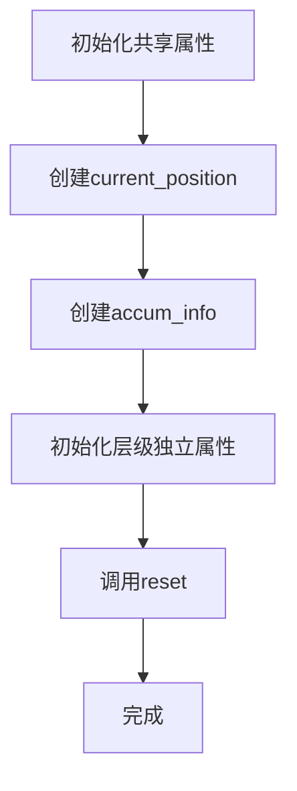
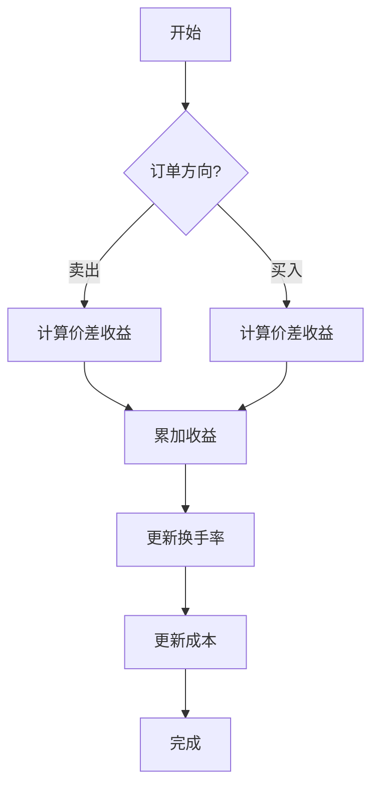
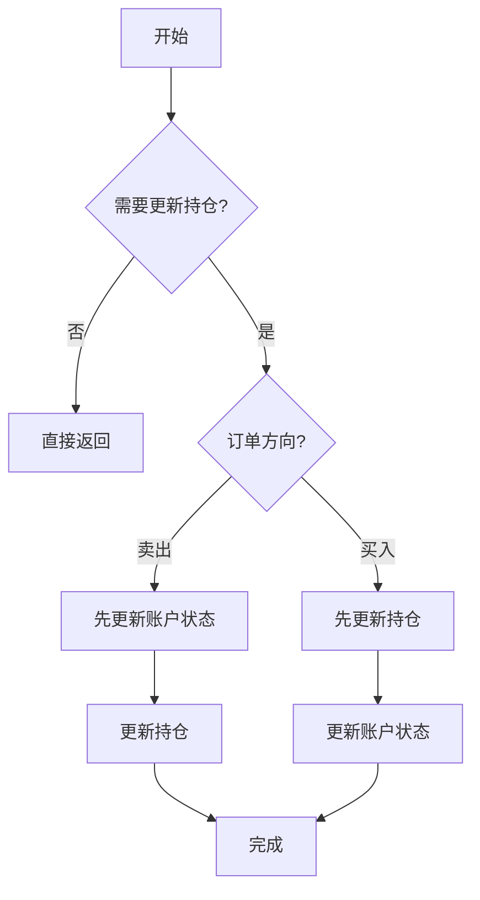
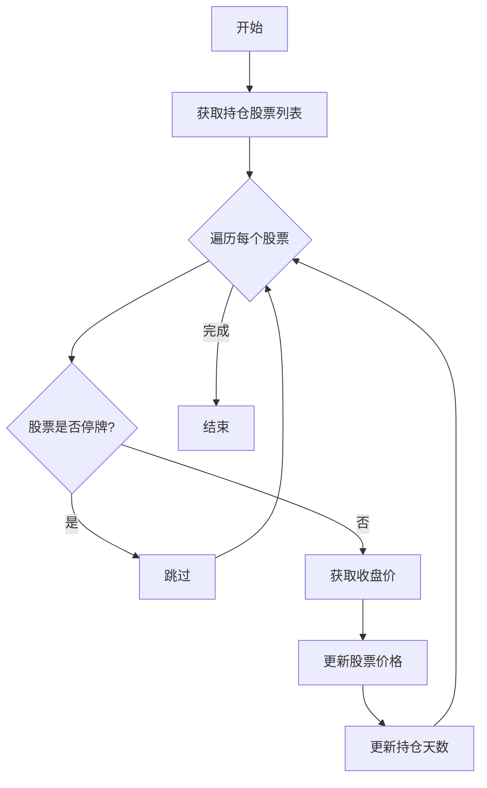
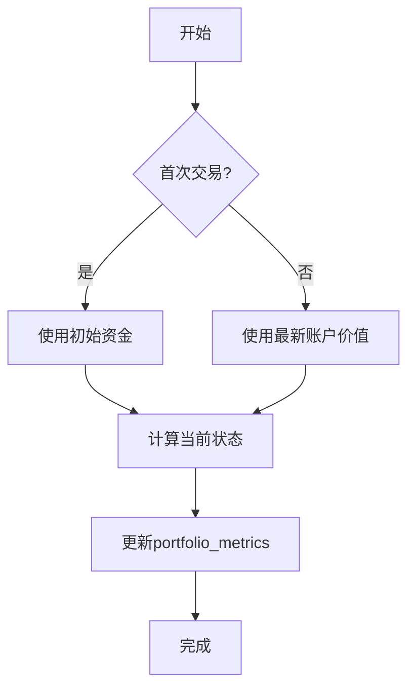
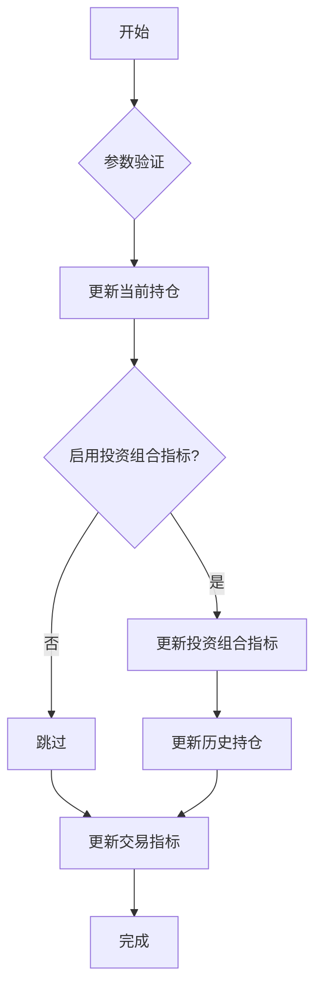

# backtest/account.py 模块文档

## 文件概述

该模块实现了回测系统的账户管理功能，负责管理交易账户的资金、持仓、收益、成本和换手率等核心指标。账户是回测系统中的核心组件之一，记录了整个回测过程中的财务状态。

该模块包含两个主要类：
1. `AccumulatedInfo`: 累积交易信息类（收益、成本、换手率）
2. `Account`: 交易账户类，管理资金、持仓和指标计算

## 类详解

### AccumulatedInfo 类

**继承关系:** 无

**类说明:** 累积交易信息类，用于记录累积的收益、成本和换手率。在多层执行时，AccumulatedInfo会在不同层级之间共享。

#### 属性

- `rtn: float` - 累积收益率（不考虑成本）
- `cost: float` - 累积交易成本
- `to: float` - 累积换手率

#### 方法

##### reset(self) -> None
**功能:** 重置所有累积信息
**返回值:** 无

**流程图:**
```
rtn = 0.0
cost = 0.0
to = 0.0
```

##### add_return_value(self, value: float) -> None
**功能:** 累加收益值
**参数:**
- `value`: 要累加的收益值
**返回值:** 无

##### add_cost(self, value: float) -> None
**功能:** 累加成本值
**参数:**
- `value`: 要累加的成本值
**返回值:** 无

##### add_turnover(self, value: float) -> None
**功能:** 累加换手率值
**参数:**
- `value`: 要累加的换手率值
**返回值:** 无

##### get_return (property) -> float
**功能:** 获取累积收益率
**返回值:** 累积收益率

##### get_cost (property) -> float
**功能:** 获取累积成本
**返回值:** 累积成本

##### get_turnover (property) -> float
**功能:** 获取累积换手率
**返回值:** 累积换手率

---

### Account 类

**继承关系:** 无

**类说明:** 交易账户类，负责管理回测过程中的交易账户，包括资金、持仓、收益、成本等。

**重要说明:**
在嵌套执行中，Account的指标正确性依赖于`executor.py`中`NestedExecutor`对`trade_account`的浅拷贝。不同层级有不同的Account对象用于计算指标，但Position对象在所有Account对象间共享。

#### 属性

**共享属性（跨层级共享）:**
- `init_cash: float` - 初始资金
- `current_position: BasePosition` - 当前持仓对象（共享）
- `accum_info: AccumulatedInfo` - 累积交易信息（共享）

**层级独立属性:**
- `freq: str` - 账户频率
- `_pos_type: str` - 持仓类型
- `_port_metr_enabled: bool` - 是否启用投资组合指标
- `benchmark_config: dict` - 基准配置
- `portfolio_metrics: PortfolioMetrics` - 投资组合指标对象
- `hist_positions: Dict[pd.Timestamp, BasePosition]` - 历史持仓记录
- `indicator: Indicator` - 交易指标对象

#### 方法

##### __init__(self, init_cash: float = 1e9, position_dict: dict = {}, freq: str = "day", benchmark_config: dict = {}, pos_type: str = "Position", port_metr_enabled: bool = True) -> None
**功能:** 初始化交易账户
**参数:**
- `init_cash`: 初始资金，默认1e9
- `position_dict`: 初始持仓字典
  - 格式: `{stock_id: amount}` 或 `{stock_id: {"amount": int, "price"(optional): float}}`
  - 如果不提供price，将通过_fill_stock_value填充
- `freq`: 账户频率，默认"day"
- `benchmark_config`: 基准配置字典
- `pos_type`: 持仓类型，默认"Position"
- `port_metr_enabled`: 是否启用投资组合指标，默认True
**返回值:** 无

##### init_vars(self, init_cash: float, position_dict: dict, freq: str, benchmark_config: dict) -> None
**功能:** 初始化账户变量
**参数:**
- `init_cash`: 初始资金
- `position_dict`: 初始持仓字典
- `freq`: 频率
- `benchmark_config`: 基准配置
**返回值:** 无

**流程图:**


##### is_port_metr_enabled(self) -> bool
**功能:** 判断是否启用投资组合指标
**返回值:** True表示启用，False表示禁用

##### reset_report(self, freq: str, benchmark_config: dict) -> None
**功能:** 重置报告相关变量
**参数:**
- `freq`: 频率
- `benchmark_config`: 基准配置
**返回值:** 无

##### reset(self, freq: str | None = None, benchmark_config: dict | None = None, port_metr_enabled: bool | None = None) -> None
**功能:** 重置账户状态
**参数:**
- `freq`: 频率（可选）
- `benchmark_config`: 基准配置（可选）
- `port_metr_enabled`: 是否启用投资组合指标（可选）
**返回值:** 无

##### get_hist_positions(self) -> Dict[pd.Timestamp, BasePosition]
**功能:** 获取历史持仓
**返回值:** 历史持仓字典

##### get_cash(self) -> float
**功能:** 获取当前现金
**返回值:** 当前现金金额

##### _update_state_from_order(self, order: Order, trade_val: float, cost: float, trade_price: float) -> None
**功能:** 从订单更新账户状态（内部方法）
**参数:**
- `order`: 订单对象
- `trade_val`: 交易金额
- `cost`: 交易成本
- `trade_price`: 交易价格
**返回值:** 无

**流程图:**


##### update_order(self, order: Order, trade_val: float, cost: float, trade_price: float) -> None
**功能:** 更新订单状态
**参数:**
- `order`: 订单对象
- `trade_val`: 交易金额
- `cost`: 交易成本
- `trade_price`: 交易价格
**返回值:** 无

**流程图:**


##### update_current_position(self, trade_start_time: pd.Timestamp, trade_end_time: pd.Timestamp, trade_exchange: Exchange) -> None
**功能:** 更新当前持仓价格和持仓天数
**参数:**
- `trade_start_time`: 交易开始时间
- `trade_end_time`: 交易结束时间
- `trade_exchange`: 交易所对象
**返回值:** 无

**流程图:**


##### update_portfolio_metrics(self, trade_start_time: pd.Timestamp, trade_end_time: pd.Timestamp) -> None
**功能:** 更新投资组合指标
**参数:**
- `trade_start_time`: 交易开始时间
- `trade_end_time`: 交易结束时间
**返回值:** 无

**流程图:**


##### update_hist_positions(self, trade_start_time: pd.Timestamp) -> None
**功能:** 更新历史持仓记录
**参数:**
- `trade_start_time`: 交易开始时间
**返回值:** 无

##### update_indicator(self, trade_start_time: pd.Timestamp, trade_exchange: Exchange, atomic: bool, outer_trade_decision: BaseTradeDecision, trade_info: list = [], inner_order_indicators: List[BaseOrderIndicator] = [], decision_list: List[Tuple[BaseTradeDecision, pd.Timestamp, pd.Timestamp]] = [], indicator_config: dict = {}) -> None
**功能:** 更新交易指标
**参数:**
- `trade_start_time`: 交易开始时间
- `trade_exchange`: 交易所对象
- `atomic`: 是否为原子执行器
- `outer_trade_decision`: 外层交易决策
- `trade_info`: 交易信息列表（原子执行器使用）
- `inner_order_indicators`: 内层订单指标列表（非原子执行器使用）
- `decision_list`: 决策列表
- `indicator_config`: 指标配置字典
**返回值:** 无

##### update_bar_end(self, trade_start_time: pd.Timestamp, trade_end_time: pd.Timestamp, trade_exchange: Exchange, atomic: bool, outer_trade_decision: BaseTradeDecision, trade_info: list = [], inner_order_indicators: List[BaseOrderIndicator] = [], decision_list: List[Tuple[BaseTradeDecision, pd.Timestamp, pd.Timestamp]] = [], indicator_config: dict = {}) -> None
**功能:** 在每个交易柱结束时更新账户
**参数:**
- `trade_start_time`: 交易开始时间
- `trade_end_time`: 交易结束时间
- `trade_exchange`: 交易所对象
- `atomic`: 是否为原子执行器
- `outer_trade_decision`: 外层交易决策
- `trade_info`: 交易信息列表
- `inner_order_indicators`: 内层订单指标列表
- `decision_list`: 决策列表
- `indicator_config`: 指标配置
**返回值:** 无

**流程图:**


##### get_portfolio_metrics(self) -> Tuple[pd.DataFrame, dict]
**功能:** 获取投资组合指标和历史持仓
**返回值:** 元组 (portfolio_metrics_dataframe, hist_positions_dict)

##### get_trade_indicator(self) -> Indicator
**功能:** 获取交易指标对象
**返回值:** Indicator对象

## 重要概念

### 收益与收益

该模块区分两种收益概念：

1. **rtn (收益率)**: 从订单角度计算
   - 任何订单执行时都会变化（买入或卖出）
   - 在交易日结束时也会变化：(今日收盘价 - 股票价) * 数量
   - **不考虑成本**

2. **earning (收益)**: 从当前持仓价值角度计算
   - 在交易日结束时更新
   - earning = 今日价值 - 昨日价值
   - **考虑成本**，这是真实的收益率

关系：`rtn - cost = earning`

### 多层共享

在嵌套执行中：
- `AccumulatedInfo`和`Position`在所有层级间共享
- 每个层级有独立的`Account`对象
- `portfolio_metrics`在每个层级独立计算
- 这样可以正确计算每个层级的指标

## 使用示例

### 基本使用

```python
from qlib.backtest.account import Account
from qlib.backtest.position import Position

# 创建账户
account = Account(
    init_cash=1e8,
    position_dict={
        "SH600000": {"amount": 1000, "price": 10.5},
        "SH600001": 2000,
    },
    freq="day",
    port_metr_enabled=True,
)

# 获取账户信息
print(f"初始资金: {account.init_cash}")
print(f"当前现金: {account.get_cash()}")
print(f"持仓: {account.current_position.get_stock_list()}")

# 获取指标
portfolio_metrics, hist_positions = account.get_portfolio_metrics()
print(f"投资组合指标行数: {len(portfolio_metrics)}")
indicator = account.get_trade_indicator()
```

### 在回测中使用

```python
from qlib.backtest import backtest
from qlib.backtest.account import Account

# 执行回测
portfolio_dict, indicator_dict = backtest(
    start_time="2020-01-01",
    end_time="2021-12-31",
    strategy=strategy_config,
    executor=executor_config,
    account={
        "cash": 1e8,
        "SH600000": 1000,
    },
    benchmark="SH000300",
)

# 分析日频账户结果
day_portfolio, day_positions = portfolio_dict["day"]
day_indicator = indicator_dict["day"][1]

# 访问历史持仓
for date, position in day_positions.items():
    print(f"{date}: {position.get_stock_list()}")
```

## 相关模块

- `backtest.position.py`: 持仓管理类（BasePosition, Position, InfPosition）
- `backtest.exchange.py`: 交易所类（Exchange）
- `backtest.decision.py`: 交易决策类（BaseTradeDecision, Order）
- `backtest.report.py`: 指标报告类（Indicator, PortfolioMetrics）

## 注意事项

1. **资金精度**: 所有金额使用float类型，注意浮点精度问题
2. **持仓共享**: 在嵌套执行中，Position对象是共享的，修改会影响所有层级
3. **指标启用**: 只有在`port_metr_enabled=True`时才会计算投资组合指标
4. **成本计算**: rtn不考虑成本，earning考虑成本
5. **历史持仓**: 历史持仓使用深拷贝，确保独立性
6. **频率对齐**: 账户频率和交易所频率应该保持一致
