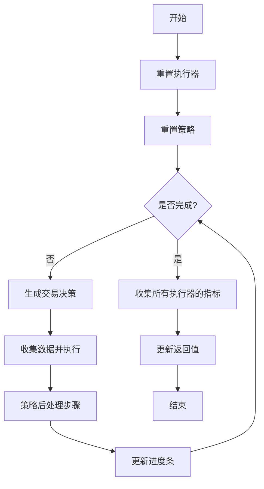

# backtest.py 模块文档

## 模块概述

`backtest.py` 模块提供了回测框架的核心循环函数，用于执行策略与执行器之间的交互。该模块支持嵌套的决策执行机制，是 Qlib 回测框架的入口点。

主要功能：
- `backtest_loop`: 执行完整的回测循环
- `collect_data_loop`: 用于强化学习训练的数据收集生成器

---

## 函数说明

### `backtest_loop`

执行最外层策略和执行器的交互回测函数。

```python
def backtest_loop(
    start_time: Union[pd.Timestamp, str],
    end_time: Union[pd.Timestamp, str],
    trade_strategy: BaseStrategy,
    trade_executor: BaseExecutor,
) -> Tuple[PORT_METRIC, INDICATOR_METRIC]
```

#### 参数说明

| 参数 | 类型 | 说明 |
|------|------|------|
| `start_time` | `Union[pd.Timestamp, str]` | 回测开始时间（闭区间），应用于最外层执行器的日历 |
| `end_time` | `Union[pd.Timestamp, str]` | 回测结束时间（闭区间），应用于最外层执行器的日历 |
| `trade_strategy` | `BaseStrategy` | 最外层的投资组合策略 |
| `trade_executor` | `BaseExecutor` | 最外层的执行器 |

#### 返回值

| 返回项 | 类型 | 说明 |
|--------|------|------|
| `portfolio_dict` | `PORT_METRIC` | 记录交易的组合指标信息 |
| `indicator_dict` | `INDICATOR_METRIC` | 计算交易指标 |

#### 返回值类型定义

```python
PORT_METRIC = Dict[str, Tuple[pd.DataFrame, dict]]
INDICATOR_METRIC = Dict[str, Tuple[pd.DataFrame, Indicator]]
```

#### 使用示例

```python
from qlib.backtest.backtest import backtest_loop
from qlib.backtest.executor import SimulatorExecutor
from qlib.strategy.base import BaseStrategy

# 创建策略和执行器
strategy = MyStrategy()
executor = SimulatorExecutor(time_per_step="1day")

# 执行回测
portfolio_metrics, indicator_metrics = backtest_loop(
    start_time="2020-01-01",
    end_time="2020-12-31",
    trade_strategy=strategy,
    trade_executor=executor
)

# 分析结果
for freq, (df, metrics) in portfolio_metrics.items():
    print(f"频率 {freq} 的组合指标:")
    print(df.head())
```

#### 注意事项

- `end_time` 是闭区间，例如设置为 `20XX0301` 将包含当天的所有分钟数据
- 该函数内部调用 `collect_data_loop` 进行实际执行

---

### `collect_data_loop`

用于收集强化学习训练数据的生成器。该函数提供了更细粒度的控制，允许在每个步骤中间插入自定义逻辑。

```python
def collect_data_loop(
    start_time: Union[pd.Timestamp, str],
    end_time: Union[pd.Timestamp, str],
    trade_strategy: BaseStrategy,
    trade_executor: BaseExecutor,
    return_value: dict | None = None,
) -> Generator[BaseTradeDecision, Optional[BaseTradeDecision], None]
```

#### 参数说明

| 参数 | 类型 | 说明 |
|------|------|------|
| `start_time` | `Union[pd.Timestamp, str]` | 回测开始时间（闭区间） |
| `end_time` | `Union[pd.Timestamp, str]` | 回测结束时间（闭区间） |
| `trade_strategy` | `BaseStrategy` | 最外层的投资组合策略 |
| `trade_executor` | `BaseExecutor` | 最外层的执行器 |
| `return_value` | `dict | None` | 用于 `backtest_loop` 返回值的字典 |

#### 返回值

**生成器产出**: 交易决策 (`BaseTradeDecision`)

**生成器接收**: 可选的交易决策（通常用于强化学习场景）

**生成器返回值**: `None`

#### 使用示例

```python
from qlib.backtest.backtest import collect_data_loop

# 使用生成器进行回测
return_val = {}
for decision in collect_data_loop(
    start_time="2020-01-01",
    end_time="2020-12-31",
    trade_strategy=strategy,
    trade_executor=executor,
    return_value=return_val
):
    # 可以在这里插入自定义逻辑
    print(f"当前决策: {decision}")

# 获取回测结果
portfolio_dict = return_val["portfolio_dict"]
indicator_dict = return_val["indicator_dict"]
```

#### 执行流程



#### 工作原理

1. **初始化阶段**:
   - 重置执行器的交易日历
   - 重置策略的基础设施

2. **主循环**:
   - 策略生成交易决策
   - 执行器收集数据并执行决策
   - 策略执行后处理步骤
   - 更新进度条

3. **结束阶段**:
   - 收集所有执行器的组合指标
   - 收集所有执行器的交易指标
   - 更新返回值字典

---

## 模块使用场景

### 场景1: 简单回测

使用 `backtest_loop` 进行标准的回测：

```python
portfolio_metrics, indicator_metrics = backtest_loop(
    start_time="2020-01-01",
    end_time="2020-12-31",
    trade_strategy=my_strategy,
    trade_executor=my_executor
)
```

### 场景2: 强化学习数据收集

使用 `collect_data_loop` 在回测过程中收集数据：

```python
return_val = {}
for decision in collect_data_loop(..., return_value=return_val):
    # 收集决策数据用于训练
    collect_decision_data(decision)
```

### 场景3: 自定义中间逻辑

在生成器循环中插入自定义逻辑：

```python
return_val = {}
for decision in collect_data_loop(..., return_value=return_val):
    # 自定义分析
    analyze_current_state()
    # 可以修改决策
    if some_condition:
        decision = modify_decision(decision)
    yield decision  # 将修改后的决策返回给执行器
```

---

## 常见问题

### Q1: `start_time` 和 `end_time` 是开区间还是闭区间？

A: 都是**闭区间**。这意味着指定的开始和结束时间都会包含在回测中。

### Q2: 如何获取不同频率的回测结果？

A: 返回的 `portfolio_dict` 和 `indicator_dict` 的键是频率字符串（如 "1day", "1min"），可以通过键访问不同频率的结果。

### Q3: `backtest_loop` 和 `collect_data_loop` 有什么区别？

A:
- `backtest_loop`: 封装了完整的回测流程，直接返回结果
- `collect_data_loop`: 返回生成器，允许在每个步骤中间插入自定义逻辑，更适合强化学习场景

---

## 相关模块

- [`decision.py`](./decision.md): 交易决策相关类
- [`executor.py`](./executor.md): 执行器相关类
- [`strategy.base`](../../strategy/base.py): 策略基类
