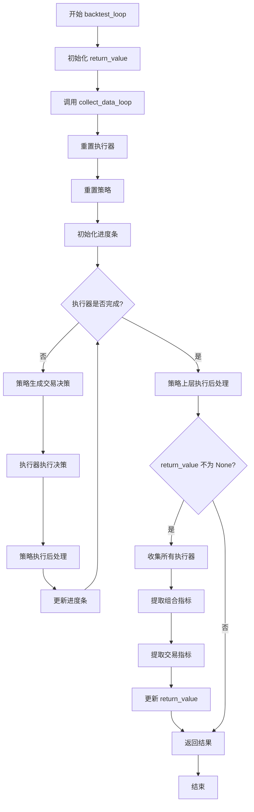
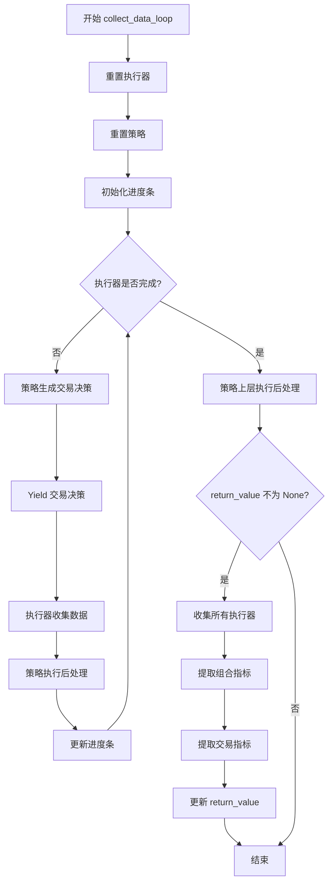

# qlib.backtest.backtest 模块

## 模块概述

`qlib.backtest.backtest` 模块提供了回测循环的核心逻辑。该模块包含两个核心函数：`backtest_loop` 和 `collect_data_loop`，分别用于执行回测和收集交易数据。

## 主要函数

### 1. backtest_loop()

```python
def backtest_loop(
    start_time: Union[pd.Timestamp, str],
    end_time: Union[pd.Timestamp, str],
    trade_strategy: BaseStrategy,
    trade_executor: BaseExecutor,
) -> Tuple[PORT_METRIC, INDICATOR_METRIC]
```

**功能说明**：
回测函数，用于嵌套决策执行中最外层策略和执行器的交互。该函数执行完整的回测流程，并返回组合指标和交易指标。

**参数说明**：

| 参数 | 类型 | 说明 |
|------|------|------|
| `start_time` | pd.Timestamp \| str | 回测开始时间（闭区间），应用于最外层执行器的日历 |
| `end_time` | pd.Timestamp \| str | 回测结束时间（闭区间），应用于最外层执行器的日历 |
| `trade_strategy` | BaseStrategy | 最外层的投资组合策略 |
| `trade_executor` | BaseExecutor | 最外层的执行器 |

**返回值**：
- `portfolio_dict` (PORT_METRIC)：记录交易组合指标信息
- `indicator_dict` (INDICATOR_METRIC)：计算交易指标

**返回值结构**：
```python
PORT_METRIC = Dict[str, Tuple[pd.DataFrame, dict]]
INDICATOR_METRIC = Dict[str, Tuple[pd.DataFrame, Indicator]]
```

**返回值说明**：
- `PORT_METRIC`：键为频率（如 "day", "30min"），值为元组（组合指标 DataFrame，指标字典）
- `INDICATOR_METRIC`：键为频率，值为元组（交易指标 DataFrame，Indicator 对象）

**使用示例**：
```python
from qlib.backtest import backtest_loop
from qlib.backtest import get_strategy_executor

# 获取策略和执行器
trade_strategy, trade_executor = get_strategy_executor(
    start_time="2020-01-01",
    end_time="2020-12-31",
    strategy=strategy_config,
    executor=executor_config,
)

# 执行回测
portfolio_dict, indicator_dict = backtest_loop(
    start_time="2020-01-01",
    end_time="2020-12-31",
    trade_strategy=trade_strategy,
    trade_executor=trade_executor,
)

# 输出结果
for freq, (df, metrics) in portfolio_dict.items():
    print(f"频率 {freq} 的组合指标：")
    print(df.tail())
```

---

### 2. collect_data_loop()

```python
def collect_data_loop(
    start_time: Union[pd.Timestamp, str],
    end_time: Union[pd.Timestamp, str],
    trade_strategy: BaseStrategy,
    trade_executor: BaseExecutor,
    return_value: dict | None = None,
) -> Generator[BaseTradeDecision, Optional[BaseTradeDecision], None]
```

**功能说明**：
生成器函数，用于收集强化学习训练所需的交易决策数据。该函数与 `backtest_loop` 类似，但返回生成器而非直接执行回测。

**参数说明**：

| 参数 | 类型 | 默认值 | 说明 |
|------|------|--------|------|
| `start_time` | pd.Timestamp \| str | - | 回测开始时间（闭区间），应用于最外层执行器的日历 |
| `end_time` | pd.Timestamp \| str | - | 回测结束时间（闭区间），应用于最外层执行器的日历<br>**注意**：对于嵌套执行，如 `Executor[day](Executor[1min])`，设置 `end_time == 20XX0301` 会包含该日所有分钟 |
| `trade_strategy` | BaseStrategy | - | 最外层的投资组合策略 |
| `trade_executor` | BaseExecutor | - | 最外层的执行器 |
| `return_value` | dict \| None | None | 用于存储回测结果的字典 |

**返回值**：
生成器，每次 yield 一个交易决策对象

**返回值说明**：
- 每次返回一个 `BaseTradeDecision` 对象
- 当 `return_value` 不为 None 时，循环结束后会在 `return_value` 中填充：
  - `portfolio_dict`：组合指标
  - `indicator_dict`：交易指标

**使用示例**：
```python
from qlib.backtest import collect_data_loop
from qlib.backtest import get_strategy_executor

# 获取策略和执行器
trade_strategy, trade_executor = get_strategy_executor(
    start_time="2020-01-01",
    end_time="2020-12-31",
    strategy=strategy_config,
    executor=executor_config,
)

# 收集交易决策
return_value = {}
for decision in collect_data_loop(
    start_time="2020-01-01",
    end_time="2020-12-31",
    trade_strategy=trade_strategy,
    trade_executor=trade_executor,
    return_value=return_value,
):
    # 处理每个交易决策
    print(f"决策: {decision}")

# 获取回测结果
portfolio_dict = return_value.get("portfolio_dict")
indicator_dict = return_value.get("indicator_dict")
```

---

## 执行流程

### backtest_loop 流程



### collect_data_loop 流程



---

## 核心概念

### 1. 嵌套执行

回测模块支持嵌套执行，允许一个策略调用另一个策略在不同时间粒度上执行。

**示例**：
- 日线策略在每天结束时生成调仓信号
- 分钟策略在日内精确控制入场和出场时机
- 形成两级嵌套：`Executor[day](Executor[1min])`

### 2. 交易决策生成

策略通过 `generate_trade_decision()` 方法生成交易决策。该决策可能包含：
- 买入/卖出订单
- 子策略调用（用于嵌套执行）

### 3. 决策执行

执行器通过 `collect_data()` 方法执行交易决策，并返回执行结果。执行过程包括：
- 订单撮合
- 交易成本计算
- 持仓更新
- 账户状态更新

### 4. 执行后处理

策略在每次执行后通过 `post_exe_step()` 方法进行后处理，例如：
- 更新内部状态
- 记录交易信息

---

## 完整示例

### 使用 backtest_loop 扔回测

```python
import qlib
from qlib.backtest import backtest_loop, get_strategy_executor

# 初始化 QLib
qlib.init(provider_uri="~/.qlib/qlib_data/cn_data", region="cn")

# 定义策略配置
strategy_config = {
    "class": "TopkDropoutStrategy",
    "module_path": "qlib.contrib.strategy.strategy",
    "kwargs": {
        "topk": 50,
        "n_drop": 5,
        "risk_top": 10,
    },
}

# 定义执行器配置
executor_config = {
    "class": "SimulatorExecutor",
    "module_path": "qlib.backtest.executor",
    "kwargs": {
        "time_per_step": "day",
        "generate_portfolio_metrics": True,
        "indicator_config": {
            "show_indicator": True,
        },
    },
}

# 获取策略和执行器
trade_strategy, trade_executor = get_strategy_executor(
    start_time="2020-01-01",
    end_time="2020-12-31",
    strategy=strategy_config,
    executor=executor_config,
    benchmark="SH000300",
    account=1e9,
)

# 执行回测
portfolio_dict, indicator_dict = backtest_loop(
    start_time="2020-01-01",
    end_time="2020-12-31",
    trade_strategy=trade_strategy,
    trade_executor=trade_executor,
)

# 分析回测结果
print("=== 组合指标 ===")
for freq, (df, metrics) in portfolio_dict.items():
    print(f"\n频率: {freq}")
    print(f"指标: {metrics}")
    print(f"数据形状: {df.shape}")
    print(df.tail())

print("\n=== 交易指标 ===")
for freq, (df, indicator) in indicator_dict.items():
    print(f"\n频率: {freq}")
    print(f"指标对象: {indicator}")
    print(f"数据形状: {df.shape}")
    print(df.tail())
```

### 使用 collect_data_loop 收集数据

```python
import qlib
from qlib.backtest import collect_data_loop, get_strategy_executor, format_decisions

# 初始化 QLib
qlib.init(provider_uri="~/.qlib/qlib_data/cn_data", region="cn")

# 获取策略和执行器
trade_strategy, trade_executor = get_strategy_executor(
    start_time="2020-01-01",
    end_time="2020-12-31",
    strategy=strategy_config,
    executor=executor_config,
)

# 收集交易决策
decisions = []
return_value = {}
for decision in collect_data_loop(
    start_time="2020-01-01",
    end_time="2020-12-31",
    trade_strategy=trade_strategy,
    trade_executor=trade_executor,
    return_value=return_value,
):
    decisions.append(decision)

print(f"共收集到 {len(decisions)} 个交易决策")

# 格式化决策树
formatted_decisions = format_decisions(decisions)
if formatted_decisions:
    freq, decision_list = formatted_decisions
    print(f"决策频率: {freq}")
    print(f"决策数量: {len(decision_list)}")

    # 遍历决策树
    def print_decision_tree(dec_list, indent=0):
        for decision, sub_decisions in dec_list:
            print("  " * indent + f"- 决策: {decision}")
            if sub_decisions:
                print("  " * indent + f"  子决策:")
                print_decision_tree(sub_decisions[1], indent + 2)

    print_decision_tree(decision_list)

# 获取回测结果
portfolio_dict = return_value.get("portfolio_dict")
indicator_dict = return_value.get("indicator_dict")
```

### 嵌套执行示例

```python
import qlib
from qlib.backtest import backtest_loop, get_strategy_executor

# 初始化 QLib
qlib.init(provider_uri="~/.qlib/qlib_data/cn_data", region="cn")

# 日策略配置
day_strategy_config = {
    "class": "TopkDropoutStrategy",
    "module_path": "qlib.contrib.strategy.strategy",
    "kwargs": {"topk": 50, "n_drop": 5},
}

# 分钟策略配置
min_strategy_config = {
    "class": "SignalStrategy",
    "module_path": "qlib.contrib.strategy.signal_strategy",
    "kwargs": {"signal": "buy"},
}

# 嵌套执行器配置
nested_executor_config = {
    "class": "NestedExecutor",
    "module_path": "qlib.backtest.executor",
    "kwargs": {
        "time_per_step": "day",
        "inner_executor": {
            "class": "SimulatorExecutor",
            "module_path": "qlib.backtest.executor",
            "kwargs": {
                "time_per_step": "30min",
            },
        },
        "inner_strategy": min_strategy_config,
    },
}

# 获取策略和执行器
trade_strategy, trade_executor = get_strategy_executor(
    start_time="2020-01-01",
    end_time="2020-12-01",
    strategy=day_strategy_config,
    executor=nested_executor_config,
)

# 执行嵌套回测
portfolio_dict, indicator_dict = backtest_loop(
    start_time="2020-01-01",
    end_time="2020-12-01",
    trade_strategy=trade_strategy,
    trade_executor=trade_executor,
)

# 输出结果
print("嵌套执行回测完成")
for freq, (df, metrics) in portfolio_dict.items():
    print(f"频率 {freq}: {df.shape[0]} 个交易日")
```

---

## 注意事项

1. **时间闭区间**：`start_time` 和 `end_time` 都是闭区间，会包含这两个时间点
2. **嵌套执行的时间**：对于嵌套执行，`end_time` 应用于最外层执行器的日历
3. **生成器使用**：`collect_data_loop` 返回生成器，需要遍历或转换为列表才能获取所有决策
4. **return_value 更新**：只有当 `return_value` 不为 None 时，才会填充回测结果
5. **进度条显示**：回测过程中会显示进度条，可以通过 executor 的 `verbose` 参数控制
6. **多执行器支持**：回测结果会收集所有层级执行器的指标，按频率组织

---

## 相关模块

- [Exchange](./exchange.md) - 交易所模拟
- [Account](./account.md) - 账户管理
- [BaseExecutor](./executor.md) - 订单执行器
- [BaseTradeDecision](./decision.md) - 交易决策
- [Indicator](./report.md) - 指标计算
