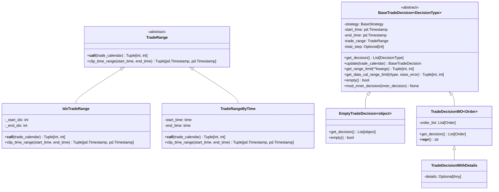

# decision.py 模块文档

## 模块概述

`decision.py` 模块定义了回测框架中的交易决策相关类。该模块提供了订单、交易范围、交易决策等核心数据结构，是策略与执行器之间通信的桥梁。

主要功能：
- `Order`: 表示单个交易订单
- `OrderHelper`: 辅助类，用于简化订单创建
- `TradeRange`: 定义交易时间范围的抽象基类
- `TradeRangeByTime`: 基于时间的交易范围（适用于日内交易）
- `BaseTradeDecision`: 交易决策的基类
- `EmptyTradeDecision`: 空交易决策
- `TradeDecisionWO`: 包含订单的交易决策
- `TradeDecisionWithDetails`: 带详细信息的交易决策

---

## 类和枚举说明

### `OrderDir` (枚举)

订单方向枚举，继承自 `IntEnum`。

```python
class OrderDir(IntEnum):
    SELL = 0  # 卖出
    BUY = 1   # 买入
```

#### 使用示例

```python
from qlib.backtest.decision import OrderDir

direction = OrderDir.BUY  # 买入
direction = OrderDir.SELL  # 卖出
```

---

### `Order` (数据类)

表示单个交易订单的数据类。

```python
@dataclass
class Order:
    stock_id: str              # 股票代码
    amount: float             # 调整后的交易数量（非负值）
    direction: OrderDir        # 交易方向
    start_time: pd.Timestamp   # 订单所属时间范围的开始时间
    end_time: pd.Timestamp     # 订单所属时间范围的结束时间
    deal_amount: float = 0.0   # 实际成交数量（由回测系统设置）
    factor: Optional[float] = None  # 交易因子（由回测系统设置）
```

#### 字段说明

| 字段 | 类型 | 说明 |
|------|------|------|
| `stock_id` | `str` | 股票代码 |
| `amount` | `float` | 调整后的交易数量（非负值） |
| `direction` | `OrderDir` | 交易方向（买入或卖出） |
| `start_time` | `pd.Timestamp` | 订单所属时间范围的开始时间（闭区间） |
| `end_time` | `pd.Timestamp` | 订单所属时间范围的结束时间（闭区间） |
| `deal_amount` | `float` | 实际成交数量（由回测系统在订单执行后设置） |
| `factor` | `Optional[float]` | 交易因子（由回测系统设置） |

**交易结果说明**:
- 无法交易: `deal_amount == 0`, `factor is None`（如股票停牌，整个订单失败，无成本）
- 成交或部分成交: `deal_amount >= 0`, `factor is not None`

#### 属性说明

##### `amount_delta`

返回数量的变化值。

```python
@property
def amount_delta(self) -> float:
    return self.amount * self.sign
```

- 正值：买入 `amount` 数量的股票
- 负值：卖出 `amount` 数量的股票

##### `deal_amount_delta`

返回成交数量的变化值。

```python
@property
def deal_amount_delta(self) -> float:
    return self.deal_amount * self.sign
```

- 正值：实际买入 `deal_amount` 数量的股票
- 负值：实际卖出 `deal_amount` 数量的股票

##### `sign`

返回交易的符号。

```python
@property
def sign(self) -> int:
    return self.direction * 2 - 1
```

- `+1`: 买入
- `-1`: 卖出

##### `key_by_day`

返回在日级别粒度下的唯一键（可哈希）。

```python
@property
def key_by_day(self) -> tuple:
    return self.stock_id, self.date, self.direction
```

##### `key`

返回订单的唯一键（可哈希）。

```python
@property
def key(self) -> tuple:
    return self.stock_id, self.start_time, self.end_time, self.direction
```

##### `date`

返回订单的日期。

```python
@property
def date(self) -> pd.Timestamp:
    return pd.Timestamp(self.start_time.replace(hour=0, minute=0, second=0))
```

#### 方法说明

##### `parse_dir` (静态方法)

解析交易方向，支持多种输入类型。

```python
@staticmethod
def parse_dir(direction: Union[str, int, np.integer, OrderDir, np.ndarray]) -> Union[OrderDir, np.ndarray]
```

**参数**:
- `direction`: 交易方向，可以是字符串（"buy"/"sell"）、整数（正数为买入）、`OrderDir` 枚举或 numpy 数组

**返回值**:
- `OrderDir`: 解析后的方向
- `np.ndarray`: 如果输入是数组，返回解析后的数组

**使用示例**:

```python
from qlib.backtest.decision import Order, OrderDir

# 从字符串解析
dir1 = Order.parse_dir("buy")    # OrderDir.BUY
dir2 = Order.parse_dir("sell")   # OrderDir.SELL

# 从整数解析
dir3 = Order.parse_dir(1)         # OrderDir.BUY
dir4 = Order.parse_dir(-1)        # OrderDir.SELL

# 从枚举解析
dir5 = Order.parse_dir(OrderDir.BUY)
```

#### 使用示例

```python
from qlib.backtest.decision import Order, OrderDir
import pandas as pd

# 创建买入订单
buy_order = Order(
    stock_id="SH600000",
    amount=1000,
    direction=OrderDir.BUY,
    start_time=pd.Timestamp("2020-01-01 09:30:00"),
    end_time=pd.Timestamp("2020-01-01 10:00:00")
)

# 创建卖出订单
sell_order = Order(
    stock_id="SH600000",
    amount=500,
    direction=OrderDir.SELL,
    start_time=pd.Timestamp("2020-01-01 14:00:00"),
    end_time=pd.Timestamp("2020-01-01 14:30:00")
)

# 查看订单属性
print(f"订单金额变化: {buy_order.amount_delta}")  # 1000
print(f"订单符号: {buy_order.sign}")  # 1
print(f"订单唯一键: {buy_order.key}")
```

---

### `OrderHelper` (类)

辅助类，用于更方便地创建订单。

```python
class OrderHelper:
    def __init__(self, exchange: Exchange) -> None
```

#### 方法说明

##### `create` (静态方法)

创建一个订单。

```python
@staticmethod
def create(
    code: str,
    amount: float,
    direction: OrderDir,
    start_time: Union[str] = None,
    end_time: Union[str] = None,
) -> Order
```

**参数**:
- `code`: 交易标的代码
- `amount`: 调整后的交易数量
- `direction`: 交易方向
- `start_time`: 订单所属时间范围的开始时间（可选）
- `end_time`: 订单所属时间范围的结束时间（可选）

**返回值**:
- `Order`: 创建的订单

**使用示例**:

```python
from qlib.backtest.decision import OrderHelper, OrderDir

order = OrderHelper.create(
    code="SH600000",
    amount=1000,
    direction=OrderDir.BUY,
    start_time="2020-01-01 09:30:00",
    end_time="2020-01-01 10:00:00"
)
```

---

### `TradeRange` (抽象基类)

交易范围的抽象基类，用于定义交易的时间范围限制。

```python
class TradeRange:
    @abstractmethod
    def __call__(self, trade_calendar: TradeCalendarManager) -> Tuple[int, int]:
        pass

    @abstractmethod
    def clip_time_range(self, start_time: pd.Timestamp, end_time: pd.Timestamp) -> Tuple[pd.Timestamp, pd.Timestamp]:
        pass
```

#### 方法说明

##### `__call__`

获取交易范围对应的索引范围。

**参数**:
- `trade_calendar`: 内部策略的交易日历

**返回值**:
- `Tuple[int, int]`: 可交易的起始索引和结束索引（闭区间）

##### `clip_time_range`

裁剪时间范围。

**参数**:
- `start_time`: 开始时间
- `end_time`: 结束时间

**返回值**:
- `Tuple[pd.Timestamp, pd.Timestamp]`: 裁剪后的可交易时间范围（`[start_time, end_time]` 和自身规则的交集）

---

### `IdxTradeRange` (类)

基于索引的交易范围。

```python
class IdxTradeRange(TradeRange):
    def __init__(self, start_idx: int, end_idx: int) -> None
```

#### 构造参数

| 参数 | 类型 | 说明 |
|------|------|------|
| `start_idx` | `int` | 起始索引 |
| `end_idx` | `int` | 结束索引 |

#### 使用示例

```python
from qlib.backtest.decision import IdxTradeRange

# 定义索引范围
trade_range = IdxTradeRange(start_idx=0, end_idx=100)
```

---

### `TradeRangeByTime` (类)

基于时间的交易范围，常用于日内交易。

```python
class TradeRangeByTime(TradeRange):
    def __init__(self, start_time: str | time, end_time: str | time) -> None
```

#### 构造参数

| 参数 | 类型 | 说明 |
|------|------|------|
| `start_time` | `str | time` | 开始时间，如 "9:30" |
| `end_time` | `str | time` | 结束时间，如 "14:30" |

#### 使用示例

```python
from qlib.backtest.decision import TradeRangeByTime

# 定义9:30到14:30的交易时间范围
trade_range = TradeRangeByTime(
    start_time="9:30",
    end_time="14:30"
)
```

#### 注意事项

- 该类专为**分钟级日内交易**设计
- `start_time` 和 `end_time` 都是闭区间

---

### `BaseTradeDecision` (泛型基类)

交易决策的基类，由策略生成并传递给执行器执行。

```python
class BaseTradeDecision(Generic[DecisionType]):
    def __init__(
        self,
        strategy: BaseStrategy,
        trade_range: Union[Tuple[int, int], TradeRange, None] = None
    ) -> None
```

#### 构造参数

| 参数 | 类型 | 说明 |
|------|------|------|
| `strategy` | `BaseStrategy` | 生成该决策的策略 |
| `trade_range` | `Union[Tuple[int, int], TradeRange, None]` | 底层策略的索引范围（可选） |

**`trade_range` 的两种形式**:
1. `Tuple[int, int]`: 起始索引和结束索引（闭区间）
2. `TradeRange`: 可调用的交易范围对象

#### 属性说明

| 属性 | 类型 | 说明 |
|------|------|------|
| `strategy` | `BaseStrategy` | 生成决策的策略 |
| `start_time` | `pd.Timestamp` | 决策的开始时间 |
| `end_time` | `pd.Timestamp` | 决策的结束时间 |
| `trade_range` | `Optional[TradeRange]` | 交易范围 |
| `total_step` | `Optional[int]` | 总步数 |

#### 方法说明

##### `get_decision`

获取具体的决策内容（如执行订单）。

```python
def get_decision(self) -> List[DecisionType]:
    raise NotImplementedError
```

**返回值**:
- 空列表 `[]`: 决策不可用
- 非空列表 `[concrete_decision]`: 决策可用

##### `update`

在每个步骤开始时被调用，用于更新决策或从内部执行器日历更新信息。

```python
def update(self, trade_calendar: TradeCalendarManager) -> Optional[BaseTradeDecision]:
```

**参数**:
- `trade_calendar`: **内部策略**的交易日历

**返回值**:
- `BaseTradeDecision`: 新更新的决策
- `None`: 无更新（使用之前的决策或不可用）

##### `get_range_limit`

返回获取限制决策执行时间的预期步长范围。

```python
def get_range_limit(self, **kwargs: Any) -> Tuple[int, int]:
```

**参数**:
- `default_value`: 默认值（当无法提供范围时使用）
- `inner_calendar`: 内部策略的交易日历

**返回值**:
- `Tuple[int, int]`: 起始和结束索引（闭区间）

**注意事项**:
- 仅在 `NestedExecutor` 中使用
- 最外层策略不遵循任何范围限制
- 最内层策略的 `range_limit` 无用（因为原子执行器没有此功能）

##### `get_data_cal_range_limit`

基于数据日历获取范围限制。

```python
def get_data_cal_range_limit(self, rtype: str = "full", raise_error: bool = False) -> Tuple[int, int]:
```

**参数**:
- `rtype`: 返回类型
  - `"full"`: 返回当天决策的完整限制
  - `"step"`: 返回当前步骤的限制
- `raise_error`: 是否在无交易范围时抛出异常

**返回值**:
- `Tuple[int, int]`: 数据日历中的范围限制

##### `empty`

判断决策是否为空。

```python
def empty(self) -> bool:
```

**返回值**:
- `True`: 决策为空
- `False`: 决策不为空

##### `mod_inner_decision`

修改内部交易决策（在内部决策生成后调用）。

```python
def mod_inner_decision(self, inner_trade_decision: BaseTradeDecision) -> None:
```

**参数**:
- `inner_trade_decision`: 内部交易决策（将就地修改）

**注意事项**:
- 留下一个钩子，允许外层决策影响内层策略生成的决策
- 默认行为：当内层 `trade_range` 未设置时，会传播外层的 `trade_range`

#### 使用示例

```python
from qlib.backtest.decision import BaseTradeDecision, TradeRangeByTime

# 创建带有交易范围的决策
class MyTradeDecision(BaseTradeDecision):
    def __init__(self, strategy, trade_range=None):
        super().__init__(strategy, trade_range)

    def get_decision(self):
        # 返回具体的订单列表
        return self.order_list

# 使用
trade_range = TradeRangeByTime("9:30", "14:30")
decision = MyTradeDecision(strategy=my_strategy, trade_range=trade_range)
```

---

### `EmptyTradeDecision` (类)

空的交易决策。

```python
class EmptyTradeDecision(BaseTradeDecision[object]):
    def get_decision(self) -> List[object]:
        return []

    def empty(self) -> bool:
        return True
```

#### 使用示例

```python
from qlib.backtest.decision import EmptyTradeDecision

# 创建空决策
empty_decision = EmptyTradeDecision(strategy=my_strategy)
assert empty_decision.empty() == True
```

---

### `TradeDecisionWO` (类)

包含订单的交易决策（（T）rade（D）ecision **W**ith **O**rder）。

```python
class TradeDecisionWO(BaseTradeDecision[Order]):
    def __init__(
        self,
        order_list: List[Order],
        strategy: BaseStrategy,
        trade_range: Union[Tuple[int, int], TradeRange, None] = None,
    ) -> None
```

#### 构造参数

| 参数 | 类型 | 说明 |
|------|------|------|
| `order_list` | `List[Order]` | 订单列表 |
| `strategy` | `BaseStrategy` | 生成该决策的策略 |
| `trade_range` | `Union[Tuple[int, int], TradeRange, None]` | 交易范围（可选） |

#### 方法说明

##### `get_decision`

返回订单列表。

```python
def get_decision(self) -> List[Order]:
    return self.order_list
```

#### 使用示例

```python
from qlib.backtest.decision import TradeDecisionWO, Order, OrderDir

# 创建订单
buy_order = Order(
    stock_id="SH600000",
    amount=1000,
    direction=OrderDir.BUY,
    start_time=pd.Timestamp("2020-01-01 09:30:00"),
    end_time=pd.Timestamp("2020-01-01 10:00:00")
)

# 创建交易决策
decision = TradeDecisionWO(
    order_list=[buy_order],
    strategy=my_strategy
)

# 获取订单列表
orders = decision.get_decision()
```

---

### `TradeDecisionWithDetails` (类)

带详细信息的交易决策，用于生成执行报告。

```python
class TradeDecisionWithDetails(TradeDecisionWO):
    def __init__(
        self,
        order_list: List[Order],
        strategy: BaseStrategy,
        trade_range: Optional[Tuple[int, int]] = None,
        details: Optional[Any] = None,
    ) -> None
```

#### 构造参数

| 参数 | 类型 | 说明 |
|------|------|------|
| `order_list` | `List[Order]` | 订单列表 |
| `strategy` | `BaseStrategy` | 生成该决策的策略 |
| `trade_range` | `Optional[Tuple[int, int]]` | 交易范围（可选） |
| `details` | `Optional[Any]` | 详细信息（可选） |

#### 使用示例

```python
from qlib.backtest.decision import TradeDecisionWithDetails, Order, OrderDir

# 创建订单
order = Order(
    stock_id="SH600000",
    amount=1000,
    direction=OrderDir.BUY,
    start_time=pd.Timestamp("2020-01-01 09:30:00"),
    end_time=pd.Timestamp("2020-01-01 10:00:00")
)

# 创建带详细信息的决策
decision = TradeDecisionWithDetails(
    order_list=[order],
    strategy=my_strategy,
    details={"reason": "买入信号", "confidence": 0.85}
)

# 访问详细信息
print(decision.details)
```

---

## 类继承关系图



---

## 使用场景

### 场景1: 创建简单的买卖订单

```python
from qlib.backtest.decision import Order, OrderDir
import pandas as pd

# 买入订单
buy_order = Order(
    stock_id="SH600000",
    amount=1000,
    direction=OrderDir.BUY,
    start_time=pd.Timestamp("2020-01-01 09:30:00"),
    end_time=pd.Timestamp("2020-01-01 10:00:00")
)

# 卖出订单
sell_order = Order(
    stock_id="SH600000",
    amount=500,
    direction=OrderDir.SELL,
    start_time=pd.Timestamp("2020-01-01 14:00:00"),
    end_time=pd.Timestamp("2020-01-01 14:30:00")
)
```

### 场景2: 创建带时间范围的交易决策

```python
from qlib.backtest.decision import TradeDecisionWO, TradeRangeByTime

# 定义交易时间范围（只在前半小时交易）
trade_range = TradeRangeByTime("9:30", "10:00")

# 创建决策
decision = TradeDecisionWO(
    order_list=[buy_order],
    strategy=my_strategy,
    trade_range=trade_range
)
```

### 场景3: 创建带详细信息的决策

```python
from qlib.backtest.decision import TradeDecisionWithDetails

decision = TradeDecisionWithDetails(
    order_list=[buy_order],
    strategy=my_strategy,
    details={
        "signal": "买入",
        "score": 0.92,
        "reason": "技术指标突破"
    }
)
```

### 场景4: 在自定义策略中使用交易决策

```python
from qlib.strategy.base import BaseStrategy
from qlib.backtest.decision import TradeDecisionWO, Order, OrderDir

class MyStrategy(BaseStrategy):
    def generate_trade_decision(self, execute_result=None):
        # 获取信号
        signal = self.get_signal()

        # 生成订单
        orders = []
        for stock_id, score in signal.items():
            if score > 0.8:
                orders.append(Order(
                    stock_id=stock_id,
                    amount=100,
                    direction=OrderDir.BUY,
                ))
            elif score < 0.2:
                orders.append(Order(
                    stock_id=stock_id,
                    amount=100,
                    direction=OrderDir.SELL,
                ))

        # 返回交易决策
        return TradeDecisionWO(
            order_list=orders,
            strategy=self,
        )
```

---

## 常见问题

### Q1: `Order` 中的 `amount` 和 `deal_amount` 有什么区别？

A:
- `amount`: 用户指定的订单数量（调整后）
- `deal_amount`: 实际成交的数量，由回测系统在执行后设置

### Q2: `TradeRangeByTime` 适用于什么场景？

A: 专门用于**分钟级日内交易**，例如只在上午9:30到10:30之间交易。

### Q3: 如何判断一个决策是否为空？

A: 使用 `decision.empty()` 方法，返回 `True` 表示决策为空。

### Q4: `get_range_limit` 在什么情况下会被调用？

A: 该方法仅在 `NestedExecutor` 中使用，用于限制内层策略的执行时间范围。最外层策略不遵循任何范围限制。

---

## 相关模块

- [`exchange.py`](./exchange.md): 交易所相关类
- [`executor.py`](./executor.md): 执行器相关类
- [`backtest.py`](./backtest.md): 回测循环函数
- [`strategy.base`](../../strategy/base.py): 策略基类

---

## 注意事项

1. **时间区间**: 所有时间参数都是闭区间
2. **方向验证**: `Order` 方向只能是 `SELL` 或 `BUY`
3. **数量非负**: `amount` 和 `deal_amount` 都是非负值
4. **结果字段**: `deal_amount` 和 `factor` 由回测系统设置，用户无需关心
5. **时间范围**: `TradeRange` 仅影响 `NestedExecutor`，不影响原子执行器
6. **决策更新**: `update` 方法允许决策在执行过程中动态更新
7. **嵌套决策**: `mod_inner_decision` 方法允许外层决策影响内层决策
