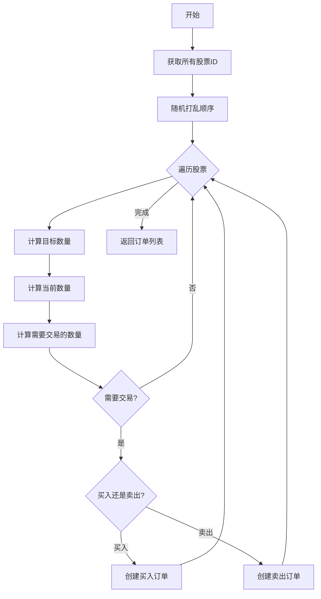

# exchange.py 模块文档

## 模块概述

`exchange.py` 模块定义了交易所类 `Exchange`，用于模拟真实市场的交易行为。该模块负责：

1. 从 Qlib 数据源获取市场数据
2. 处理订单的成交逻辑
3. 计算交易成本
4. 管理交易限制（涨跌停、成交量等）
5. 复权因子处理

---

## 类说明

### `Exchange` (类)

交易所类，模拟真实市场交易行为。

```python
class Exchange:
    def __init__(
        self,
        freq: str = "day",
        start_time: Union[pd.Timestamp, str] = None,
        end_time: Union[pd.Timestamp, str] = None,
        codes: Union[list, str] = "all",
        deal_price: Union[str, Tuple[str, str], List[str], None] = None,
        subscribe_fields: list = [],
        limit_threshold: Union[Tuple[str, str], float, None] = None,
        volume_threshold: Union[tuple, dict, None] = None,
        open_cost: float = 0.0015,
        close_cost: float = 0.0025,
        min_cost: float = 5.0,
        impact_cost: float = 0.0,
        extra_quote: pd.DataFrame = None,
        quote_cls: Type[BaseQuote] = NumpyQuote,
        **kwargs: Any,
    ) -> None
```

---

## 构造参数详解

| 参数 | 类型 | 默认值 | 说明 |
|------|------|--------|------|
| `freq` | `str` | `"day"` | 数据频率（如 "1day", "1min"） |
| `start_time` | `Union[pd.Timestamp, str]` | `None` | 回测开始时间（闭区间） |
| `end_time` | `Union[pd.Timestamp, str]` | `None` | 回测结束时间（闭区间） |
| `codes` | `Union[list, str]` | `"all"` | 股票代码列表或预设名称（如 "all", "csi500", "sse50"） |
| `deal_price` | `Union[str, Tuple[str, str], List[str], None]` | `None` | 成交价格配置 |
| `subscribe_fields` | `list` | `[]` | 额外订阅的字段 |
| `limit_threshold` | `Union[Tuple[str, str], float, None]` | `None` | 涨跌停限制阈值 |
| `volume_threshold` | `Union[tuple, dict, None]` | `None` | 成交量限制配置 |
| `open_cost` | `float` | `0.0015` | 开仓成本率（买入成本率） |
| `close_cost` | `float` | `0.0025` | 平仓成本率（卖出成本率） |
| `min_cost` | `float` | `5.0` | 最小交易成本 |
| `impact_cost` | `float` | `0.0` | 市场冲击成本率（滑点） |
| `extra_quote` | `pd.DataFrame` | `None` | 额外行情数据 |
| `quote_cls` | `Type[BaseQuote]` | `NumpyQuote` | 行情数据类 |
| `trade_unit` | `int` | `None` | 交易单位（通过 `kwargs` 传递） |

---

### `deal_price` 参数详解

成交价格配置，支持以下格式：

1. **单一字符串**: 买卖使用相同价格
   ```python
   deal_price = "$close"  # 或 "close"
   ```

2. **元组或列表**: 买卖使用不同价格
   ```python
   deal_price = ("$open", "$close")  # 买入用开盘价，卖出用收盘价
   deal_price = ["$open", "$vwap"]   # 买入用开盘价，卖出用成交量加权平均价
   ```

**支持的价格字段**:
- `$close` 或 `$vwap`: 收盘价或成交量加权平均价
- `$open`: 开盘价
- 其他自定义字段

---

### `limit_threshold` 参数详解

涨跌停限制阈值，支持以下格式：

1. **`None`**: 无限制
   ```python
   limit_threshold = None
   ```

2. **浮点数**: 基于涨跌幅度的限制
   ```python
   limit_threshold = 0.1  # 涨跌幅超过10%时限制交易
   ```

3. **元组**: 基于自定义表达式的限制
   ```python
   limit_threshold = ("$limit_buy", "$limit_sell")
   # $limit_buy: True 表示不能买入
   # $limit_sell: True 表示不能卖出
   ```

---

### `volume_threshold` 参数详解

成交量限制配置，支持以下格式：

1. **单一元组**: 买卖使用相同限制
   ```python
   volume_threshold = ("cum", "0.2 * DayCumsum($volume, '9:45', '14:45')")
   ```

2. **字典**: 分别指定买卖限制
   ```python
   volume_threshold = {
       "all": ("cum", "0.2 * DayCumsum($volume, '9:45', '14:45')"),  # 通用限制
       "buy": ("current", "$askV1"),  # 买入限制
       "sell": ("current", "$bidV1"),  # 卖出限制
   }
   ```

**限制类型**:
- `"cum"`: 累计值，需要减去已成交量
- `"current"`: 当前值，直接使用

---

## 常量定义

| 常量 | 值 | 说明 |
|------|-----|------|
| `LT_TP_EXP` | `"(exp)"` | 基于表达式的限制 |
| `LT_FLT` | `"float"` | 基于涨跌幅度的限制 |
| `LT_NONE` | `"none"` | 无限制 |

---

## 重要方法说明

### `get_quote_from_qlib`

从 Qlib 数据源获取行情数据。

```python
def get_quote_from_qlib(self) -> None:
```

**功能**:
- 从 Qlib 获取指定股票、时间范围、字段的数据
- 处理复权因子
- 更新涨跌停限制
- 合并额外行情数据

---

### `check_stock_limit`

检查股票是否因涨跌停而限制交易。

```python
def check_stock_limit(
    self,
    stock_id: str,
    start_time: pd.Timestamp,
    end_time: pd.Timestamp,
    direction: int | None = None,
) -> bool:
```

**参数**:
- `stock_id`: 股票代码
- `start_time`: 开始时间
- `end_time`: 结束时间
- `direction`: 交易方向（可选）
  - `None`: 检查买卖是否都受限
  - `Order.BUY`: 检查买入是否受限
  - `Order.SELL`: 检查卖出是否受限

**返回值**:
- `True`: 股票受限（不能交易）
- `False`: 股票不受限

---

### `check_stock_suspended`

检查股票是否停牌。

```python
def check_stock_suspended(
    self,
    stock_id: str,
    start_time: pd.Timestamp,
    end_time: pd.Timestamp,
) -> bool:
```

**参数**:
- `stock_id`: 股票代码
- `start_time`: 开始时间
- `end_time`: 结束时间

**返回值**:
- `True`: 股票停牌
- `False`: 股票未停牌

---

### `is_stock_tradable`

检查股票是否可交易。

```python
def is_stock_tradable(
    self,
    stock_id: str,
    start_time: pd.Timestamp,
    end_time: pd.Timestamp,
    direction: int | None = None,
) -> bool:
```

**参数**:
- `stock_id`: 股票代码
- `start_time`: 开始时间
- `end_time`: 结束时间
- `direction`: 交易方向（可选）

**返回值**:
- `True`: 股票可交易
- `False`: 股票不可交易（停牌或受限）

---

### `check_order`

检查订单是否可执行。

```python
def check_order(self, order: Order) -> bool:
```

**参数**:
- `order`: 订单对象

**返回值**:
- `True`: 订单可执行
- `False`: 订单不可执行

---

### `deal_order`

执行订单，更新账户或持仓状态。

```python
def deal_order(
    self,
    order: Order,
    trade_account: Account | None = None,
    position: BasePosition | None = None,
    dealt_order_amount: Dict[str, float] = defaultdict(float),
) -> Tuple[float, float, float]:
```

**参数**:
- `order`: 订单对象
- `trade_account`: 交易账户（可选）
- `position`: 持仓对象（可选）
- `dealt_order_amount`: 已成交订单数量字典

**返回值**:
- `trade_val`: 交易金额
- `trade_cost`: 交易成本
- `trade_price`: 交易价格

**注意事项**:
- `trade_account` 和 `position` 只能选择一个
- 订单的 `deal_amount` 和 `factor` 会被更新

---

### `get_quote_info`

获取行情数据。

```python
def get_quote_info(
    self,
    stock_id: str,
    start_time: pd.Timestamp,
    end_time: pd.Timestamp,
    field: str,
    method: str = "ts_data_last",
) -> Union[None, int, float, bool, IndexData]:
```

**参数**:
- `stock_id`: 股票代码
- `start_time`: 开始时间
- `end_time`: 结束时间
- `field`: 字段名称（如 `$close`, `$volume`）
- `method`: 获取方法
  - `"ts_data_last"`: 获取最后一个值（默认）
  - `"sum"`: 求和
  - `"all"`: 全部

**返回值**:
- 字段对应的值

---

### `get_close`

获取收盘价。

```python
def get_close(
    self,
    stock_id: str,
    start_time: pd.Timestamp,
    end_time: pd.Timestamp,
    method: str = "ts_data_last",
) -> Union[None, int, float, bool, IndexData]:
```

**返回值**:
- 收盘价

---

### `get_volume`

获取成交量。

```python
def get_volume(
    self,
    stock_id: str,
    start_time: pd.Timestamp,
    end_time: pd.Timestamp,
    method: Optional[str] = "sum",
) -> Union[None, int, float, bool, IndexData]:
```

**返回值**:
- 成交量

---

### `get_deal_price`

获取成交价格。

```python
def get_deal_price(
    self,
    stock_id: str,
    start_time: pd.Timestamp,
    end_time: pd.Timestamp,
    direction: OrderDir,
    method: Optional[str] = "ts_data_last",
) -> Union[None, int, float, bool, IndexData]:
```

**参数**:
- `stock_id`: 股票代码
- `start_time`: 开始时间
- `end_time`: 结束时间
- `direction`: 交易方向（决定使用买入价还是卖出价）
- `method`: 获取方法

**返回值**:
- 成交价格

---

### `get_factor`

获取复权因子。

```python
def get_factor(
    self,
    stock_id: str,
    start_time: pd.Timestamp,
    end_time: pd.Timestamp,
) -> Optional[float]:
```

**返回值**:
- `None`: 股票停牌
- `float`: 复权因子

---

### `generate_amount_position_from_weight_position`

根据权重和现金生成目标持仓。

```python
def generate_amount_position_from_weight_position(
    self,
    weight_position: dict,
    cash: float,
    start_time: pd.Timestamp,
    end_time: pd.Timestamp,
    direction: OrderDir = OrderDir.BUY,
) -> dict:
```

**参数**:
- `weight_position`: 权重持仓 `{stock_id: weight}`
- `cash`: 现金
- `start_time`: 开始时间
- `end_time`: 结束时间
- `direction`: 交易方向（默认买入）

**返回值**:
- 数量持仓 `{stock_id: amount}`

**注意事项**:
- 权重必须在 (0, 1) 范围内
- 可交易股票的权重之和不能超过 1.0

---

### `generate_order_for_target_amount_position`

根据目标持仓和当前持仓生成订单列表。

```python
def generate_order_for_target_amount_position(
    self,
    target_position: dict,
    current_position: dict,
    start_time: pd.Timestamp,
    end_time: pd.Timestamp,
) -> List[Order]:
```

**参数**:
- `target_position`: 目标持仓 `{stock_id: amount}`
- `current_position`: 当前持仓 `{stock_id: amount}`
- `start_time`: 开始时间
- `end_time`: 结束时间

**返回值**:
- 订单列表（先卖后买）

**流程**:


---

### `calculate_amount_position_value`

计算持仓价值。

```python
def calculate_amount_position_value(
    self,
    amount_dict: dict,
    start_time: pd.Timestamp,
    end_time: pd.Timestamp,
    only_tradable: bool = False,
    direction: OrderDir = OrderDir.SELL,
) -> float:
```

**参数**:
- `amount_dict`: 持仓的数量 `{stock_id: amount}`
- `start_time`: 开始时间
- `end_time`: 结束时间
- `only_tradable`: 是否只计算可交易股票（默认 False）
- `direction`: 交易方向（默认卖出）

**返回值**:
- 持仓价值

---

### `get_amount_of_trade_unit`

获取基于复权因子的交易单位。

```python
def get_amount_of_trade_unit(
    self,
    factor: float | None = None,
    stock_id: str | None = None,
    start_time: pd.Timestamp = None,
    end_time: pd.Timestamp = None,
) -> Optional[float]:
```

**参数**:
- `factor`: 复权因子（可选）
- `stock_id`: 股票代码（可选）
- `start_time`: 开始时间（可选）
- `end_time`: 结束时间（可选）

**返回值**:
- `None`: 禁用交易单位或使用调整价格模式
- `float`: 交易单位

**注意事项**:
- `factor` 优先级高于 `stock_id`, `start_time`, `end_time`

---

### `round_amount_by_trade_unit`

根据交易单位对数量进行取整。

```python
def round_amount_by_trade_unit(
    self,
    deal_amount: float,
    factor: float | None = None,
    stock_id: str | None = None,
    start_time: pd.Timestamp = None,
    end_time: pd.Timestamp = None,
) -> float:
```

**参数**:
- `deal_amount`: 交易数量
- `factor`: 复权因子（可选）
- `stock_id`: 股票代码（可选）
- `start_time`: 开始时间（可选）
- `end_time`: 结束时间（可选）

**返回值**:
- 取整后的数量

---

### `get_order_helper`

获取订单辅助对象。

```python
def get_order_helper(self) -> OrderHelper:
```

**返回值**:
- `OrderHelper` 对象

---

## 使用示例

### 示例1: 创建简单的交易所

```python
from qlib.backtest.exchange import Exchange
import pandas as pd

# 创建交易所
exchange = Exchange(
    freq="1day",
    start_time="2020-01-01",
    end_time="2020-12-31",
    codes=["SH600000", "SH600519"],
    deal_price="$close",
    open_cost=0.0015,  # 买入成本率 0.15%
    close_cost=0.0025, # 卖出成本率 0.25%
    min_cost=5.0,     # 最小交易成本 5 元
)
```

### 示例2: 设置涨跌停限制

```python
# 基于涨跌幅度的限制
exchange = Exchange(
    freq="1day",
    start_time="2020-01-01",
    end_time="2020-12-31",
    limit_threshold=0.1,  # 涨跌幅超过 10% 时限制交易
)

# 基于自定义表达式的限制
exchange = Exchange(
    freq="1day",
    start_time="2020-01-01",
    end_time="2020-12-31",
    limit_threshold=("$limit_buy", "$limit_sell"),
)
```

### 示例3: 设置成交量限制

```python
# 使用成交量限制
exchange = Exchange(
    freq="1min",
    start_time="2020-01-01",
    end_time="2020-12-31",
    volume_threshold={
        "all": ("cum", "0.2 * DayCumsum($volume, '9:45', '14:45')"),
        "buy": ("current", "$askV1"),
        "sell": ("current", "$bidV1"),
    },
)
```

### 示例4: 使用不同的成交价格

```python
# 买卖使用相同价格
exchange = Exchange(deal_price="$close")

# 买卖使用不同价格
exchange = Exchange(deal_price=("$open", "$close"))
```

### 示例5: 检查股票是否可交易

```python
# 检查股票是否停牌
is_suspended = exchange.check_stock_suspended(
    stock_id="SH600000",
    start_time=pd.Timestamp("2020-01-01 09:30:00"),
    end_time=pd.Timestamp("2020-01-01 10:00:00"),
)

# 检查股票是否受限
is_limited = exchange.check_stock_limit(
    stock_id="SH600000",
    start_time=pd.Timestamp("2020-01-01 09:30:00"),
    end_time=pd.Timestamp("2020-01-01 10:00:00"),
    direction=OrderDir.BUY,
)

# 检查股票是否可交易
is_tradable = exchange.is_stock_tradable(
    stock_id="SH600000",
    start_time=pd.Timestamp("2020-01-01 09:30:00"),
    end_time=pd.Timestamp("2020-01-01 10:00:00"),
)
```

### 示例6: 获取行情数据

```python
# 获取收盘价
close_price = exchange.get_close(
    stock_id="SH600000",
    start_time=pd.Timestamp("2020-01-01 09:30:00"),
    end_time=pd.Timestamp("2020-01-01 10:00:00"),
)

# 获取成交量
volume = exchange.get_volume(
    stock_id="SH600000",
    start_time=pd.Timestamp("2020-01-01 09:30:00"),
    end_time=pd.Timestamp("2020-01-01 10:00:00"),
)

# 获取成交价格
deal_price = exchange.get_deal_price(
    stock_id="SH600000",
    start_time=pd.Timestamp("2020-01-01 09:30:00"),
    end_time=pd.Timestamp("2020-01-01 10:00:00"),
    direction=OrderDir.BUY,
)
```

### 示例7: 生成目标持仓和订单

```python
# 根据权重生成数量持仓
weight_position = {
    "SH600000": 0.5,
    "SH600519": 0.5,
}
cash = 1000000

amount_position = exchange.generate_amount_position_from_weight_position(
    weight_position=weight_position,
    cash=cash,
    start_time=pd.Timestamp("2020-01-01 09:30:00"),
    end_time=pd.Timestamp("2020-01-01 10:00:00"),
)

# 根据目标持仓生成订单
current_position = {"SH600000": 1000, "SH600519": 0}
target_position = {"SH600000": 0, "SH600519": 2000}

orders = exchange.generate_order_for_target_amount_position(
    target_position=target_position,
    current_position=current_position,
    start_time=pd.Timestamp("2020-01-01 09:30:00"),
    end_time=pd.Timestamp("2020-01-01 10:00:00"),
)
```

---

## 常见问题

### Q1: 如何设置交易单位？

A: 通过 `trade_unit`' 参数设置（通过 `kwargs` 传递）：

```python
exchange = Exchange(
    freq="1day",
    trade_unit=100,  # 中国 A 股的交易单位
)
```

### Q2: `open_cost` 和 `close_cost` 有什么区别？

A:
- `open_cost`: 买入成本率（开仓成本）
- `close_cost`: 卖出成本率（平仓成本）

### Q3: 如何获取复权因子？

A: 使用 `get_factor` 方法：

```python
factor = exchange.get_factor(
    stock_id="SH600000",
    start_time=pd.Timestamp("2020-01-01"),
    end_time=pd.Timestamp("2020-01-02"),
)
```

---

## 相关模块

- [`decision.py`](./decision.md): 订单和交易决策相关类
- [`executor.py`](./executor.md): 执行器相关类
- [`account.py`](./account.md): 账户相关类
- [`position.py`](./position.md): 持仓相关类
