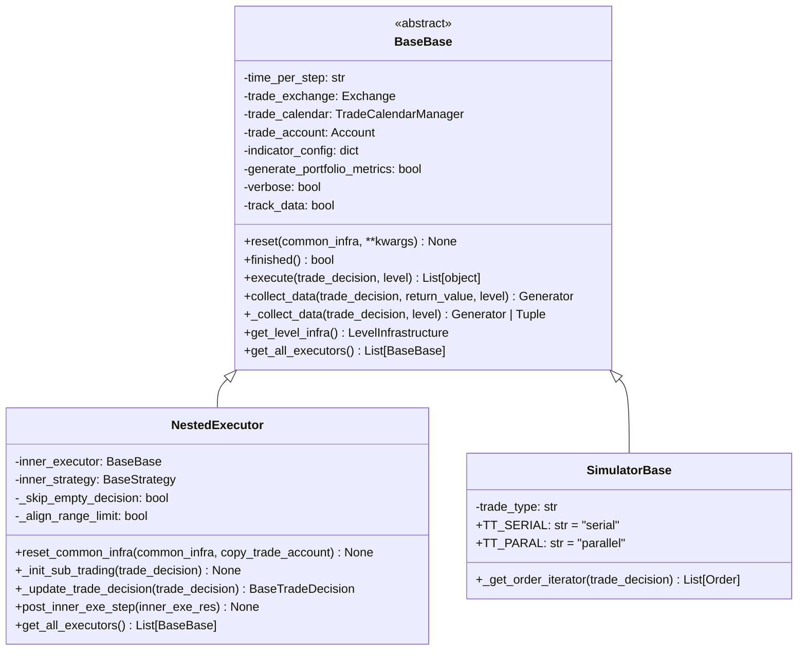

# executor.py 模块文档

## 模块概述

`executor.py` 模块定义了回测框架中的执行器类，负责执行交易决策并管理交易流程。该模块提供了：

1. **BaseExecutor**: 执行器基类
2. **NestedExecutor**: 嵌套执行器，支持多层策略
3. **SimulatorExecutor**: 模拟执行器，模拟真实市场执行

---

## 类说明

### `BaseExecutor` (抽象基类)

执行器的基类，定义了执行器的基本接口和通用功能。

```python
class BaseExecutor:
    def __init__(
        self,
        time_per_step: str,
        start_time: Union[str, pd.Timestamp] = None,
        end_time: Union[str, pd.Timestamp] = None,
        indicator_config: dict = {},
        generate_portfolio_metrics: bool = False,
        verbose: bool = False,
        track_data: bool = False,
        trade_exchange: Exchange | None = None,
        common_infra: CommonInfrastructure | None = None,
        settle_type: str = BasePosition.ST_NO,
        **kwargs: Any,
    ) -> None
```

---

## 构造参数详解

| 参数 | 类型 | 默认值 | 说明 |
|------|------|--------|------|
| `time_per_step` | `str` | 必需 | 每交易步的时间间隔（用于生成交易日历） |
| `start_time` | `Union[str, pd.Timestamp]` | `None` | 回测开始时间 |
| `end_time` | `Union[str, pd.Timestamp]` | `None` | 回测结束时间 |
| `indicator_config` | `dict` | `{}` | 交易指标配置 |
| `generate_portfolio_metrics` | `bool` | `False` | 是否生成组合指标 |
| `verbose` | `bool` | `False` | 是否打印交易信息 |
| `track_data` | `bool` | `False` | 是否生成交易决策数据（用于强化学习） |
| `trade_exchange` | `Exchange | None` | `None` | 交易所对象 |
| `common_infra` | `CommonInfrastructure | None` | `None` | 通用基础设施 |
| `settle_type` | `str` | `ST_NO` | 结算类型 |
| `**kwargs` | `Any` | - | 其他参数 |

---

### `indicator_config` 参数详解

交易指标配置字典，支持以下字段：

```python
indicator_config = {
    'show_indicator': True,  # 是否显示指标
    'pa_config': {
        "agg": "twap",  # 或 "vwap"
        "price": "$close",  # 基准价格
    },
    'ffr_config':{
        'weight_method': 'value_weighted',  # 或 'mean', 'amount_weighted'
    }
}
```

**支持的指标**:
- `pa` (Price Advantage): 价格优势
- `pos` (Positive Rate): 正向率
- `ffr` (Fulfill Rate): 成交率

---

## 重要属性说明

| 属性 | 类型 | 说明 |
|------|------|------|
| `time_per_step` | `str` | 每交易步的时间间隔 |
| `trade_exchange` | `Exchange` | 交易所对象 |
| `trade_calendar` | `TradeCalendarManager` | 交易日历管理器 |
| `trade_account` | `Account` | 交易账户 |
| `indicator_config` | `dict` | 交易指标配置 |
| `generate_portfolio_metrics` | `bool` | 是否生成组合指标 |
| `verbose` | `bool` | 是否打印交易信息 |
| `track_data` | `bool` | 是否生成交易决策数据 |

---

## 重要方法说明

### `reset`

重置执行器状态。

```python
def reset(self, common_infra: CommonInfrastructure | None = None, **kwargs: Any) -> None:
```

**功能**:
- 重置 `start_time` 和 `end_time`
- 重置 `common_infra`（包括 `trade_account`, `trade_exchange` 等）

**参数**:
- `common_infra`: 通用基础设施（可选）
- `**kwargs`: 其他参数（如 `start_time`, `end_time`）

---

### `reset_common_infra`

重置通用基础设施。

```python
def reset_common_infra(self, common_infra: CommonInfrastructure, copy_trade_account: bool = False) -> None:
```

**参数**:
- `common_infra`: 通用基础设施
- `copy_trade_account`: 是否复制交易账户

---

### `finished`

检查回测是否完成。

```python
def finished(self) -> bool:
```

**返回值**:
- `True`: 回测完成
- `False`: 回测未完成

---

### `execute`

执行交易决策（不推荐直接使用）。

```python
def execute(self, trade_decision: BaseTradeDecision, level: int = 0) -> List[object]:
[]

**参数**:
- `trade_decision`: 交易决策
- `level`: 当前执行器级别

**返回值**:
- 执行结果列表

**注意**: 该函数在框架中从未直接使用，应使用 `collect_data` 代替。

---

### `collect_data`

生成器函数，用于收集交易决策数据（用于强化学习训练）。

```python
def collect_data(
    self,
    trade_decision: BaseTradeDecision,
    return_value: dict | None = None,
    level: int = 0,
) -> Generator[Any, Any, List[object]]:
[]

**参数**:
- `trade_decision`: 交易决策
- `return_value`: 返回值字典的内存地址
- `level`: 当前执行器级别（0 表示顶层）

**返回值**:
- 生成器，产生交易决策
- 最终返回执行结果列表

---

### `_collect_data` (抽象方法)

收集数据的具体实现（由子类实现）。

```python
@abstractmethod
def _collect_data(
    self,
    trade_decision: BaseTradeDecision,
    level: int = 0,
) -> Union[Generator[Any, Any, Tuple[List[object], dict]], Tuple[List[object], dict]]:
[]
```

**参数**:
- `trade_decision`: 交易决策
- `level`: 当前执行器级别

**返回值**:
- 生成器或元组 `(<执行结果>, <额外参数>)`

---

### `get_level_infra`

获取当前级别的基础设施。

```python
def get_level_infra(self) -> LevelInfrastructure:
```

**返回值**:
- 当前级别的基础设施对象

---

### `get_all_executors`

获取所有执行器（包括嵌套执行器）。

```python
def get_all_executors(self) -> List[BaseBase]:
```

**返回值**:
- 所有执行器的列表
---

## 嵌套执行器

### `NestedExecutor` (类)

嵌套执行器，支持内层策略和执行器。在每个时间步调用内层策略和执行器来执行交易决策。

```python
class NestedExecutor(BaseBase):
    def __init__(
        self,
        time_per_step: str,
        inner_executor: Union[BaseBase, dict],
        inner_strategy: Union[BaseStrategy, dict],
        start_time: Union[str, pd.Timestamp] = None,
        end_time: Union[str, pd.Timestamp] = None,
        indicator_config: dict = = {},
        generate_portfolio_metrics: bool = False,
        verbose: bool = False,
        track_data: bool = False,
        skip_empty_decision: bool = True,
        align_range_limit: bool = True,
        common_infra: CommonInfrastructure | None = None,
        **kwargs: Any,
    ) -> None
```

---

## 构造参数详解

| 参数 | 类型 | 默认值 | 说明 |
|------|------|--------|------|
| `inner_executor` | `Union[BaseBase, dict]` | 必需 | 内层执行器 |
| `inner_strategy` | `Union[BaseStrategy, dict]` | 必需 | 内层策略 |
| `skip_empty_decision` | `bool` | `True` | 是否跳过空决策 |
| `align_range_limit` | `bool` | `True` | 是否强制对齐交易范围限制 |
| 其他参数 | 同 `BaseBase` | - | - |

**参数说明**:
- `skip_empty_decision`: 当决策为空时是否跳过内层循环
  - 应该设置为 `False` 的情况：
    - 决策可能在步骤中更新
    - 内层执行器可能不遵循外层策略的决策
- `align_range_limit`: 是否强制对齐交易范围限制
  - 仅用于嵌套执行器，因为范围限制由外层策略给出

---

## 重要方法说明

### `reset_common_infra`

重置通用内层设施。

```python
def reset_common_infra(self, common_infra: CommonInfrastructure, copy_trade_account: bool = False) -> None:
```

**注意**: 第一层跟随 `copy_trade_account` 设置，下层必须复制 `trade_account`。

---

### `_init_sub_trading`

初始化子交易。

```python
def _init_sub_trading(self, trade_decision: BaseTradeDecision) -> None:
```

**功能**: 重置内层执行器，设置子级别基础设施，重置内层策略。

---

### `_update_trade_decision`

更新交易决策。

```python
def _update_trade_decision(self, trade_decision: BaseTradeDecision) -> BaseTradeDecision:
```

**功能**: 外层策略有机会在每个迭代中更新决策。

---

### `post_inner_exe_step`

内层执行器每步之后的钩子函数。

```python
def post_inner_exe_step(self, inner_exe_res: List[object]) -> None:
```

**参数**:
- `inner_exe_res`: 内层任务的执行结果

---

## 模拟执行器

### `SimulatorBase` (类)

模拟执行器，模拟真实市场执行。

```python
class SimulatorBase(BaseBase):
    def __init__(
        self,
        time_per_step: str,
        start_time: Union[str, pd.Timestamp] = None,
        end_time: Union[str, pd.Timestamp] = None,
        indicator_config: dict = {},
        generate_portfolio_metrics: bool = False,
        verbose: bool = False,
        track_data: bool = False,
        common_infra: CommonInfrastructure | None = None,
        trade_type: str = TT_SERIAL,
        **kwargs: Any,
    ) -> None
```

---

## 交易类型

| 常量 | 值 | 说明 |
|------|-----|------|
| `TT_SERIAL` | `"serial"` | 串行执行，订单按顺序执行 |
| `TT_PARAL` | `"parallel"` | 并行执行，订单并行执行（按买入优先排序） |

---

## 构造参数详解

| 参数 | 类型 | 默认值 | 说明 |
|------|------|--------|------|
| `trade_type` | `str` | `TT_SERIAL` | 交易类型 |

**交易类型说明**:
- `TT_SERIAL` (串行）:
  - 订单按顺序执行
  - 在每个交易步，可以卖出股票后用资金买入新股票

- `TT_PARAL` (并行）:
  - 订单并行执行（买入优先）
  - 在每个交易步，如果尝试卖出股票后买入新股票，会失败

---

## 重要方法说明

### `_get_order_iterator`

根据交易类型获取订单迭代器。

```python
def _get_order_iterator(self, trade_decision: BaseTradeDecision) -> List[Order]:
```

**参数**:
- `trade_decision`: 交易决策

**返回值**:
- 订单列表（根据交易类型排序）

---

## 使用示例

### 示例1: 创建基本的模拟执行器

```python
from qlib.backtest.executor import SimulatorBase

executor = SimulatorBase(
    time_per_step="1day",
    start_time="2020-01-01",
    end_time="2020-12-31",
    trade_type="serial",  # 串行执行
    verbose=True,  # 打印交易信息
)
```

### 示例2: 创建嵌套执行器

```python
from qlib.backtest.executor import NestedExecutor, SimulatorBase
from qlib.strategy.base import BaseStrategy

# 创建内层执行器和策略
inner_executor = SimulatorBase(time_per_step="1min")
inner_strategy = MyInnerStrategy()

# 创建嵌套执行器
executor = NestedExecutor(
    time_per_step="1day",
    inner_executor=inner_executor,
    inner_strategy=inner_strategy,
    skip_empty_decision=True,
    align_range_limit=True,
)
```

### 示例3: 使用并行交易类型

```python
executor = SimulatorBase(
    time_per_step="1day",
    trade_type="parallel",  # 并行执行
)
```

### 示例4: 启用指标生成

```python
executor = SimulatorBase(
    time_per_step="1day",
    indicator_config={
        'show_indicator': True,
        'pa_config': {
            "agg": "twap",
            "price": "$close",
        },
        'ffr_config': {
            'weight_method': 'value_weighted',
        }
    },
    generate_portfolio_metrics=True,
)
```

---

## 类继承关系图



---

## 常见问题

### Q1: `execute` 和 `collect_data` 有什么区别？

A:
- `execute`: 封装的执行方法，不推荐直接使用
- `collect_data`: 生成器函数，用于强化学习训练，提供更细粒度的控制

### Q2: 串行和并行交易类型有什么区别？

A:
- **串行 (TT_SERIAL)**: 订单按顺序执行，可以卖出后立即用资金买入
- **并行 (TT_PARAL)**: 订单并行执行（买入优先），卖出和买入不能在同一个步骤中完成

### Q3: 如何获取所有执行器？

A: 使用 `get_all_executors()` 方法，该方法会递归获取嵌套执行器中的所有执行器。

---

## 相关模块

- [`decision.py`](./decision.md): 交易决策相关类
- [`exchange.py`](./exchange.md): 交易所相关类
- [`account.py`](./account.md): 账户相关类
- [`strategy.base`](../../strategy/base.py): 策略基类

---

## 注意事项

1. **生成器模式**: `collect_data` 返回生成器，可以用于 `yield from` 表达式
2. **强化学习支持**: `track_data=True` 时会生成交易决策数据
3. **嵌套执行**: `NestedExecutor` 支持多层策略和执行器
4. **交易顺序**: 并行交易类型按买入优先排序，避免资金冲突
5. **基础设施**: `common_infra` 包含 `trade_account` 和 `trade_exchange` 等共享资源
6. **账户拷贝**: 嵌套执行器使用浅拷贝共享 Position 对象
