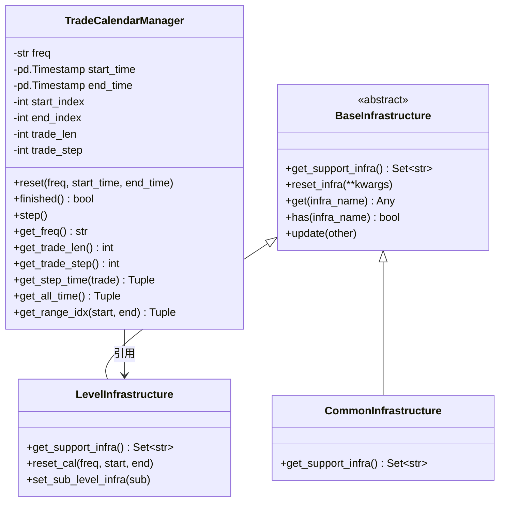

# high_performance_ds.py 模块文档

## 模块概述

`high_performance_ds.py` 模块提供了回测框架中的基础设施管理类，用于支持多级别策略执行的交易日历管理和基础设施共享。

该模块主要包含以下核心组件：
- **TradeCalendarManager**: 交易日历管理器，用于管理回测过程中的交易时间和步进
- **BaseInfrastructure**: 基础设施抽象类，用于在不同级别之间共享资源
- **CommonInfrastructure**: 通用基础设施，包含账户和交易所
- **LevelInfrastructure**: 级别基础设施，由执行器创建并在同一级别的策略之间共享

## 类定义

### 1. TradeCalendarManager

交易日历管理器，用于管理回测过程中的交易时间和步进。

#### 构造方法

```python
TradeCalendarManager(
    freq: str,
    start_time: Union[str, pd.Timestamp] = None,
    end_time: Union[str, pd.Timestamp] = None,
    level_infra: LevelInfrastructure | None = None
)
```

**参数说明：**

| 参数名 | 类型 | 必填 | 说明 |
|--------|------|------|------|
| freq | str | 是 | 交易频率，也是每步交易的时间间隔 |
| start_time | Union[str, pd.Timestamp] | 否 | 交易日历的闭区间开始时间，默认为None。如果为None，必须在交易前重置 |
| end_time | Union[str, pd.Timestamp] | 否 | 交易时间范围的闭区间结束时间，默认为None。如果为None，必须在交易前重置 |
| level_infra | LevelInfrastructure \| None | 否 | 级别基础设施引用，用于获取数据日历范围 |

#### 重要方法

##### reset()

重置交易日历。

```python
reset(
    freq: str,
    start_time: Union[ str, pd.Timestamp] = None,
    end_time: Union[ str, pd.Timestamp] = None
) -> None
```

**功能：**
- 设置交易频率和时间范围
- 初始化交易步数（trade_step 为 0）
- 计算总交易步数（trade_len）

**属性设置：**
- `self.trade_len`: 总交易步数
- `self.trade_step`: 已完成的交易步数，范围 [0, 1, 2, ..., trade_len-1]

##### finished()

检查交易是否完成。

```python
finished() -> bool
```

**返回值：**
- `True`: 交易已完成（trade_step >= trade_len）
- `False`: 交易未完成（trade_step < trade_len，已完成 trade_step 步）

**使用场景：**
应在调用 `strategy.generate_decisions` 和 `executor.execute` 之前检查。

##### step()

前进到下一个交易步。

```python
step() -> None
```

**异常：**
- 如果交易已完成，抛出 `RuntimeError`

##### get_freq()

获取交易频率。

```python
get_freq() -> str
```

##### get_trade_len()

获取总交易步数。

```python
get_trade_len() -> int
```

##### get_trade_step()

获取当前交易步数。

```python
get_trade_step() -> int
```

##### get_step_time()

获取指定交易步的时间范围。

```python
get_step_time(
    trade_step: int | None = None,
    shift: int = 0
) -> Tuple[pd.Timestamp, pd.Timestamp]
```

**参数说明：**

| 参数名 | 类型 | 默认值 | 说明 |
|--------|------|--------|------|
| trade_step | int \| None | None | 交易步数，None表示当前步 |
| shift | int | 0 | 时间偏移量 |

**返回值：**
- `shift == 0`: 返回当前交易时间范围
- `shift > 0`: 返回向前偏移 shift 个 bar 的时间范围
- `shift < 0`: 返回向后偏移 shift 个 bar 的时间范围

**关于端点：**
- Qlib 使用闭区间表示时间序列选择
- 返回的右端点需要减 1 秒，因为 Qlib 使用闭区间表示

##### get_data_cal_range()

获取日历范围的数据索引。

```python
get_data_cal_range(rtype: str = "full") -> Tuple[int, int]
```

**参数说明：**

| 参数名 | 类型 | 默认值 | 说明 |
|--------|------|--------|------|
| rtype | str | "full" | "full" 返回决策在一天中的完整限制，"step" 返回当前步的限制 |

**假设：**
1. common_infra 中交易所的频率与数据日历相同
2. 用户希望获取按天取模的数据索引（即 240 min）

##### get_all_time()

获取交易的开始时间和结束时间。

```python
get_all_time() -> Tuple[pd.Timestamp, pd.Timestamp]
```

##### get_range_idx()

获取涉及指定时间范围的索引范围（闭区间）。

```python
get_range_idx(
    start_time: pd.Timestamp,
    end_time: pd.Timestamp
) -> Tuple[int, int]
```

**参数说明：**
- start_time: 开始时间
- end_time: 结束时间

**返回值：**
- 返回索引范围，左右都是闭区间
- 索引会被裁剪到有效范围 [0, trade_len-1]

#### 使用示例

```python
from qlib.backtest.high_performance_ds import TradeCalendarManager

# 创建交易日历管理器
cal = TradeCalendarManager(
    freq="day",
    start_time="2020-01-01",
    end_time="2020-12-31"
)

# 获取当前步时间范围
start, end = cal.get_step_time()
print(f"当前交易步: {cal.get_trade_step()}/{cal.get_trade_len()}")
print(f"时间范围: {start} ~ {end}")

# 检查是否完成
while not cal.finished():
    # 执行交易逻辑
    print(f"执行交易步 {cal.get_trade_step()}")
    cal.step()  # 前进到下一步
```

---

### 2. BaseInfrastructure

基础设施抽象类，用于在不同级别之间共享资源。

#### 构造方法

```python
BaseInfrastructure(**kwargs: Any)
```

**参数说明：**
- kwargs: 要设置的基础设施键值对

#### 重要方法

##### get_support_infra() [抽象方法]

获取支持的基础设施名称集合。

```python
@abstractmethod
def get_support_infra() -> Set[str]
```

**子类必须实现此方法。**

##### reset_infra()

重置基础设施属性。

```python
reset_infra(**kwargs: Any) -> None
```

**行为：**
- 只设置在 `get_support_infra()` 中声明的基础设施
- 忽略不支持的基础设施并发出警告

##### get()

获取指定基础设施。

```python
get(infra_name: str) -> Any
```

**异常：**
- 如果基础设施不存在，发出警告并返回 None

##### has()

检查是否存在指定基础设施。

```python
has(infra_name: str) -> bool
```

##### update()

用另一个基础设施更新当前基础设施。

```python
update(other: BaseInfrastructure) -> None
```

---

### 3. CommonInfrastructure

通用基础设施类，包含账户和交易所。

#### 支持的基础设施

```python
get_support_infra() -> Set[str]
# 返回 {"trade_account", "trade_exchange"}
```

**包含设施：**
- `trade_account`: 交易账户
- `trade_exchange`: 交易所

---

### 4. LevelInfrastructure

级别基础设施类，由执行器创建并在同一级别的策略之间共享。

#### 支持的基础设施

```python
get_support_infra() -> Set[str]
# 返回 {"trade_calendar", "sub_level_infra", "common_infra", "executor"}
```

**包含设施：**

| 设施名 | 说明 |
|--------|------|
| trade_calendar | 交易日历管理器 |
| sub_level_infra | 子级别基础设施（仅在 _init_sub_trading 后可用） |
| common_infra | 通用基础设施（账户和交易所） |
| executor | 执行器实例 |

#### 重要方法

##### reset_cal()

重置交易日历管理器。

```python
reset_cal(
    freq: str,
    start_time: Union[str, pd.Timestamp, None],
    end_time: Union[str, pd.Timestamp, None]
) -> None
```

如果已存在交易日历，则重置它；否则创建新的交易日历管理器。

##### set_sub_level_infra()

设置子级别基础设施，使跨多级别访问日历更方便。

```python
set_sub_level_infra(sub_level_infra: LevelInfrastructure) -> None
```

#### 使用示例

```python
from qlib.backtest.high_performance_ds import LevelInfrastructure, CommonInfrastructure

# 创建通用基础设施
common_infra = CommonInfrastructure()
common_infra.reset_infra(
    trade_account=my_account,
    trade_exchange=my_exchange
)

# 创建级别基础设施
level_infra = LevelInfrastructure()
level_infra.reset_infra(
    common_infra=common_infra,
    executor=my_executor
)

# 重置交易日历
level_infra.reset_cal(
    freq="day",
    start_time="2020-01-01",
    end_time="2020-12-31"
)

# 访问基础设施
calendar = level_infra.get("trade_calendar")
exchange = level_infra.get("common_infra").get("trade_exchange")
```

---

## 工具函数

### get_start_end_idx()

获取内层策略的决策级别索引范围限制的辅助函数。

```python
def get_start_end_idx(
    trade_calendar: TradeCalendarManager,
    outer_trade_decision: BaseTradeDecision
) -> Tuple[int, int]
```

**参数说明：**
- trade_calendar: 交易日历管理器
- outer_trade_decision: 外层策略做出的交易决策

**返回值：**
- 起始索引和结束索引

**注意：**
- 此函数不适用于订单级别
- 如果决策不支持 `get_range_limit`，则返回完整的日历范围

---

## 架构图



## 使用场景

### 场景1: 单级别策略执行

```python
# 初始化基础设施
common_infra = CommonInfrastructure()
common_infra.reset_infra(
    trade_account=account,
    trade_exchange=exchange
)

level_infra = LevelInfrastructure()
level_infra.reset_infra(
    common_infra=common_infra,
    executor=executor
)

# 设置交易日历
level_infra.reset_cal(
    freq="day",
    start_time="2020-01-01",
    end_time="2020-12-31"
)

# 执行回测
cal = level_infra.get("trade_calendar")
while not cal.finished():
    # 生成决策
    decisions = strategy.generate_decisions()
    # 执行决策
    executor.execute(decisions)
    # 前进
    cal.step()
```

### 场景2: 多级别策略执行

```python
# 外层基础设施
outer_level_infra = LevelInfrastructure()
outer_level_infra.reset_infra(
    common_infra=common_infra,
    executor=outer_executor
)
outer_level_infra.reset_cal(
    freq="day",
    start_time="2020-01-01",
    end_time="2020-12-31"
)

# 内层基础设施（分钟级）
inner_level_infra = LevelInfrastructure()
inner_level_infra.reset_infra(
    common_infra=common_infra,
    executor=inner_executor
)

# 设置内层日历范围为外层决策的约束范围
outer_decisions = outer_strategy.generate_decisions()
for decision in outer_decisions:
    start_idx, end_idx = get_start_end_idx(
        trade_calendar=inner_level_infra.get("trade_calendar"),
        outer_trade_decision=decision
    )
    # 根据索引范围执行内层策略
    inner_strategy.execute_in_range(start_idx, end_idx)
```

## 注意事项

1. **时间表示**: Qlib 使用闭区间表示时间范围，与 pandas 保持一致
2. **频率支持**: 交易日历支持多种频率（day, 1min, 5min 等）
3. **生命周期**: TradeCalendarManager 需要调用 `reset()` 方法重置以复用
4. **基础设施共享**: LevelInfrastructure 允许同一级别的策略共享资源
5. **跨级别访问**: 通过设置 sub_level_infra 可以方便地跨级别访问日历

## 相关模块

- `qlib.backtest.executor.py`: 使用 LevelInfrastructure 和 TradeCalendarManager 执行策略
- `qlib.backtest.strategy.py`: 使用 LevelInfrastructure 访问共享资源
- `qlib.data.data.Cal`: 提供交易日历功能
