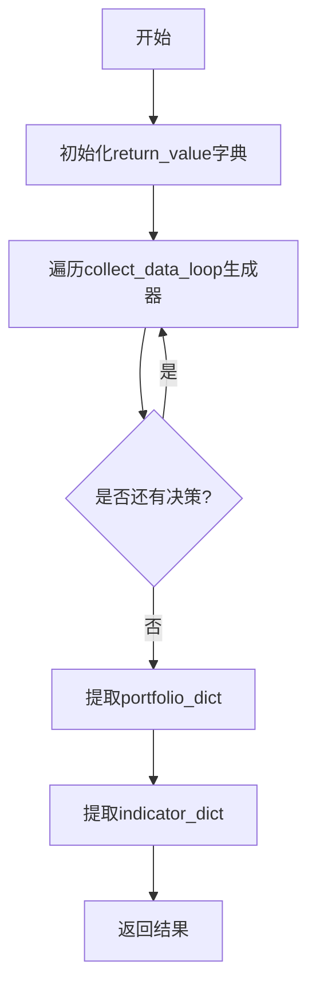
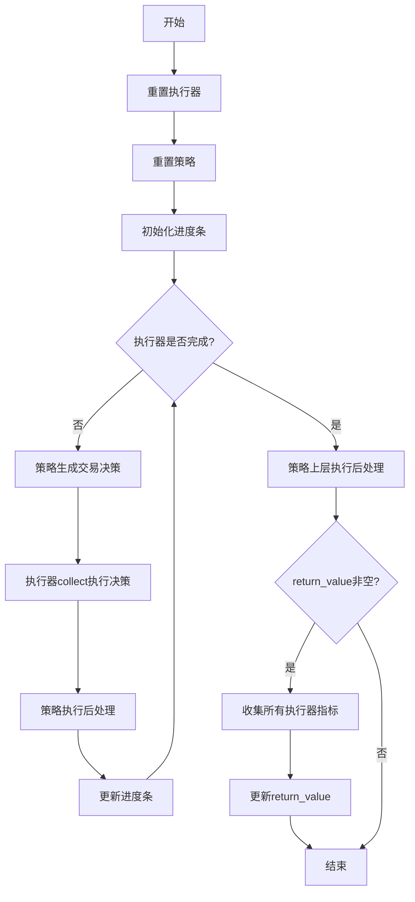

# backtest/__init__.py 模块文档

## 文件概述

该模块是Qlib回测系统的入口模块，提供了完整的回测功能接口。它整合了策略执行器、交易账户、交易所和指标报告等核心组件，支持单层和多层嵌套回测。

该模块主要包含两个核心回测循环函数：
1. `backtest_loop`: 用于执行完整的回测并返回指标结果
2. `collect_data_loop`: 用于收集交易决策数据（主要用于强化学习训练）

## 类型定义

### PORT_METRIC

```python
PORT_METRIC = Dict[str, Tuple[pd.DataFrame, dict]]
```

**说明**: 投资组合指标字典类型
- 键: 频率字符串（如 "day", "1min"）
- 值: 元组 (portfolio_metrics_dataframe, positions_dict)

### INDICATOR_METRIC

```python
INDICATOR_METRIC = Dict[str, Tuple[pd.DataFrame, Indicator]]
```

**说明**: 交易指标字典类型
- 键: 频率字符串（如 "day", "1min"）
- 值: 元组 (indicator_dataframe, indicator_object)

## 函数详解

### backtest_loop

**函数签名:**
```python
def backtest_loop(
    start_time: Union[pd.Timestamp, str],
    end_time: Union[pd.Timestamp, str],
    trade_strategy: BaseStrategy,
    trade_executor: BaseExecutor,
) -> Tuple[PORT_METRIC, INDICATOR_METRIC]
```

**功能描述:**
回测循环函数，用于最外层策略和执行器的交互。这是用户直接调用回测的入口函数。

**参数说明:**
- `start_time`: 回测的起始时间（闭区间）
- `end_time`: 回测的结束时间（闭区间）
  - 注意：将应用于最外层执行器的日历
  - 例如：`Executor[day](Executor[1min])`，设置 `end_time == 20XX0301` 将包含20XX0301日的所有分钟数据
- `trade_strategy`: 最外层的投资组合策略
- `trade_executor`: 最外层的执行器

**返回值:**
- `portfolio_dict`: 投资组合指标字典，记录交易的投资组合指标信息
- `indicator_dict`: 指标字典，计算交易指标

**流程图:**


### collect_data_loop

**函数签名:**
```python
def collect_data_loop(
    start_time: Union[pd.Timestamp, str],
    end_time: Union[pd.Timestamp, str],
    trade_strategy: BaseStrategy,
    trade_executor: BaseExecutor,
    return_value: dict | None = None,
) -> Generator[BaseTradeDecision, Optional[BaseTradeDecision], None]
```

**功能描述:**
生成器函数，用于收集交易决策数据。主要用于强化学习训练，能够逐步yield每个交易决策供外部处理。

**参数说明:**
- `start_time`: 回测的起始时间（闭区间）
  - 注意：将应用于最外层执行器的日历
- `end_time`: 回测的结束时间（闭区间）
  - 注意：将应用于最外层执行器的日历
  - 例如：`Executor[day](Executor[1min])`，设置 `end_time == 20XX0301` 将包含20XX0301日的所有分钟数据
- `trade_strategy`: 最外层的投资组合策略
- `trade_executor`: 最外层的执行器
- `return_value`: 用于backtest_loop返回结果的字典

**生成器Yield值:**
- 交易决策对象 `BaseTradeDecision`

**生成器Send值:**
- 可选的 `BaseTradeDecision`，用于接收外部返回的决策

**流程图:**


## 使用示例

### 基本回测示例

```python
from qlib.backtest import backtest_loop
from qlib.contrib.strategy import TopkDropoutStrategy
from qlib.backtest.executor import SimulatorExecutor

# 创建策略和执行器
strategy = TopkDropoutStrategy(
    signal="...",
    topk=50,
    drop_rate=0.0,
)
executor = SimulatorExecutor(time_per_step="day")

# 执行回测
portfolio_dict, indicator_dict = backtest_loop(
    start_time="2020-01-01",
    end_time="2021-12-31",
    trade_strategy=strategy,
    trade_executor=executor,
)

# 获取结果
portfolio_metrics = portfolio_dict["day"][0]
indicator = indicator_dict["day"][1]
```

### 嵌套回测示例

```python
from qlib.backtest import backtest_loop
from qlib.contrib.strategy import TopkDropoutStrategy, TWAPStrategy
from qlib.backtest.executor import NestedExecutor, SimulatorExecutor

# 外层策略
outer_strategy = TopkDropoutStrategy(
    signal="...",
    topk=50,
)

# 内层策略
inner_strategy = TWAPStrategy(
    risk_degree=0.95,
)

# 嵌套执行器
executor = NestedExecutor(
    time_per_step="day",
    inner_executor=SimulatorExecutor(time_per_step="1min"),
    inner_strategy=inner_strategy,
)

# 执行回测
portfolio_dict, indicator_dict = backtest_loop(
    start_time="2020-01-01",
    end_time="2021-12-31",
    trade_strategy=outer_strategy,
    trade_executor=executor,
)
```

### 收集数据示例（用于强化学习）

```python
from qlib.backtest import collect_data_loop

return_value = {}
for decision in collect_data_loop(
    start_time="2020-01-01",
    end_time="2021-12-31",
    trade_strategy=strategy,
    trade_executor=executor,
    return_value=return_value,
):
    # 处理每个交易决策
    print(decision)

# 获取结果
portfolio_dict = return_value.get("portfolio_dict")
indicator_dict = return_value.get("indicator_dict")
```

## 相关模块

- `backtest.executor.py`: 执行器相关类（BaseExecutor, NestedExecutor, SimulatorExecutor）
- `backtest.account.py`: 账户管理类（Account, AccumulatedInfo）
- `backtest.exchange.py`: 交易所类（Exchange）
- `backtest.decision.py`: 交易决策类（BaseTradeDecision, Order）
- `backtest.report.py`: 指标报告类（Indicator, PortfolioMetrics）
- `qlib.strategy.base.py`: 策略基类（BaseStrategy）

## 重要概念

### 嵌套回测

Qlib支持多层嵌套回测，允许在更高频次的回测环境中执行低频次的策略决策。典型场景：

1. **日频决策 + 分钟级执行**: 策略在每日生成投资组合目标，执行器在当日分钟级别执行订单以达成目标
2. **高频回测**: 支持分钟级、秒级等多时间粒度的回测

### 生成器模式

`collect_data_loop`使用Python生成器模式，允许：
- 逐步yield每个交易决策
- 支持外部处理决策（如强化学习）
- 可以中断和恢复执行

### 多频率指标

回测结果按频率组织，支持同时获取：
- 日频指标（"day"）
- 分钟频指标（"1min", "5min"等）
- 自定义频率指标

## 注意事项

1. **时间区间**: 所有时间参数都是闭区间
2. **嵌套限制**: 嵌套回测时，内层执行器的日历范围在外层决策范围内
3. **资源管理**: 回测循环会自动管理交易账户和执行器的状态
4. **进度显示**: 默认使用tqdm显示进度条
5. **指标收集**: 只有在执行器配置`generate_portfolio_metrics=True`时才会收集投资组合指标
