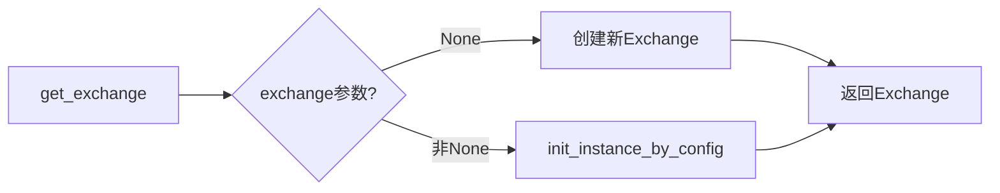
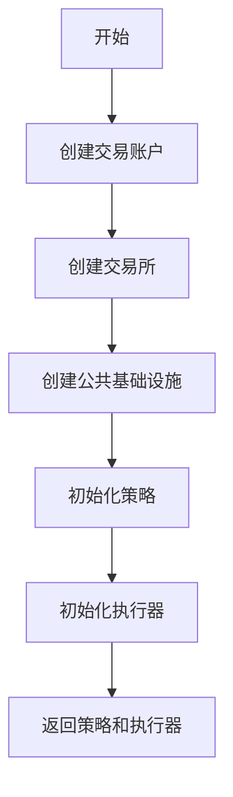
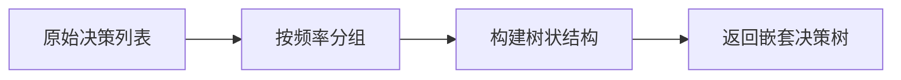

# backtest/backtest_caller.py 模块文档

## 文件概述

该模块是Qlib回测系统的高层入口模块，提供了用户友好的接口来执行回测。它封装了底层的回测循环、策略、执行器和交易所等组件，简化了用户的使用流程。

主要功能包括：
1. 创建和配置交易所（Exchange）
2. 创建和配置交易账户（Account）
3. 创建和配置策略与执行器
4. 执行完整的回测流程
5. 格式化（format）收集的交易决策数据

## 函数详解

### get_exchange

**函数签名:**
```python
def get_exchange(
    exchange: Union[str, dict, object, Path] = None,
    freq: str = "day",
    start_time: Union[pd.Timestamp, str] = None,
    end_time: Union[pd.Timestamp, str] = None,
    codes: Union[list, str] = "all",
    subscribe_fields: list = [],
    open_cost: float = 0.0015,
    close_cost: float = 0.0025,
    min_cost: float = 5.0,
    limit_threshold: Union[Tuple[str, str], float, None] | None = None,
    deal_price: Union[str, Tuple[str, str], List[str]] | None = None,
    **kwargs: Any,
) -> Exchange
```

**功能描述:**
创建并初始化一个交易所对象，用于提供市场数据和执行交易。

**参数说明:**
- `exchange`: 交易所配置，可以是None或`init_instance_by_config`接受的任何类型
  - None: 创建新的Exchange对象
  - 其他: 通过配置初始化
- `freq`: 数据频率（如"day", "1min"）
- `start_time`: 回测起始时间（闭区间）
- `end_time`: 回测结束时间（闭区间）
- `codes`: 股票列表或字符串（如"all", "csi500", "sse50"）
- `subscribe_fields`: 订阅的字段列表
- `open_cost`: 开仓交易成本率（比例）
- `close_cost`: 平仓交易成本率（比例）
- `min_cost`: 最小交易成本（绝对值，如5元佣金）
- `deal_price`: 成交价格配置
  - str: 单一价格（如"$close", "$open", "$vwap"）
  - Tuple[str, str]: （买价, 卖价）
  - List[str]: 同元组
- `limit_threshold`: 涨跌停阈值
  - None: 无限制
  - float: 如0.1表示10%
  - Tuple[str, str]: （买涨停表达式, 卖跌停表达式）
- `**kwargs`: 其他Exchange参数（如`trade_unit`）

**返回值:**
- `Exchange`: 初始化好的交易所对象

**流程图:**


### create_account_instance

**函数签名:**
```python
def create_account_instance(
    start_time: Union[pd.Timestamp, str],
    end_time: Union[pd.Timestamp, str],
    benchmark: Optional[str],
    account: Union[float, int, dict],
    pos_type: str = "Position",
) -> Account
```

**功能描述:**
创建交易账户实例，支持多种初始化方式。

**参数说明:**
- `start_time`: 基准起始时间
- `end_time`: 基准结束时间
- `benchmark`: 基准代码（如"SH000300"表示沪深300）
- `account`: 账户配置
  - float/int: 仅使用初始现金
  - dict: 详细配置
    - "cash": 初始现金
    - "stock1": 股票1配置 {"amount": 数量, "price"(可选): 价格}
    - "stock2": 股票2配置...
- `pos_type`: 持仓类型（默认"Position"）

**返回值:**
- `Account`: 初始化好的账户对象

**配置示例:**
```python
# 方式1: 仅现金
account = 1e9

# 方式2: 带初始持仓
account = {
    "cash": 1e8,
    "SH600000": {"amount": 1000, "price": 10.5},
    "SH600001": 2000,  # 等同于 {"amount": 2000}
}
```

### get_strategy_executor

**函数签名:**
```python
def get_strategy_executor(
    start_time: Union[pd.Timestamp, str],
    end_time: Union[pd.Timestamp, str],
    strategy: Union[str, dict, object, Path],
    executor: Union[str, dict, object, Path],
    benchmark: Optional[str] = "SH000300",
    account: Union[float, int, dict] = 1e9,
    exchange_kwargs: dict = {},
    pos_type: str = "Position",
) -> Tuple[BaseStrategy, BaseExecutor]
```

**功能描述:**
创建并初始化策略和执行器，用于回测。这是回测准备的核心函数。

**参数说明:**
- `start_time`: 回测起始时间
- `end_time`: 回测结束时间
- `strategy`: 策略配置（可通过`init_instance_by_config`初始化）
- `executor`: 执行器配置（可通过`init`_instance_by_config`初始化）
- `benchmark`: 基准代码
- `account`: 账户配置
- `exchange_kwargs`: 交易所参数字典
- `pos_type`: 持仓类型

**返回值:**
- 元组: (trade_strategy, trade_executor)

**流程图:**


### backtest

**函数签名:**
```python
def backtest(
    start_time: Union[pd.Timestamp, str],
    end_time: Union[pd.Timestamp, str],
    strategy: Union[str, dict, object, Path],
    executor: Union[str, dict, object, Path],
    benchmark: str = "SH000300",
    account: Union[float, int, dict] = 1e9,
    exchange_kwargs: dict = {},
    pos_type: str = "Position",
) -> Tuple[PORT_METRIC, INDICATOR_METRIC]
```

**功能描述:**
执行完整的回测流程，返回投资组合指标和交易指标。这是用户最常用的回测函数。

**参数说明:**
- `start_time`: 回测起始时间（闭区间）
  - 注意：应用于最外层执行器的日历
- `end_time`: 回测结束时间（闭区间）
  - 注意：应用于最外层执行器的日历
  - 例如：`Executor[day](Executor[1min])`，设置`end_time == 20XX0301`将包含20XX0301日的所有分钟
- `strategy`: 最外层投资组合策略配置
- `executor`: 最外层执行器配置
- `benchmark`: 基准代码（用于报告）
- `account`: 账户配置
  - float/int: 仅使用初始现金
  - Position: 使用带持仓的账户
- `exchange_kwargs`: 交易所参数
- `pos_type`: 持仓类型

**返回值:**
- `portfolio_dict`: 投资组合指标字典
  - 键: 频率字符串（如"day", "1min"）
  - 值: 元组 (portfolio_metrics_dataframe, positions_dict)
- `indicator_dict`: 交易指标字典
  - 键: 频率字符串
  - 值: 元组 (indicator_dataframe, indicator_object)

**使用示例:**
```python
from qlib.backtest import backtest

portfolio_dict, indicator_dict = backtest(
    start_time="2020-01-01",
    end_time="2021-12-31",
    strategy={
        "class": "TopkDropoutStrategy",
        "module_path": "qlib.contrib.strategy",
        "kwargs": {
            "signal": "...",
            "topk": 50,
            "drop_rate": 0.0,
        }
    },
    executor={
        "class": "SimulatorExecutor",
        "module_path": "qlib.backtest.executor",
        "kwargs": {
            "time_per_step": "day",
        }
    },
    benchmark="SH000300",
    account=1e9,
)

# 获取日频投资组合指标
portfolio_metrics = portfolio_dict["day"][0]
positions = portfolio_dict["day"][1]

# 获取日频交易指标
indicator_df = indicator_dict["day"][0]
indicator_obj = indicator_dict["day"][1]
```

### collect_data

**函数签名:**
```python
def collect_data(
    start_time: Union[pd.Timestamp, str],
    end_time: Union[pd.Timestamp, str],
    strategy: Union[str, dict, object, Path],
    executor: Union[str, dict, object, Path],
    benchmark: str = "SH000300",
    account: Union[float, int, dict] = 1e9,
    exchange_kwargs: dict = {},
    pos_type: str = "Position",
    return_value: dict | None = None,
) -> Generator[object, None, None]
```

**功能描述:**
初始化策略和执行器，然后收集交易决策数据。主要用于强化学习训练，能够逐步yield每个交易决策。

**参数说明:**
- 参数与`backtest`函数相同
- `return_value`: 用于返回结果的字典地址（可选）

**生成器Yield值:**
- 交易决策对象 `BaseTradeDecision`

**使用示例:**
```python
from qlib.backtest import collect_data

return_value = {}
for decision in collect_data(
    start_time="2020-01-01",
    end_time="2021-12-31",
    strategy=strategy_config,
    executor=executor_config,
    return_value=return_value,
):
    # 处理每个交易决策
    print(f"决策时间: {decision.start_time}")
    print(f"订单数量: {len(decision.get_decision())}")

# 获取结果
portfolio_dict = return_value.get("portfolio_dict")
indicator_dict = return_value.get("indicator_dict")
```

### format_decisions

**函数签名:**
```python
def format_decisions(
    decisions: List[BaseTradeDecision],
) -> Optional[Tuple[str, List[Tuple[BaseTradeDecision, Union[Tuple, None]]]]
```

**功能描述:**
将`collect_data`收集的决策列表格式化为树状结构，便于用户理解和分析。

**参数说明:**
- `decisions`: 由`collect_data`收集的交易决策列表

**返回值:**
- None: 如果决策列表为空
- 元组: (freq, decisions_tree)
  - `freq`: 频率字符串（如"day", "30min", "1min"）
  - `decisions_tree`: 嵌套的决策树
    - 格式: List[Tuple[决策, 子决策]]
    - 子决策: 同样格式的递归结构或None

**返回结构示例:**
```python
(
    "day",
    [
        (决策1, (
            "30min",
            [
                (子决策1, None),
                (子决策2, None),
            ]
        )),
        (决策2, None),
    ]
)
```

**流程图:**


## 导出内容

```python
__all__ = ["Order", "backtest", "get_strategy_executor"]
```

## 相关模块

- `backtest.backtest.py`: 底层回测循环函数
- `backtest.executor.py`: 执行器实现
- `backtest.account.py`: 账户实现
- `backtest.exchange.py`: 交易所实现
- `qlib.strategy.base.py`: 策略基类
- `qlib.contrib.strategy`: 预制策略实现

## 完整使用示例

### 示例1: 简单回测

```python
from qlib.backtest import backtest

portfolio_dict, indicator_dict = backtest(
    start_time="2020-01-01",
    end_time="2021-12-31",
    strategy={
        "class": "TopkDropoutStrategy",
        "module_path": "qlib.contrib.strategy",
        "kwargs": {
            "signal": "Ref($close, 1) / $close - 1",
            "topk": 50,
        }
    },
    executor={
        "class": "SimulatorExecutor",
        "module_path": "qlib.backtest.executor",
        "kwargs": {
            "time_per_step": "day",
            "generate_portfolio_metrics": True,
        }
    },
    benchmark="SH000300",
    account=1e9,
    exchange_kwargs={
        "freq": "day",
        "open_cost": 0.0015,
        "close_cost": 0.0025,
    },
)

# 分析结果
portfolio_metrics = portfolio_dict["day"][0]
print(f"总收益: {portfolio_metrics['return'].sum():.2%}")
print(f"年化收益: {portfolio_metrics['return'].mean() * 252:.2%}")
```

### 示例2: 嵌套回测（日频决策+分钟执行）

```python
from qlib.backtest import backtest

portfolio_dict, indicator_dict = backtest(
    start_time="2020-01-01",
    end_time="2020-12-31",
    strategy={
        "class": "TopkDropoutStrategy",
        "module_path": "qlib.contrib.strategy",
        "kwargs": {
            "signal": "Ref($close, 1) / $close - 1",
            "topk": 50,
        }
    },
    executor={
        "class": "NestedExecutor",
        "module_path": "qlib.backtest.executor",
        "kwargs": {
            "time_per_step": "day",
            "inner_executor": {
                "class": "SimulatorExecutor",
                "module_path": "qlib.backtest.executor",
                "kwargs": {
                    "time_per_step": "1min",
                    "generate_portfolio_metrics": False,
                }
            },
            "inner_strategy": {
                "class": "TWAPStrategy",
                "module_path": "qlib.contrib.strategy",
                "kwargs": {
                    "risk_degree": 0.95,
                }
            },
            "generate_portfolio_metrics": True,
        }
    },
    benchmark="SH000300",
    account=1e9,
)

# 获取不同频率的结果
day_metrics = portfolio_dict["day"][0]
one_min_indicator = indicator_dict["1min"][1]
```

### 示例3: 收集数据用于强化学习

```python
from qlib.backtest import collect_data, format_decisions

# 收集决策数据
decisions = list(collect_data(
    start_time="2020-01-01",
    end_time="2020-12-31",
    strategy=strategy_config,
    executor=executor_config,
    return_value=return_value,
))

# 格式化决策
formatted_decisions = format_decisions(decisions)

# 分析决策树
def print_decision_tree(tree, level=0):
    indent = "  " * level
    freq, sub_decisions = tree
    print(f"{indent}频率: {freq}")
    for decision, sub_tree in sub_decisions:
        print(f"{indent}  决策: {decision.strategy.__class__.__name__}")
        if sub_tree:
            print_decision_tree(sub_tree, level + 2)

print_decision_tree(formatted_decisions)
```

## 注意事项

1. **时间区间**: 所有时间参数都是闭区间（包含端点）
2. **账户配置**: 支持多种账户初始化方式，选择最适合的方式
3. **基准数据**: 基准数据需要提前准备好，否则会报错
4. **内存使用**: 收集所有决策数据会占用较多内存，大数据集建议分批处理
5. **频率配置**: 确保交易所频率和执行器频率一致
6. **成本计算**: 默认使用比例成本，可通过`min_cost`设置最小绝对成本
