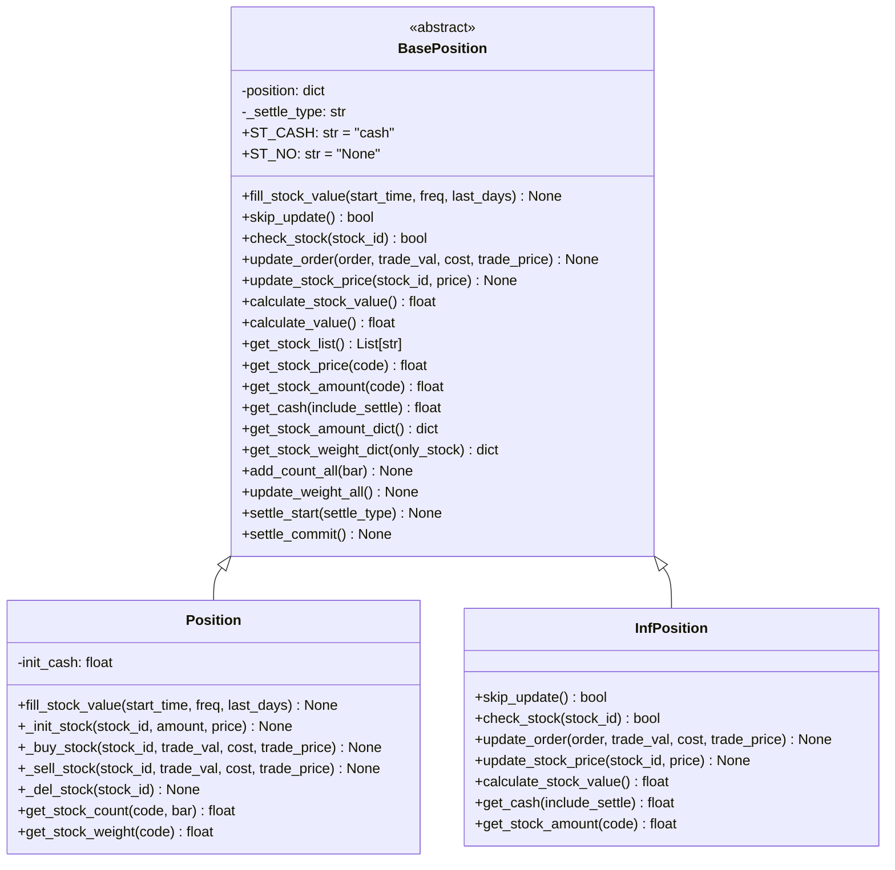

# position.py 模块文档

## 模块概述

`position.py` 模块定义了持仓管理类，负责跟踪和维护投资组合的持仓状态。该模块提供了：

1. **BasePosition**: 持仓基类
2. **Position**: 标准持仓类
3. **InfPosition**: 无限资金和数量的持仓类（用于生成随机订单）

---

## 类说明

### `BasePosition` (抽象基类)

持仓基类，定义了持仓管理的基本接口。

```python
class BasePosition:
    def __init__(self, *args: Any, cash: float = 0.0, **kwargs: Any) -> None:
```

---

## 构造参数详解

| 参数 | 类型 | 默认值 | 说明 |
|------|------|--------|------|
| `cash` | `float` | `0.0` | 初始现金 |
| `**kwargs` | `Any` | - | 其他参数 |

---

## 常量定义

| 常量 | 值 | 说明 |
|------|-----|------|
| `ST_CASH` | `"cash"` | 延迟现金结算类型 |
| `ST_NO` | `"None"` | 无结算类型 |

---

## 重要方法说明

### `fill_stock_value`

从 Qlib 填充股票价值。

```python
def fill_stock_value(self, start_time: Union[str, pd.Timestamp], freq: str, last_days: int = 30) -> None:
```

**参数**:
- `start_time`: 回测开始时间
- `freq`: 数据频率
- `last_days`: 获取最近几天的收盘价（默认 30）

---

### `skip_update`

是否跳过更新操作。

```python
def skip_update(self) -> bool:
```

**返回值**:
- `True`: 跳过更新（如 `InfPosition`）
- `False`: 不跳过更新

---

### `check_stock`

检查股票是否在持仓中。

```python
def check_stock(self, stock_id: str) -> bool:
```

**参数**:
- `stock_id`: 股票代码

**返回值**:
- `True`: 股票在持仓中
- `False`: 股票不在持仓中

---

### `update_order`

根据订单更新持仓。

```python
def update_order(self, order: Order, trade_val: float, cost: float, trade_price: float) -> None:
```

**参数**:
- `order`: 订单对象
- `trade_val`: 交易金额
- `cost`: 交易成本
- `trade_price`: 交易价格

---

### `update_stock_price`

更新股票最新价格。

```python
def update_stock_price(self, stock_id: str, price: float) -> None:
```

**参数**:
- `stock_id`: 股票代码
- `price`: 新价格

---

### `calculate_stock_value`

计算股票总价值（不包括现金）。

```python
def calculate_stock_value(self) -> float:
```

**返回值**:
- 股票总价值

---

### `calculate_value`

计算总价值（股票 + 现金）。

```python
def calculate_value(self) -> float:
```

**返回值**:
- 总价值

---

### `get_stock_list`

获取持仓中的股票列表。

```python
def get_stock_list(self) -> List[str]:
```

**返回值**:
- 股票代码列表

---

### `get_stock_price`

获取股票最新价格。

```python
def get_stock_price(self, code: str) -> float:
```

**参数**:
- `code`: 股票代码

**返回值**:
- 股票最新价格

---

### `get_stock_amount`

获取股票数量。

```python
def get_stock_amount(self, code: str) -> float:
```

**参数**:
- `code`: 股票代码

**返回值**:
- 股票数量

---

### `get_cash`

获取可用现金。

```python
def get_cash(self, include_settle: bool = False) -> float:
```

**参数**:
- `include_settle`: 是否包含未结算（延迟）现金

**返回值**:
- 可用现金

---

### `get_stock_amount_dict`

获取股票数量字典。

```python
def get_stock_amount_dict(self) -> dict:
```

**返回值**:
- `{stock_id: amount}`

---

### `get_stock_weight_dict`

获取股票权重字典。

```python
def get_stock_weight_dict(self, only_stock: bool = False) -> dict:
```

**参数**:
- `only_stock`:
  - `True`: 返回每只股票在总股票中的权重
  - `False`: 返回每只股票在总资产（股票 + 现金）中的权重

**返回值**:
- `{stock_id: weight}`

---

### `add_count_all`

在每个 bar 结尾增加所有股票的计数。

```python
def add_count_all(self, bar: str) -> None:
```

**参数**:
- `bar`: 层级名称

---

### `update_weight_all`

更新持仓权重。

```python
def update_weight_all(self) -> None:
```

**注意**: 权重数据在订单成交后处于错误状态，在交易日期的结束更新权重。

---

### `settle_start`

结算开始。

```python
def settle_start(self, settle_type: str) -> None:
```

**参数**:
- `settle_type`: 结算类型
  - `"cash"`: 延迟现金结算
  - `None`: 无结算机制

**说明**: 类似于事务的开始和提交。

---

### `settle_commit`

结算提交。

```python
def settle_commit(self) -> None:
```

---

## 标准持仓类

### `Position` (类)

标准持仓类，维护真实的持仓状态。

```python
class Position(BasePosition):
    def __init__(self, cash: float = 0, position_dict: Dict[str, Union[Dict[str, float], float]] = {}) -> None:
```

---

## 构造参数详解

| 参数 | 类型 | 默认值 | 说明 |
|------|------|--------|------|
| `cash` | `float` | `0` | 初始现金 |
| `position_dict` | `Dict` | `{}` | 初始持仓字典 |

**`position_dict` 格式**:
```python
{
    stock_id: {
        'amount': int,  # 持仓数量
        'price': float,  # 最新价格（可选）
    },
    ...
}
```

或者简化格式：
```python
{
    stock_id: int,  # 持仓数量（价格稍后填充）
    ...
}
```

---

## 持仓数据结构

```python
{
    stock_id: {
        'count': int,      # 持仓天数
        'amount': float,   # 持仓数量
        'price': float,    # 最新价格
        'weight': float,   # 持仓权重
    },
    'cash': float,          # 现金
    'now_account_value': float,  # 当前账户价值
}
```

---

## 重要方法说明

### `fill_stock_value`

从 Qlib 填充缺失的股票价格。

```python
def fill_stock_value(self, start_time: Union[str, pd.Timestamp], freq: str, last_days: int = 30) -> None:
```

**功能**: 如果股票价格信息缺失，从 Qlib 获取最近 `last_days` 天的收盘价。

---

### `_init_stock`

初始化股票持仓。

```python
def _init_stock(self, stock_id: str, amount: float, price: float | None = None) -> None:
```

---

### `_buy_stock`

买入股票。

```python
def _buy_stock(self, stock_id: str, trade_val: float, cost: float, trade_price: float) -> None:
```

**功能**:
- 计算交易数量
- 如果股票不在持仓中，初始化持仓
- 如果股票已在持仓中，增加数量
- 减去现金（交易金额 + 成本）

---

### `_sell_stock`

卖出股票。

```python
def _sell_stock(self, stock_id: str, trade_val: float, cost: float, trade_price: float) -> None:
```

**功能**:
- 计算交易数量
- 检查持仓是否足够
- 如果卖出全部，删除持仓
- 如果卖出部分，减少持仓数量
- 根据结算类型处理现金

---

### `_del_stock`

删除股票持仓。

```python
def _del_stock(self, stock_id: str) -> None:
```

---

### `get_stock_count`

获取股票的持仓天数。

```python
def get_stock_count(self, code: str, bar: str) -> float:
```

**参数**:
- `code`: 股票代码
- `bar`: 层级名称

**返回值**:
- 持仓天数

---

### `get_stock_weight`

获取股票权重。

```python
def get_stock_weight(self, code: str) -> float:
```

**参数**:
- `code`: 股票代码

**返回值**:
- 股票权重

---

## 无限持仓类

### `InfPosition` (类)

无限资金和数量的持仓类，用于生成随机订单。

```python
class InfPosition(BasePosition):
```

**特点**:
- 跳过所有状态更新
- 总是返回无限资金和数量
- 用于测试和随机订单生成

---

## 重要方法说明

### `skip_update`

总是返回 `True`（跳过更新）。

```python
def skip_update(self) -> bool:
```

**返回值**:
- `True`（总是跳过）

---

### `check_stock`

总是返回 `True`（总是拥有任何股票）。

```python
def check_stock(self, stock_id: str) -> bool:
```

**返回值**:
- `True`（总是拥有）

---

### `update_order`

不执行任何操作（无状态）。

```python
def update_order(self, order: Order, trade_val: float, cost: float, trade_price: float) -> None:
```

---

### `update_stock_price`

不执行任何操作（无状态）。

```python
def update_stock_price(self, stock_id: str, price: float) -> None:
```

---

### `calculate_stock_value`

返回无限股票价值。

```python
def calculate_stock_value(self) -> float:
```

**返回值**:
- `np.inf`（无限）

---

### `calculate_value`

抛出 NotImplementedError。

```python
def calculate_value(self) -> float:
```

**注意**: `InfPosition` 不支持计算总价值。

---

### `get_stock_price`

返回 `np.nan`（价格无意义）。

```python
def get_stock_price(self, code: str) -> float:
```

**返回值**:
- `np.nan`

---

### `get_stock_amount`

返回 `np.inf`（无限数量）。

```python
def get_stock_amount(self, code: str) -> float:
```

**返回值**:
- `np.inf`

---

### `get_cash`

返回 `np.inf`（无限现金）。

```python
def get_cash(self, include_settle: bool = False) -> float:
```

**返回值**:
- `np.inf`

---

## 使用示例

### 示例1: 创建空持仓

```python
from qlib.backtest.position import Position

# 创建空持仓
position = Position()
```

### 示例2: 创建带初始现金的持仓

```python
# 创建带 1000000 初始现金的持仓
position = Position(cash=1000000)
```

### 示例3: 创建带初始持仓的持仓

```python
# 创建带初始持仓的持仓
position = Position(
    cash=1000000,
    position_dict={
        "SH600000": {
            "amount": 1000,
            "price": 10.0,
        },
        "SH600519": {
            "amount": 500,
        },
    }
)

# 填充缺失的价格
position.fill_stock_value(
    start_time="2020-01-01",
    freq="1day",
    last_days=30,
)
```

### 示例4: 更新订单

```python
from qlib.backtest.decision import Order, OrderDir

# 创建买入订单
order = Order(
    stock_id="SH600000",
    amount=1000,
    direction=OrderDir.BUY,
)

# 更新持仓
position.update_order(
    order=order,
    trade_val=10000,  # 交易金额
    cost=15,         # 交易成本
    trade_price=10.0,  # 交易价格
)

# 查看持仓状态
print(f"现金: {position.get_cash()}")
print(f"持仓: {position.get_stock_amount_dict()}")
```

### 示例5: 获取持仓信息

```python
# 获取股票列表
stock_list = position.get_stock_list()
print(f"持仓股票: {stock_list}")

# 获取股票数量
for stock_id in stock_list:
    amount = position.get_stock_amount(stock_id)
    price = position.get_stock_price(stock_id)
    weight = position.get_stock_weight(stock_id)
    print(f"{stock_id}: 数量={amount}, 价格={price}, 权重={weight}")

# 获取总价值
total_value = position.calculate_value()
stock_value = position.calculate_stock_value()
print(f"总价值: {total_value}, 股票价值: {stock_value}")

# 获取股票权重字典
weight_dict = position.get_stock_weight_dict(only_stock=False)
print(f"权重字典: {weight_dict}")
```

### 示例6: 使用结算机制

```python
# 开始现金结算
position.settle_start(settle_type="cash")

# 执行一些订单...

# 提交结算
position.settle_commit()
```

### 示例7: 创建无限持仓

```python
from qlib.backtest.position import InfPosition

# 创建无限持仓（用于测试）
position = InfPosition()

# 检查股票（总是返回 True）
print(position.check_stock("SH600000"))  # True

# 获取现金（总是返回无限）
print(position.get_cash())  # inf

# 获取股票数量（总是返回无限）
print(position.get_stock_amount("SH600000"))  # inf
```

---

## 类继承关系图



---

## 常见问题

### Q1: 持仓数据结构是什么样的？

A: 每个股票的持仓包含：
- `count`: 持仓天数
- `amount`: 持仓数量
- `price`: 最新价格
- `weight`: 持仓权重

### Q2: 如何更新持仓？

A: 使用 `update_order` 方法，传入订单和交易信息：
```python
position.update_order(
    order=order,
    trade_val=10000,
    cost=15,
    trade_price=10.0,
)
```

### Q3: 结算机制有什么用？

A: 结算机制可以延迟现金的可用性：
- `ST_CASH`: 卖出资金当天不可用
- `ST_NO`: 无延迟

### Q4: `InfPosition` 用于什么场景？

A: 用于测试和生成随机订单，不需要跟踪真实持仓状态。

---

## 相关模块

- [`exchange.py`](./exchange.md): 交易所相关类
- [`executor.py`](./executor.md): 执行器相关类
- [`account.py`](./account.md): 账户相关类
- [`decision.py`](./decision.md): 订单和交易决策相关类

---

## 注意事项

1. **持仓字典**: 创建 `Position` 时，`position_dict` 必须复制
2. **价格填充**: 如果股票价格缺失，需要调用 `fill_stock_value` 填充
3. **权重计算**: 权重在每个交易日期结束时更新
4. **结算机制**: 使用结算机制时，卖出资金在提交后才能使用
5. **无限持仓**: `InfPosition` 跳过所有更新，适用于特殊场景
