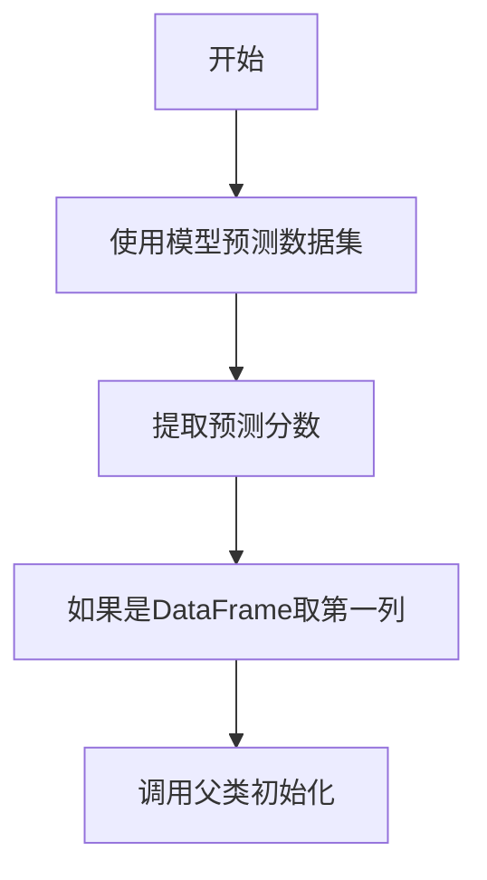

# backtest/signal.py 模块文档

## 文件概述

该模块定义了交易信号的接口和实现类。信号是策略生成交易决策的输入数据，可以来自不同的数据源（如准备好的数据、模型的在线预测等）。

主要包含：
1. `Signal`: 信号基类（抽象类）
2. `SignalWCache`: 基于缓存的信号类
3. `ModelSignal`: 基于模型的信号类
4. `create_signal_from`: 信号创建辅助函数

## 类详解

### Signal 类

**继承关系:** abc.ABCMeta（抽象基类）

**类说明:** 信号基类，定义了交易信号的统一接口。信号是策略生成交易决策的输入数据。

#### 方法

##### get_signal(self, start_time: pd.Timestamp, end_time: pd.Timestamp) -> Union[pd.Series, pd.DataFrame, None] [abstractmethod]

**功能描述:** 获取指定时间范围内的信号数据

**参数说明:**
- `start_time`: 信号起始时间
- `end_time`: 信号结束时间

**返回值:**
- `pd.Series`: 单只股票的信号
- `pd.DataFrame`: 多只股票的信号
- `None`: 该时间范围内无信号

**注意:** 返回None表示在该天没有信号数据

---

### SignalWCache 类

**继承关系:** Signal

**类说明:** 基于pandas缓存的信号类。将准备好的信号存储为属性，并根据输入查询返回相应的信号数据。

**信号数据格式:**
```
            $close      $volume
instrument  datetime
SH600000   2008-01-02  0.079704   16162960.0
            2008-01-03  0.120125   28117442.0
            2008-01-04  0.878860   23632884.0
            2008-01-07  0.505539   20813402.0
            2008-01-08  0.395004   16044853.0
```

#### 属性

- `signal_cache`: 转换索引格式的信号数据

#### 方法

##### __init__(self, signal: Union[pd.Series, pd.DataFrame]) -> None

**功能描述:** 初始化信号缓存

**参数说明:**
- `signal`: 信号数据
  - 支持 `pd.Series` 或 `pd.DataFrame`
  - 索引顺序不重要，可以自动调整

##### get_signal(self, start_time: pd.Timestamp, end_time: pd.Timestamp) -> Union[pd.Series, pd.DataFrame]

**功能描述:** 获取指定时间范围内的信号

**参数说明:**
- `start_time`: 信号起始时间
- `end_time`: 信号结束时间

**返回值:** 信号Series或DataFrame

**注意:**
- 信号频率可能与策略决策频率不对齐，因此需要从数据重采样
- 使用最新信号（method="last"）因为利用了更近期的数据

**流程图:**
```mermaid
graph LR
    A[开始] --> B[从signal_cache获取数据]
    B --> C[使用"last"方法重采样]
    C --> D[返回信号数据]
```

---

### ModelSignal 类

**继承关系:** SignalWCache

**类说明:** 基于模型的信号类。使用模型预测生成信号，支持在线更新机制。

#### 属性

- `model`: BaseModel - 预测模型
- `dataset`: Dataset - 数据集

#### 方法

##### __init__(self, model: BaseModel, dataset: Dataset) -> None

**功能描述:** 初始化模型信号

**参数说明:**
- `model`: 预测模型
- `dataset`: 数据集

**流程图:**


##### _update_model(self) -> None

**功能描述:** 使用在线数据时，在每个柱更新模型

**更新流程:**
1. 使用在线数据更新数据集（数据集应支持在线更新）
2. 对新柱进行最新预测
3. 更新预测分数到最新预测中

**注意:** 该方法目前未包含在框架中，未来可能重构

---

## 函数详解

### create_signal_from(obj: Union[Signal, Tuple[BaseModel, Dataset], List, Dict, Text, pd.Series, pd.DataFrame]) -> Signal

**功能描述:** 从多种信息类型创建信号对象

**参数说明:**
- `obj`: 输入对象，支持以下类型：
  - `Signal`: 直接返回
  - `tuple` 或 `list`: 使用ModelSignal创建
  - `dict` 或 `str`: 使用init_instance_by_config创建
  - `pd.DataFrame` 或 `pd.Series`: 使用SignalWCache创建

**返回值:** Signal对象

**创建逻辑:**
```python
if isinstance(obj, Signal):
    return obj
elif isinstance(obj, (tuple, list)):
    return ModelSignal(*obj)
elif isinstance(obj, (dict, str)):
    return init_instance_by_config(obj)
elif isinstance(obj, (pd.DataFrame, pd.Series)):
    return SignalWCache(signal=obj)
else:
    raise NotImplementedError
```

## 使用示例

### 使用SignalWCache

```python
from qlib.backtest.signal import SignalWCache
import pandas as pd

# 准备信号数据
signal_data = pd.DataFrame({
    "SH600000": [0.1, 0.2, 0.3, 0.2],
    "SH600001": [0.3, 0.1, 0.2, 0.4],
    "SH600002": [0.2, 0.3, 0.1, 0.1],
}, index=pd.date_range("2020-01-01", "2020-01-04", freq="D"))

# 创建信号
signal = SignalWCache(signal=signal_data)

# 获取信号
signal_slice = signal.get_signal(
    start_time=pd.Timestamp("2020-01-01"),
    end_time=pd.Timestamp("2020-01-03"),
)
print(signal_slice)
```

### 使用ModelSignal

```python
from qlib.backtest.signal import ModelSignal
from qlib.model.base import BaseModel
from qlib.data.dataset import Dataset

# 创建模型和数据集
model = load_model(...)  # 加载训练好的模型
dataset = load_dataset(...)  # 加载测试数据集

# 创建模型信号
signal = ModelSignal(model=model, dataset=dataset)

# 获取信号
signal_slice = signal.get_signal(
    start_time=pd.Timestamp("2020-01-01"),
    end_time=pd.Timestamp("2020-01-10"),
)
```

### 使用create_signal_from

```python
from qlib.backtest.signal import create_signal_from

# 方式1: 从DataFrame创建
signal1 = create_signal_from(signal_df)

# 方式2: 从模型和数据集创建
signal2 = create_signal_from((model, dataset))

# 方式3: 从配置创建
signal3 = create_signal_from({
    "class": "MySignalClass",
    "module_path": "my.module",
    "kwargs": {...}
})

# 方式4: 直接传递Signal对象
signal4. = create_signal_from(existing_signal)
```

### 在策略中使用信号

```python
from qlib.strategy.base import BaseStrategy
from qlib.backtest.signal import create_signal_from

class MyStrategy(BaseStrategy):
    def __init__(self, signal, **kwargs):
        super().__init__(**kwargs)
        self.signal = create_signal_from(signal)

    def generate_trade_decision(self, execute_result=None):
        # 获取当前信号
        signal = self.signal.get_signal(
            start_time=self.trade_calendar.get_step_time()[0],
            end_time=self.trade_calendar.get_step_time()[1],
        )

        # 根据信号生成订单
        # ...
```

## 相关模块

- `qlib.model.base`: 模型基类（BaseModel）
- `qlib.data.dataset`: 数据集类（Dataset）
- `qlib.strategy.base`: 策略基类（BaseStrategy）
- `qlib.backtest.decision`: 交易决策类（BaseTradeDecision）

## 重要概念

### 信号来源

信号可以来自多个来源：

1. **准备好的数据**: 使用SignalWCache存储预处理的信号
2. **模型预测**: 使用ModelSignal从模型生成在线预测
3. **自定义实现**: 继承Signal类实现自定义信号逻辑

### 时间对齐

- 信号频率可能与策略决策频率不对齐
- 使用最近的数据（method="last"）
- 支持自动重采样

### 在线更新

ModelSignal支持在线更新（当前未实现）：
- 在每个柱更新数据集
- 重新预测新数据
- 更新到预测中

## 注意事项

1. **返回None**: get_signal返回None表示无信号数据
2. **索引格式**: SignalWCache会转换索引为datetime级别
3. **在线更新**: ModelSignal的_update_model方法目前未实现
4. **数据类型**: 支持Series和DataFrame两种格式
5. **模型预测**: ModelSignal假设模型返回预测分数
6. **数据集更新**: 在线更新需要数据集支持在线更新功能
