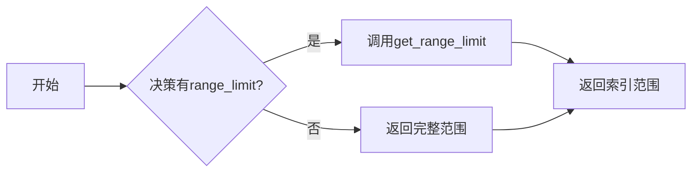

# backtest/utils.py 模块文档

## 文件概述

该模块实现了回测系统的基础设施（Infrastructure）类，用于管理策略和执行器之间的共享资源和状态。基础设施是回测系统解耦的核心组件。

主要包含：
1. `TradeCalendarManager`: 交易日历管理器
2. `BaseInfrastructure`: 基础设施基类
3. `CommonInfrastructure`: 公共设施类
4. `LevelInfrastructure`: 层级设施类
5. `get_start_end_idx`: 辅助函数，获取决策的起始和结束索引

## 类详解

### TradeCalendarManager 类

**继承关系:** 无

**类说明:** 交易日历管理器，用于管理回测的交易日历。被BaseStrategy和BaseExecutor使用。

#### 属性

**日历配置:**
- `freq: str` - 交易频率
- `start_time: pd.Timestamp` - 起始时间（闭区间）
- `end_time: pd.Timestamp` - 结束时间（闭区间）
- `_calendar: np.ndarray` - 日历数组
- `start_index: int` - 起始索引
- `end_index: int` - 结束索引

**交易状态:**
- `trade_len: int` - 总交易步数
- `trade_step: int` - 当前已完成的交易步数（0到trade_len-1）

**层级引用:**
- `level_infra: LevelInfrastructure | None` - 层级设施引用

#### 方法

##### __init__(self, freq: str, start_time: Union[str, pd.Timestamp] = None, end_time: Union[str, pd.Timestamp] = None, level_infra: LevelInfrastructure | None = None) -> None

**功能描述:** 初始化交易日历管理器

**参数说明:**
- `freq`: 交易频率（如"day", "1min"）
- `start_time`: 交易起始时间（闭区间，可选）
- `end_time`: 交易结束时间（闭区间，可选）
- `level_infra`: 层级设施（可选）

**注意:**
- 如果start_time或end_time为None，必须在交易前调用reset
- 所有时间参数都是闭区间

##### reset(self, freq: str, start_time: Union[str, pd.Timestamp] = None, end_time: Union[str, pd.Timestamp] = None) -> None

**功能描述:** 重置交易日历

**参数说明:**
- `freq`: 交易频率
- `start_time`: 交易起始时间（可选）
- `end_time`: 交易结束时间（可选）

**初始化内容:**
- `trade_len`: 总交易步数（end_index - start_index + 1）
- `trade_step`: 当前已完成的交易步数（初始化为0）

##### finished(self) -> bool

**功能描述:** 检查交易是否完成

**返回值:**
- `True`: 交易已完成（trade_step >= trade_len）
- `False`: 交易未完成

**注意:**
- 应在调用strategy.generate_decisions和executor.execute之前检查
- trade_step表示已完成的交易步数

##### step(self) -> None

**功能描述:** 前进一步

**抛出异常:** RuntimeError（如果日历已完成）

##### get_freq(self) -> str

**功能描述:** 获取交易频率

**返回值:** 频率字符串

##### get_trade_len(self) -> int

**功能描述:** 获取总交易步数

**返回值:** 总步数

##### get_trade_step(self) -> int

**功能描述:** 获取当前交易步数

**返回值:** 当前步数（0到trade_len-1）

##### get_step_time(self, trade_step: int | None = None, shift: int = 0) -> Tuple[pd.Timestamp, pd.Timestamp]

**功能描述:** 获取指定交易步的左右端点（闭区间）

**参数说明:**
- `trade_step`: 交易步数（可选，默认当前步）
- `shift`: 偏移条数（可选，默认0）
  - 0: 当前步
  - >0: 之前的步
  - <0: 之后的步

**返回值:** 元组 (start_time, end_time)

**端点说明:**
- Qlib使用闭区间进行时间序列数据选择
- 返回的右端点需要减1秒（因为Qlib的闭区间表示）
- Qlib支持分钟级决策执行，1秒小于任何时间间隔

**举例:**
```python
# 获取当前步的时间范围
start, end = calendar.get_step_time()

# 获取上一步的时间范围
prev_start, prev_end = calendar.get_step_time(shift=1)

# 获取下一步的时间范围
next_start, next_end = calendar.get_step_time(shift=-1)
```

##### get_data_cal_range(self, rtype: str = "full") -> Tuple[int, int]

**功能描述:** 获取数据日历范围

**参数说明:**
- `rtype`: 范围类型
  - `"full"`: 返回决策在当日的完整限制
  - `"step"`: 返回当前步骤的限制

**返回值:** 元组 (start_idx, end_idx)

**假设:**
1. 交易所的频率与数据日历频率相同
2. 用户希望按天取模数据索引（即240分钟）

##### get_all_time(self) -> Tuple[pd.Timestamp, pd.Timestamp]

**功能描述:** 获取交易的start_time和end_time

**返回值:** 元组 (start_time, end_time)

##### get_range_idx(self, start_time: pd.Timestamp, end_time: pd.Timestamp) -> Tuple[int, int]

**功能描述:** 获取涉及start_time到end_time的_range索引（闭区间）

**参数说明:**
- `start_time`: 起始时间
- `end_time`: 结束时间

**返回值:** 元组 (left, right) - 左右都是闭区间

**注意:** 返回的索引相对于start_index，是相对的range索引

##### __repr__(self) -> str

**功能描述:** 返回对象的字符串表示

**返回值:** 格式化的字符串

---

### BaseInfrastructure 类

**继承关系:** 无

**类说明:** 基础设施基类，定义了基础设施的通用接口。

#### 方法

##### __init__(self, **kwargs: Any) -> None

**功能描述:** 初始化基础设置

##### get_support_infra(self) -> Set[str] [abstractmethod]

**功能描述:** 返回支持的基础设施名称集合

**返回值:** 设施名称集合

##### reset_infra(self, **kwargs: Any) -> None

**功能描述:** 重置基础设施

**参数说明:**
- `**kwargs`: 要设置的关键字参数

**注意:** 只设置支持的基础设施

##### get(self, infra_name: str) -> Any

**功能描述:** 获取指定名称的基础设施

**参数说明:**
- `infra_name`: 设施名称

**返回值:** 设施对象或None

##### has(self, infra_name: str) -> bool

**功能描述:** 检查是否拥有指定名称的基础设施

**参数说明:**
- `infra_name`: 设施名称

**返回值:** True表示拥有，False表示不拥有

##### update(self, other: BaseInfrastructure) -> None

**功能描述:** 用其他基础设施更新当前基础设施

**参数说明:**
- `other`: 其他基础设施对象

---

### CommonInfrastructure 类

**继承关系:** BaseInfrastructure

**类说明:** 公共设施类，存储策略和执行器共享的资源。

**支持的基础设施:**
- `trade_account`: 交易账户
- `trade_exchange`: 交易所

#### 方法

##### get_support_infra(self) -> Set[str]

**功能描述:** 返回支持的基础设施名称集合

**返回值:** `{"trade_account", "trade_exchange"}`

---

### LevelInfrastructure 类

**继承关系:** BaseInfrastructure

**类说明:** 层级设施类，由执行器创建，然后共享给同层的策略。

**支持的基础设施:**
- `trade_calendar`: 交易日历
- `sub_level_infra`: 子层级设施
- `common_infra`: 公共设施
- `executor`: 执行器

**注意:** `sub_level_infra`只在_init_sub_trading后才有用

#### 方法

##### get_support_infra(self) -> Set[str]

**功能描述:** 返回支持的基础设施名称集合

**返回值:** 设施名称集合

##### reset_cal(self, freq: str, start_time: Union[str, pd.Timestamp, None], end_time: Union[str, pd.Timestamp, None]) -> None

**功能描述:** 重置交易日历管理器

**参数说明:**
- `freq`: 交易频率
- `start_time`: 起始时间（可选）
- `end_time`: 结束时间（可选）

##### set_sub_level_infra(self, sub_level_infra: LevelInfrastructure) -> None

**功能描述:** 设置子层级设施

**参数说明:****
- `sub_level_infra`: 子层级设施对象

**注意:** 使跨层级访问日历更容易

---

## 辅助函数

### get_start_end_idx(trade_calendar: TradeCalendarManager, outer_trade_decision: BaseTradeDecision) -> Tuple[int, int]

**功能描述:** 辅助函数，用于获取内层策略的决策级索引范围限制

**参数说明:**
- `trade_calendar`: 交易日历管理器（内层策略的）
- `outer_trade_decision`: 外层策略生成的交易决策

**返回值:** 元组 (start_index, end_index)

**注意:**
- 不适用于订单级
- 如果决策无法提供统一起始终束，返回完整索引范围

**流程图:**


## 使用示例

### 创建和使用交易日历

```python
from qlib.backtest.utils import TradeCalendarManager

# 创建交易日历管理器
calendar = TradeCalendarManager(
    freq="day",
    start_time="2020-01-01",
    end_time="2020-12-31",
)

# 检查是否完成
while not calendar.finished():
    # 获取当前时间范围
    start, end = calendar.get_step_time()
    print(f"交易日 {calendar.get_trade_step()}: {start} - {end}")

    # 前进一步
    calendar.step()
```

### 使用基础设施

```python
from qlib.backtest.utils import CommonInfrastructure, LevelInfrastructure
from qlib.backtest.exchange import Exchange
from qlib.backtest.account import Account

# 创建公共设施
common_infra = CommonInfrastructure(
    trade_account=Account(),
    trade_exchange=Exchange(...),
)

# 访问公共设施
account = common_infra.get("trade_account")
exchange = common_infra.get("trade_exchange")

# 创建层级设施
level_infra = LevelInfrastructure(
    trade_calendar=calendar,
    common_infra=common_infra,
    executor=executor,
)

# 访问层级设施
calendar = level_infra.get("trade_calendar")
sub_infra = level_infra.get("sub_level_infra")
```

### 在策略和执行器中使用

```python
from qlib.strategy.base import BaseStrategy

class MyStrategy(BaseStrategy):
    def reset_common_infra(self, common_infra: CommonInfrastructure):
        super().reset_common_infra(common_infra)

        # 访问交易所
        self.exchange = self.common_infra.get("trade_exchange")

        # 访问交易日历
        self.trade_calendar = self.level_infra.get("trade_calendar")
```

```python
from qlib.backtest.executor import BaseExecutor

class MyExecutor(BaseExecutor):
    def __init__(self, ...):
        super().__init__(...)

        # 通过属性访问交易日历
        calendar = self.trade_calendar
        print(f"交易步数: {calendar.get_trade_len()}")
```

### 获取时间范围

```python
# 获取当前步的时间范围（闭区间）
start, end = trade_calendar.get_step_time()

# 获取上一步的时间范围
prev_start, prev_end = trade_calendar.get_step_time(shift=1)

# 获取数据日历范围
data_start_idx, data_end_idx = trade_calendar.get_data_cal_range(rtype="full")

# 获取range索引
range_start, range_end = trade_calendar.get_range_idx(
    start_time=pd.Timestamp("2020-01-05"),
    end_time=pd.Timestamp("2020-01-10"),
)
```

## 相关模块

- `qlib.backtest.executor`: 执行器类，使用基础设施
- `qlib.backtest.decision`: 交易决策类，使用get_start_end_idx
- `qlib.strategy.base`: 策略基类，使用基础设施
- `qlib.data.data`: 数据访问接口（日历）

## 重要概念

### 基础设施分层

基础设施分为三个层级：

1. **CommonInfrastructure**: 策略和执行器共享的资源
   - trade_account: 交易账户
   - trade_exchange: 交易所

2. **LevelInfrastructure**: 同层策略和执行器共享的资源
   - trade_calendar: 交易日历
   - sub_level_infra: 子层级设施
   - common_infra: 公共设施引用
   - executor: 执行器引用

3. **TradeCalendarManager**: 交易日历管理
   - 管理交易时间范围
   - 跟踪当前交易步

### 嵌套执行的基础设施流

```
CommonInfrastructure (共享所有层级)
    ├── LevelInfrastructure (外层)
    │   ├── trade_calendar (外层)
    │   ├── sub_level_infra → LevelInfrastructure (内层)
    │   │   ├── trade_calendar (内层)
    │   │   └── sub_level_infra → ...
    │   ├── common_infra
    │   └── executor
    └── ...
```

### 交易步数管理

- `trade_len`: 总交易步数
- `trade_step`: 当前已完成的交易步数（0到trade_len-1）
- `finished()`: 检查trade_step >= trade_len

### 闭区间约定

- 所有时间参数都是闭区间（包含端点）
- 与pandas.Series.loc的闭区间行为一致
- 支持分钟级决策执行

### 设施访问优先级

1. 层级优先：先从LevelInfrastructure查找
2. 公共次之：再从CommonInfrastructure查找
`trade_exchange`属性使用这种优先级

## 注意事项

1. **时间区间**: 所有时间参数都是闭区间（包含端点）
2. **相对索引**: get_range_idx返回的是相对索引（相对于start_index）
3. **子层设施**: sub_level_infra只在_init_sub_trading后有定义
4. **设施名称**: 只能设置支持的基础设施，否则会被忽略
5. **日历步进**: 必须定期调用step()否则会卡在循环中
6. **完成检查**: 应在生成决策和执行前检查finished()
