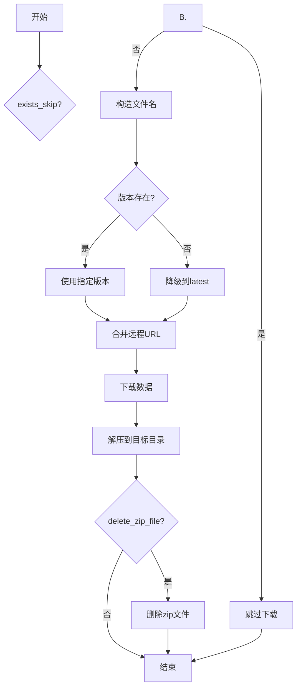

# cli/data.py 模块文档

## 文件概述
提供Qlib数据下载的命令行接口，使用fire框架实现。

## 类

### GetData 类
**功能：** 数据下载管理类

**主要属性：**
- `REMOTE_URL`: 数据下载的基础URL
  - 默认值: "https://github.com/SunsetWolf/qlib_dataset/releases/download"

**主要方法：**

1. `__init__(delete_zip_file=False)`
   - 初始化数据下载器
   - 参数：
     - `delete_zip_file`: 是否删除下载的zip文件（默认False）

2. `merge_remote_url(file_name: str) -> str`
   - 合并远程URL
   - 参数：
     - `file_name`: 文件名
   - 说明：
     - 如果文件名包含版本号（如v2/...），使用该版本
     - 否则默认使用v0版本
   - 返回：完整的下载URL

3. `download(url: str, target_path: Union[Path, str])`
   - 下载文件
   - 参数：
     - `url`: 下载URL
     - `target_path`: 保存路径
   - 实现：
     - 使用流式下载（stream=True）
     - 支持进度显示（tqdm）
     - 超时60秒
     - 数据来源：Yahoo Finance

4. `download_data(file_name: str, target_dir: Union[Path, str], delete_old: bool = True)`
   - 下载并解压数据
   - 参数：
     - `file_name`: 要下载的文件名（需以.zip结尾）
     - `target_dir`: 保存目录
     - `delete_old`: 是否删除旧数据（默认True）
   - 实现流程：
     ```
     1. 创建带时间戳的临时文件名
     2. 合并远程URL
     3. 下载文件
     4. 解压到目标目录
     5. 如果delete_zip_file=True，删除zip文件
     ```

5. `check_dataset(file_name: str) -> bool`
   - 检查数据集是否存在
   - 参数：
     - `file_name`: 文件名
   - 返回：是否存在（404表示不存在）

6. `_unzip(file_path: Union[Path, str], target_dir: Union[Path, str], delete_old: bool = True)` (静态方法)
   - 解压zip文件
   - 参数：
     - `file_path`: zip文件路径
     - `target_dir`: 目标目录
     - `delete_old`: 是否删除旧数据（默认True）
   - 说明：
     - 如果delete_old=True，需要用户确认删除
     - 使用tqdm显示解压进度

7. `_delete_qlib_data(file_dir: Path)` (静态方法)
   - 删除Qlib数据目录
   - 参数：
     - `file_dir`: 目录路径
   - 删除的目录：
     - features
     - calendars
     - instruments
     - features_cache
     - dataset_cache

8. `qlib_data(...)`
   - 下载Qlib数据（主方法）
   - 参数：
     - `name`: 数据集名称（默认"qlib_data"）
     - `target_dir`: 保存目录（默认"~/.qlib/qlib_data/cn_data"）
     - `version`: 数据版本（默认None，脚本自动决定）
     - `interval`: 数据频率（默认"1d"）
     - `region`: 数据区域（默认"cn"）
     - `delete_old`: 是否删除旧数据（默认True）
     - `exists_skip`: 如果存在则跳过（默认False）
   - 实现流程：
     ```
     1. 如果exists_skip=True且数据存在，跳过
     2. 构造文件名（包含Qlib版本）
     3. 如果版本不存在，则降级到latest
     4. 调用download_data下载
     ```

## 使用示例

### 下载日频数据
```bash
# 使用fire命令
python -m qlib.cli.data qlib_data \
    --name qlib_data \
    --target_dir ~/.qlib/qlib_data/cn_data \
    --interval 1d \
    --region cn
```

### 下载分钟频数据
```bash
python -m qlib.cli.data qlib_data \
    --name qlib_data \
    --target_dir ~/.qlib/qlib_data/cn_data_1min \
    --interval 1min \
    --region cn
```

### 跳过已存在的数据
```bash
python -m qlib.cli.data qlib_data \
    --target_dir ~/.qlib/qlib_data/cn_data \
    --exists_skip True
```

## 数据下载流程



## 文件名格式

```
{version}/{name}_{region}_{interval}_{qlib_version}.zip
```

示例：
- `v2/qlib_data_cn_1d_0.9.6.zip`
- `latest/qlib_data_us_1d_0.9.6.zip.lnk`

## 与其他模块的关系
- `fire`: 命令行框架
- `tqdm`: 进度条显示
- `requests`: HTTP下载
- `zipfile`: 解压
- `loguru`: 日志记录
- `qlib.utils.exists_qlib_data`: 数据存在检查
