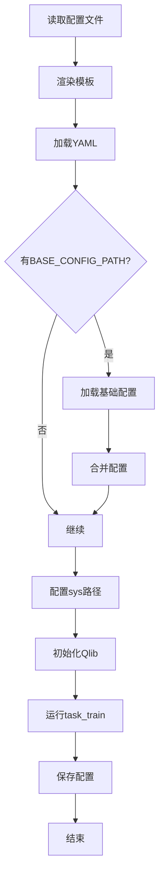
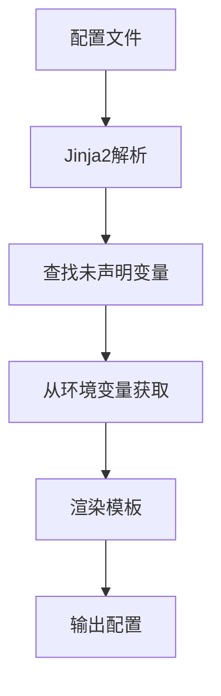
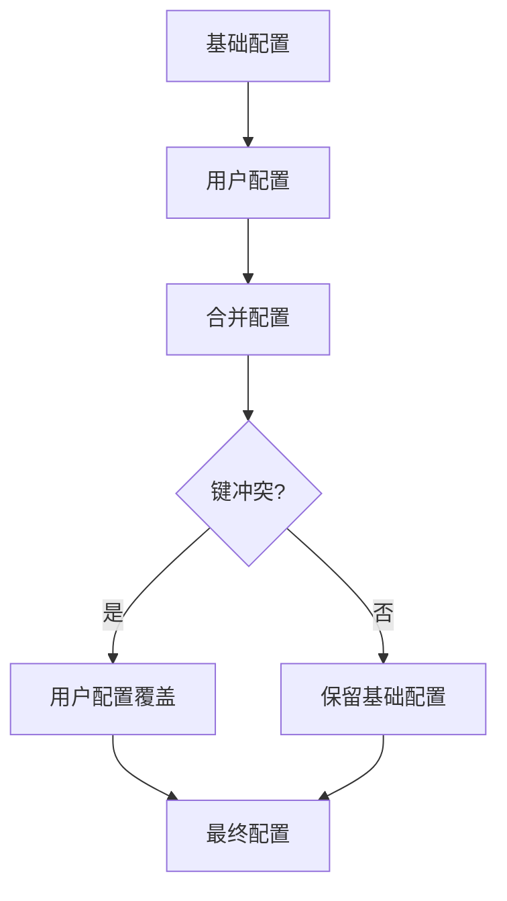

# cli/run.py 模块文档

## 文件概述
提供Qlib工作流执行的命令行接口，支持配置文件渲染、模块路径管理和任务训练。

## 主要函数

### get_path_list 函数
**签名：** `get_path_list(path) -> list`

**功能：** 将路径转换为列表

**参数：**
- `path`: 路径（字符串或列表）

**返回：** 路径列表

---

### sys_config 函数
**签名：** `sys_config(config, config_path)`

**功能：** 配置sys部分（系统路径）

**参数：**
- `config`: 工作流配置
- `config_path`: 配置文件路径

**配置项：**
- `sys.path`: 添加到Python路径的路径列表
- `sys.rel_path`: 相对于config_path的路径列表

**说明：** 用于加载自定义模块

---

### render_template 函数
**签名：** `render_template(config_path: str) -> str`

**功能：** 基于环境变量渲染模板

**参数：**
- `config_path`: 配置文件路径

**模板引擎：** Jinja2

**处理流程：**
```
1. 读取配置文件
2. 设置Jinja2环境
3. 解析模板查找未声明的变量
4. 从环境变量获取变量值
5. 使用环境变量上下文渲染模板
```

**返回：** 渲染后的配置内容

**示例：**
```yaml
# 配置文件示例
experiment_name: {{ EXPERIMENT_NAME }}
model_type: {{ MODEL_TYPE | default('lgb') }}
```

---

### workflow 函数
**签名：**
```python
workflow(
    config_path,
    experiment_name="workflow",
    uri_folder="mlruns"
)
```

**功能：** Qlib CLI入口，运行完整的工作流

**参数：**
- `config_path`: 配置文件路径
- `experiment_name`: 实验名称（默认"workflow"）
- `uri_folder`: MLflow URI文件夹（默认"mlruns"）

**执行流程：**
```
1. 渲染模板（支持Jinja2环境变量）
2. 加载YAML配置
3. 检查BASE配置文件
4. 如果存在BASE_CONFIG_PATH：
   a. 加载基础配置
   b. 合并用户配置到基础配置
5. 配置sys部分（添加路径）
6. 初始化Qlib
   a. 如果配置中有exp_manager，使用qlib.init
   b. 否则配置默认的exp_manager
7. 运行task_train
8. 保存配置到recorder
```

**BASE_CONFIG_PATH支持：**
- 允许用户指定基础配置文件
- 避免复制粘贴重复配置
- 支持相对路径和绝对路径

**示例：**
```yaml
# 配置文件示例
qlib_init:
    provider_uri: "~/.qlib/qlib_data/cn_data"
    region: cn
BASE_CONFIG_PATH: "workflow_config_lightgbm_Alpha158.yaml"
market: csi300  # 覆盖基础配置
```

---

### run 函数
**签名：** `run()`

**功能：** 使用fire运行workflow

**说明：** 将workflow函数暴露给fire命令行接口

## 使用示例

### 基本使用
```bash
# 运行工作流
python -m qlib.cli.run workflow config.yaml

# 指定实验名称
python -m qlib.cli.run workflow config.yaml --experiment_name my_exp

# 指定MLflow目录
python -m qlib.cli.run workflow config.yaml --uri_folder ./mlruns
```

### 使用环境变量
```bash
# 设置环境变量
export EXPERIMENT_NAME="test_exp"
export MODEL_TYPE="lgb"

# 运行工作流（Jinja2会自动替换）
python -m qlib.cli.run workflow config.yaml
```

### 使用BASE_CONFIG_PATH
```yaml
# 你的配置文件
qlib_init:
    provider_uri: "~/.qlib/qlib_data/cn_data"
    region: cn
BASE_CONFIG_PATH: "workflow_config_lightgbm_Alpha158.yaml"
market: csi300  # 覆盖基础配置中的market
```

## 工作流执行流程



## 模板渲染流程



## 配置合并规则



## 与其他模块的关系
- `fire`: 命令行框架
- `Jinja2`: 模板引擎
- `ruamel.yaml`: YAML解析
- `qlib`: Qlib初始化
- `qlib.config`: 配置管理
- `qlib.log`: 日志记录
- `qlib.utils`: 工具函数
- `qlib.model.trainer`: 任务训练
