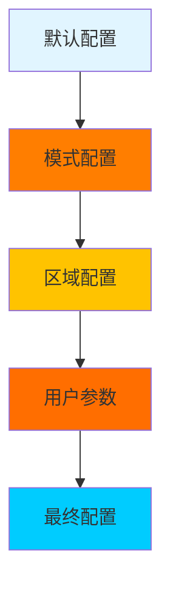
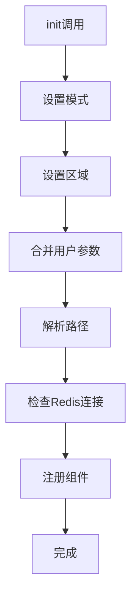
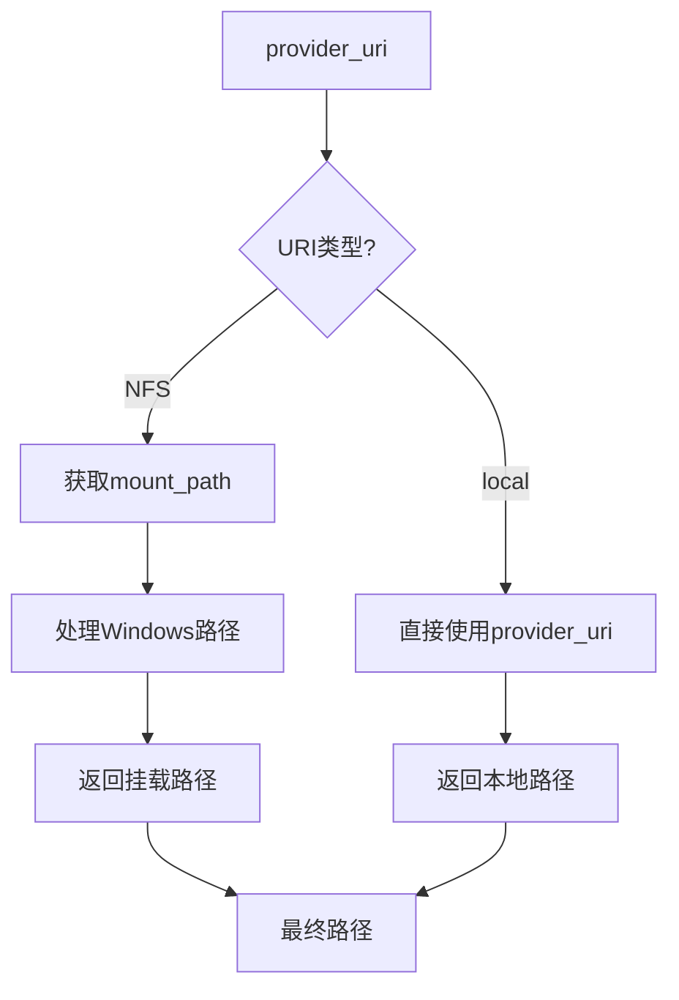

# config.py 模块文档

## 文件概述
提供Qlib的配置管理系统，包括默认配置、模式配置、全局配置对象等。

## 配置类

### MLflowSettings 类
**功能：** MLflow相关设置（基于pydantic_settings）

**主要属性：**
```python
uri: str = "file:" + str(Path(os.getcwd()).resolve() / "mlruns")
default_exp_name: str = "Experiment"
```

**说明：** 使用环境变量QLIB_前缀可以覆盖这些设置

---

### QSettings 类
**功能：** Qlib的默认设置

**主要属性：**
```python
mlflow: MLflowSettings = MLflowSettings()
provider_uri: str = "~/.qlib/qlib_data/cn_data"
model_config = SettingsConfigDict(
    env_prefix="QLIB_",
    env_nested_delimiter="_",
)
```

---

### Config 类
**功能：** 基础配置类

**主要方法：**

1. `__init__(default_conf)`
   - 初始化配置
   - 深拷贝默认配置

2. `__getitem__(key)`: 字典式访问

3. `__getattr__(attr)`: 属性式访问

4. `get(key, default=None)`: 带默认值的获取

5. `__setitem__(key, value)`: 字典式设置

6. `__setattr__(attr, value)`: 属性式设置

7. `__contains__(item)`: 成员测试

8. `__getstate__()`: 序列化状态

9. `__setstate__(state)`: 反序列化状态

10. `__str__()`, `__repr__()`: 字符串表示

11. `reset()`: 重置为默认配置

12. `update(*args, **kwargs)`: 更新配置

13. `set_conf_from_C(config)`: 从C对象设置配置

14. `register_from_C(config, skip_register=True)` (静态方法)
    - 注册配置到全局C对象

---

### QlibConfig 类
**功能：** Qlib配置管理类

**主要属性（静态）：**
```python
LOCAL_URI = "local"      # 本地URI类型
NFS_URI = "nfs"          # NFS URI类型
DEFAULT_FREQ = "__DEFAULT_FREQ"  # 默认频率
```

**主要方法：**

1. `__init__(default_conf)`: 初始化配置

2. `set_mode(mode)`: 设置模式（client/server）

3. `set_region(region)`: 设置区域

4. `resolve_path()`: 解析路径（处理~扩展）

5. `set(default_conf, **kwargs)`: 设置配置
   - 处理特殊参数：
     - `region`: 设置区域配置
     - 其他：直接设置

6. `register()`: 注册全局组件
   - 注册所有数据提供者
   - 设置实验管理器
   - 注册退出处理器

7. `reset_qlib_version()`: 重置Qlib版本

8. `get_kernels(freq)`: 获取处理器数量
   - 支持固定值或callable

**属性访问：**
- `registered`: 是否已注册
- `dpm`: 数据路径管理器

---

### DataPathManager 类（嵌套在QlibConfig中）
**功能：** 数据路径管理

**主要方法（静态）：**

1. `format_provider_uri(provider_uri) -> dict`
   - 格式化provider_uri为字典
   - 扩展用户路径

2. `get_uri_type(uri) -> str`
   - 判断URI类型（local或nfs）

3. `get_data_uri(freq) -> Path`
   - 获取频率对应的数据路径
   - 处理NFS挂载

## 默认配置

### _default_config
**主要配置项：**

```python
# 数据提供者
"calendar_provider": "LocalCalendarProvider",
"instrument_provider": "LocalInstrumentProvider",
"feature_provider": "LocalFeatureProvider",
"pit_provider": "LocalPITProvider",
"expression_provider": "LocalExpressionProvider",
"dataset_provider": "LocalDatasetProvider",
"provider": "LocalProvider",

# 数据路径
"provider_uri": "",  # 可以为str或dict

# 缓存配置
"expression_cache": None,
"calendar_cache": None,
"local_cache_path": None,
"kernels": NUM_USABLE_CPU,
"dump_protocol_version": PROTOCOL_VERSION,
"maxtasksperchild": None,
"joblib_backend": "multiprocessing",
"default_disk_cache": 1,
"mem_cache_size_limit": 500,
"mem_cache_limit_type": "length",
"mem_cache_expire": 60 * 60,
"dataset_cache_dir_name": "dataset_cache",
"features_cache_dir_name": "features_cache",

# Redis配置
"redis_host": "127.0.0.1",
"redis_port": 6379,
"redis_task_db": 1,
"redis_password": None,

# 日志配置
"logging_level": logging.INFO,
"logging_config": {...},

# 实验管理器
"exp_manager": {
    "class": "MLflowExpManager",
    "module_path": "qlib.workflow.expm",
    "kwargs": {...},
},

# PIT配置
"pit_record_type": {...},
"pit_record_nan": {...},

# MongoDB配置
"mongo": {
    "task_url": "mongodb://localhost:27017/",
    "task_db_name": "default_task_db",
},

# 高频数据配置
"min_data_shift": 0,
```

---

### MODE_CONF
**模式配置：**

```python
"server": {
    "provider_uri": "",
    "redis_host": "127.0.0.1",
    "redis_port": 6379,
    "redis_task_db": 1,
    "expression_cache": DISK_EXPRESSION_CACHE,
    "dataset_cache": DISK_DATASET_CACHE,
    "local_cache_path": Path("~/.cache/qlib_simple_cache"),
    "mount_path": None,
},
"client": {
    "provider_uri": QSETTINGS.provider_uri,
    "dataset_cache": None,
    "local_cache_path": Path("~/.cache/qlib_simple_cache"),
    "mount_path": None,
    "auto_mount": False,
    "timeout": 100,
    "logging_level": logging.INFO,
    "region": REG_CN,
    "custom_ops": [],
},
```

---

### _default_region_config
**区域特定配置：**

```python
REG_CN: {
    "trade_unit": 100,
    "limit_threshold": 0.095,
    "deal_price": "close",
},
REG_US: {
    "trade_unit": 1,
    "limit_threshold": None,
    "deal_price": "close",
},
REG_TW: {
    "trade_unit": 1000,
    "limit_threshold": 0.1,
    "deal_price": "close",
},
```

## 全局对象

```python
C = QlibConfig(_default_config)
```

**用途：**
- 全局配置访问
- 支持字典和属性访问

**示例：**
```python
# 字典访问
provider_uri = C["provider_uri"]

# 属性访问
provider_uri = C.provider_uri

# 更新配置
C["new_key"] = "value"
```

## 配置优先级



## 初始化流程



## 路径解析流程



## 使用示例

### 访问配置
```python
from qlib.config import C

# 获取配置
region = C.region
provider_uri = C["provider_uri"]

# 修改配置
C["logging_level"] = logging.DEBUG
```

### 模式切换
```python
from qlib.config import C

# 切换到服务器模式
C.set_mode("server")

# 切换到客户端模式
C.set_mode("client")
```

### 区域配置
```python
from qlib.config import C, REG_CN, REG_US

# 切换到中国
C.set_region(REG_CN)

# 切换到美国
C.set_region(REG_US)
```

### 数据路径管理
```python
from qlib.config import C

# 获取数据路径管理器
dpm = C.dpm

# 获取日频数据路径
day_path = dpm.get_data_uri("day")

# 获取分钟频数据路径
min_path = dpm.get_data_uri("1min")
```

## 与其他模块的关系
- `qlib`: 全局配置对象C
- `qlib.constant`: 区域常量
- `qlib.log`: 日志系统
- `pathlib`: 路径处理
- `pydantic_settings`: 配置验证
