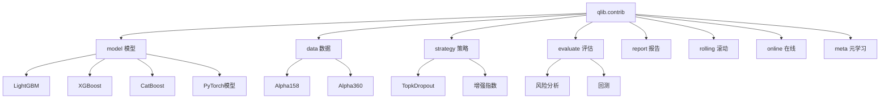
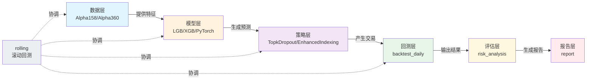

# Contrib 模块文档

## 模块概述

`qlib.contrib` 是 Qlib 的社区贡献模块，包含了丰富的量化投资相关的组件和功能扩展。该模块提供了数据处理、模型实现、交易策略、回测评估、报告生成等完整的量化投资工作流支持。

### 主要功能模块

| 模块 | 功能描述 |
|------|----------|
| [model](./model/) | 多种机器学习模型实现（LightGBM、XGBoost、PyTorch等） |
| [data](./data/) | 数据处理器和Handler（Alpha158、Alpha360等） |
| [strategy](./strategy/) | 交易策略实现（TopkDropout、增强指数等） |
| [report](./report/) | 回测报告和可视化分析 |
| [evaluate](./#) | 回测和风险分析函数 |
| [rolling](./rolling/) | 滚动回测实现 |
| [online](./online/) | 在线交易管理 |
| [meta](./meta/) | 元学习相关功能 |
| [ops](./ops/) | 高频操作 |
| [tuner](./tuner/) | 超参数调优 |
| [workflow](./workflow/) | 工作流记录器 |



---

## 核心模块详解

### 1. evaluate 模块

`evaluate` 模块提供了回测执行和风险分析的核心功能。

#### 主要函数

##### risk_analysis

```python
def risk_analysis(r, N: int = None, freq: str = "day", mode: Literal["sum", "product"] = "sum")
```

**功能说明**：对收益率序列的风险分析，计算年化收益率、信息比率、最大回撤等指标。

**参数**：
- `r` (pandas.Series): 日收益率序列
- `N` (int, optional): 年化缩放因子（日：252，周：50，月：12）
- `freq` (str, optional): 分析频率，用于计算缩放因子
- `mode` (Literal["sum", "product"], optional): 收益率累积方式
  - `"sum"`: 算术累积（线性收益率）
  - `"product"`: 几何累积（复利收益率）

**返回值**：
- `pd.DataFrame`: 包含风险指标的数据框

**风险指标**：
| 指标 | 说明 |
|------|------|
| mean | 平均收益率 |
| std | 收益率标准差 |
| annualized_return | 年化收益率 |
| information_ratio | 信息比率 |
| max_drawdown | 最大回撤 |

**使用示例**：

```python
import pandas as pd
from qlib.contrib.evaluate import risk_analysis

# 创建示例收益率序列
returns = pd.Series([0.01, -0.02, 0.015, -0.005, 0.02],
                  index=pd.date_range('2020-01-01', periods=5))

# 进行风险分析
risk_metrics = risk_analysis(returns, freq='day')
print(risk_metrics)
```

---

##### indicator_analysis

```python
def indicator_analysis(df, method="mean")
```

**功能说明**：分析交易统计时间序列指标。

**参数**：
- `df` (pandas.DataFrame): 包含交易指标的数据框
  - 必需字段：'pa'（价格优势）、'pos'（正收益率）、'ffr'（成交率）
  - 可选字段：'deal_amount'（成交量）、'value'（交易价值）
- `method` (str, optional): 统计方法
  - `"mean"`: 简单平均
  - `"amount_weighted"`: 成交量加权平均
  - `"value_weighted"`: 价值加权平均

**返回值**：
- `pd.DataFrame`: 各交易指标的统计值

---

##### backtest_daily

```python
def backtest_daily(
    start_time: Union[str, pd.Timestamp],
    end_time: Union[str, pd.Timestamp],
    strategy: Union[str, dict, BaseStrategy],
    executor: Union[str, dict, BaseExecutor] = None,
    account: Union[float, int, Position] = 1e8,
    benchmark: str = "SH000300",
    exchange_kwargs: dict = None,
    pos_type: str = "Position",
)
```

**功能说明**：初始化策略和执行器，执行日频回测。

**参数**：
- `start_time`: 回测开始时间
- `end_time`: 回测结束时间
- `strategy`: 策略配置，可以是字符串、字典或BaseStrategy实例
- `executor`: 执行器配置
- `account`: 账户资金或持仓
- `benchmark`: 基准指数，默认"SH000300"
- `exchange_kwargs`: 交易所参数
- `pos_type`: 持仓类型

**返回值**：
- `report_normal`: 回测报告
- `positions_normal`: 回测持仓

**使用示例**：

```python
from qlib.contrib.evaluate import backtest_daily
from qlib.contrib.strategy import TopkDropoutStrategy

# 策略配置
strategy_config = {
    "topk": 50,
    "n_drop": 5,
    "signal": pred_score,  # 预测分数
}

# 执行回测
report, positions = backtest_daily(
    start_time="2017-01-01",
    end_time="2020-08-01",
    strategy=strategy_config
)
```

---

##### long_short_backtest

```python
def long_short_backtest(
    pred,
    topk=50,
    deal_price=None,
    shift=1,
    open_cost=0,
    close_cost=0,
    trade_unit=None,
    limit_threshold=None,
    min_cost=5,
    subscribe_fields=[],
    extract_codes=False,
)
```

**功能说明**：多空策略回测。

**参数**：
- `pred`: 第T天产生的交易信号
- `topk`: 做多和做空的股票数量
- `deal_price`: 交易价格
- `shift`: 是否将预测偏移一天
- `open_cost`: 开仓交易成本
- `close_cost`: 平仓交易成本
- `trade_unit`: 交易单位（中国A股为100）
- `limit_threshold`: 涨跌停限制
- `min_cost`: 最小交易成本
- `subscribe_fields`: 订阅字段
- `extract_codes`: 是否从预测中提取代码

**返回值**：
- `dict`: 包含做多、做空和多空组合收益率的字典

---

### 2. model 模块

`model` 模块提供了多种机器学习模型的实现。

#### 导出的模型类

```python
# 梯度提升树模型
- CatBoostModel
- DEnsembleModel (Double Ensemble)
- LGBModel (LightGBM)
- XGBModel (XGBoost)

# 线性模型
- LinearModel

# PyTorch深度学习模型
- ALSTM (Attention LSTM)
- GATs (Graph Attention Networks)
- GRU (Gated Recurrent Unit)
- LSTM (Long Short-Term Memory)
- DNNModelPytorch (深度神经网络)
- TabnetModel
- SFM_Model
- TCN (Temporal Convolutional Network)
- ADD (Adaptive Denoising Diffusion)
```

**使用示例**：

```python
from qlib.contrib.model import LGBModel

# 创建LightGBM模型
model = LGBModel(
    loss="mse",
    learning_rate=0.1,
    colsample_bytree=0.8879,
    subsample=0.8789,
    n_estimators=200,
    num_leaves=255,
)

# 训练模型
model.fit(dataset)

# 预测
pred = model.predict(dataset)
```

---

### 3. strategy 模块

`strategy` 模块提供了多种交易策略的实现。

#### 导出的策略类

```python
# 信号策略
- TopkDropoutStrategy
- WeightStrategyBase
- EnhancedIndexingStrategy

# 规则策略
- TWAPStrategy
- SBBStrategyBase
- SBBStrategyEMA

# 成本控制策略
- SoftTopkStrategy
```

#### TopkDropoutStrategy

**功能说明**：基于信号的Top-K选股策略，定期调仓时替换表现最差的N只股票。

**主要参数**：
- `topk`: 持仓股票数量
- `n_drop`: 每次调仓替换的股票数量
- `method_sell`: 卖出方法（"random"或"bottom"）
- `method_buy`: 买入方法（"random"或"top"）
- `hold_thresh`: 最小持仓天数
- `only_tradable`: 是否只交易可交易股票
- `forbid_all_trade_at_limit`: 涨跌停时是否禁止所有交易

**使用示例**：

```python
from qlib.contrib.strategy import TopkDropoutStrategy

# 创建策略
strategy = TopkDropoutStrategy(
    signal=pred_score,
    topk=50,
    n_drop=5,
    method_sell="bottom",
    method_buy="top",
    hold_thresh=1,
)
```

---

#### EnhancedIndexingStrategy

**功能说明**：增强指数策略，在跟踪基准指数的同时获取超额收益。

---

#### TWAPStrategy

**功能说明**：时间加权平均价格策略，用于订单执行。

---

### 4. data 模块

`data` 模块提供了数据处理和特征工程的功能。

#### 导出的Handler类

```python
- Alpha158: 158个Alpha因子
- Alpha360: 360个Alpha因子
- Alpha360vwap: 基于VWAP的Alpha360
```

#### Alpha158

**功能说明**：提供158个经典Alpha因子的数据处理器。

**主要参数**：
- `instruments`: 股票池（默认"csi500"）
- `start_time`: 开始时间
- `end_time`: 结束时间
- `freq`: 频率（默认"day"）
- `infer_processors`: 推理处理器
- `learn_processors`: 学习处理器
- `fit_start_time`: 拟合开始时间
- `fit_end_time`: 拟合结束时间

**使用示例**：

```python
from qlib.contrib.data.handler import Alpha158

# 创建Alpha158数据处理器
handler = Alpha158(
    instruments="csi500",
    start_time="2010-01-01",
    end_time="2020-12-31",
    fit_start_time="2010-01-01",
    fit_end_time="2017-12-31",
)
```

---

#### Alpha360

**功能说明**：提供360个Alpha因子的数据处理器。

---

### 5. report 模块

`report` 模块提供了回测报告生成和可视化功能。

#### 导出的图表列表

```python
GRAPH_NAME_LIST = [
    "analysis_position.report_graph",
    "analysis_position.score_ic_graph",
    "analysis_position.cumulative_return_graph",
    "analysis_position.risk_analysis_graph",
    "analysis_position.rank_label_graph",
    "analysis_model.model_performance_graph",
]
```

**功能说明**：
- `report_graph`: 生成综合报告图表
- `score_ic_graph`: 信息系数分析图表
- `cumulative_return_graph`: 累计收益率图表
- `risk_analysis_graph`: 风险分析图表
- `rank_label_graph`: 排名标签分析图表
- `model_performance_graph`: 模型性能图表

---

### 6. rolling 模块

`rolling` 模块提供了滚动回测的功能。

**功能说明**：
- 提供通用的滚动回测实现
- 支持时间窗口滚动训练和测试
- 与 examples/benchmarks/benchmarks_dynamic 的区别：
  - rolling 模块专注于提供通用的滚动实现
  - benchmarks_dynamic 包含特定的基准测试内容

---

## 完整工作流示例

下面是一个完整的量化投资工作流示例，展示了如何使用 contrib 模块的各个组件：

```python
import qlib
from qlib.contrib.data.handler import Alpha158
from qlib.contrib.model import LGBModel
from qlib.contrib.strategy import TopkDropoutStrategy
from qlib.contrib.evaluate import backtest_daily, risk_analysis
from qlib.workflow import R
from qlib.workflow.record_temp import SignalRecord, PortAnaRecord

# 1. 初始化Qlib
qlib.init(provider_uri="~/.qlib/qlib_data/cn_data")

# 2. 准备数据
handler = Alpha158(
    instruments="csi500",
    start_time="2010-01-01",
    end_time="2020-12-31",
    fit_start_time="2010-01-01",
    fit_end_time="2017-12-31",
)

# 3. 创建数据集
dataset = Dataset(handler=handler, segments={
    "train": ("2010-01-01", "2017-12-31"),
    "valid": ("2018-01-01", "2018-12-31"),
    "test": ("2019-01-01", "2020-12-31"),
})

# 4. 训练模型
model = LGBModel(
    loss="mse",
    learning_rate=0.1,
    colsample_bytree=0.8879,
    subsample=0.8789,
    n_estimators=200,
    num_leaves=255,
)

with R.start(experiment_name="workflow"):
    # 记录和训练
    recorder = R.get_recorder()
    model.fit(dataset)

    # 生成信号
    signal_record = SignalRecord(model, dataset, recorder)
    signal_record.generate()

    # 回测分析
    port_ana_record = PortAnaRecord(recorder, config={
        "executor": {
            "class": "SimulatorExecutor",
            "module_path": "qlib.backtest.executor",
            "kwargs": {
                "time_per_step": "day",
                "generate_portfolio_metrics": True,
            },
        },
        "strategy": {
            "class": "TopkDropoutStrategy",
            "module_path": "qlib.contrib.strategy",
            "kwargs": {
                "signal": "<PRED>",
                "topk": 50,
                "n_drop": 5,
            },
        },
        "backtest": {
            "start_time": "2019-01-01",
            "end_time": "2020-12-31",
            "account": 100000000,
            "benchmark": "SH000300",
            "exchange_kwargs": {
                "freq": "day",
                "limit_threshold": 0.095,
                "deal_price": "close",
                "open_cost": 0.0005,
                "close_cost": 0.0015,
                "min_cost": 5,
            },
        },
    })
    port_ana_record.generate()
```

---

## 模块架构关系



---

## 注意事项

1. **可选依赖**：部分模型（如CatBoost、LightGBM、XGBoost、PyTorch）需要单独安装对应的库
2. **数据格式**：确保使用正确的数据格式和频率
3. **成本设置**：回测时注意设置合理的交易成本
4. **基准选择**：根据市场选择合适的基准指数
5. **风险控制**：设置适当的风险控制参数

---

## 相关模块

- [qlib.model](../model/__init__.md): 核心模型接口
- [qlib.strategy](../strategy/__init__.md): 核心策略接口
- [qlib.backtest](../backtest/__init__.md): 回测引擎
- [qlib.data](../data/__init__.md): 数据管理
- [qlib.workflow](../workflow/__init__.md): 工作流管理
