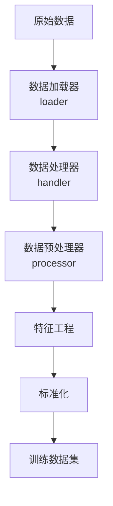

# `__init__.py`

## 模块概述

`qlib.contrib.data` 模块是 Qlib 中数据相关的贡献模块，提供了丰富的数据处理、加载和转换功能。该模块是构建量化投资策略数据管道的核心组件。

该模块包含以下主要功能：
- **数据加载器**：定义如何从原始数据中提取特征和标签
- **数据处理器**：对数据进行预处理、标准化和清洗
- **数据处理器**：管理数据加载、处理和分割的完整流程
- **高频数据处理**：支持分钟级数据的特殊处理

## 主要组件

### 数据加载器（loader.py）

| 类名 | 说明 |
|------|------|
| `Alpha360DL` | Alpha360 数据加载器，提供60天历史价格序列 |
| `Alpha158DL` | Alpha158 数据加载器，提供丰富的技术指标特征 |

### 数据处理器（processor.py）

| 类名 | 说明 |
|------|------|
| `ConfigSectionProcessor` | Alpha158 专用数据处理器 |

### 数据处理器（handler.py）

| 类名 | 说明 |
|------|------|
| `Alpha360` | Alpha360 数据处理器 |
| `Alpha360vwap` | 基于 VWAP 的 Alpha360 处理器 |
| `Alpha158` | Alpha158 数据处理器 |
| `Alpha158vwap` | 基于 VWAP 的 Alpha158 处理器 |

### 数据集类（dataset.py）

| 类名 | 说明 |
|------|------|
| `MTSDatasetH` | 内存增强时间序列数据集 |

### 高频数据处理

| 文件 | 说明 |
|------|------|
| `highfreq_provider.py` | 高频数据提供者 |
| `highfreq_processor.py` | 高频数据处理器 |
| `highfreq_handler.py` | 高频数据处理器 |
| `highfreq_provider.py` | Arctic 特征提供者 |

### 工具函数（utils/）

| 文件 | 说明 |
|------|------|
| `sepdf.py` | 单指数 PDF 相关函数 |

## 模块架构

```
qlib.contrib.data
├── loader.py              # 数据加载器定义
├── processor.py           # 数据预处理器
├── handler.py             # 数据处理器
├── dataset.py             # 数据集类
├── data.py               # 数据提供者
├── highfreq_provider.py   # 高频数据提供者
├── highfreq_processor.py  # 高频数据处理器
├── highfreq_handler.py    # 高频数据处理器
└── utils/
    └── sepdf.py          # 工具函数
```

## 使用示例

### 基本使用（日线数据）

```python
from qlib.contrib.data.handler import Alpha158

# 创建数据处理器
handler = Alpha158(
    instruments="csi500",  # 使用中证500成分股
    start_time="2020-01-01",
    end_time="2023-12-31",
)

# 获取训练数据
train_data = handler.fetch(
    segment="train",
    col_set=["feature", "label"],
)
```

### 高频数据处理

```python
from qlib.contrib.data.highfreq_handler import HighFreqHandler

# 创建高频数据处理器
handler = HighFreqHandler(
    instruments="csi300",
    start_time="2023-01-01",
    end_time="2023-12-31",
)
```

### 自定义数据管道

```python
from qlib.contrib.data.handler import Alpha158
from qlib.contrib.data.processor import ConfigSectionProcessor

# 使用自定义处理器
handler = Alpha158(
    instruments="csi500",
    start_time="2020-01-01",
    end_time="2023-12-31",
    learn_processors=[
        ConfigSectionProcessor(fillna_feature=True),
    ],
)
```

## 数据流程



## 配置示例

### YAML 配置

```yaml
# workflow_config.yaml
data_handler:
  class: Alpha158
  module_path: qlib.contrib.data.handler
  kwargs:
    instruments: csi500
    start_time: 2020-01-01
    end_time: 2023-12-31
    learn_processors:
      - class: DropnaLabel
      - class: CSZScoreNorm
        kwargs:
          fields_group: label
```

### Python 配置

```python
config = {
    "class": "Alpha158",
    "module_path": "qlib.contrib.data.handler",
    "kwargs": {
        "instruments": "csi500",
        "start_time": "2020-01-01",
        "end_time": "2023-12-31",
    }
}
```

## 性能优化

1. **数据缓存**：使用 Qlib 的缓存机制避免重复计算
2. **并行处理**：支持多进程数据处理
3. **内存优化**：使用懒加载和内存映射减少内存占用
4. **向量化计算**：所有操作基于 Pandas/Numpy 向量化实现

## 注意事项

1. 确保在使用前已初始化 Qlib
2. 数据时间范围需要与交易日历对齐
3. 处理器配置需要与数据加载器匹配
4. 高频数据处理需要额外配置和资源

## 相关模块

- `qlib.data.dataset`：基础数据集接口
- `qlib.data.dataset.loader`：基础数据加载器
- `qlib.data.dataset.processor`：基础数据处理器
- `qlib.data.dataset.handler`：基础数据处理器

## 参考资源

- [Qlib 数据文档](https://qlib.readthedocs.io/en/latest/component/data.html)
- [Alpha360 示例](https://github.com/microsoft/qlib/tree/main/examples/benchmarks/Alpha360)
- [Alpha158 示例](https://github.com/microsoft/qlib/tree/main/examples/benchmarks/LightGBM)
