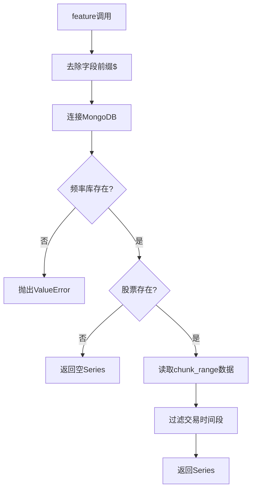

# contrib.data.data

**文件路径**: `qlib/contrib/data/data.py`

## 模块概述

该模块提供了基于Arctic的特征数据提供者实现。Arctic是一个基于MongoDB的高性能时间序列数据库，适用于存储和检索金融时间序列数据。

**注意**: 该模块已被移至contrib目录，原因如下：
1. Arctic对pandas和numpy版本有严格要求
2. pip在计算正确的版本号时会失败

要使用基于Arctic的provider，需要手动安装arctic：
```bash
pip install arctic
```

## 类定义

### `ArcticFeatureProvider`

**继承关系**: `FeatureProvider`

**说明**: 基于Arctic的特征数据提供者，从MongoDB的时间序列存储中获取特征数据。

#### 构造方法

```python
__init__(
    uri="127.0.0.1",
    retry_time=0,
    market_transaction_time_list=[("09:15", "11:30"), ("13:00", "15:00")]
)
```

**功能**: 初始化Arctic特征数据提供者

**参数**:
| 参数 | 类型 | 默认值 | 说明 |
|------|------|--------|------|
| uri | str | "127.0.0.1" | MongoDB连接URI |
| retry_time | int | 0 | 重试次数（当前未实现） |
| market_transaction_time_list | list | [("09:15", "11:30"), ("13:00", "15:00")] | 市场交易时间段 |

**说明**:
- `market_transaction_time_list`对于TResample操作符特别重要，用于过滤交易时间之外的数据
- TODO: 需要实现连接失败时的重试机制

---

#### 方法

##### `feature(instrument, field, start_index, end_index, freq)`

**功能**: 获取单个特征数据

**参数**:
| 参数 | 类型 | 说明 |
|------|------|------|
| instrument | str | 股票代码 |
| field | str | 特征字段名（带$前缀） |
| start_index | int | 开始索引 |
| end_index | int | 结束索引 |
| freq | str | 数据频率 |

**返回值**:
- `pd.Series` - 特征值序列

**异常**:
- `ValueError`: 当指定的频率库不存在时抛出

**说明**:
1. 去除字段名前缀`$`
2. 连接到MongoDB服务器
3. 检查频率库是否存在
4. 检查股票代码是否存在
5. 读取指定范围的数据
6. 过滤到交易时间段
7. 返回时间序列数据

**注意**:
- 当前实现在每次调用时都会连接服务器，可能导致性能问题
- TODO: 优化连接管理，避免频繁连接

## 数据流程



## 使用示例

### 基本使用

```python
from qlib.contrib.data import ArcticFeatureProvider

# 初始化provider
provider = ArcticFeatureProvider(
    uri="mongodb://localhost:27017/",
    market_transaction_time_list=[
        ("09:30", "11:30"),
        ("13:00", "15:00")
    ]
)

# 获取特征数据
data = provider.feature(
    instrument="SH600000",
    field="$close",
    start_index=0,
    end_index=100,
    freq="day"
)
```

### 自定义交易时间

```python
# 美股市场交易时间
provider = ArcticFeatureProvider(
    uri="mongodb://us-market-server:27017/",
    market_transaction_time_list=[
        ("09:30", "16:00")  # 美股连续交易
    ]
)
```

## 性能优化建议

1. **连接池管理**: 当前实现每次调用都创建新连接，建议使用连接池
2. **批量读取**: 考虑支持批量读取多个特征以提高效率
3. **缓存机制**: 对于频繁访问的数据，考虑添加本地缓存

## 相关模块

- `qlib.data.data.FeatureProvider` - 基类
- `qlib.data.ops` - 数据操作符
- `qlib.data.inst_processor` - 数据处理器

## 注意事项

1. **Arctic版本兼容**: 需要确保Arctic版本与pandas/numpy版本兼容
2. **手动安装**: 需要手动安装arctic包
3. **MongoDB依赖**: 需要运行中的MongoDB服务器
4. **时间过滤**: 默认使用A股交易时间段，其他市场需要自定义
