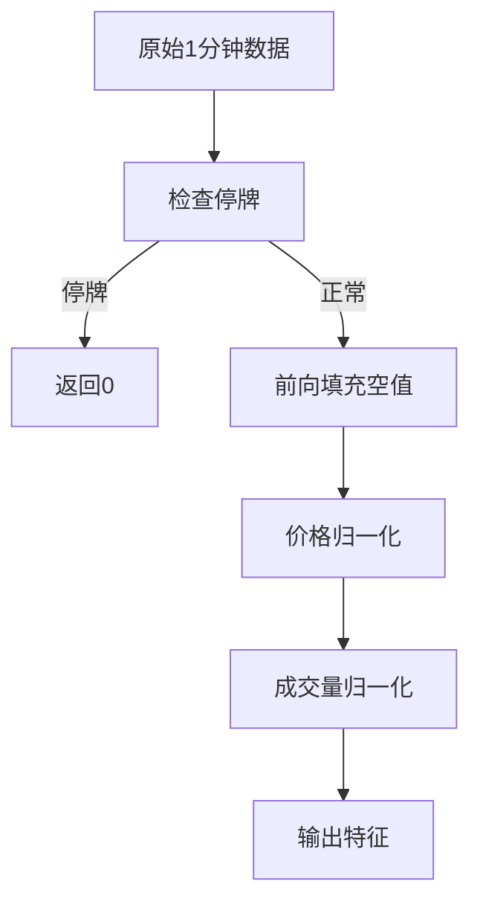

# contrib.data.highfreq_handler

**文件路径**: `qlib/contrib/data/highfreq_handler.py`

## 模块概述

该模块提供了高频交易数据处理器类 `HighFreqHandler`，专门用于处理1分钟级别的数据。

**主要特点**:
- 数据频率为1分钟
- 提供当前和前一日的价格（归一化）
- 处理停牌数据
- 支持成交量特征的特殊处理

## 常量定义

```python
EPSILON = 1e-4
```

**说明**: 用于数值比较的小常量，避免浮点精度问题。

## 类定义

### `HighFreqHandler`

**继承关系**: `DataHandlerLP`

**说明**: 高频数据处理器，用于1分钟级别数据

**特征设计**:
1. **价格归一化**: 使用昨日237分钟（接近收盘）的收盘价作为基准
2. **停牌处理**: 使用`paused_num`字段过滤停牌数据
3. **成交量特殊处理**: 使用7200分钟（5个交易日）的均值归一化

#### 构造方法

```python
__init__(
    self,
    instruments="csi300",
    start_time=None,
    end_time=None,
    infer_processors=[],
    learn_processors=[],
    fit_start_time=None,
    fit_end_time=None,
    drop_raw=True,
)
```

**功能**: 初始化高频数据处理器

**参数**:
| 参数 | 类型 | 默认值 | 说明 |
|------|------|--------|------|
| instruments | str/dict | "csi300" | 股票池配置 |
| start_time | str | None | 开始时间 |
| end_time | str | None | 结束时间 |
| infer_processors | list | [] | 推理处理器 |
| learn_processors | list | [] | 学习处理器 |
| fit_start_time | str | None | 拟合开始时间 |
| fit_end_time | str | None | 拟合结束时间 |
| drop_raw | bool | True | 是否删除原始数据 |

---

#### 方法

##### `get_feature_config()`

**功能**: 获取高频特征配置

**返回值**:
- `tuple`: (字段表达式列表, 字段名称列表)

**特征说明**:

| 特征名 | 表达式 | 说明 |
|--------|--------|------|
| $open | 当日开盘价/昨日收盘价 | 当日开盘价归一化 |
| $high | 当日最高价/昨日收盘价 | 当日最高价归一化 |
| $low | 当日最低价/昨日收盘价 | 当日最低价归一化 |
| $close | 当日收盘价/昨日收盘价 | 当日收盘价归一化 |
| $vwap | 当日VWAP/昨日收盘价 | 当日VWAP归一化 |
| $open_1 | 前240分钟开盘价/昨日收盘价 | 前一时段开盘价归一化 |
| $high_1 | 前240分钟最高价/昨日收盘价 | 前一时段最高价归一化 |
| $low_1 | 前240分钟最低价/昨日收盘价 | 前一时段最低价归一化 |
| $close_1 | 前240分钟收盘价/昨日收盘价 | 前一时段收盘价归一化 |
| $vwap_1 | 前240分钟VWAP/昨日收盘价 | 前一时段VWAP归一化 |
| $volume | 当日成交量/7200分钟均值 | 当日成交量归一化 |
| $volume_1 | 前240分钟成交量/7200分钟均值 | 前一时段成交量归一化 |

**总计**: 12个特征

**特征公式详解**:

```python
# 停牌选择模板
template_paused = "Select(Gt($paused_num, 1.001), {0})"

# 空值处理模板
template_if = "If(IsNull({1}), {0}, {1})"

# 价格归一化模板（相对于昨日237分钟收盘价）
template_norm = "{0}/DayLast(Ref({1}, 243))"

# 成交量归一化模板（相对于7200分钟均值）
template_vol = "{0}/Ref(DayLast(Mean({0}, 7200)), 240)"
```

**处理逻辑**:
1. 检查是否停牌（paused_num > 1.001）
2. 如果停牌，返回0
3. 前向填充空值
4. 除以基准值进行归一化

## 使用示例

### 基本使用

```python
from qlib.contrib.data.highfreq_handler import HighFreqHandler

# 创建高频数据处理器
handler = HighFreqHandler(
    instruments="csi300",
    start_time="2020-01-01",
    end_time="2020-12-31"
)

# 设置数据
handler.setup_data()

# 获取数据
data = handler.fetch(selector=slice(0, 100))
```

### 自定义处理器

```python
from qlib.contrib.data.highfreq_handler import HighFreqHandler

# 自定义处理器
handler = HighFreqHandler(
    instruments="csi500",
    start_time="2020-01-01",
    end_time="2020-12-31",
    learn_processors=[
        {"class": "DropnaLabel"},
        {"class": "CSZScoreNorm", "kwargs": {"fields_group": "label"}},
    ],
    infer_processors=[
        {"class": "ZScoreNorm"},
    ]
)

handler.setup_data()
```

### 与数据集类配合

```python
from qlib.data.dataset import DatasetH
from qlib.contrib.data.highfreq_handler import HighFreqHandler

# 创建处理器
handler = HighFreqHandler(
    instruments="csi300",
    start_time="2020-01-01",
    end_time="2020-12-31"
)

# 创建数据集
dataset = DatasetH(
    handler=handler,
    segments={
        "train": ("2020-01-01", "2020-06-30"),
        "valid": ("2020-07-01", "2020-09-30"),
        "test": ("2020-10-01", "2020-12-31")
    }
)

dataset.setup_data()
```

## 数据流程



## 时间窗口说明

```mermaid
graph LR
    subgraph "一个交易日 (240分钟)"
        A[0-237分钟] B[237-239分钟] C[240分钟]
    end
    subgraph "昨日"
        D[237分钟收盘价] --> E[基准值]
    end
    F[7200分钟均值] --> G[成交量基准]
    E --> H[价格归一化]
    G --> I[成交量归一化]
```

**时间说明**:
- 237分钟：接近收盘时间（4小时 × 60分钟 = 240分钟）
- 243分钟：DayLast(Ref(..., 243))表示昨日237分钟
- 7200分钟：5个交易日（5 × 240 × 60）
- 240分钟：4小时，一个交易时段

## 特征对比

| 特性 | Alpha360 | Alpha158 | HighFreqHandler |
|--------|----------|----------|-----------------|
| 数据频率 | 日 | 日 | 1分钟 |
| 特征数量 | 360 | 158 | 12 |
| 价格归一化 | 除以当日收盘 | 标准化 | 除以昨日收盘 |
| 停牌处理 | 无 | 无 | 有 |
| 适用场景 | 日频模型 | 日频模型 | 高频模型 |

## 注意事项

1. **数据源要求**: 需要包含`$paused_num`字段用于停牌检测
2. **时间对齐**: 确保数据时间为交易日内的1分钟级别
3. **基准时间**: 使用昨日237分钟作为基准，可能需要调整
4. **成交量处理**: 成交量使用7200分钟均值，避免单日波动影响
5. **归一化方式**: 价格和成交量使用不同的归一化策略

## 相关模块

- `qlib.data.dataset.handler.DataHandlerLP` - 基类
- `qlib.contrib.data.handler` - 日频数据处理器
- `qlib.contrib.ops.high_freq` - 高频操作符
- `qlib.contrib.data.highfreq_processor` - 高频数据处理器
