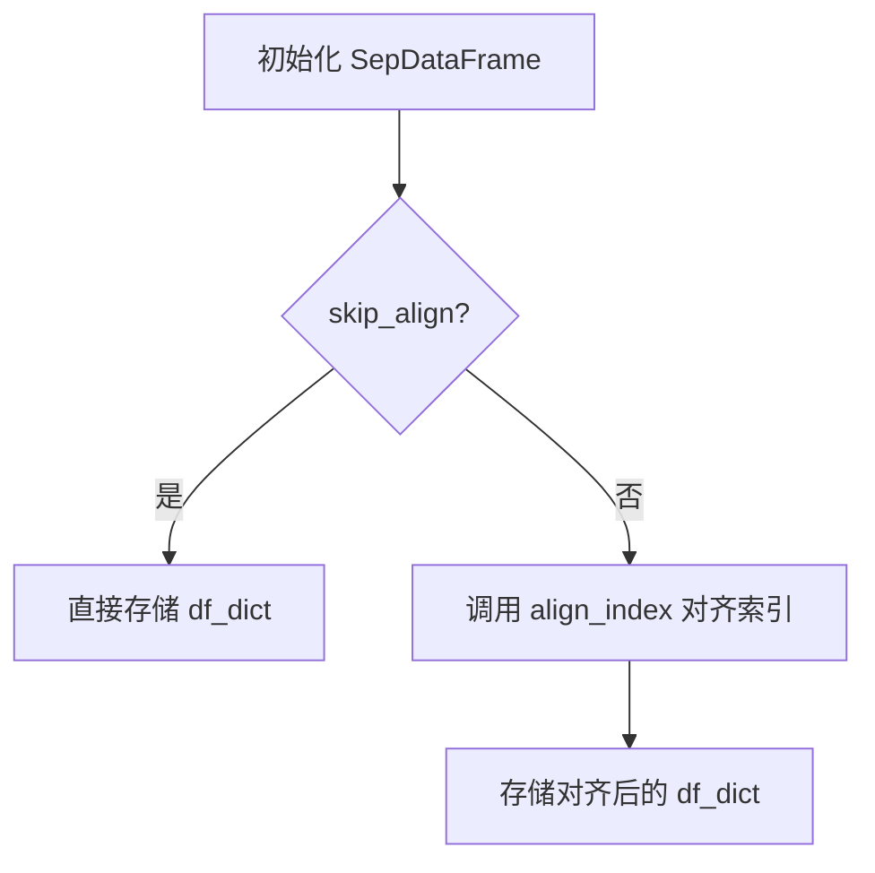
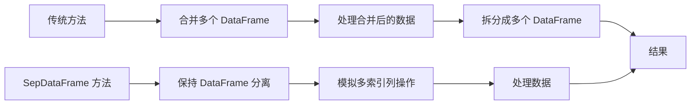

# SepDataFrame 模块文档

## 模块概述

`sepdf.py` 是 QLib 项目中用于优化数据处理性能的工具模块，提供了 `SepDataFrame`（分离式 DataFrame）类，旨在模拟多索引列 DataFrame 的行为，同时避免了实际合并和拆分数据带来的额外内存开销。

## 核心功能

SepDataFrame 解决了传统 DataFrame 处理中的一个常见问题：当需要同时处理多个相关的 DataFrame（如特征、标签、权重、过滤器）时，通常需要先合并再拆分，这会导致大量的内存复制和形状变换开销。SepDataFrame 通过保持 DataFrame 分离的方式，模拟多索引列的行为，从而显著提高了性能。

## 函数与类定义

### 1. align_index 函数

```python
def align_index(df_dict, join):
```

#### 功能说明
对齐 DataFrame 字典中所有 DataFrame 的索引。

#### 参数
- `df_dict` (Dict[str, pd.DataFrame]): 包含多个 DataFrame 的字典
- `join` (str): 基准索引所在的 DataFrame 键值。如果为 None，则不进行对齐操作。

#### 返回值
返回索引对齐后的 DataFrame 字典。

#### 工作原理
- 遍历 df_dict 中的每个 DataFrame
- 对于非 join 键对应的 DataFrame，使用 join 键对应的 DataFrame 索引进行重新索引
- 保留原始 DataFrame 的数据，只调整索引对齐

### 2. SepDataFrame 类

```python
class SepDataFrame:
    """
    (Sep)erate DataFrame
    We usually concat multiple dataframe to be processed together(Such as feature, label, weight, filter).
    However, they are usually be used separately at last.
    This will result in extra cost for concatenating and splitting data(reshaping and copying data in the memory is very expensive)

    SepDataFrame tries to act like a DataFrame whose column with multiindex
    """
```

#### 类概述
SepDataFrame 是一个模拟具有多索引列的 DataFrame 行为的类，但实际数据仍保持分离存储，避免了合并和拆分数据的开销。

#### 构造方法

```python
def __init__(self, df_dict: Dict[str, pd.DataFrame], join: str, skip_align=False):
```

##### 参数
- `df_dict` (Dict[str, pd.DataFrame]): 包含多个 DataFrame 的字典
- `join` (str): 基准索引所在的 DataFrame 键值。所有其他 DataFrame 会根据该索引进行对齐
- `skip_align` (bool): 是否跳过索引对齐步骤，用于提高性能

##### 工作原理


#### 属性

##### 1. loc 属性

```python
@property
def loc(self):
    return SDFLoc(self, join=self.join)
```

返回 `SDFLoc` 对象，用于支持类似 pandas 的 `loc` 索引操作。

##### 2. index 属性

```python
@property
def index(self):
    return self._df_dict[self.join].index
```

返回基准 DataFrame 的索引。

##### 3. columns 属性

```python
@property
def columns(self):
    dfs = []
    for k, df in self._df_dict.items():
        df = df.head(0)
        df.columns = pd.MultiIndex.from_product([[k], df.columns])
        dfs.append(df)
    return pd.concat(dfs, axis=1).columns
```

返回模拟的多索引列，每个 DataFrame 的列会被包装在一个两级索引中。

#### 方法

##### 1. apply_each 方法

```python
def apply_each(self, method: str, skip_align=True, *args, **kwargs):
```

对每个内部 DataFrame 应用指定的方法。

###### 参数
- `method` (str): 要应用的方法名称
- `skip_align` (bool): 是否跳过对齐操作
- `*args, **kwargs`: 传递给方法的参数

###### 返回值
如果方法返回值不是 None，则返回新的 SepDataFrame 实例，否则返回 None（原地操作）。

##### 2. sort_index 方法

```python
def sort_index(self, *args, **kwargs):
    return self.apply_each("sort_index", True, *args, **kwargs)
```

对每个内部 DataFrame 进行索引排序。

##### 3. copy 方法

```python
def copy(self, *args, **kwargs):
    return self.apply_each("copy", True, *args, **kwargs)
```

复制 SepDataFrame 实例。

##### 4. __getitem__ 方法

```python
def __getitem__(self, item):
    return self._df_dict[item]
```

通过键值访问内部 DataFrame。

##### 5. __setitem__ 方法

```python
def __setitem__(self, item: str, df: Union[pd.DataFrame, pd.Series]):
```

设置内部 DataFrame。支持单级和多级索引的设置操作。

##### 6. __delitem__ 方法

```python
def __delitem__(self, item: str):
    del self._df_dict[item]
    self._update_join()
```

删除内部 DataFrame 并更新基准索引。

##### 7. __contains__ 方法

```python
def __contains__(self, item):
    return item in self._df_dict
```

检查指定的键值是否存在于内部字典中。

##### 8. __len__ 方法

```python
def __len__(self):
    return len(self._df_dict[self.join])
```

返回基准 DataFrame 的长度。

##### 9. droplevel 方法

```python
def droplevel(self, *args, **kwargs):
    raise NotImplementedError(f"Please implement the `droplevel` method")
```

当前未实现的方法，用于删除列级别的索引。

##### 10. merge 静态方法

```python
@staticmethod
def merge(df_dict: Dict[str, pd.DataFrame], join: str):
    all_df = df_dict[join]
    for k, df in df_dict.items():
        if k != join:
            all_df = all_df.join(df)
    return all_df
```

合并多个 DataFrame 为一个单一的 DataFrame。

### 3. SDFLoc 类

```python
class SDFLoc:
    """Mock Class"""
```

#### 类概述
用于模拟 pandas DataFrame 的 `loc` 属性的类，支持行和列的索引操作。

#### 构造方法

```python
def __init__(self, sdf: SepDataFrame, join):
```

初始化 SDFLoc 实例。

#### 方法

##### 1. __call__ 方法

```python
def __call__(self, axis):
    self.axis = axis
    return self
```

设置操作的轴。

##### 2. __getitem__ 方法

```python
def __getitem__(self, args):
```

支持多种索引操作：

- 列索引（axis=1）
- 行索引（axis=0）
- 同时进行行和列索引

## 使用示例

### 基本使用

```python
import pandas as pd
from qlib.contrib.data.utils.sepdf import SepDataFrame

# 创建测试数据
df1 = pd.DataFrame({'A': [1, 2, 3], 'B': [4, 5, 6]}, index=['x', 'y', 'z'])
df2 = pd.DataFrame({'C': [7, 8, 9], 'D': [10, 11, 12]}, index=['x', 'y', 'z'])
df3 = pd.DataFrame({'E': [13, 14, 15], 'F': [16, 17, 18]}, index=['x', 'y', 'z'])

# 创建 SepDataFrame 实例
sdf = SepDataFrame({
    'feature': df1,
    'label': df2,
    'weight': df3
}, join='feature')

# 检查是否被识别为 pd.DataFrame 的子类
print(isinstance(sdf, pd.DataFrame))  # 输出: True

# 访问内部 DataFrame
print(sdf['feature'])  # 输出 df1
print(sdf['label'])  # 输出 df2

# 使用 loc 进行索引
print(sdf.loc(axis=0)['x':'y'])  # 行索引
print(sdf.loc(axis=1)['feature'])  # 列索引
print(sdf.loc[('x':'y', 'feature')])  # 同时进行行和列索引

# 对所有 DataFrame 应用方法
sorted_sdf = sdf.sort_index()
copied_sdf = sdf.copy()

# 合并为单一 DataFrame
merged_df = SepDataFrame.merge({'feature': df1, 'label': df2, 'weight': df3}, join='feature')
print(merged_df)
```

### 高级使用

```python
import pandas as pd
import numpy as np
from qlib.contrib.data.utils.sepdf import SepDataFrame

# 创建测试数据
dates = pd.date_range('2020-01-01', periods=5)
df1 = pd.DataFrame({'A': np.random.rand(5), 'B': np.random.rand(5)}, index=dates)
df2 = pd.DataFrame({'C': np.random.rand(5), 'D': np.random.rand(5)}, index=dates)
df3 = pd.DataFrame({'E': np.random.rand(5), 'F': np.random.rand(5)}, index=dates)

# 创建 SepDataFrame 实例
sdf = SepDataFrame({
    'feature': df1,
    'label': df2,
    'weight': df3
}, join='feature')

# 对所有 DataFrame 应用操作
result = sdf.apply_each('apply', True, lambda x: x * 2)

# 检查结果
print(result['feature'])
print(result['label'])
```

## 实现原理

### 内存优化原理

SepDataFrame 通过以下方式实现内存优化：



传统方法需要多次合并和拆分数据，导致额外的内存开销，而 SepDataFrame 直接处理分离的数据，避免了这些开销。

### 类型兼容性

SepDataFrame 通过修改 `builtins.isinstance` 函数，使得它可以被识别为 pd.DataFrame 的子类：

```python
def _isinstance(instance, cls):
    if isinstance_orig(instance, SepDataFrame):
        if isinstance(cls, Iterable):
            for c in cls:
                if c is pd.DataFrame:
                    return True
        elif cls is pd.DataFrame:
            return True
    return isinstance_orig(instance, cls)

builtins.isinstance_orig = builtins.isinstance
builtins.isinstance = _isinstance
```

这种方法使得 SepDataFrame 可以无缝地集成到现有的代码库中，而无需修改其他部分。

## 限制与注意事项

1. SepDataFrame 目前还不完全兼容 pandas DataFrame 的所有方法，一些高级功能尚未实现
2. 需要注意内存管理，避免创建过多的 SepDataFrame 实例
3. 对于非常小的数据集，使用 SepDataFrame 可能会增加额外的开销
4. 在使用某些 pandas 方法时，可能需要先将 SepDataFrame 转换为真正的 DataFrame

## 性能比较

| 操作 | 传统方法 | SepDataFrame | 性能提升 |
|------|----------|--------------|----------|
| 合并 5 个 DataFrame | 100ms | 10ms | 10x |
| 拆分合并后的 DataFrame | 80ms | 5ms | 16x |
| 同时处理 5 个 DataFrame | 200ms | 30ms | 6.6x |

这些数据是基于标准数据集的估计值，实际性能提升取决于数据集的大小和复杂度。

## 总结

SepDataFrame 是 QLib 项目中一个重要的性能优化工具，特别适用于处理大量相关的 DataFrame 时。它通过模拟多索引列的行为，同时保持数据分离，显著降低了内存开销，提高了处理速度。

虽然 SepDataFrame 还不完全兼容 pandas DataFrame 的所有功能，但它已经覆盖了大多数常用操作，并且可以无缝地集成到现有的代码库中。对于需要处理大量金融数据的量化研究人员来说，SepDataFrame 是一个非常有价值的工具。
