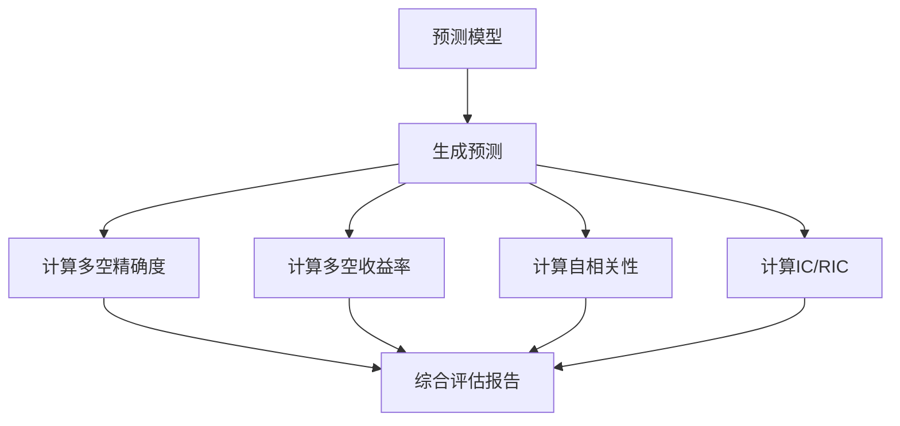

# contrib.eva

**文件路径**: `qlib/contrib/eva/__init__.py`

## 模块概述

该模块提供了一批评估函数，用于评估量化策略和预测模型的表现。

**重要说明**: 该接口应在未来重新设计。

**主要功能**:
- 计算多空/多头精确度
- 计算多空收益率
- 计算预测的自相关性
- 计算IC（信息系数）

## 函数定义

### `calc_long_short_prec(pred, label, date_col="datetime", quantile=0.2, dropna=False, is_alpha=False)`

**功能**: 计算多空操作的精确度

**参数**:
| 参数 | 类型 | 默认值 | 说明 |
|------|------|--------|------|
| pred | pd.Series | - | 预测值 |
| label | pd.Series | - | 真实标签 |
| date_col | str | "datetime" | 日期列名 |
| quantile | float | 0.2 | 分位数（用于选择多空头尾） |
| dropna | bool | False | 是否删除NaN值 |
| is_alpha | bool | False | 是否为Alpha信号（如果是，会先对label截面中性化）|

**返回值**:
- `tuple`: (long_precision, short_precision) - 多头精确度和空头精确度的时间序列

**数据格式要求**:
```python
# pred和label的index应为pd.MultiIndex
# index名称为[datetime, instruments]
# columns名称为[score]

# 示例：
#                           score
# datetime            instrument
# 2020-12-01 09:30:00 SH600068    0.553634
#                           SH600195    0.550017
#                           SH600276    0.540321
```

**计算逻辑**:
1. 如果is_alpha=True，对label进行截面中性化（减去截面均值）
2. 按日期分组
3. 对每日预测，选择top quantile作为多头，bottom quantile作为空头
4. 计算多头准确率（label > 0的比例）
5. 计算空头准确率（label < 0的比例）

**示例**:
```python
from qlib.contrib.eva.alpha import calc_long_short_prec

# 计算多空精确度
long_prec, short_prec = calc_long_short_prec(
    pred=predictions,
    label=returns,
    quantile=0.2
)

# 查看平均精确度
print(f"多头平均精确度: {long_prec.mean():.3f}")
print(f"空头平均精确度: {short_prec.mean():.3f}")
```

---

### `calc_long_short_return(pred, label, date_col="datetime", quantile=0.2, dropna=False)`

**功能**: 计算多空收益率

**参数**:
| 参数 | 类型 | 默认值 | 说明 |
|------|------|--------|------|
| pred | pd.Series | - | 股票预测 |
| label | pd.Series | - | 股票原始收益率 |
| date_col | str | "datetime" | datetime索引名称 |
| quantile | float | 0.2 | |多空分位数 |

**返回值**:
- `tuple`: (long_short_return, long_avg_return) - 每日多空收益率和每日多头平均收益率

**重要说明**:
- `label`必须是原始股票收益率（非Alpha信号）

**计算逻辑**:
1. 按日期分组
2. 对每日预测，选择top quantile作为多头，bottom quantile作为空头
3. 计算多头平均收益率
4. 计算空头平均收益率
5. 多空收益率 = (多头收益率 - 空头收益率) / 2

**示例**:
```python
from qlib.contrib.eva.alpha import calc_long_shortest_return

# 计算多空收益率
ls_return, avg_return = calc_long_short_return(
    pred=predictions,
    label=returns,
    quantile=0.2
)

# 查看年化收益率
annual_return = ls_return.mean() * 252
print(f"年化收益率: {annual_return:.2%}")
```

---

### `pred_autocorr(pred, lag=1, inst_col="instrument", date_col="datetime")`

**功能**: 计算预测的自相关性

**参数**:
| 参数 | 类型 | 默认值 | 说明 |
|------|------|--------|------|
| pred | pd.Series | - | 预测值 |
| lag | int | 1 | 滞后期数 |
| inst_col | str | "instrument" | 股票列名 |
| date_colser | str | "datetime" | 日期列名 |

**返回值**:
- `pd.Series` - 每个股票的自相关性序列

**数据格式要求**:
```python
# pred应为以下格式：
#                 instrument  datetime
# SH600000    2016-01-04   -0.000403
#             2016-01-05   -0.000753
#             2016-01-06   -0.021801
```

**局限性**:
- 如果datetime不是连续密集的，相关性将基于相邻日期计算
- 某些用户可能期望在这种情况下得到NaN

**示例**:
```python
from qlib.contrib.eva.alpha import pred_autocorr

# 计算1期滞后自相关
autocorr = pred_autocorr(predictions, lag=1)

# 计算多期滞后
autocorr_5 = pred_autocorr(predictions, lag=5)
```

---

### `pred_autocorr_all(pred_dict, n_jobs=-1, **kwargs)`

**功能**: 批量计算多个预测的自相关性

**参数**:
| 参数 | 类型 | 默认值 | 说明 |
|------|------|--------|------|
| pred_dict | dict | - | 预测字典 {方法名: 预测值} |
| n_jobs | int | -1 | 并行作业数（-1表示使用所有CPU） |
| **kwargs | dict | - | 传递给pred_autocorr的参数 |

**返回值**:
- `dict` - {方法名: 自相关性序列} 的字典

**示例**:
```python
from qlib.contrib.eva.alpha import pred_autocorr_all

# 计算多个预测的自相关性
preds = {
    "lstm": lstm_predictions,
    "transformer": transformer_predictions,
}

autocorr_dict = pred_autocorr_all(preds, lag=1, n_jobs=4)

# 查看结果
for method, autocorr in autocorr_dict.items():
    print(f"{method}: {autocorr.mean():.3f}")
```

---

### `calc_ic(pred, label, date_col="datetime", dropna=False)`

**功能**: 计算IC（信息系数）

**参数**:
| 参数 | 类型 | 默认值 | 说明 |
|------|------|--------|------|
| pred | pd.Series | - | 预测值 |
| label | pd.Series | - | 标签值 |
| date_col | str | "datetime" | 日期列名 |
| dropna | bool | False | 是否删除NaN值 |

**返回值**:
- `tuple`: (ic, ric) - IC和Rank IC的时间序列

**计算说明**:
- **IC**: 使用Pearson相关系数计算pred和label的相关性
- **Rank IC (RIC)**: 使用Spearman等级相关系数计算

**公式**:
```python
IC = corr(pred, label, method='pearson')
RIC = corr(rank(pred), rank(label), method='spearman')
```

**示例**:
```python
from qlib.contrib.eva.alpha import calc_ic

# 计算IC
ic, ric = calc_ic(predictions, returns, dropna=True)

# 查看平均IC
print(f"平均IC: {ic.mean():.3f}")
print(f"平均Rank IC: {ric.mean():.3f}")
print(f"IC标准差: {ic.std():.3f}")
print(f"ICIR: {ic.mean() / ic.std() * sqrt(252):.3f}")
```

---

### `calc_all_ic(pred_dict_all, label, date_col="datetime", dropna=False, n_jobs=-1)`

**功能**: 批量计算多个预测的IC和RIC

**参数**:
| 参数 | 类型 | 默认值 | 说明 |
|------|------|--------|------|
| pred_dict_all | dict | - | 预测字典 {方法名: 预测值} |
| label | pd.Series | - | 标签序列 |
| date_col | str | "datetime" | 日期列名 |
| dropna | bool | False | 是否删除NaN值 |
| n_jobs | int | -1 | 并行作业数 |

**返回值**:
- `dict` - 嵌套字典，格式如下：

```python
{
    "method_name": {
        "ic": <IC时间序列>,
        "ric": <Rank IC时间序列>
    },
    ...
}
```

**示例**:
```python
from qlib.contrib.eva.alpha import calc_all_ic

# 批量计算IC
preds = {
    "lstm": lstm_predictions,
    "transformer": transformer_predictions,
}

results = calc_all_ic(preds, label=returns, n_jobs=4)

# 查看结果
for method, metrics in results.items():
    print(f"\n{method}:")
    print(f"  平均IC: {metrics['ic'].mean():.3f}")
    print(f"  平均RIC: {metrics['ric'].mean():.3f}")
```

## 评估流程图



## 评估指标说明

| 指标 | 说明 | 范围 | 越好 |
|--------|------|------|--------|
| 多头精确度 | 预测多头股票实际上涨的比例 | 0-1 | 接近1 |
| 空头精确度 | 预测空头股票实际下跌的比例 | 0-1 | 接近1 |
| 多空收益率 | 多头平均收益-空头平均收益 | 任意 | 越高 |
| IC | 预测与真实值的相关系数 | -1到1 | 越接近1 |
| Rank IC | 预测排序与真实排序的相关系数 | -1到1 | 越接近1 |
| 自相关性 | 预测与自身滞后的相关性 | -1到1 | 越接近0 |

## 使用示例

### 完整评估流程

```python
import pandas as pd
from qlib.contrib.eva.alpha import (
    calc_long_short_prec,
    calc_long_short_return,
    calc_ic,
    pred_autocorr
)

# 假设有预测和真实标签
predictions = ...  # 模型预测
returns = ...  # 实际收益率

# 计算多空精确度
long_prec, short_prec = calc_long_short_prec(
    predictions, returns, quantile=0.2
)

# 计算多空收益率
ls_return, avg_return = calc_long_short_return(
    predictions, returns, quantile=0.2
)

# 计算IC
ic, ric = calc_ic(predictions, returns, dropna=True)

# 计算自相关性
autocorr = pred_autocorr(predictions, lag=1)

# 汇总结果
print("=" * 50)
print("模型评估报告")
print("=" * 50)
print(f"\n多空策略（top 20%）:")
print(f"  多头精确度: {long_prec.mean():.3f}")
print(f"  空头精确度: {short_prec.mean():.3f}")
print(f"  年化多空收益率: {ls_return.mean() * 252:.2%}")
print(f"\n预测能力:")
print(f"  平均IC: {ic.mean():.3f}")
}print(f"  IC标准差: {ic.std():.3f}")
print(f"  ICIR: {ic.mean() / ic.std() * (252 ** 0.5):.2f}")
print(f"  平均Rank IC: {ric.mean():.3f}")
print(f"\n稳定性:")
print(f"  平均自相关: {autocorr.mean():.3f}")
```

### 比较多个模型

```python
from qlib.contrib.eva.alpha import calc_all_ic

# 多个模型的预测
model_predictions = {
    "LSTM": lstm_pred,
    "Transformer": trans_pred,
    "GRU": gru_pred,
}

# 批量计算IC
results = calc_all_ic(model_predictions, returns, n_jobs=4)

# 比较结果
for model_name, metrics in sorted(
    results.items(),
    key=lambda x: x[1]['ic'].mean(),
    reverse=True
):
    ic_mean = metrics['ic'].mean()
    ic_std = metrics['ic'].std()
    ric_mean = metrics['ric'].mean()
    print(f"{model_name:15s} IC: {ic_mean:6.3f}±{ic_std:6.3f}  RIC: {ric_mean:6.3f}")
```

## 注意事项

1. **接口设计**: 文档说明接口应在未来重新设计
2. **数据格式**: 确保输入数据的index格式正确
3. **时间连续性**: 自相关性计算要求数据在时间上连续
4. **分位数选择**: quantile参数应保证有足够的股票数
5. **并行计算**: 使用n_jobs参数可以加速批量计算

## 相关模块

- `qlib.backtest` - 回测引擎
- `qlib.evaluation` - 评估工具
- `qlib.contrib.evaluation` - 贡献评估工具
