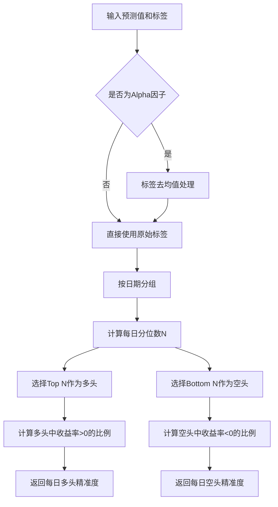

# QLib 贡献模块评估函数 - alpha.py

## 模块概述

`alpha.py` 是 QLib 量化投资平台贡献模块中的核心评估函数库，提供了一系列用于量化策略评估的关键指标计算函数。这些函数主要用于评估预测模型在股票市场中的表现，包括精准度、收益率、自相关系数和信息系数等。

## 函数列表

| 函数名 | 功能描述 |
|--------|----------|
| [calc_long_short_prec](#calc_long_short_prec) | 计算多空操作的精准度 |
| [calc_long_short_return](#calc_long_short_return) | 计算多空组合收益率 |
| [pred_autocorr](#pred_autocorr) | 计算预测值的自相关系数 |
| [pred_autocorr_all](#pred_autocorr_all) | 批量计算多个预测结果的自相关系数 |
| [calc_ic](#calc_ic) | 计算信息系数（IC）和秩信息系数（RIC） |
| [calc_all_ic](#calc_all_ic) | 批量计算多个预测结果的信息系数 |

---

## 函数详解

### calc_long_short_prec

**功能**：计算多空操作的精准度（Precision）

```python
def calc_long_short_prec(
    pred: pd.Series, label: pd.Series, date_col="datetime", quantile: float = 0.2, dropna=False, is_alpha=False
) -> Tuple[pd.Series, pd.Series]:
```

#### 参数说明

| 参数名 | 类型 | 描述 |
|--------|------|------|
| pred | pd.Series | 股票预测值，索引为 pd.MultiIndex，包含 [datetime, instruments] 两个级别 |
| label | pd.Series | 股票实际收益率或标签值 |
| date_col | str | 日期索引列名，默认为 "datetime" |
| quantile | float | 分位数，用于确定多头和空头组合的比例，默认为 0.2（即20%） |
| dropna | bool | 是否删除缺失值，默认为 False |
| is_alpha | bool | 是否对标签进行去均值处理（用于alpha因子计算），默认为 False |

#### 返回值

Tuple[pd.Series, pd.Series]：
- 第一个 pd.Series：每日多头操作的精准度
- 第二个 pd.Series：每日空头操作的精准度

#### 计算原理



#### 使用示例

```python
import pandas as pd
from qlib.contrib.eva.alpha import calc_long_short_prec

# 创建示例数据
data = {
    'score': [0.5536, 0.5500, 0.5403, 0.5173, 0.5447],
    'return': [0.02, -0.01, 0.03, -0.02, 0.01]
}

index = pd.MultiIndex.from_tuples(
    [('2020-12-01', 'SH600068'), ('2020-12-01', 'SH600195'),
     ('2020-12-01', 'SH600276'), ('2020-12-01', 'SH600584'),
     ('2020-12-01', 'SH600715')],
    names=['datetime', 'instrument']
)

pred = pd.Series(data['score'], index=index)
label = pd.Series(data['return'], index=index)

# 计算多空精准度
long_prec, short_prec = calc_long_short_prec(pred, label, quantile=0.2)
print("多头精准度:", long_prec)
print("空头精准度:", short_prec)
```

---

### calc_long_short_return

**功能**：计算多空组合收益率

```python
def calc_long_short_return(
    pred: pd.Series,
    label: pd.Series,
    date_col: str = "datetime",
    quantile: float = 0.2,
    dropna: bool = False,
) -> Tuple[pd.Series, pd.Series]:
```

#### 参数说明

| 参数名 | 类型 | 描述 |
|--------|------|------|
| pred | pd.Series | 股票预测值，索引为 pd.MultiIndex，包含 [datetime, instruments] 两个级别 |
| label | pd.Series | 股票实际收益率（必须是原始收益率） |
| date_col | str | 日期索引列名，默认为 "datetime" |
| quantile | float | 分位数，用于确定多头和空头组合的比例，默认为 0.2（即20%） |
| dropna | bool | 是否删除缺失值，默认为 False |

#### 返回值

Tuple[pd.Series, pd.Series]：
- 第一个 pd.Series：每日多空组合收益率（(多头平均收益率 - 空头平均收益率)/2）
- 第二个 pd.Series：每日市场平均收益率

#### 使用示例

```python
import pandas as pd
from qlib.contrib.eva.alpha import calc_long_short_return

# 使用与calc_long_short_prec相同的示例数据
pred = pd.Series(data['score'], index=index)
label = pd.Series(data['return'], index=index)

# 计算多空收益率
long_short_r, long_avg_r = calc_long_short_return(pred, label, quantile=0.2)
print("多空组合收益率:", long_short_r)
print("市场平均收益率:", long_avg_r)
```

---

### pred_autocorr

**功能**：计算预测值的自相关系数

```python
def pred_autocorr(pred: pd.Series, lag=1, inst_col="instrument", date_col="datetime"):
```

#### 参数说明

| 参数名 | 类型 | 描述 |
|--------|------|------|
| pred | pd.Series | 股票预测值，索引为 pd.MultiIndex，包含 [instrument, datetime] 两个级别 |
| lag | int | 滞后阶数，默认为1 |
| inst_col | str | 股票代码索引列名，默认为 "instrument" |
| date_col | str | 日期索引列名，默认为 "datetime" |

#### 返回值

pd.Series：每日预测值的自相关系数

#### 注意事项

- 如果日期不是连续密集的，相关系数将基于相邻日期计算（某些用户可能期望NaN）

#### 使用示例

```python
import pandas as pd
from qlib.contrib.eva.alpha import pred_autocorr

# 创建示例数据
data = {
    'prediction': [-0.0004, -0.0008, -0.0218, -0.0652, -0.0625]
}

index = pd.MultiIndex.from_tuples(
    [('SH600000', '2016-01-04'), ('SH600000', '2016-01-05'),
     ('SH600000', '2016-01-06'), ('SH600000', '2016-01-07'),
     ('SH600000', '2016-01-08')],
    names=['instrument', 'datetime']
)

pred = pd.Series(data['prediction'], index=index)

# 计算预测值自相关系数
autocorr = pred_autocorr(pred, lag=1)
print("预测值自相关系数:", autocorr)
```

---

### pred_autocorr_all

**功能**：批量计算多个预测结果的自相关系数

```python
def pred_autocorr_all(pred_dict, n_jobs=-1, **kwargs):
```

#### 参数说明

| 参数名 | 类型 | 描述 |
|--------|------|------|
| pred_dict | dict | 预测结果字典，格式为 {<方法名>: <预测值Series>} |
| n_jobs | int | 并行计算的作业数，默认为-1（使用所有CPU核心） |
| **kwargs | | 传递给 pred_autocorr 函数的参数 |

#### 返回值

dict：每个预测方法的自相关系数结果

#### 使用示例

```python
import pandas as pd
from qlib.contrib.eva.alpha import pred_autocorr_all

# 创建多个预测结果
pred_dict = {
    'model1': pd.Series([-0.0004, -0.0008, -0.0218, -0.0652, -0.0625], index=index),
    'model2': pd.Series([0.0012, -0.0005, -0.0189, -0.0701, -0.0589], index=index)
}

# 批量计算自相关系数
autocorr_results = pred_autocorr_all(pred_dict, n_jobs=2, lag=1)
for model, result in autocorr_results.items():
    print(f"{model} 自相关系数:")
    print(result)
```

---

### calc_ic

**功能**：计算信息系数（IC）和秩信息系数（RIC）

```python
def calc_ic(pred: pd.Series, label: pd.Series, date_col="datetime", dropna=False) -> (pd.Series, pd.Series):
```

#### 参数说明

| 参数名 | 类型 | 描述 |
|--------|------|------|
| pred | pd.Series | 股票预测值，索引为 pd.MultiIndex，包含 [datetime, instruments] 两个级别 |
| label | pd.Series | 股票实际收益率或标签值 |
| date_col | str | 日期索引列名，默认为 "datetime" |
| dropna | bool | 是否删除缺失值，默认为 False |

#### 返回值

Tuple[pd.Series, pd.Series]：
- 第一个 pd.Series：每日信息系数（IC），使用皮尔逊相关系数计算
- 第二个 pd.Series：每日秩信息系数（RIC），使用斯皮尔曼等级相关系数计算

#### 使用示例

```python
import pandas as pd
from qlib.contrib.eva.alpha import calc_ic

# 使用与calc_long_short_prec相同的示例数据
pred = pd.Series(data['score'], index=index)
label = pd.Series(data['return'], index=index)

# 计算IC和RIC
ic, ric = calc_ic(pred, label)
print("信息系数(IC):", ic)
print("秩信息系数(RIC):", ric)
```

---

### calc_all_ic

**功能**：批量计算多个预测结果的信息系数

```python
def calc_all_ic(pred_dict_all, label, date_col="datetime", dropna=False, n_jobs=-1):
```

#### 参数说明

| 参数名 | 类型 | 描述 |
|--------|------|------|
| pred_dict_all | dict | 预测结果字典，格式为 {<方法名>: <预测值Series>} |
| label | pd.Series | 股票实际收益率或标签值（统一使用） |
| date_col | str | 日期索引列名，默认为 "datetime" |
| dropna | bool | 是否删除缺失值，默认为 False |
| n_jobs | int | 并行计算的作业数，默认为-1（使用所有CPU核心） |

#### 返回值

dict：每个预测方法的IC和RIC结果，格式为：

```python
{
    'method1': {
        'ic': pd.Series(...),
        'ric': pd.Series(...)
    },
    'method2': {
        'ic': pd.Series(...),
        'ric': pd.Series(...)
    }
}
```

#### 使用示例

```python
import pandas as pd
from qlib.contrib.eva.alpha import calc_all_ic

# 创建多个预测结果和统一标签
pred_dict = {
    'model1': pd.Series([0.5536, 0.5500, 0.5403, 0.5173, 0.5447], index=index),
    'model2': pd.Series([0.5489, 0.5512, 0.5398, 0.5211, 0.5423], index=index)
}

label = pd.Series([0.02, -0.01, 0.03, -0.02, 0.01], index=index)

# 批量计算信息系数
all_ic_results = calc_all_ic(pred_dict, label, n_jobs=2)
for model, results in all_ic_results.items():
    print(f"{model} 信息系数:")
    print("IC:", results['ic'])
    print("RIC:", results['ric'])
```

---

## 模块设计特点

### 1. 统一的数据格式

所有函数都接受统一格式的输入数据：
- 使用 `pd.MultiIndex` 索引，包含 `datetime` 和 `instrument` 两个级别
- 预测值和标签都采用 `pd.Series` 类型

### 2. 高效的分组计算

大量使用 Pandas 的 `groupby` 操作进行每日级别计算，确保：
- 计算效率
- 结果的一致性
- 便于后续分析

### 3. 并行计算支持

通过 `joblib.Parallel` 实现并行计算，提高处理大量数据时的效率：
- `pred_autocorr_all` 和 `calc_all_ic` 支持并行计算
- `n_jobs` 参数控制并行作业数

### 4. 灵活的参数配置

所有函数都提供了灵活的参数配置：
- 分位数设置（`quantile`）
- 日期和股票代码列名（`date_col`, `inst_col`）
- 缺失值处理（`dropna`）
- 并行计算配置（`n_jobs`）

---

## 使用场景

该模块主要适用于以下量化投资场景：

### 1. 策略回测评估

在策略回测过程中，使用这些评估函数可以：
- 评估预测模型的准确性
- 计算策略收益率
- 分析预测值的自相关性
- 计算信息系数等关键指标

### 2. 模型选择与比较

通过批量计算多个模型的评估指标：
- 比较不同模型的预测性能
- 选择最优模型
- 分析模型的稳定性

### 3. 策略优化

基于评估结果，可以：
- 调整策略参数（如分位数）
- 优化选股逻辑
- 改进风险控制

---

## 依赖关系

| 库名 | 用途 |
|------|------|
| pandas | 数据处理和分析 |
| numpy | 数值计算 |
| joblib | 并行计算 |
| qlib | 量化投资平台核心库 |

---

## 代码优化建议

### 潜在问题

1. **数据验证**：在处理大量数据时，缺少对输入数据格式的严格验证
2. **错误处理**：对于异常情况（如缺少数据、无效参数）的处理可以进一步优化
3. **性能优化**：在处理极端大量数据时，某些操作可以进一步优化

### 优化方案

```python
# 示例：增强数据验证
def validate_input(pred: pd.Series, label: pd.Series):
    # 验证索引类型
    if not isinstance(pred.index, pd.MultiIndex):
        raise ValueError("预测值索引必须是 pd.MultiIndex")
    if not isinstance(label.index, pd.MultiIndex):
        raise ValueError("标签索引必须是 pd.MultiIndex")

    # 验证索引级别
    if set(pred.index.names) != {'datetime', 'instrument'}:
        raise ValueError("预测值索引级别必须包含 'datetime' 和 'instrument'")
    if set(label.index.names) != {'datetime', 'instrument'}:
        raise ValueError("标签索引级别必须包含 'datetime' 和 'instrument'")

    # 验证索引匹配
    if not pred.index.equals(label.index):
        raise ValueError("预测值和标签的索引不匹配")

    return True
```

---

## 总结

`alpha.py` 提供了一整套量化策略评估工具，涵盖了从精准度和收益率计算到自相关分析和信息系数计算的完整流程。这些工具设计精良，使用统一的数据格式，并支持高效的并行计算，是量化策略开发和评估的重要组成部分。
