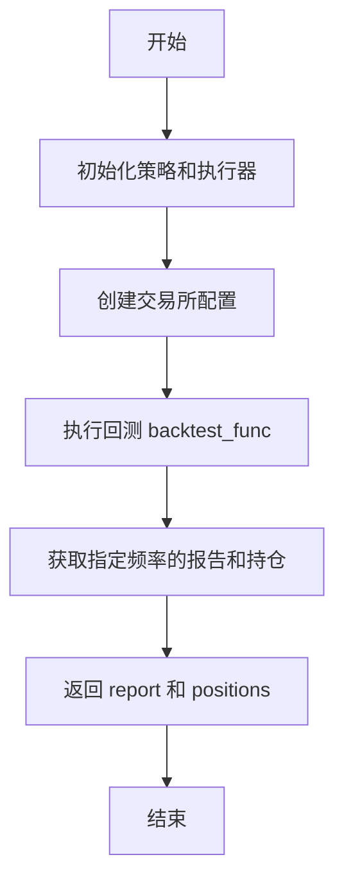
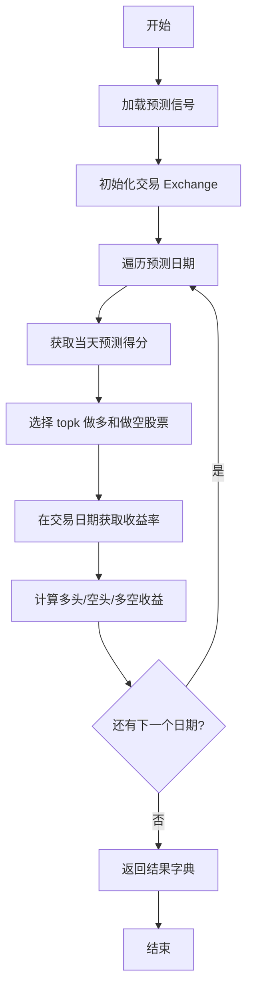

# evaluate.py 模块文档

## 模块概述

`qlib.contrib.evaluate` 模块提供了回测评估和风险分析的核心功能，包括风险指标计算、交易指标分析以及回测框架的便捷接口。该模块是 Qlib 量化投资平台中评估策略表现的重要组件。

## 主要功能

- **风险分析**：计算年化收益率、信息比率、最大回撤等风险指标
- **交易指标分析**：分析价格优势（PA）、正向率（POS）、成交率（FFR）等交易指标
- **回测接口**：提供便捷的日频回测接口 `backtest_daily`
- **多空回测**：提供简单的多空策略回测功能 `long_short_backtest`

---

## 函数详解

### 1. `risk_analysis(r, N=None, freq='day', mode='sum')`

**功能说明**

计算收益率序列的风险指标，包括均值、标准差、年化收益率、信息比率和最大回撤。

**注意**
年化收益率的计算与传统定义有所不同，这是有意设计的。Qlib 使用累加而非累乘来避免累积曲线呈指数增长。所有年化收益率的计算都遵循这一原则。

**参数说明**

| 参数名 | 类型 | 必填 | 默认值 | 说明 |
|--------|------|------|--------|------|
| `r` | pandas.Series | 是 | - | 每日收益率序列 |
| `N` | int | 否 | None | 年化缩放因子（日频:252，周频:50，月频:12），`N` 和 `freq` 至少需要提供一个 |
| `freq` | str | 否 | 'day' | 分析频率，用于计算缩放因子，`N` 和 `freq` 至少需要提供一个 |
| `mode` | Literal["sum", "product"] | 否 | 'sum' | 收益率累积方式：<br> - `"sum"`：算术累积（线性收益率）<br> - `"product"`：几何累积（复利收益率） |

**返回值说明**

返回一个 DataFrame，包含以下指标：

| 指标名 | 说明 |
|--------|------|
| `mean` | 平均收益率 |
| `std` | 收益率标准差 |
| `annualized_return` | 年化收益率 |
| `information_ratio` | 信息比率 |
| `max_drawdown` | 最大回撤 |

**使用示例**

```python
import pandas as pd
from qlib.contrib.evaluate import risk_analysis

# 创建示例收益率序列
returns = pd.Series([0.01, -0.02, 0.03, -0.01, 0.02], index=pd.date_range('2020-01-01', periods=5))

# 使用累加模式计算（默认）
result_sum = risk_analysis(returns, freq='day', mode='sum')
print(result_sum)

# 使用复利模式计算
result_product = risk_analysis(returns, freq='day', mode='product')
print(result_product)

# 直接指定缩放因子
result_custom = risk_analysis(returns, N=252)
```

**计算公式**

当 `mode='sum'` 时：
- 均值：$\text{mean} = \frac{1}{n}\sum_{i=1}^{n} r_i$
- 标准差：$\text{std} = \sqrt{\frac{1}{n-1}\sum_{i=1}^{n}(r_i - \text{mean})^2}$
- 年化收益率：$\text{annualized_return} = \text{mean} \times N$
- 最大回撤：$\max(\text{cumsum}(r) - \text{cummax}(\text{cumsum}(r)))$

当 `mode='product'` 时：
- 累积曲线：$\text{cum_curve} = \prod_{i=1}^{t}(1 + r_i)$
- 均值（几何平均）：$\text{mean} = \text{cum_curve}_{-1}^{1/n} - 1$
- 标准差（对数收益率）：$\text{std} = \sqrt{\frac{1}{n-1}\sum_{i=1}^{n}(\ln(1+r_i) - \text{mean})^2}$
- 年化收益率：$\text{annualized_return} = (1 + \text{cumulative_return})^{N/n} - 1$
- 最大回撤：$\min\left(\frac{\text{cum_curve}}{\text{cummax}(\text{cum_curve})} - 1\right)$

---

### 2. `indicator_analysis(df, method='mean')`

**功能说明**

分析交易统计指标的时间序列数据，计算价格优势（PA）、正向率（POS）和成交率（FFR）等指标的统计值。

**参数说明**

| 参数名 | 类型 | 必填 | 默认值 | 说明 |
|--------|------|------|--------|------|
| `df` | pandas.DataFrame | 是 | - | 交易指标数据框，索引为日期时间<br>**必需字段**：<br> - `pa`：价格优势<br> - `pos`：正向率<br> - `ffr`：成交率<br>**可选字段**：<br> - `deal_amount`：总成交额（仅在 method='amount_weighted' 时需要）<br> - `value`：总交易价值（仅在 method='value_weighted' 时需要） |
| `method` | str | 否 | 'mean' | 统计方法：<br> - `'mean'`：计算各指标的平均统计值<br> - `'amount_weighted'`：计算成交额加权的平均统计值<br> - `'value_weighted'`：计算价值加权的平均统计值<br><br>**注意**：pos 指标的统计方法始终为 `"mean"` |

**返回值说明**

返回一个 DataFrame，包含各指标的统计值。

| 指标名 | 说明 |
|--------|------|
| `pa` | 价格优势的统计值 |
| `pos` | 正向率的平均值 |
| `ffr` | 成交率的统计值 |

**使用示例**

```python
import pandas as pd
from qlib.contrib.evaluate import indicator_analysis

# 创建示例交易指标数据
df = pd.DataFrame({
    'pa': [0.1, 0.2, 0.15, 0.18],
    'pos': [0.6, 0.7, 0.65, 0.68],
    'ffr': [0.9, 0.95, 0.92, 0.93],
    'deal_amount': [1000, 2000, 1500, 1800],
    'value': [5000, 10000, 7500, 9000],
    'count': [10, 20, 15, 18]
}, index=pd.date_range('2020-01-01', periods=4))

# 平均统计
result_mean = indicator_analysis(df, method='mean')
print(result_mean)

# 成交额加权统计
result_amount = indicator_analysis(df, method='amount_weighted')
print(result_amount)

# 价值加权统计
result_value = indicator_analysis(df, method='value_weighted')
print(result_value)
```

---

### 3. `backtest_daily(start_time, end_time, strategy, executor=None, account=1e8, benchmark='SH000300', exchange_kwargs=None, pos_type='Position')`

**功能说明**

初始化策略和执行器，然后执行日频回测。这是一个为了兼容旧代码提供的 API。

**参数说明**

| 参数名 | 类型 | 必填 | 默认值 | 说明 |
|--------|------|------|--------|------|
| `start_time` | Union[str, pd.Timestamp] | 是 | - | 回测的起始时间（闭区间）<br>**注意**：这将应用于最外层执行器的日历 |
| `end_time` | Union[str, pd.Timestamp] | 是 | - | 回测的结束时间（闭区间）<br>**注意**：这将应用于最外层执行器的日历。<br>例如：`Executor[day](Executor[1min])`，设置 `end_time == 20200301` 将包含 20200301 的所有分钟 |
| `strategy` | Union[str, dict, BaseStrategy] | 是 | - | 用于初始化最外层投资组合策略的配置。<br>支持的格式：<br> - **dict**：策略配置字典<br> - **BaseStrategy**：策略实例对象<br> - **str**：策略标识符，支持三种格式：<br>   1. pickle 文件路径：`'file:///<path>/obj.pkl'`<br>   2. 类名：`"ClassName"`，将使用 `getattr(module, "ClassName")()`<br>   3. 模块路径+类名：`"a.b.c.ClassName"`，将使用 `getattr(a.b.c.module, "ClassName")()` |
| `executor` | Union[str, dict, BaseExecutor] | 否 | None | 用于初始化最外层执行器的配置。如果为 None，将创建默认的 `SimulatorExecutor` |
| `account` | Union[float, int, Position] | 否 | 1e8 | 账户信息描述如何创建账户：<br> - **float 或 int**：使用仅包含初始现金的 Account<br> - **Position**：使用包含指定持仓的 Account |
| `benchmark` | str | 否 | 'SH000300' | 用于报告的基准指数代码 |
| `exchange_kwargs` | dict | 否 | None | 初始化 Exchange 的参数 |
| `pos_type` | str | 否 | 'Position' | Position 的类型 |

**exchange_kwargs 参数说明**

```python
exchange_kwargs = {
    "freq": "day",              # 交易频率
    "limit_threshold": None,    # 涨跌停限制，None 则使用 C.limit_threshold
    "deal_price": None,         # 成交价格，None 则使用 C.deal_price
    "open_cost": 0.0005,        # 开仓交易成本
    "close_cost": 0.0015,       # 平仓交易成本
    "min_cost": 5,              # 最小交易成本
}
```

**返回值说明**

| 返回值 | 类型 | 说明 |
|--------|------|------|
| `report_normal` | pd.DataFrame | 回测报告 |
| `positions_normal` | pd.DataFrame | 回测持仓 |

**使用示例**

```python
from qlib.contrib.evaluate import backtest_daily
from qlib.contrib.strategy.signal_strategy import TopkDropoutStrategy
import pandas as pd

# 示例1：使用 dict 配置策略
strategy_config = {
    "class": "TopkDropoutStrategy",
    "module_path": "qlib.contrib.strategy.signal_strategy",
    "kwargs": {
        "signal": pred_score,  # 预测得分
        "topk": 50,
        "n_drop": 5,
    },
}

report, positions = backtest_daily(
    start_time="2017-01-01",
    end_time="2020-08-01",
    strategy=strategy_config,
    benchmark="SH000300"
)

# 示例2：使用 BaseStrategy 实例
pred_score = pd.read_pickle("score.pkl")["score"]
strategy = TopkDropoutStrategy(
    topk=50,
    n_drop=5,
    signal=pred_score
)

report, positions = backtest_daily(
    start_time="2017-01-01",
    end_time="2020-08-01",
    strategy=strategy
)

# 示例3：自定义交易成本
exchange_kwargs = {
    "freq": "day",
    "open_cost": 0.0005,
    "close_cost": 0.0015,
    "min_cost": 5,
}

report, positions = backtest_daily(
    start_time="2017-01-01",
    end_time="2020-08-01",
    strategy=strategy,
    exchange_kwargs=exchange_kwargs
)
```

---

### 4. `long_short_backtest(pred, topk=50, deal_price=None, shift=1, open_cost=0, close_cost=0, trade_unit=None, limit_threshold=None, min_cost=5, subscribe_fields=[], extract_codes=False)`

**功能说明**

执行多空策略回测。该函数根据预测信号在每个交易日做多 topk 只股票、做空 topk 只股票，并计算多头、空头和多空组合的收益率。

**参数说明**

| 参数名 | 类型 | 必填 | 默认值 | 说明 |
|--------|------|------|--------|------|
| `pred` | pd.DataFrame | 是 | - | 在第 T 天产生的交易信号。格式为 MultiIndex (datetime, instrument) 的 DataFrame，包含 `score` 列 |
| `topk` | int | 否 | 50 | 做多和做空的股票数量 |
| `deal_price` | str | 否 | None | 交易价格，None 则使用 `C.deal_price` |
| `shift` | int | 否 | 1 | 是否将预测移动一天。如果 `shift=1`，则在 T+1 天进行交易 |
| `open_cost` | float | 否 | 0 | 开仓交易成本 |
| `close_cost` | float | 否 | 0 | 平仓交易成本 |
| `trade_unit` | int | 否 | None | 交易单位，中国 A 股为 100，None 则使用 `C.trade_unit` |
| `limit_threshold` | float | 否 | None | 涨跌停限制，例如 0.1 表示 10%，多头和空头使用相同的限制。None 则使用 `C.limit_threshold` |
| `min_cost` | float | 否 | 5 | 最小交易成本 |
| `subscribe_fields` | list | 否 | [] | 订阅字段 |
| `extract_codes` | bool | 否 | False | 是否将从 pred 中提取的代码传递给交易所。<br>**注意**：使用离线 qlib 时这会更快 |

**返回值说明**

返回一个字典，包含三个收益率序列：

| 键 | 类型 | 说明 |
|----|------|------|
| `"long"` | pd.Series | 多头收益率（相对于市场平均的超额收益） |
| `"short"` | pd.Series | 空头收益率（相对于市场平均的超额收益） |
| `"long_short"` | pd.Series | 多空组合收益率 |

**使用示例**

```python
import pandas as pd
from qlib.contrib.evaluate import long_short_backtest

# 准备预测信号
pred = pd.read_pickle("pred_score.pkl")

# 执行多空回测
result = long_short_backtest(
    pred=pred,
    topk=50,
    shift=1,
    open_cost=0.0005,
    close_cost=0.0015,
    limit_threshold=0.1,
    min_cost=5
)

# 查看结果
print("多头收益率:")
print(result["long"].head())

print("\n空头收益率:")
print(result["short"].head())

print("\n多空组合收益率:")
print(result["long_short"].head())

# 计算累计收益
long_cum_return = (1 + result["long"]).cumprod()
print(f"\n多头累计收益: {long_cum_return.iloc[-1] - 1:.2%}")
```

**计算逻辑**

1. 对于每个预测日期 `d`：
   - 选择 score 最高的 topk 只股票作为多头
   - 选择 score 最低的 topk 只股票作为空头

2. 在交易日期 `d+shift`：
   - 计算多头的平均收益率：$\text{long_return} = \text{mean}(\text{long_profits}) - \text{mean}(\text{all_profits})$
   - 计算空头的平均收益率：$\text{short_return} = \text{mean}(\text{short_profits}) + \text{mean}(\text{all_profits})$
   - 计算多空组合收益率：$\text{ls_return} = \text{mean}(\text{short_profits}) + \text{mean}(\text{long_profits})$

---

## 流程图

### backtest_daily 执行流程



### long_short_backtest 执行流程



---

## 注意事项

1. **风险分析模式选择**
   - `mode='sum'` 适用于线性收益率场景，计算更简单
   - `mode='product'` 适用于复利收益率场景，更符合实际投资

2. **回测时间设置**
   - `start_time` 和 `end_time` 是闭区间
   - 对于嵌套执行器（如日频内包含分钟频），结束时间会包含当天的所有分钟数据

3. **交易成本**
   - 默认设置：`open_cost=0.0005`，`close_cost=0.0015`，`min_cost=5`
   - 可通过 `exchange_kwargs` 自定义

4. **数据要求**
   - `pred` 参数需要是 MultiIndex (datetime, instrument) 格式
   - 如果 instrument 在第一层索引，会自动交换到第二层

5. **性能优化**
   - 使用离线 qlib 时，设置 `extract_codes=True` 可以提高性能
   - 批量加载收盘价数据以减少 I/O 操作

---

## 参考代码

完整示例代码可参考 `examples/benchmarks/` 目录下的工作流配置文件。

---

## 更新日志

- **v0.9.0**: 添加 `mode` 参数支持复利累积
- **v0.8.0**: 新增 `extract_codes` 参数以优化性能
- **v0.7.0**: 重构回测接口，统一执行器配置
