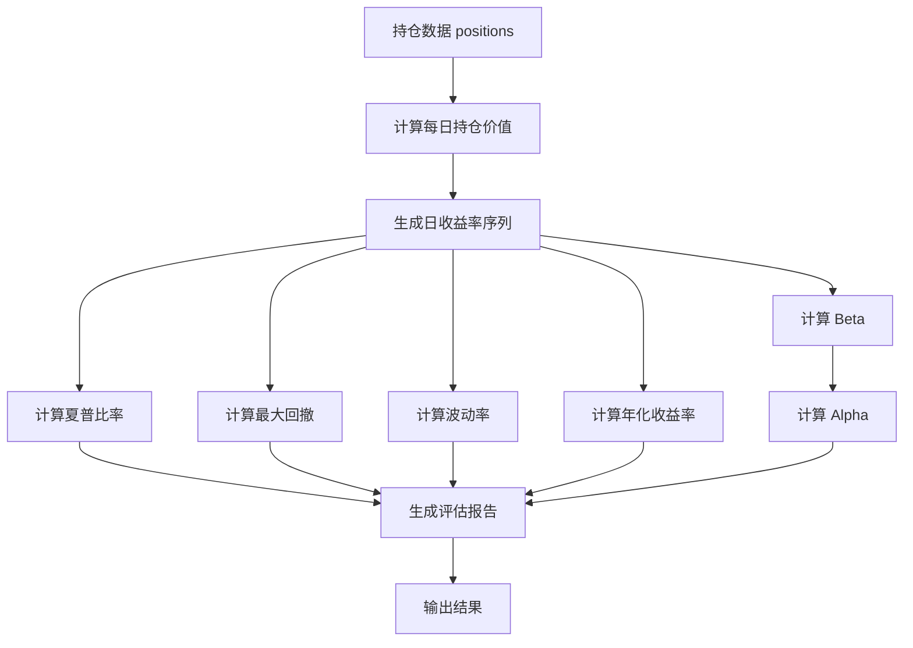
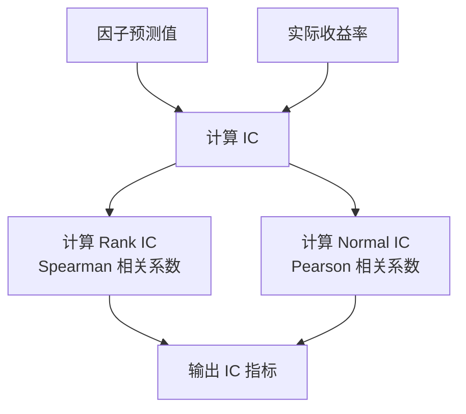

# evaluate_portfolio.py 模块文档

## 模块概述

`qlib.contrib.evaluate_portfolio` 模块提供了投资组合评估的核心函数，包括持仓价值计算、收益率序列生成、年化收益率、夏普比率、最大回撤、Beta、Alpha 等经典风险指标的计算。该模块专门用于从持仓视角评估投资组合的表现。

## 主要功能

- **持仓价值计算**：从持仓数据计算资产价值
- **收益率生成**：将持仓数据转换为日收益率序列
- **风险指标计算**：年化收益率、夏普比率、最大回撤、波动率等
- **回归分析**：计算 Beta、Alpha 等相对于基准的指标
- **相关性分析**：计算 Rank IC 和 Normal IC

---

## 函数详解

### 1. `_get_position_value_from_df(evaluate_date, position, close_data_df)`

**功能说明**

从已有的收盘价数据框中计算持仓价值。这是一个内部辅助函数。

**参数说明**

| 参数名 | 类型 | 必填 | 说明 |
|--------|------|------|------|
| `evaluate_date` | datetime | 是 | 评估日期 |
| `position` | dict | 是 | 持仓信息字典，与 `get_position_value()` 中的 position 格式相同 |
| `close_data_df` | pd.DataFrame | 是 | 收盘价数据框，MultiIndex 格式<br>`close_data_df['$close'][stock_id][evaluate_date]` 表示股票在指定日期的收盘价 |

**返回值说明**

返回持仓在评估日期的总价值（股票价值 + 现金）。

**持仓数据格式**

```python
position = {
    'SH600022': {
        'amount': 100.00,  # 持仓数量
        'price': 12.00     # 成本价
    },
    'cash': 100000.0       # 现金
}
```

**使用示例**

```python
import pandas as pd
from qlib.contrib.evaluate_portfolio import _get_position_value_from_df

# 假设已有收盘价数据
close_data_df = D.features(
    ['SH600022', 'SH600000'],
    ['$close'],
    start_time='2020-01-05',
    end_time='2020-01-05'
)

# 持仓数据
position = {
    'SH600022': {'amount': 100.0, 'price': 12.0},
    'SH600000': {'amount': 200.0, 'price': 10.0},
    'cash': 50000.0
}

# 计算持仓价值
value = _get_position_value_from_df(
    evaluate_date=pd.Timestamp('2020-01-05'),
    position=position,
    close_data_df=close_data_df
)
print(f"持仓价值: {value:.2f}")
```

---

### 2. `get_position_value(evaluate_date, position)`

**功能说明**

计算指定日期的持仓价值。这是核心函数，用于获取持仓在特定日期的市值。

**参数说明**

| 参数名 | 类型 | 必填 | 说明 |
|--------|------|------|------|
| `evaluate_date` | datetime | 是 | 评估日期 |
| `position` | dict | 是 | 持仓信息字典 |

**返回值说明**

返回持仓在评估日期的总价值（股票价值 + 现金）。

**持仓数据格式**

```python
positions = {
    Timestamp('2016-01-05 00:00:00'): {
        'SH600022': {
            ''amount': 100.00,  # 持仓数量
            'price': 12.00       # 成本价
        },
        'cash': 100000.0         # 现金
    }
}
```

这表示在 2016-01-05 持有 100 股 SH600022 和 100000 元现金。

**使用示例**

```python
import pandas as pd
from qlib.contrib.evaluate_portfolio import get_position_value

# 持仓数据
position = {
    'SH600022': {'amount': 100.0, 'price': 12.0},
    'cash': 100000.0
}

# 计算持仓价值
value = get_position_value(
    evaluate_date=pd.Timestamp('2020-01-05'),
    position=position
)
print(f"持仓价值: {value:.2f}")
```

---

### 3. `get_position_list_value(positions)`

**功能说明**

批量计算多个日期的持仓价值。该函数会加载所有需要的收盘价数据，然后计算每个日期的持仓价值。

**参数说明**

| 参数名 | 类型 | 必填 | 说明 |
|--------|------|------|------|
| `positions` | dict | 是 | 多个日期的持仓数据，键为日期，值为持仓字典 |

**返回值说明**

返回一个 OrderedDict，键为日期，值为持仓价值。

**使用示例**

```python
import pandas as pd
from collections import OrderedDict
from qlib.contrib.evaluate_portfolio import get_position_list_value

# 多日持仓数据
positions = OrderedDict([
    (pd.Timestamp('2020-01-05'), {
        'SH600022': {'amount': 100.0, 'price': 12.0},
        'cash': 100000.0
    }),
    (pd.Timestamp('2020-01-06'), {
        'SH600022': {'amount': 150.0, 'price': 12.0},
        'cash': 95000.0
    })
])

# 批量计算持仓价值
value_dict = get_position_list_value(positions)
for date, value in value_dict.items():
    print(f"{date.date()}: {value:.2f}")
```

---

### 4. `get_daily_return_series_from_positions(positions, init_asset_value)`

**功能说明**

从持仓数据生成日收益率序列。该函数首先计算每日持仓价值，然后计算收益率。

**参数说明**

| 参数名 | 类型 | 必填 | 说明 |
|--------|------|------|------|
| `positions` | dict | 是 | 策略生成的持仓数据 |
| `init_asset_value` | float | 是 | 初始资产价值 |

**返回值说明**

返回一个 pd.Series，表示日收益率序列，`return_series[date]` 为当天的收益率。

**使用示例**

```python
import pandas as pd
from collections import OrderedDict
from qlib.contrib.evaluate_portfolio import get_daily_return_series_from_positions

# 持仓数据
positions = OrderedDict([
    (pd.Timestamp('2020-01-05'), {
        'SH600022': {'amount': 100.0, 'price': 12.0},
        'cash': 100000.0
    }),
    (pd.Timestamp('2020-01-06'), {
        'SH600022': {'amount': 150.0, 'price': 12.0},
        'cash': 95000.0
    })
])

# 生成日收益率序列
return_series = get_daily_return_series_from_positions(
    positions=positions,
    init_asset_value=100000.0
)

print("日收益率序列:")
print(return_series)
```

---

### 5. `get_annual_return_from_positions(positions, init_asset_value)`

**功能说明**

从持仓数据计算年化收益率。

**计算公式**

$$ \text{annual_return} = \left(\frac{p_{end}}{p_{start}}\right)^{\frac{250}{n}} - 1 $$

其中：
- $p_{end}$：最终价值
- $p_{start}$：初始价值
- $n$：回测天数

**参数说明**

| 参数名 | 类型 | 必填 | 说明 |
|--------|------|------|------|
| `positions` | dict | 是 | 持仓数据 |
| `init_asset_value` | float | 是 | 初始资产价值 |

**返回值说明**

返回年化收益率（浮点数）。

**使用示例**

```python
import pandas as pd
from collections import OrderedDict
from qlib.contrib.evaluate_portfolio import get_annual_return_from_positions

positions = OrderedDict([
    (pd.Timestamp('2020-01-05'), {'cash': 100000.0}),
    (pd.Timestamp('2020-12-31'), {'cash': 120000.0})
])

annual_return = get_annual_return_from_positions(
    positions=positions,
    init_asset_value=100000.0
)
print(f"年化收益率: {annual_return:.2%}")
```

---

### 6. `get_annaul_return_from_return_series(r, method='ci')`

**功能说明**

从日收益率序列计算年化收益率。

**参数说明**

| 参数名 | 类型 | 必填 | 默认值 | 说明 |
|--------|------|------|--------|------|
| `r` | pandas.Series | 是 | - | 日收益率序列 |
| `method` | str | 否 | 'ci' | 利息计算方法：<br> - `'ci'`：复利（compound interest）<br> - `'si'`：单利（simple interest） |

**返回值说明**

返回年化收益率（浮点数）。

**使用示例**

```python
import pandas as pd
from qlib.contrib.evaluate_portfolio import get_annaul_return_from_return_series

# 日收益率序列
returns = pd.Series([0.01, -0.02, 0.03, -0.01, 0.02])

# 复利计算
annual_ci = get_annaul_return_from_return_series(returns, method='ci')
print(f"复利年化收益率: {annual_ci:.2%}")

# 单利计算
annual_si = get_annaul_return_from_return_series(returns, method='si')
print(f"单利年化收益率: {annual_si:.2%}")
```

---

### 7. `get_sharpe_ratio_from_return_series(r, risk_free_rate=0.00, method='ci')`

**功能说明**

从日收益率序列计算夏普比率。

**计算公式**

$$ \text{Sharpe} = \frac{\text{annual_return} - r_f}{\sigma \times \sqrt{250}} $$

其中：
- $\text{annual_return}$：年化收益率
- $r_f$：无风险利率
- $\sigma$：日收益率标准差

**参数说明**

| 参数名 | 类型 | 必填 | 默认值 | 说明 |
|--------|------|------|--------|------|
| `r` | pandas.Series | 是 | - | 日收益率序列 |
| `risk_free_rate` | float | 否 | 0.00 | 无风险利率，可设置为 0.03 等 |
| `method` | str | 否 | 'ci' | 利息计算方法：<br> - `'ci'`：复利<br> - `'si'`：单利 |

**返回值说明**

返回夏普比率（浮点数）。

**使用示例**

```python
import pandas as pd
from qlib.contrib.evaluate_portfolio import get_sharpe_ratio_from_return_series

returns = pd.Series([0.01, -0.02, 0.03, -0.01, 0.02])

# 计算夏普比率
sharpe = get_sharpe_ratio_from_return_series(
    r=returns,
    risk_free_rate=0.03,
    method='ci'
)
print(f"夏普比率: {sharpe:.4f}")
```

---

### 8. `get_max_drawdown_from_series(r)`

**功能说明**

从收益率序列计算最大回撤。使用 cumprod 方式计算。

**计算公式**

$$ \text{MDD} = \min\left(\frac{\text{cumprod}(1+r) - \text{cummax}(\text{cumprod}(1+r))}{\text{cummax}(\text{cumprod}(1+r))}\right) $$

**参数说明**

| 参数名 | 类型 | 必填 | 说明 |
|--------|------|------|------|
| `r` | pandas.Series | 是 | 日收益率序列 |

**返回值说明**

返回最大回撤（浮点数，负值）。

**使用示例**

```python
import pandas as pd
from qlib.contrib.evaluate_portfolio import get_max_drawdown_from_series

returns = pd.Series([0.01, -0.02, 0.03, -0.01, 0.02])

mdd = get_max_drawdown_from_series(returns)
print(f"最大回撤: {mdd:.2%}")
```

---

### 9. `get_beta(r, b)`

**功能说明**

计算策略相对于基准的 Beta 值。

**计算公式**

$$ \beta = \frac{\text{Cov}(r, b)}{\text{Var}(b)} $$

其中：
- $r$：策略收益率
- $b$：基准收益率

**参数说明**

| 参数名 | 类型 | 必填 | 说明 |
|--------|------|------|------|
| `r` | pandas.Series | 是 | 策略的日收益率序列
| `b` | pandas.Series | 是 | 基准的日收益率序列

**返回值说明**

返回 Beta 值（浮点数）。

**使用示例**

```python
import pandas as pd
from qlib.contrib.evaluate_portfolio import get_beta

# 策略和基准收益率
strategy_returns = pd.Series([0.01, -0.02, 0.03, -0.01, 0.02])
benchmark_returns = pd.Series([0.008, -0.015, 0.025, -0.008, 0.018])

beta = get_beta(strategy_returns, benchmark_returns)
print(f"Beta: {beta:.4f}")
```

---

### 10. `get_alpha(r, b, risk_free_rate=0.03)`

**功能说明**

计算策略的 Alpha 值，即经风险调整后的超额收益。

**计算公式**

$$ \alpha = r_a - r_f - \beta \times (r_b - r_f) $$

其中：
- $r_a$：策略年化收益率
- $r_b$：基准年化收益率
- $r_f$：无风险利率
- $\beta$：Beta 值

**参数说明**

| 参数名 | 类型 | 必填 | 默认值 | 说明 |
|--------|------|------|--------|------|
| `r` | pandas.Series | 是 | - | 策略的日收益率序列
| `b` | pandas.Series | 是 | - | 基准的日收益率序列
| `risk_free_rate` | float | 否 | 0.03 | 无风险利率

**返回值说明**

返回 Alpha 值（浮点数）。

**使用示例**

```python
import pandas as pd
from qlib.contrib.evaluate_portfolio import get_alpha

strategy_returns = pd.Series([0.01, -0.02, 0.03, -0.01, 0.02])
benchmark_returns = pd.Series([0.008, -0.015, 0.025, -0.008, 0.018])

alpha = get_alpha(strategy_returns, benchmark_returns, risk_free_rate=0.03)
print(f"Alpha: {alpha:.2%}")
```

---

### 11. `get_volatility_from_series(r)`

**功能说明**

从收益率序列计算波动率（标准差）。

**参数说明**

| 参数名 | 类型 | 必填 | 说明 |
|--------|------|------|------|
| `r` | pandas.Series | 是 | 日收益率序列 |

**返回值说明**

返回波动率（浮点数）。

**使用示例**

```python
import pandas as pd
from qlib.contrib.evaluate_portfolio import get_volatility_from_series

returns = pd.Series([0.01, -0.02, 0.03, -0.01, 0.02])

volatility = get_volatility_from_series(returns)
print(f"波动率: {volatility:.4f}")
```

---

### 12. `get_rank_ic(a, b)`

**功能说明**

计算排序信息系数（Rank IC），即两个序列的 Spearman 相关系数。该指标常用于评估预测因子与实际收益率的相关性。

**参数说明**

| 参数名 | 类型 | 必填 | 说明 |
|--------|------|------|------|
| `a` | pandas.Series | 是 | 因子值的日序列 |
| `b` | pandas.Series | 是 | 收益率的日序列 |

**返回值说明**

返回排序相关系数（浮点数，范围 [-1, 1]）。

**使用示例**

```python
import pandas as pd
from qlib.contrib.evaluate_portfolio import get_rank_ic

# 因子值和实际收益率
factor_scores = pd.Series([0.8, 0.6, 0.9, 0.5, 0.7])
actual_returns = pd.Series([0.01, -0.02, 0.03, -0.01, 0.02])

rank_ic = get_rank_ic(factor_scores, actual_returns)
print(f"Rank IC: {rank_ic:.4f}")
```

---

### 13. `get_normal_ic(a, b)`

**功能说明**

计算普通信息系数（Normal IC），即两个序列的 Pearson 相关系数。

**参数说明**

| 参数名 | 类型 | 必填 | 说明 |
|--------|------|------|------|
| `a` | pandas.Series | 是 | 因子值的日序列 |
| `b` | pandas.Series | 是 | 收益率的日序列 |

**返回值说明**

返回 Pearson 相关系数（浮点数，范围 [-1, 1]）。

**使用示例**

```python
import pandas as pd
from qlib.contrib.evaluate_portfolio import get_normal_ic

factor_scores = pd.Series([0.8, 0.6, 0.9, 0.5, 0.7])
actual_returns = pd.Series([0.01, -0.02, 0.03, -0.01, 0.02])

normal_ic = get_normal_ic(factor_scores, actual_returns)
print(f"Normal IC: {normal_ic:.4f}")
```

---

## 完整使用示例

### 示例1：从持仓数据评估投资组合

```python
import pandas as pd
from collections import OrderedDict
from qlib.contrib.evaluate_portfolio import (
    get_position_list_value,
    get_daily_return_series_from_positions,
    get_sharpe_ratio_from_return_series,
    get_max_drawdown_from_series,
    get_beta,
    get_alpha
)

# 假设有回测产生的持仓数据
positions = OrderedDict([
    (pd.Timestamp('2020-01-05'), {
        'SH600022': {'amount': 100.0, 'price': 12.0},
        'cash': 100000.0
    }),
    (pd.Timestamp('2020-01-06'), {
        'SH600022': {'amount': 150.0, 'price': 12.0},
        'cash': 95000.0
    }),
    # ... 更多日期的持仓
])

# 初始资产
init_asset = 100000.0

# 1. 计算每日持仓价值
value_dict = get_position_list_value(positions)
print("每日持仓价值:")
for date, value in list(value_dict.items())[:3]:
    print(f"  {date.date()}: {value:.2f}")

# 2. 生成日收益率序列
return_series = get_daily_return_series_from_positions(
    positions, init_asset
)
print(f"\n日收益率样本:\n{return_series.head()}")

# 3. 计算夏普比率
sharpe = get_sharpe_ratio_from_return_series(
    return_series, risk_free_rate=0.03
)
print(f"\n夏普比率: {sharpe:.4f}")

# 4. 计算最大回撤
mdd = get_max_drawdown_from_series(return_series)
print(f"最大回撤: {mdd:.2%}")

# 5. 假设有基准收益率
benchmark_returns = pd.Series([0.008, -0.015, 0.025])

# 计算 Beta 和 Alpha
beta = get_beta(return_series, benchmark_returns)
alpha = get_alpha(return_series, benchmark_returns, risk_free_rate=0.03)
print(f"Beta: {beta:.4f}")
print(f"Alpha: {alpha:.2%}")
```

### 示例2：计算 IC 指标

```python
import pandas as pd
from qlib.contrib.evaluate_portfolio import (
    get_rank_ic,
    get_normal_ic
)

# 假设有一段时间的因子预测值和实际收益率
# 格式：MultiIndex (datetime, instrument) 的 DataFrame
factor_scores = pd.Series([
    0.8, 0.6, 0.9, 0.5, 0.7,
    0.85, 0.65, 0.95, 0.55, 0.75
])

actual_returns = pd.Series([
    0.01, -0.02, 0.03, -0.01, 0.02,
    0.015, -0.025, 0.035, -0.015, 0.025
])

# 计算 Rank IC
rank_ic = get_rank_ic(factor_scores, actual_returns)
print(f"Rank IC: {rank_ic:.4f}")

# 计算 Normal IC
normal_ic = get_normal_ic(factor_scores, actual_returns)
print(f"Normal IC: {normal_ic:.4f}")
```

---

## 流程图

### 从持仓到风险指标的完整流程



### IC 计算流程



---

## 指标说明

### 风险指标对比

| 指标 | 计算方式 | 含义 | 理想值 |
|------|----------|------|--------|
| 年化收益率 | 复利/单利 | 投资组合的年化回报 | 越高越好 |
| 夏普比率 | (收益 - 无风险)/风险 | 单位风险的超额收益 | > 1 为优秀 |
| 最大回撤 | 峰值到谷值最大跌幅 | 最大亏损幅度 | 越小越好 |
| 波动率 | 收益率标准差 | 收益率的波动程度 | 适中 |
| Beta | Cov/Var_Benchmark | 相对于基准的系统性风险 | < 1 为防御性 |
| Alpha | 收益 - 风险调整收益 | 超越基准的部分 | > 0 为优秀 |
| Rank IC | Spearman 相关系数 | 预测排序与收益排序的相关性 | > 0.05 为有效 |
| Normal IC | Pearson 相关系数 | 预测值与收益值的线性相关性 | > 0.05 为有效 |

---

## 注意事项

1. **数据格式要求**
   - 持仓数据必须为 MultiIndex (datetime, instrument) 格式
   - 如果 instrument 在第一层索引，会自动交换

2. **收益率计算方法**
- 复利（ci）：更符合实际投资场景
- 单利（si）：计算更简单，适合短期分析

3. **年化系数**
   - 使用 250 作为年化交易日数（中国 A 股市场）
   - 可根据实际情况调整

4. **无风险利率**
   - 默认为 0.00（或 0.03）
   - 可根据实际情况设置（如国债收益率）

5. **性能优化**
   - 批量计算使用 `get_position_list_value` 而非循环调用 `get_position_value`
   - 减少重复的数据加载

6. **IC 指标解释**
   - Rank IC：评估因子的排序预测能力
   - Normal IC：评估因子的线性预测能力
   - 通常 Rank IC 更稳健，不受异常值影响

---

## 参考公式

### 年化收益率

**复利方式**：
$$ R_{annual} = (1 + \bar{r})^{250} - 1 $$

**单利方式**：
$$ R_{annual} = \bar{r} \times 250 $$

### 夏普比率

$$ \text{Sharpe} = \frac{R_{annual} - r_f}{\sigma \times \sqrt{250}} $$

### 最大回撤

$$ \text{MDD} = \min\left(\frac{\text{cumprod}(1+r) - \text{cummax}(\text{cumprod}(1+r))}{\text{cummax}(\text{cumprod}(1+r))}\right) $$

### Beta 和 Alpha

$$ \beta = \frac{\text{Cov}(r, b)}{\text{Var}(b)} $$
$$ \alpha = R_a - r_f - \beta \times (R_b - r_f) $$

### Rank IC

$$ \text{Rank IC} = \rho_{\text{Spearman}}(a, b) $$

### Normal IC

$$ \text{Normal IC} = \rho_{\text{Pearson}}(a, b) $$

---

## 更新日志

- **v0.9.0**: 优化批量计算性能
- **v0.8.0**: 添加 Normal IC 计算功能
- **v0.7.0**: 重构持仓价值计算逻辑
