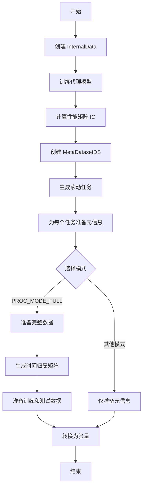

# dataset.py

## 模块概述

该模块实现了基于元学习的数据选择机制，包括：

- **InternalData**: 内部数据类，用于管理代理模型的预测性能数据
- **MetaTaskDS**: 元学习任务类，处理单个元学习任务的数据准备
- **MetaDatasetDS**: 元学习数据集类，管理多个元学习任务的数据集

## 类定义

### InternalData

内部数据管理类，用于收集和存储不同时间窗口数据的性能指标。

#### 构造方法参数

| 参数名 | 类型 | 必需 | 说明 |
|--------|------|------|------|
| task_tpl | dict | 是 | 任务模板配置 |
| step | int | 是 | 滚动窗口步长 |
| exp_name | str | 是 | 实验名称 |

#### 方法

##### setup(trainer=TrainerR, trainer_kwargs={})

设置内部数据，训练代理模型并计算性能矩阵。

**参数说明：**

- **trainer**: 训练器类，默认为 `TrainerR`
- **trainer_kwargs**: 训练器参数字典

**功能说明：**

1. 准备代理模型的预测任务配置
2. 训练代理模型（如果尚未训练）
3. 提取预测结果和标签
4. 计算每个时间窗口数据的 Spearman IC 指标
5. 生成 `self.data_ic_df` 性能矩阵

**输出数据结构：**

`data_ic_df` 是一个 DataFrame，其中：
- 每列代表一个训练数据段
- 每行代表一个测试日期
- 单元格表示该日期该数据段的 IC 值

```python
# 示例数据结构
                       (2021-06-21, 2021-07-02)  (2021-06-04, 2021-06-18)  ...
datetime
2018-01-02          0.079782                0.115975              ...
2018-01-03          0.123386                0.107789              ...
...
```

##### update()

更新在线交易的数据（当前未实现）。

**TODO:**
- 当新数据（包括标签）完全可用时更新
- 更新预测结果
- 更新数据相似度映射（如果应用）

---

### MetaTaskDS

元学习任务类，为数据选择准备单个任务的数据。

#### 构造方法参数

| 参数名 | 类型 | 默认值 | 说明 |
|--------|------|----------|------|
| task | dict | - | 任务配置字典 |
| meta_info | pd.DataFrame | - | 元信息性能矩阵 |
| mode | str | "PROC_MODE_FULL" | 处理模式 |
| fill_method | str | "max" | 缺失值填充方法 |

**meta_info 数据结构：**

与 `InternalData.data_ic_df` 相同，表示不同数据段在不同日期的 IC 性能。

**mode 选项：**

- `PROC_MODE_FULL`: 完整处理模式，准备所有数据
- 其他模式：仅准备元信息

**fill_method 选项：**

- `"max"`: 使用行最大值填充（与历史实现对齐）
- `"maxseg"`: 使用分段最大值填充
- `"zero"`: 填充为 0

#### 处理后的数据结构

```python
{
    "time_perf": <hist_step_n * step, data_pieces>,  # 数据段性能
    "time_belong": <sample, data_pieces>,           # 样本归属矩阵 (1. 或 0.)
    "X": <train_samples, features>,               # 训练特征
    "y": <train_samples>,                       # 训练标签
    "X_test": <test_samples, features>,           # 测试特征
    "y_test": <test_samples>,                   # 测试标签
    "test_idx": MultiIndex                      # 测试样本索引
}
```

#### 方法

##### get_meta_input()

获取处理后的元输入数据。

**返回值：**

- **dict**: 包含所有处理后的数据的字典

##### _get_processed_meta_info()

处理元信息，进行归一化和缺失值填充。

**处理流程：**

1. 对每行进行归一化（减去均值）
2. 根据填充方法处理缺失值
3. 最终将剩余缺失值填充为 0

---

### MetaDatasetDS

元学习数据集类，管理多个元学习任务的数据集。

#### 构造方法参数

| 参数名 | 类型 | 必需 | 说明 |
|--------|------|------|------|
| task_tpl | dict or list | 是 | 任务模板或任务列表 |
| step | int | 是 | 滚动步长 |
| trunc_days | int | 否 | 基于测试起始截断的天数 |
| rolling_ext_days | int | 0 | 滚动扩展天数 |
| exp_name | str or InternalData | 是 | 实验名称或内部数据对象 |
| segments | dict or float or str | 是 | 数据分段配置 |
| hist_step_n | int | 10 | 历史步数 |
| task_mode | str | "PROC_MODE_FULL" | 任务处理模式 |
| fill_method | str | "max" | 缺失值填充方法 |

**segments 配置说明：**

- **dict**: `{"train": (start, end), "test": (start, end)}`
- **float**: 训练集比例（如 0.8 表示 80% 用于训练）
- **str**: 确保该日期在测试集中的分割点

**exp_name 参数说明：**

- **str**: 代理模型性能实验的名称
- **InternalData**: 已准备好的内部数据对象

#### 方法

##### _prepare_meta_ipt(task)

为特定任务准备元输入。

**返回值：**

- **pd.DataFrame**: 处理后的元信息矩阵

**处理逻辑：**

1. 获取任务训练/验证段的最大结束时间
2. 切片获取有效的历史性能数据
3. 掩除重叠信息（避免数据泄露）
4. 限制历史长度为 `hist_step_n * step`

**数据结构示例：**

```python
# 返回的 DataFrame 结构
                       2009-01-05  2009-02-09  ...  2011-05-26
                       2009-02-06  2009-03-06  ...  2011-06-23
datetime
2009-01-13        NaN         0.310639   ...  0.137792
2009-01-14        NaN         0.261086   ...  0.082581
...
2011-07-01        -0.075762   -0.026626  ...  NaN
```

##### _prepare_seg(segment)

准备特定分段的任务列表。

**参数说明：**

- **segment**: 分段名称（"train" 或 "test"）

**返回值：**

- **List[MetaTaskDS]**: 该分段的所有元学习任务

## 使用示例

### 基本使用

```python
from qlib.contrib.meta.data_selection.dataset import MetaDatasetDS
from qlib.contrib.meta.data_selection.model import MetaModelDS

# 定义任务模板
task_tpl = {
    "model": {...},
    "dataset": {
        "kwargs": {
            "handler": {...},
            "segments": {
                "train": ("2009-01-01", "2010-12-31"),
                "valid": ("2011-01-01", "2011-06-30"),
                "test": ("2011-07-01", "2011-12-31")
            }
        }
    }
}

# 创建元学习数据集
meta_dataset = MetaDatasetDS(
    task_tpl=task_tpl,
    step=20,              # 20天滚动步长
    trunc_days=5,          # 截断5天以避免未来信息
    exp_name="proxy_exp",   # 代理模型实验名称
    segments=0.8,         # 80%用于训练
    hist_step_n=10         # 考虑10个历史步
)

# 创建元学习模型
meta_model = MetaModelDS(
    step=20,
    hist_step_n=10,
    clip_method="tanh",
    clip_weight=2.0
)

# 训练元学习模型
meta_model.fit(meta_dataset)
```

### 使用 InternalData

```python
from qlib.contrib.meta.data_selection.dataset import InternalData, MetaDatasetDS

# 创建内部数据
internal_data = InternalData(
    task_tpl=task_tpl,
    step=20,
    exp_name="proxy_exp"
)

# 设置内部数据（训练代理模型）
internal_data.setup()

# 使用已准备的内部数据创建数据集
meta_dataset = MetaDatasetDS(
    task_tpl=task_tpl,
    step=20,
    exp_name=internal_data,  # 直接传入 InternalData 对象
    segments=0.8,
    hist_step_n=10
)
```

## 算法流程图



## 注意事项

1. **内存消耗**: `PROC_MODE_FULL` 模式会占用大量内存
2. **代理模型训练**: 首次运行需要训练所有代理模型，耗时较长
3. **数据泄露风险**: 正确设置 `trunc_days` 避免未来信息泄露
4. **缺失值处理**: 不同填充方法会影响元学习模型的性能
5. **时间归属矩阵**: 确保每个样本正确分配到对应的时间段

## 相关文档

- [model.py 文档](./model.md) - 元学习模型
- [net.py 文档](./net.md) - 神经网络结构
- [utils.py 文档](./utils.md) - 工具函数
