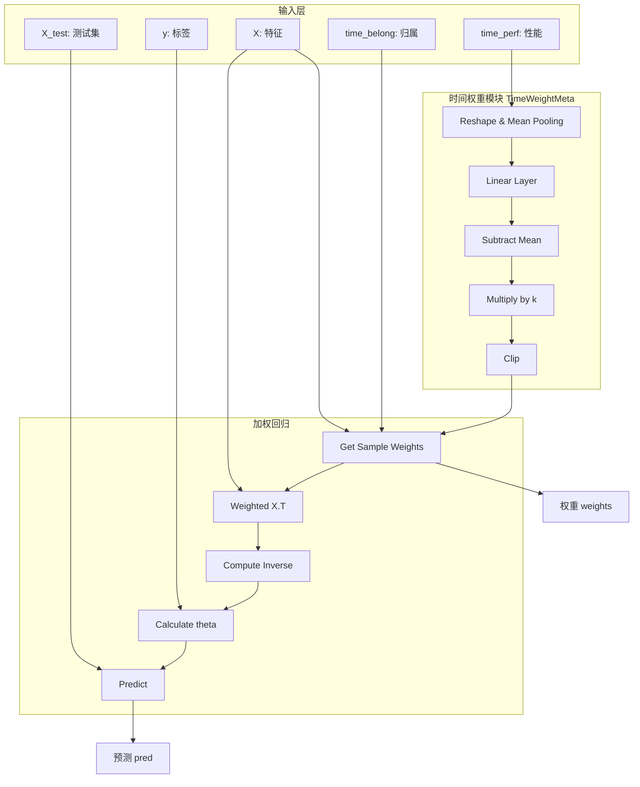
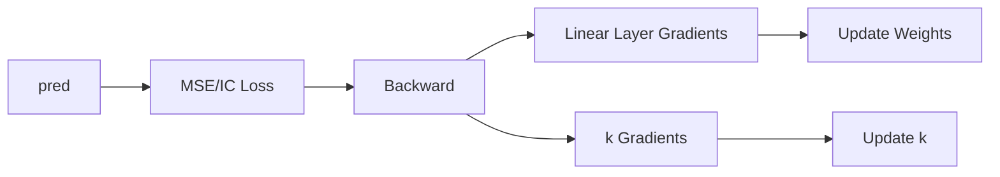

# net.py

## 模块概述

该模块实现了数据选择元学习所需的神经网络结构，包括：

- **TimeWeightMeta**: 时间权重元学习模块
- **PredNet**: 预测网络，整合时间权重和线性回归

## 类定义

### TimeWeightMeta

时间权重元学习模块，学习历史数据段的权重分配。

#### 构造方法参数

| 参数名 | 类型 | 默认值 | 说明 |
|--------|------|----------|------|
| hist_step_n | int | - | 历史步数（输入特征维度） |
| clip_weight | float | None | 权重截断阈值 |
| clip_method | str | "clamp" | 截断方法："tanh" 或 "clamp" |

**clip_weight 参数说明：**

- 为 None: 不截断权重
- 为 0.0-1.0 (clamp/tanh): 被转换为 1/clip_weight
- > 1.0: 正常使用

#### 网络结构

```
Input: [hist_step_n, data_pieces]
  ↓
Mean pooling: [data_pieces]
  ↓
Linear layer: [data_pieces]
  ↓
Subtract mean (去中心化): [data_pieces]
  ↓
Multiply by k (缩放): [data_pieces]
  ↓
Clip (if clip_weight set): [data_pieces]
  ↓
Output: [data_pieces] (weights)
```

#### 方法

##### forward(time_perf, time_belong=None, return_preds=False)

前向传播计算时间权重。

**参数说明：**

- **time_perf** (Tensor): 时间性能矩阵，形状为 `[hist_step_n * data_pieces]`
- **time_belong** (Tensor): 时间归属矩阵，形状为 `[samples, data_pieces]`
- **return_preds** (bool): 是否返回预测值而非权重

**返回值：**

- **Tensor**: 权重向量或分配到样本的权重

**处理流程：**

1. 重塑性能矩阵: `[hist_step_n * data_pieces] → [hist_step_n, data_pieces]`
2. 对每个数据段计算平均性能
3. 通过线性层输出原始权重预测
4. 减去均值（避免使用未来信息）
5. 乘以缩放因子 k
6. 应用截断（如果设置）
7. 如果提供 `time_belong`，分配权重到样本

**数学公式：**

```python
# 1. 平均性能
avg_perf = mean(time_perf.reshape(hist_step_n, data_pieces), axis=0)

# 2. 线性变换
preds = linear(avg_perf)

# 3. 去中心化
preds = preds - mean(preds)

# 4. 缩放
preds = preds * k

# 5. 截断
weights = clip(preds)

# 6. 分配到样本
sample_weights = time_belong @ weights
```

---

### PredNet

预测网络，整合时间权重学习和加权的线性回归。

#### 构造方法参数

| 参数名 | 类型 | 默认值 | 说明 |
|--------|------|----------|------|
| step | int | - | 滚动步长 |
| hist_step_n | int | - | 历史步数 |
| clip_weight | float | None | 权重截断阈值 |
| clip_method | str | "tanh" | 截断方法 |
| alpha | float | 0.0 | L2正则化系数 |

**alpha 参数说明：**

- 用于线性回归的 L2 正则化
- 对齐元学习模型和线性子模型时有用

#### 网络结构

```
Input:
  - X: [train_samples, features]
  - y: [train_samples]
  - time_perf: [hist_step_n * data_pieces]
  - time_belong: [train_samples, data_pieces]
  - X_test: [test_samples, features]

TimeWeightMeta:
  - 计算每个数据段的权重
  - 分配权重到训练样本

Weighted Regression:
  - X_w = X.T * weights
  - theta = (X_w @ X + alpha*I)^(-1) @ X_w @ y
  - pred = X_test @ theta

Output:
  - pred: [test_samples]
  - weights: [train_samples]
```

#### 方法

##### get_sample_weights(X, time_perf, time_belong, ignore_weight=False)

获取训练样本的权重。

**参数说明：**

- **X** (Tensor): 训练特征
- **time_perf** (Tensor): 时间性能矩阵
- **time_belong** (Tensor): 时间归属矩阵
- **ignore_weight** (bool): 是否忽略权重

**返回值：**

- **Tensor**: 样本权重向量

**逻辑：**

1. 初始化权重为 1.0
2. 如果不忽略权重且提供时间性能：
   - 计算时间权重
   - 乘以时间权重

##### forward(X, y, time_perf, time_belong, X_test, ignore_weight=False)

前向传播，执行加权的线性回归。

**参数说明：**

- **X** (Tensor): 训练特征，形状为 `[train_samples, features]`
- **y** (Tensor): 训练标签，形状为 `[train_samples]`
- **time_perf** (Tensor): 时间性能矩阵
- **time_belong** (Tensor): 时间归属矩阵
- **X_test** (Tensor): 测试特征，形状为 `[test_samples, features]`
- **ignore_weight** (bool): 是否忽略权重

**返回值：**

- **pred** (Tensor): 测试集预测，形状为 `[test_samples]`
- **weights** (Tensor): 训练集权重，形状为 `[train_samples]`

**数学公式：**

```python
# 1. 获取样本权重
weights = get_sample_weights(X, time_perf, time_belong, ignore_weight)

# 2. 加权特征
X_w = X.T * weights  # [features, train_samples]

# 3. 计算 (X^T W X) 的逆
A = X_w @ X + alpha * I  # [features, features]
A_inv = inverse(A)

# 4. 计算回归系数
theta = A_inv @ X_w @ y  # [features]

# 5. 生成预测
pred = X_test @ theta  # [test_samples]
```

##### init_paramters(hist_step_n)

初始化网络参数。

**参数说明：**

- **hist_step_n**: 历史步数

**初始化策略：**

```python
# 线性层权重：接近均匀分布
linear.weight.data = 1.0 / hist_step_n + 0.01 * random

# 线性层偏置：零
linear.bias.data.fill_(0.0)

# 缩放因子：初始值 8.0
k = 8.0
```

## 使用示例

### 创建网络

```python
import torch
from qlib.contrib.meta.data_selection.net import PredNet

# 创建预测网络
net = PredNet(
    step=20,           # 滚动步长
    hist_step_n=10,    # 10个历史步
    clip_weight=2.0,   # 截断权重到 [0.5, 2.0]
    clip_method="tanh", # 使用 tanh 截断
    alpha=0.01         # L2 正则化
)
```

### 前向传播

```python
# 准备输入数据
X = torch.randn(1000, 50)           # 1000个样本，50个特征
y = torch.randn(1000)              # 标签
time_perf = torch.randn(500)          # 历史性能 (10 * 50)
time_belong = torch.randn(1000, 50)   # 时间归属
X_test = torch.randn(200, 50)       # 测试集

# 前向传播
pred, weights = net(X, y, time_perf, time_belong, X_test)

print(f"Predictions shape: {pred.shape}")     # [200]
print(f"Sample weights shape: {weights.shape}") # [1000]
print(f"Total weight: {weights.sum().item()}")
```

### 查看学习的时间权重

```python
# 计算时间权重
time_weights = net.twm(
    time_perf=time_perf,
    time_belong=time_belong,
    return_preds=False
)

print("Time weights for each data segment:")
print(time_weights)
```

### 不使用权重的基线

```python
# 不使用权重的基线预测
pred_baseline, weights_baseline = net(
    X, y, time_perf, time_belong, X_test,
    ignore_weight=True
)

print("Baseline (no weights):")
print(f"  Prediction MSE: {torch.nn.functional.mse_loss(pred_baseline, y_test)}")
```

## 网络架构图



## 训练策略

### 参数初始化

- **线性层权重**: 接近均匀分布，避免初始偏向
- **缩放因子 k**: 初始值 8.0，可学习参数
- **偏置**: 初始化为 0

### 梯度流



### 损失函数

1. **MSE Loss**: 均方误差
   - `loss = mean((pred - y)^2)`

2. **IC Loss**: 信息系数
   - 计算每日 Spearman 相关性
   - `loss = -mean(IC)` (负值因为要最大化 IC)

## 注意事项

1. **数值稳定性**:
   - 使用 `pinverse` 或 `inverse` 需要矩阵可逆
   - 添加 `alpha * I` 确保正定

2. **权重归一化**:
   - 网络不保证权重和为 1
   - 使用 `exp` 确保权重为正

3. **未来信息泄露**:
   - `subtract mean` 防止使用未来信息
   - 正确设置 `time_belong` 矩阵很重要

4. **计算效率**:
   - 矩阵求逆计算成本高
   - 对于大量特征，考虑使用迭代方法

5. **梯度爆炸**:
   - 使用权重截断防止极端权重
   - 监控梯度的范数

## 性能优化

### 批处理

```python
# 小批量训练以降低内存
batch_size = 100
for i in range(0, len(X), batch_size):
    X_batch = X[i:i+batch_size]
    y_batch = y[i:i+batch_size]
    pred, weights = net(X_batch, y_batch, ...)
    loss = criterion(pred, y_batch)
    loss.backward()
```

### 梯度裁剪

```python
# 防止梯度爆炸
torch.nn.utils.clip_grad_norm_(net.parameters(), max_norm=1.0)
```

### 混合精度训练

```python
# 使用 FP16 加速训练
net = net.half()
X = X.half()
y = y.half()
# ... 其他张量也转为 half
pred, weights = net(X, y, ...)
```

## 相关文档

- [utils.py 文档](./utils.md) - 工具函数（包括 `preds_to_weight_with_clamp`）
- [model.py 文档](./model.md) - 使用该网络的元学习模型
- [dataset.py 文档](./dataset.md) - 数据输入格式
