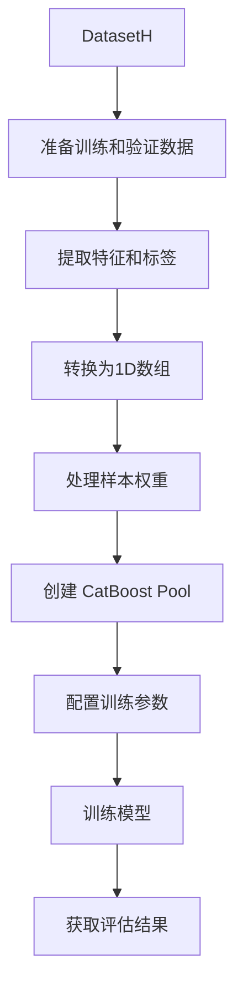

# CatBoostModel 模块文档

## 模块概述

`catboost_model.py` 模块提供了基于 CatBoost 框架的量化投资预测模型实现。CatBoost 是一种高性能的梯度提升决策树（GBDT）算法，特别在处理类别特征方面表现出色。

该模块主要包含一个核心类 `CatBoostModel`，集成了 Qlib 的模型接口和特征重要性解释接口。

## 核心类

### CatBoostModel

基于 CatBoost 的预测模型，继承自 `Model` 和 `FeatureInt` 基类。

#### 构造方法

```python
def __init__(self, loss="RMSE", **kwargs)
```

**参数说明：**

| 参数名 | 类型 | 默认值 | 说明 |
|--------|------|--------|------|
| loss | str | "RMSE" | 损失函数类型，支持 "RMSE"（均方根误差）或 "Logloss"（对数损失） |
| **kwargs | dict | - | 其他传递给 CatBoost 的超参数 |

**异常：**
- `NotImplementedError`: 当传入不支持的损失函数类型时抛出

**支持的 CatBoost 参数：**
通过 `**kwargs` 可以传递所有 CatBoost 支持的参数，如：
- `learning_rate`: 学习率
- `depth`: 树的最大深度
- `l2_leaf_reg`: L2 正则化系数
- `random_seed`: 随机种子

#### fit 方法

```python
def fit(
    self,
    dataset: DatasetH,
    num_boost_round=1000,
    early_stopping_rounds=50,
    verbose_eval=20,
    evals_result=dict(),
    reweighter=None,
    **kwargs,
)
```

训练 CatBoost 模型。

**参数说明：**

| 参数名 | 类型 | 默认值 | 说明 |
|--------|------|--------|------|
| dataset | DatasetH | 必需 | 包含训练和验证数据的 Qlib 数据集对象 |
| num_boost_round | int | 1000 | 最大迭代轮数（树的数量） |
| early_stopping_rounds | int | 50 | 早停轮数，验证集性能不提升的轮数阈值 |
| verbose_eval | int | 20 | 日志打印频率，每 N 轮打印一次日志 |
| evals_result | dict | dict() | 用于存储训练和验证集评估结果的字典 |
| reweighter | Reweighter | None | 样本重加权器，用于处理样本权重 |
| **kwargs | dict | - | 其他传递给 CatBoost.fit() 的参数 |

**数据处理流程：**



**异常：**
- `ValueError`: 当数据集为空或标签维度不支持时抛出

#### predict 方法

```python
def predict(self, dataset: DatasetH, segment: Union[Text, slice] = "test")
```

使用训练好的模型进行预测。

**参数说明：**

| 参数名 | 类型 | 默认值 | 说明 |
|--------|------|--------|------|
| dataset | DatasetH | 必需 | 包含测试数据的 Qlib 数据集对象 |
| segment | Union[Text, slice] | "test" | 要预测的数据片段，可以是 "train"、"valid"、"test" 或 slice 对象 |

**返回值：**
- `pd.Series`: 预测结果序列，索引与输入数据保持一致

**异常：**
- `ValueError`: 当模型尚未训练时抛出

#### get_feature_importance 方法

```python
def get_feature_importance(self, *args, **kwargs) -> pd.Series
```

获取特征重要性得分。

**参数说明：**
所有参数将直接传递给 CatBoost 的 `get_feature_importance` 方法。

**返回值：**
- `pd.Series`: 按重要性降序排列的特征重要性得分序列，索引为特征名称

**支持的参数类型：**
根据 [CatBoost 文档](https://catboost.ai/docs/concepts/python-reference_catboost_get_feature_importance.html)，支持以下特征重要性类型：
- `PredictionValuesChange`: 预测值变化（默认）
- `LossFunctionChange`: 损失函数变化
- `ShapValues`: SHAP 值

**示例：**

```python
# 获取默认特征重要性
importance = model.get_feature_importance()

# 获取损失函数变化的重要性

importance = model.get_feature_importance(type='LossFunctionChange')
```

## 使用示例

### 基本使用

```python
from qlib.contrib.model.catboost_model import CatBoostModel
from qlib.data.dataset import DatasetH

# 1. 创建模型
model = CatBoostModel(
    loss="RMSE",
    learning_rate=0.1,
    depth=6,
    l2_leaf_reg=3.0,
    random_seed=42
)

# 2. 准备数据集
dataset = DatasetH(config=dataset_config)

# 3. 训练模型
model.fit(
    dataset=dataset,
    num_boost_round=500,
    early_stopping_rounds=50,
    verbose_eval=20
)

# 4. 进行预测
preds = model.predict(dataset, segment="test")

# 5. 获取特征重要性
feature_importance = model.get_feature_importance()
print(feature_importance.head(10))
```

### 使用样本重加权

```python
from qlib.data.dataset.weight import InstanceReweighter

# 创建重加权器
reweighter = InstanceReweighter(
    weight_method="exp"
)

# 训练时应用重加权
model.fit(
    dataset=dataset,
    reweighter=reweighter
)
```

### 二分类任务

```python
# 创建二分类模型
model = CatBoostModel(
    loss="Logloss",  # 使用对数损失
    eval_metric="AUC"
)

# 训练
model.fit(dataset=dataset)
```

### GPU 训练

模型会自动检测 GPU 并在可用时使用 GPU 进行训练：

```python
# 模型会自动使用第一个可用的 GPU
model.fit(dataset=dataset)
```

## 注意事项

1. **标签格式要求**：CatBoost 不支持多标签训练，标签必须是 1D 数组
2. **GPU 支持**：模型会自动检测并使用 GPU（如果有）
3. **早停机制**：默认启用早停，可以通过 `early_stopping_rounds` 控制
4. **数据验证**：训练前会检查数据是否为空
5. **参数传递**：所有额外的 CatBoost 参数都可以通过 `**kwargs` 传递

## 相关文档

- [CatBoost 官方文档](https://catboost.ai/docs/)
- [Qlib 模型基类](../../model/base.py)
- [Qlib 特征重要性接口](../../model/interpret/base.py)

## 版本历史

- 当前版本支持 CatBoost 的所有标准参数
- 特征重要性计算完全兼容 CatBoost API
