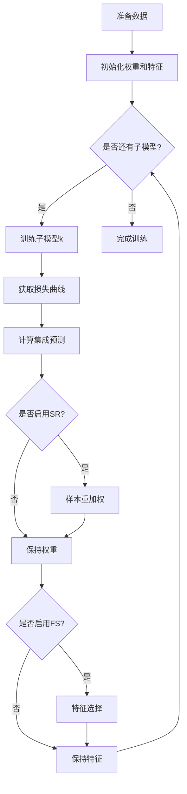
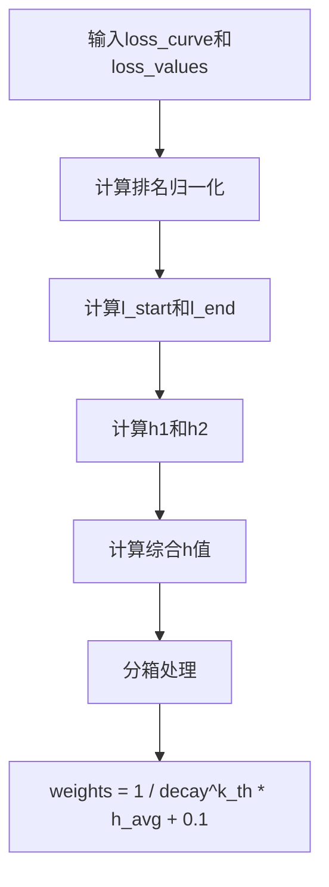
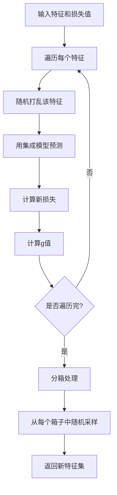

# Double Ensemble Model 模块文档

## 模块概述

`double_ensemble.py` 模块实现了 Double Ensemble (双集成) 模型，这是一种用于时序预测的集成学习方法。该模型通过两个关键模块提升预测性能：

1. **Sample Reweighting (SR)**：样本重加权模块，根据样本损失曲线动态调整样本权重
2. **Feature Selection (FS)**：特征选择模块，基于特征重要性动态选择特征子集

Double Ensemble 通过迭代训练多个子模型，每个子模型使用重新加权的样本和选择的特征，从而逐步提升模型性能。

## 核心类

### DEnsembleModel

Double Ensemble 集成模型，继承自 `Model` 和 `FeatureInt` 基类。

#### 构造方法

```python
def ____init__(
    self,
    base_model="gbm",
    loss="mse",
    num_models=6,
    enable_sr=True,
    enable_fs=True,
    alpha1=1.0,
    alpha2=1.0,
    bins_sr=10,
    bins_fs=5,
    decay=None,
    sample_ratios=None,
    sub_weights=None,
    epochs=100,
    early_stopping_rounds=None,
    **kwargs,
)
```

**参数说明：**

| 参数名 | 类型 | 默认值 | 说明 |
|--------|------|--------|------|
| base_model | str | "gbm" | 基础模型类型，当前仅支持 "gbm"（使用 LightGBM） |
| loss | str | "mse" | 损失函数类型，支持 "mse"（均方误差） |
| num_models | int | 6 | 子模型数量 |
| enable_sr | bool | True | 是否启用样本重加权（Sample Reweighting） |
| enable_fs | bool | True | 是否启用特征选择（Feature Selection） |
| alpha1 | float | 1.0 | 样本重加权中当前损失权重系数 |
| alpha2 | float | 1.0 | 样本重加权中学习进度权重系数 |
| bins_sr | int | 10 | 样本重加权的分箱数量 |
| bins_fs | int | 5 | 特征选择的分箱数量 |
| decay | float | None | 权重衰减因子，默认为 None |
| sample_ratios | list | [0.8, 0.7, 0.6, 0.5, 0.4] | 各分箱的采样比例列表，长度需等于 bins_fs |
| sub_weights | list | None | 各子模型的权重列表，长度需等于 num_models |
| epochs | int | 100 | 每个子模型的训练轮数 |
| early_stopping_rounds | int | None | 早停轮数 |
| **kwargs | dict | - | 传递给 LightGBM 的其他参数 |

**约束条件：**
- `len(sample_ratios)` 必须等于 `bins_fs`
- `len(sub_weights)` 必须等于 `num_models`

#### fit 方法

```python
def fit(self, dataset: DatasetH)
```

训练 Double Ensemble 模型。

**训练流程：**



**详细步骤：**
1. 准备训练和验证集数据
2. 初始化样本权重为全1向量
3. 对于每个子模型 k：
   - 使用当前权重和特征训练子模型
   - 获取该子模型的训练损失曲线
   - 计算当前集成模型的预测和损失
   - 如果启用 SR，根据损失曲线和当前损失进行样本重加权
   - 如果启用 FS，根据损失值进行特征选择
4. 保存所有子模型及其特征配置

#### train_submodel 方法

```python
def train_submodel(self, df_train, df_valid, weights, features)
```

训练单个子模型。

**参数说明：**

| 参数名 | 类型 | 说明 |
|--------|------|------|
| df_train | DataFrame | 训练集数据 |
| df_valid | DataFrame | 验证集数据 |
| weights | array | 样本权重数组 |
| features | Index | 使用的特征索引 |

**返回值：**
- 训练好的 LightGBM Booster 对象

#### sample_reweight 方法

```python
def sample_reweight(self, loss_curve, loss_values, k_th)
```

**样本重加权（SR）模块**的核心实现。

**参数说明：**

| 参数名 | 类型 | 说明 |
|--------|------|------|
| loss_curve | DataFrame | 形状为 N×T 的损失曲线矩阵，元素 (i, t) 表示第 i 个样本在第 t 次迭代后的误差 |
| loss_values | Series | 形状为 N 的向量，表示当前集成模型在每个样本上的损失 |
| k_th | int | 当前子模型的索引（从1开始） |

**算法流程：**



**计算公式：**

1. 排名归一化：
   - `loss_curve_norm = loss_curve.rank(axis=0, pct=True)`
   - `loss_values_norm = (-loss_values).rank(pct=True)`

2. 学习进度指标：
   - `l_start`：损失曲线前 10% 时期的平均损失
   - `l_end`：损失曲线后 10% 时期的平均损失
   - `h2 = (l_end / l_start).rank(pct=True)`

3. 综合得分：
   - `h = alpha1 * h1 + alpha2 * h2`

4. 权重计算：
   - `weight = 1 / (decay^k_th * h_avg + 0.1)`

**返回值：**
- `pd.Series`: 所有样本的新权重

#### feature_selection 方法

```python
def feature_selection(self, df_train, loss_values)
```

**特征选择（FS）模块**的核心实现。

**参数说明：**

| 参数名 | 类型 | 说明 |
|--------|------|------|
| df_train | DataFrame | 形状为 N×F 的训练数据 |
| loss_values | Series | 形状为 N 的向量，表示当前集成模型在每个样本上的损失 |

**算法流程：**



**g值计算：**
- `g_value = mean(loss_feat - loss_values) / (std(loss_feat - loss_values) + 1e-7)`
- 该值越大，说明特征越重要（打乱后损失增加越多）

**特征采样策略：**
- 根据 g 值将特征分成 `bins_fs` 个箱子
- 从每个箱子中按 `sample_ratios` 比例随机采样特征
- 保留低 g 值箱子的少量特征，高 g 值箱子的大部分特征

**返回值：**
- `pd.Index`: 选择后的特征索引集合

#### get_loss 方法

```python
def get_loss(self, label, pred)
```

计算预测损失。

**参数说明：**

| 参数名 | 类型 | 说明 |
|--------|------|------|
| label | array | 真实标签 |
| pred | array | 预测值 |

**返回值：**
- MSE 损失数组：`(label - pred)^2`

#### retrieve_loss_curve 方法

```python
def retrieve_retrieve_loss_curve(self, model, df_train, features)
```

获取训练过程中每一轮迭代的损失曲线。

**参数说明：**

| 参数名 | 类型 | 说明 |
|--------|------|------|
| model | Booster | LightGBM 模型 |
| df_train | DataFrame | 训练数据 |
| features | Index | 使用的特征 |

**返回值：**
- `pd.DataFrame`: 形状为 N×T 的损失曲线矩阵

#### predict 方法

```python
def predict(self, dataset: DatasetH, segment: Union[Text, slice] = "test")
```

使用集成模型进行预测。

**预测公式：**
```
pred = Σ(sub_model_k.predict(X) * weight_k) / Σ(weight_k)
```

**参数说明：**

| 参数名 | 类型 | 默认值 | 说明 |
|--------|------|--------|------|
| dataset | DatasetH | 必需 | 包含测试数据的 Qlib 数据集对象 |
| segment | Union[Text, slice] | "test" | 要预测的数据片段 |

**返回值：**
- `pd.Series`: 加权平均的预测结果序列

#### predict_sub 方法

```python
def predict_sub(self, submodel, df_data, features)
```

使用单个子模型进行预测。

**参数说明：**

| 参数名 | 类型 | 说明 |
|--------|------|------|
| submodel | Booster | LightGBM 子模型 |
| df_data | DataFrame | 数据 |
| features | | Index 使用的特征 |

**返回值：**
- `pd.Series`: 预测结果序列

#### get_feature_importance 方法

```python
def get_feature_importance(self, *args, **kwargs) -> pd.Series
```

获取所有子模型的加权平均特征重要性。

**返回值：**
- `pd.Series`: 按重要性降序排列的特征重要性得分

## 使用示例

### 基本使用

```python
from qlib.contrib.model.double_ensemble import DEnsembleModel
from qlib.data.dataset import DatasetH

# 1. 创建 Double Ensemble 模型
model = DEnsembleModel(
    base_model="gbm",
    loss="mse",
    num_models=6,           # 训练6个子模型
    enable_sr=True,         # 启用样本重加权
    enable_fs=True,         # 启用特征选择
    alpha1=1.0,
    alpha2=1.0,
    bins_sr=10,            # SR分箱数
    bins_fs=5,             # FS分箱数
    decay=0.9,             # 衰减因子
    epochs=200,
    early_stopping_rounds=50
)

# 2. 准备数据集
dataset = DatasetH(config=dataset_config)

# 3. 训练模型
model.fit(dataset)

# 4. 进行预测
preds = model.predict(dataset, segment="test")

# 5. 获取特征重要性
feature_importance = model.get_feature_importance()
print(feature_importance.head(10))
```

### 禁用部分模块

```python
# 仅使用样本重加权，不使用特征选择
model = DEnsembleModel(
    enable_sr=True,
    enable_fs=False,
    num_models=4
)
```

### 自定义采样比例

```python
# 为不同重要性的特征设置不同的采样比例
model = DEnsembleModel(
    bins_fs=5,
    sample_ratios=[0.9, 0.8, 0.6, 0.4, 0.2],
    # 从高重要性箱子采样90%，从低重要性箱子采样20%
)
```

### 自定义子模型权重

```python
# 给后面的子模型更高的权重
model = DEnsembleModel(
    num_models=5,
    sub_weights=[1, 1, 2, 3, 5]  # 权重递增
)
```

## 算法原理

### 样本重加权（Sample Reweighting）

样本重加权的目标是让模型更关注"难学"的样本。核心思想：

1. **损失曲线分析**：观察每个样本在训练过程中的损失变化
2. **学习进度指标**：`l_end / l_start` 越大，说明样本学习越困难
3. **当前损失**：当前集成模型在该样本上的损失越大，说明样本越难
4. **综合评分**：结合两者计算 h 值
5. **权重分配**：h 值越大，权重越小（避免过度关注极端难样本）

### 特征选择（Feature Selection）

特征选择的目标是动态调整特征子集，避免特征冗余：

1. **重要性评估**：通过打乱特征观察损失变化
2. **g 值计算**：g 值越大，特征越重要
3. **分箱处理**：将特征按重要性分箱
4. **随机采样**：从各箱子中按比例采样，保持多样性

## 注意事项

1. **计算复杂度**：Double Ensemble 训练时间约为普通 LightGBM 的 `num_models` 倍
2. **特征选择开销**：特征选择需要多次预测，可能增加训练时间
3. **参数调优**：`alpha1`、`alpha2`、`decay` 等参数对性能影响较大
4. **内存消耗**：存储多个子模型和中间结果，内存占用较高
5. **数据规模**：适用于中小规模数据集，超大数据集可能需要调整参数

## 性能优化建议

1. **减少子模型数量**：如果训练时间过长，可以减少 `num_models`
2. **调整分箱数**：减少 `bins_sr` 和 `bins_fs` 可以降低计算量
3. **禁用部分模块**：根据需要禁用 SR 或 FS
4. **并行训练**：子模型可以并行训练（当前实现为串行）
5. **早停设置**：合理设置 `early_stopping_rounds` 避免过拟合

## 相关文献

Double Ensemble 算法基于以下研究论文：
- [Double Ensemble: A New Ensemble Method Based on Sample Reweighting and Feature Selection](https://arxiv.org/abs/2008.10970)

## 相关文档

- [LightGBM 文档](https://lightgbm.readthedocs.io/)
- [Qlib 模型基类](../../model/base.py)
- [Qlib 特征重要性接口](../../model/interpret/base.py)

## 版本历史

- 当前版本仅支持 "gbm"（LightGBM）作为基础模型
- 支持通过 `**kwargs` 传递所有 LightGBM 参数
- 集成特征重要性计算
