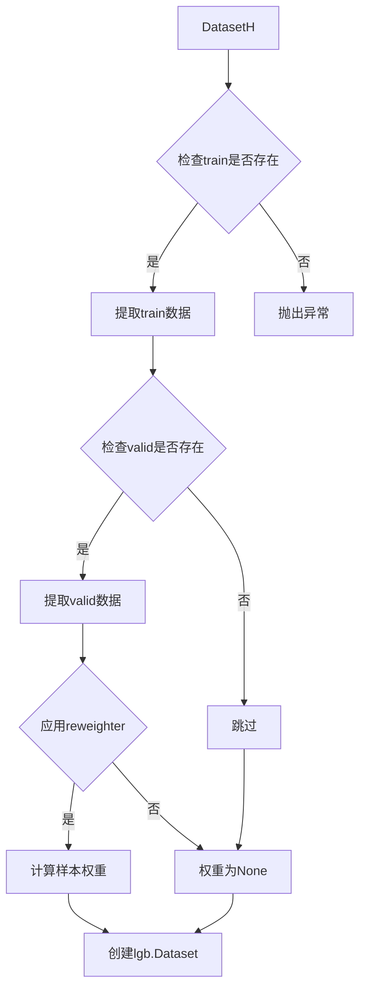
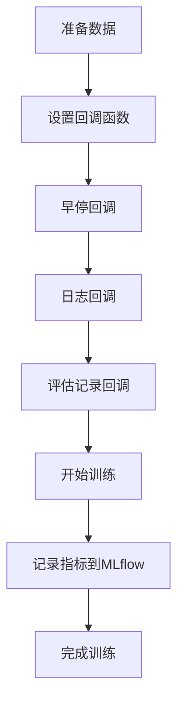

# LGBModel (LightGBM Model) 模块文档

## 模块概述

`gbdt.py` 模块提供了基于 LightGBM 框架的梯度提升决策树（GBDT）模型实现。LightGBM 是一种高效的梯度提升框架，具有以下特点：

- **速度快**：基于直方图算法的决策树学习
- **内存效率高**：支持大规模数据集
- **精度高**：在多个基准数据集上表现优异
- **分布式支持**：支持单机和分布式训练

该模块主要包含一个核心类 `LGBModel`，集成了 Qlib 的模型接口、微调接口和特征重要性解释接口。

## 核心类

### LGBModel

基于 LightGBM 的预测模型，继承自 `ModelFT` 和 `LightGBMFInt` 基类。

#### 构造方法

```python
def __init__(
    self,
    loss="mse",
    early_stopping_rounds=50,
    num_boost_round=1000,
    **kwargs
)
```

**参数说明：**

| 参数名 | 类型 | 默认值 | 说明 |
|--------|------|--------|------|
| loss | str | "mse" | 损失函数类型，支持 "mse"（均方误差）或 "binary"（二分类） |
| early_stopping_rounds | int | 50 | 早停轮数，验证集性能不提升的轮数阈值 |
| num_boost_round | int | 1000 | 最大迭代轮数（树的数量） |
| **kwargs | dict | - | 其他传递给 LightGBM 的超参数 |

**异常：**
- `NotImplementedError`: 当传入不支持的损失函数类型时抛出

**支持的 LightGBM 参数：**
通过 `**kwargs` 可以传递所有 LightGBM 支持的参数，常用的包括：
- `learning_rate`: 学习率，默认 0.1
- `num_leaves`: 每棵树的叶子节点数，默认 31
- `max_depth`: 树的最大深度，默认 -1（无限制）
- `min_data_in_leaf`: 叶子节点的最小样本数，默认 20
- `feature_fraction`: 特征采样比例，默认 1.0
- `bagging_fraction`: 数据采样比例，默认 1.0
- `bagging_freq`: bagging 频率，默认 0
- `reg_alpha`: L1 正则化系数，默认 0.0
- `reg_lambda`: L2 正则化系数，默认 0.0
- `random_seed`: 随机种子

#### _prepare_data 方法

```python
def _prepare_data(
    self,
    dataset: DatasetH,
    reweighter=None
) -> List[Tuple[lgb.Dataset, str]]
```

准备训练数据，将 Qlib 数据集转换为 LightGBM Dataset 格式。

**参数说明：**

| 参数名 | 类型 | 默认值 | 说明 |
|--------|------|--------|------|
| dataset | DatasetH | 必需 | Qlib 数据集对象 |
| reweighter | Reweighter | None | 样本重加权器 |

**返回值：**
- `List[Tuple[lgb.Dataset, str]]`: 数据集列表，每个元素是一个 (Dataset, segment_name) 元组

**数据处理流程：**



**注意事项：**
- train 数据集是必需的
- valid 数据集是可选的
- LightGBM 需要 1D 数组作为标签
- 支持样本重加权

#### fit 方法

```python
def fit(
    self,
    dataset: DatasetH,
    num_boost_round=None,
    early_stopping_rounds=None,
    verbose_eval=20,
    evals_result=None,
    reweighter=None,
    **kwargs,
)
```

训练 LightGBM 模型。

**参数说明：**

| 参数名 | 类型 | 默认值 | 说明 |
|--------|------|--------|------|
| dataset | DatasetH | 必需 | 包含训练和验证数据的 Qlib 数据集对象 |
| num_boost_round | int | None | 最大迭代轮数，None 时使用构造函数的默认值 |
| early_stopping_rounds | int | None | 早停轮数，None 时使用构造函数的默认值 |
| verbose_eval | int | 20 | 日志打印频率，每 N 轮打印一次日志 |
| evals_result | dict | None | 用于存储训练和验证集评估结果的字典 |
| reweighter | Reweighter | None | 样本重加权器 |
| **kwargs | dict | - | 其他传递给 lgb.train() 的参数 |

**训练流程：**



**指标记录：**
- 训练过程中的指标会自动记录到 Qlib 的 R (MLflow) 系统中
- 指标名称格式：`{metric_name}.{segment_name}`

**示例输出：**
```
[LightGBM] [Info] [Warning] Auto-choosing row-wise multi-threading, the overhead of testing was 0.001234 seconds.
[LightGBM] [Info] Total Bins 1234
[LightGBM] [Info] Number of data points in the train set: 10000, number of used features: 100
[LightGBM] [Info] [20]	train's l2: 0.1234	valid's l2: 0.2345
```

#### predict 方法

```python
def predict(
    self,
    dataset: DatasetH,
    segment: Union[Text, slice] = "test"
)
```

使用训练好的模型进行预测。

**参数说明：**

| 参数名 | 类型 | 默认值 | 说明 |
|--------|------|--------|------|
| dataset | DatasetH | 必需 | 包含测试数据的 Qlib 数据集对象 |
| segment | Union[Text, slice] | "test" | 要预测的数据片段 |

**返回值：**
- `pd.Series`: 预测结果序列，索引与输入数据保持一致

**异常：**
- `ValueError`: 当模型尚未训练时抛出

#### finetune 方法

```python
def finetune(
    self,
    dataset: DatasetH,
    num_boost_round=10,
    verbose_eval=20,
    reweighter=None
)
```

**模型微调**：在现有模型基础上继续训练。

**参数说明：**

| 参数名 | 类型 | 默认值 | 说明 |
|--------|------|--------|------|
| dataset | DatasetH | 必需 | 用于微调的数据集 |
| num_boost_round | int | 10 | 额外训练的轮数 |
| verbose_eval | int | 20 | 日志打印频率 |
| reweighter | Reweighter | None | 样本重加权器 |

**微调机制：**
- 使用 `init_model` 参数将已训练好的模型作为初始点
- 只在训练集上进行训练（不使用验证集）
- 适用于增量学习场景

**使用场景：**
1. 新数据到达时，不从头训练，而是在已有模型基础上继续训练
2. 在线学习：随着新数据的积累，持续优化模型
3. 迁移学习：先在源域训练，再在目标域微调

## 使用示例

### 基本使用

```python
from qlib.contrib.model.gbdt import LGBModel
from qlib.data.dataset import DatasetH

# 1. 创建模型
model = LGBModel(
    loss="mse",
    learning_rate=0.05,
    num_leaves=31,
    max_depth=-1,
    min_data_in_leaf=20,
    feature_fraction=0.8,
    bagging_fraction=0.8,
    bagging_freq=5,
    reg_alpha=0.1,
    reg_lambda=0.1,
    random_seed=42
)

# 2. 准备数据集
dataset = DatasetH(config=dataset_config)

# 3. 训练模型
model.fit(
    dataset=dataset,
    num_boost_round=1000,
    early_stopping_rounds=50,
    verbose_eval=20
)

# 4. 进行预测
preds = model.predict(dataset, segment="test")

# 5. 获取特征重要性
feature_importance = model.get_feature_importance()
print(feature_importance.head(10))
```

### 二分类任务

```python
# 创建二分类模型
model = LGBModel(
    loss="binary",
    objective="binary",
    metric="binary_logloss",
    learning_rate=0.1,
    num_boost_round=500
)

# 训练
model.fit(dataset=dataset)

# 预测概率
preds = model.predict(dataset)
```

### 使用样本重加权

```python
from qlib.data.dataset.weight import InstanceReweighter

# 创建重加权器
reweighter = InstanceReweighter(
    weight_method="exp"
)

# 训练时应用重加权
model.fit(
    dataset=dataset,
    reweighter=reweighter
)
```

### 模型微调

```python
# 初始训练
model.fit(dataset=dataset, num_boost_round=500)

# 获取新数据
new_dataset = DatasetH(config=new_dataset_config)

# 在新数据上微调
model.finetune(
    dataset=new_dataset,
    num_boost_round=100,
    verbose_eval=10
)
```

### 自定义评估指标

```python
# 训练时指定自定义指标
model.fit(
    dataset=dataset,
    num_boost_round=1000,
    feval=lambda pred, train_data: [
        ('custom_metric', custom_evaluation(pred, train_data.get_label()), True)
    ]
)
```

### 获取特征重要性

```python
# 获取默认特征重要性（按split次数）
importance = model.get_feature_importance(importance_type='split')

# 获取按增益的特征重要性
importance = model.get_feature_importance(importance_type='gain')

print("Top 10 important features:")
print(importance.head(10))
```

### 检查训练历史

```python
# 训练时记录评估结果
evals_result = {}
model.fit(
    dataset=dataset,
    evals_result=evals_result
)

# 查看训练历史
print("Train loss history:", evals_result['train']['l2'])
print("Valid loss history:", evals_result['valid']['l2'])
```

## 训练参数调优建议

### 1. 学习率和迭代次数

```python
# 低学习率需要更多迭代次数
model = LGBModel(
    learning_rate=0.01,    # 较低的学习率
    num_boost_round=10000   # 更多迭代
)

# 高学习率需要较少迭代次数
model = LGBModel(
    learning_rate=0.1,     # 较高的学习率
    num_boost_round=500     # 较少迭代
)
```

### 2. 防止过拟合

```python
# 方法1：减少叶子节点数
model = LGBModel(
    num_leaves=31,              # 默认31，可减小到15-31
    min_data_in_leaf=50,         # 增加最小样本数
    min_sum_hessian_in_leaf=1e-3 # 增加最小Hessian和
)

# 方法2：使用正则化
model = LGBModel(
    reg_alpha=0.1,    # L1正则化
    reg_lambda=0.1    # L2正则化
)

# 方法3：使用采样
model = LGBModel(
    feature_fraction=0.8,  # 特征采样
    bagging_fraction=0.8,   # 数据采样
    bagging_freq=5          # bagging频率
)
```

### 3. 处理不平衡数据

```python
# 方法1：通过样本权重
model.fit(dataset, reweighter=imbalance_reweighter)

# 方法2：通过class_weight（二分类）
model = LGBModel(
    scale_pos_weight=10  # 正样本权重是负样本的10倍
)
```

### 4. 处理缺失值

```python
# LightGBM自动处理缺失值，但可以控制
model = LGBModel(
    use_missing=True,              # 使用缺失值
    zero_as_missing=False,          # 不将0视为缺失
    feature_pre_filter=True        # 特征预过滤
)
```

## 模型保存与加载

```python
import pickle

# 保存模型
with open('lgb_model.pkl', 'wb') as f:
    pickle.dump(model, f)

# 加载模型
with open('lgb_model.pkl', 'rb') as f:
    loaded_model = pickle.load(f)

# 或者直接保存LightGBM模型
model.model.save_model('lgb_model.txt')

# 加载LightGBM模型
loaded_model = LGBModel()
loaded_model.model = lgb.Booster(model_file='lgb_model.txt')
```

## 性能优化

### 1. 数据加载优化

```python
# 使用free_raw_data=False保留原始数据
model.fit(dataset, free_raw_data=False)
```

### 2. 多线程设置

```python
import os

# 设置线程数
os.environ['LIGHTGBM_EXEC_INFO'] = 'num_threads=4'

# 或者在训练时设置
model.fit(
    dataset,
    num_threads=4,
    force_col_wise=True  # 按列处理
)
```

### 3. 内存优化

```python
# 使用更小的数据类型
model = LGBModel(
    max_bin=255,        # 减少bin数量
    min_data_in_bin=10,  # 每个bin的最小数据量
    two_round=True       # 两轮加载
)
```

## 注意事项

1. **标签格式要求**：LightGBM 不支持多标签训练，标签必须是 1D 数组
2. **数据集要求**：train 数据集是必需的，valid 数据集是可选的
3. **早停机制**：只有在有 valid 数据集时才生效
4. **指标记录**：训练指标会自动记录到 Qlib 的 MLflow 系统
5. **参数兼容性**：确保传递的参数与 LightGBM 版本兼容

## 常见问题

### Q1: 如何处理训练不收敛？

**A:** 尝试以下方法：
- 降低学习率
- 增加 `num_boost_round`
- 检查数据质量和特征工程
- 增加正则化参数

### Q2: 如何加速训练？

**A:** 尝试以下方法：
- 使用 `max_bin` 减少 bin 数量
- 减少 `num_leaves`
- 使用 `feature_fraction` 和 `bagging_fraction` 采样
- 调整线程数设置

### Q3: 如何处理类别特征？

**A:** LightGBM 支持类别特征：
```python
model = LGBModel(
    categorical_feature=[0, 1, 2]  # 指定类别特征的索引
)
```

### Q4: 如何导出模型为其他格式？

**A:** LightGBM 支持多种导出格式：
```python
# 导出为文本格式
model.model.save_model('model.txt')

# 导出为JSON格式
model.model.save_model('model.json')

# 导出为C++代码
model.model.save_model('model.cpp', num_iteration=-1, pred_parameter='tree')
```

## 相关文档

- [LightGBM 官方文档](https://lightgbdt.readthedocs.io/)
- [LightGBM Python API](https://lightgbm.readthedocs.io/en/latest/Python-API.html)
- [Qlib 模型基类](../../model/base.py)
- [Qlib 特征重要性接口](../../model/interpret/base.py)

## 版本历史

- 当前版本支持所有标准的 LightGBM 参数
- 支持模型微调（finetune）功能
- 支持样本重加权
- 自动记录训练指标到 MLflow
