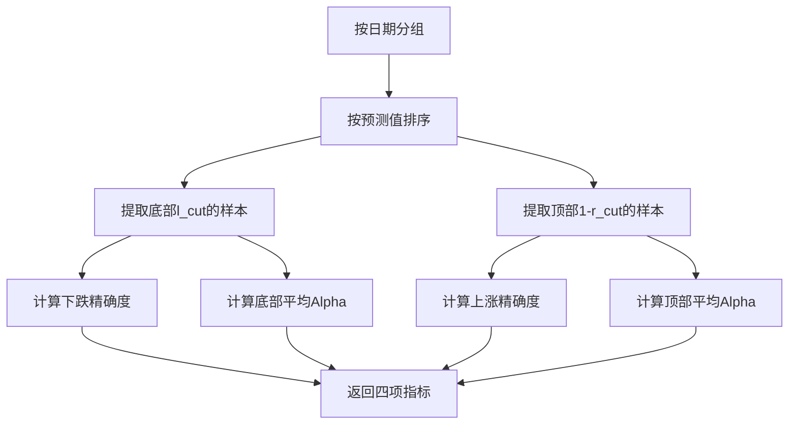
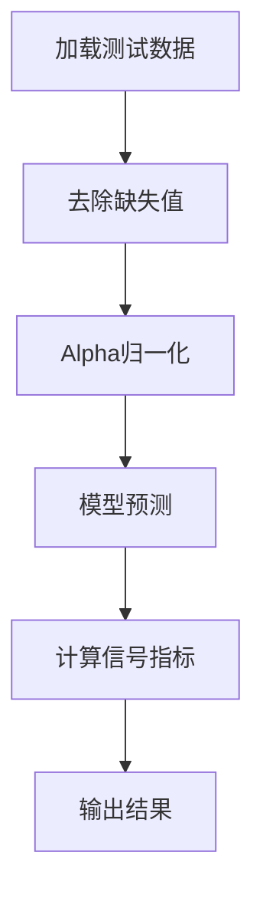
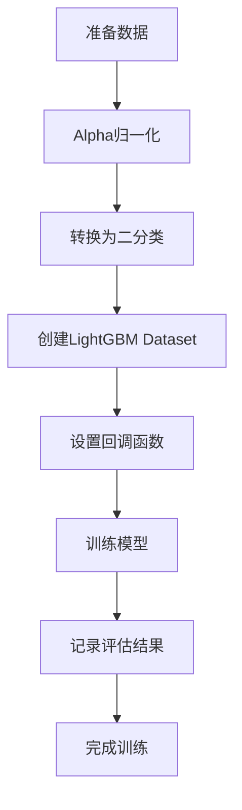

# HFLGBModel (High-Frequency LightGBM Model) 模块文档

## 模块概述

`highfreq_gdbt_model.py` 模块提供了专门用于**高频交易**预测的 LightGBM 模型实现。与标准的 LGBModel 相比，该模型具有以下特点：

1. **二分类任务**：将连续的标签转换为二分类（涨/跌）
2. **Alpha归一化**：在每个时间点上对标签进行去均值处理
3. **信号测试**：提供高频信号质量评估功能
4. **日级别评估**：按交易日计算精确度和平均收益率

该模型特别适合分钟级、秒级等高频数据的量化交易场景。

。

## 核心类

### HFLGBModel

高频 LightGBM 模型，继承自 `ModelFT` 和 `LightGBMFInt` 基类。

#### 构造方法

```python
def __init__(self, loss="mse", **kwargs)
```

**参数说明：**

| 参数名 | 类型 | 默认值 | 说明 |
|--------|------|--------|------|
| loss | str | "mse" | 损失函数类型，支持 "mse"（均方误差）或 "binary"（二分类） |
| **kwargs | dict | - | 其他传递给 LightGBM 的超参数 |

**异常：**
- `NotImplementedError`: 当传入不支持的损失函数类型时抛出

**支持的 LightGBM 参数：**
通过 `**kwargs` 可以传递所有 LightGBM 支持的参数，常用的包括：
- `learning_rate`: 学习率
- `num_leaves`: 每棵树的叶子节点数
- `max_depth`: 树的最大深度
- `min_data_in_leaf`: 叶子节点的最小样本数
- `feature_fraction`: 特征采样比例
- `bagging_fraction`: 数据采样比例
- `reg_alpha`: L1 正则化系数
- `reg_lambda`: L2 正则化系数

#### _cal_signal_metrics 方法

```python
def _cal_signal_metrics(self, y_test, l_cut, r_cut)
```

**计算高频信号指标**：按交易日（日级别）计算信号质量。

**参数说明：**

| 参数名 | 类型 | 说明 |
|--------|------|------|
| y_test | DataFrame | 包含预测值和真实标签的数据框 |
| l_cut | float | 左侧截止比例（底部预测的比例），如 0.2 表示最低20% |
| r_cut | float | 右侧截止比例（顶部预测的比例），如 0.8 表示最高20% |

**计算逻辑：**



**指标定义：**

1. **下跌精确度（down_precision）**：
   - 从底部 l_cut 样本中，真实下跌（label < 0）的比例
   - 衡量模型识别下跌信号的能力

2. **上涨精确度（up_precision）**：
   - 从顶部 (1-r_cut) 样本中，真实上涨（label > 0）的比例
   - 衡量模型识别上涨信号的能力

3. **底部平均Alpha（down_alpha）**：
   - 底部 l_cut 样本的平均收益率
   - 衡量卖出信号的预期收益

4. **顶部平均Alpha（up_alpha）**：
   - 顶部 (1-r_cut) 样本的平均收益率
   - 衡量买入信号的预期收益

**返回值：**
- `tuple`: (up_precision, down_precision, up_alpha, down_alpha)

#### hf_signal_test 方法

```python
def hf_signal_test(self, dataset: DatasetH, threhold=0.2)
```

**高频信号测试**：在测试集上评估信号质量。

**参数说明：**

| 参数名 | 类型 | 默认值 | 说明 |
|--------|------|--------|------|
| dataset | DatasetH | 必需 | 包含测试数据的 Qlib 数据集对象 |
| threhold | float | 0.2 | 截止阈值，用于计算顶部和底部的样本比例 |

**测试流程：**



**Alpha归一化：**
- 对每个时间点的标签进行去均值处理
- 公式：`label = label - label.mean(level=0)`
- 这消除了整体市场波动的影响

**输出示例：**
```
===============================
High frequency signal test
===============================
Test set precision:
Positive precision: 0.55, Negative precision: 0.53
Test Alpha Average in test set:
Positive average alpha: 0.0012, Negative average alpha: -0.0008
```

**异常：**
- `ValueError`: 当模型尚未训练时抛出

#### _prepare_data 方法

```python
def _prepare_data(self, dataset: DatasetH)
```

准备高频数据，将连续标签转换为二分类标签。

**数据处理步骤：**

1. **提取训练和验证数据数据**
2. **Alpha归一化**：对每个时间点的标签去均值
3. **标签转换**：将连续标签转换为二分类
   - label < 0 → 0（下跌）
   - label >= 0 → 1（上涨）

**代码逻辑：**
```python
# 1. 提取数据
df_train, df_valid = dataset.prepare(...)

# 2. Alpha归一化
df_train['label'] = df_train['label'] - df_train['label'].mean(level=0)

# 3. 转换为二分类
def mapping_fn(x):
    return 0 if x < 0 else 1

df_train['label_c'] = df_train['label'].apply(mapping_fn)
```

**返回值：**
- `tuple`: (dtrain, dvalid) - LightGBM Dataset 对象

**异常：**
- `ValueError`: 当数据为空或标签维度不支持时抛出

#### fit 方法

```python
def fit(
    self,
    dataset: DatasetH,
    num_boost_round=1000,
    early_stopping_rounds=50,
    verbose_eval=20,
    evals_result=None,
)
```

训练高频 LightGBM 模型。

**参数说明：**

| 参数名 | 类型 | 默认值 | 说明 |
|--------|------|--------|------|
| dataset | DatasetH | 必需 | 包含训练和验证数据的 Qlib 数据集对象 |
| num_boost_round | int | 1000 | 最大迭代轮数 |
| early_stopping_rounds | int | 50 | 早停轮数 |
| verbose_eval | int | 20 | 日志打印频率 |
| evals_result | dict | None | 用于存储训练和验证集评估结果的字典 |

**训练流程：**



**评估结果格式：**
- `evals_result['train']`: 训练集损失历史
- `evals_result['valid']`: 验证集损失历史

#### predict 方法

```python
def predict(self, dataset)
```

使用训练好的模型进行预测。

**参数说明：**

| 参数名 | 类型 | 说明 |
|--------|------|------|
| dataset | DatasetH | 包含测试数据的 Qlib 数据集对象 |

**返回值：**
- `pd.Series`: 预测结果序列，索引与输入数据保持一致

**异常：**
- `ValueError`: 当模型尚未训练时抛出

#### finetune 方法

```python
def finetune(
    self,
    dataset: DatasetH,
    num_boost_round=10,
    verbose_eval=20
)
```

模型微调：在现有模型基础上继续训练。

**参数说明：**

| 参数名 | 类型 | 默认值 | 说明 |
|--------|------|--------|:----|
| dataset | DatasetH | 必需 | 用于微调的数据集 |
| num_boost_round | int | 10 | 额外训练的轮数 |
| verbose_eval | int | 20 | 日志打印频率 |

**微调机制：**
- 使用 `init_model` 参数将已训练好的模型作为初始点
- 只在训练集上进行训练（不使用验证集）
- 适用于高频数据的增量学习场景

## 使用示例

### 基本使用

```python
from qlib.contrib.model.highfreq_gdbt_model import HFLGBModel
from qlib.data.dataset import DatasetH

# 1. 创建高频模型
model = HFLGBModel(
    loss="mse",
    learning_rate=0.05,
    num_leaves=31,
    max_depth=-1,
    min_data_in_leaf=20,
    feature_fraction=0.8,
    bagging_fraction=0.8,
    reg_alpha=0.1,
    reg_lambda=0.1
)

# 2. 准备高频数据集（1分钟级别）
dataset = DatasetH(config=hf_dataset_config)

# 3. 训练模型
model.fit(
    dataset=dataset,
    num_boost_round=1000,
    early_stopping_rounds=50,
    verbose_eval=20
)

# 4. 进行预测
preds = model.predict(dataset)

# 5. 高频信号测试
model.hf_signal_test(dataset, threhold=0.2)
```

### 高频信号测试

```python
# 训练完成后，在测试集上进行信号质量评估
model.hf_signal_test(dataset, threhold=0.2)

# 输出示例：
# Positive precision: 0.55  - 上涨信号的准确率
# Negative precision: 0.53  - 下跌信号的准确率
# Positive average alpha: 0.0012  - 买入信号的平均收益
# Negative average alpha: -0.0008  - 卖出信号的平均收益
```

### 模型微调（高频数据增量学习）

```python
# 初始训练
model.fit(dataset, num_boost_round=500)

# 获取新数据（例如：最近1天的高频数据）
new_dataset = DatasetH(config=new_hf_dataset_config)

# 在新数据上微调
model.finetune(
    dataset=new_dataset,
    num_boost_round=100,
    verbose_eval=10
)

# 重新测试信号质量
model.hf_signal_test(new_dataset, threhold=0.15)
```

### 获取特征重要性

```python
# 获取特征重要性
feature_importance = model.get_feature_importance()

print("Top 10 important features for high-frequency prediction:")
print(feature_importance.head(10))
```

### 自定义参数优化

```python
# 针对高频数据优化的参数设置
model = HFLGBModel(
    loss="mse",
    learning_rate=0.03,           # 较低的学习率
    num_leaves=63,             # 增加叶子节点
    max_depth=7,               # 限制深度防止过拟合
    min_data_in_leaf=100,      # 增加最小样本数
    feature_fraction=0.7,      # 特征采样
    bagging_fraction=0.7,       # 数据采样
    bagging_freq=1,             # 每次迭代都采样
    reg_alpha=0.2,             # L1正则化
    reg_lambda=0.2,            # L2正则化
    min_split_gain=0.01         # 最小分割增益
)
```

## 高频交易策略示例

### 基于信号的交易策略

```python
# 1. 获取预测
preds = model.predict(test_dataset)

# 2. 计算信号分位数
import numpy as np
preds_quantile = preds.groupby(level='datetime').transform(
    lambda x: pd.qcut(x, 5, labels=False, duplicates='drop')
)

# 3. 生成交易信号
signals = pd.Series(0, index=preds.index)
signals[preds_quantile == 4] = 1   # 买入信号（最高20%）
signals[preds_quantile == 0] = -1  # 卖出信号（最低20%）

# 4. 结合信号测试结果
up_precision, down_precision, up_alpha, down_alpha = model._cal_signal_metrics(
    y_test, l_cut=0.2, r_cut=0.8
)

print(f"买入信号准确率: {up_precision:.2%}")
print(f"卖出信号准确率: {down_precision:.2%}")
print(f"预期买入收益: {up_alpha:.4f}")
print(f"预期卖出收益: {down_alpha:.4f}")
```

### 多阈值策略

```python
# 测试不同阈值下的信号质量
thresholds = [0.1, 0.15, 0.2, 0.25, 0.3]

for threshold in thresholds:
    up_p, down_p, up_a, down_a = model._cal_signal_metrics(
        y_test, l_cut=threshold, r_cut=1-threshold
    )
    print(f"Threshold {threshold:.1%}:")
    print(f"  Up precision: {up_p:.2%}, Alpha: {up_a:.4f}")
    print(f"  Down precision: {down_p:.2%}, Alpha: {down_a:.4f}")
```

## 数据准备注意事项

### 1. 数据结构

高频数据通常具有以下结构：
- 多级索引：(datetime, instrument)
- datetime 精确到分钟或秒级别
- instrument 为股票代码

```python
# 数据示例
#                     feature_1  feature_2  ...  label
# datetime    instrument
# 2024-01-01 09:30:00  SH600000   1.2        0.8     ...  0.001
# 2024-01-01 09:30:00  SH600001   0.9        1.1     ...  -0.002
# ...
```

### 2. 标签归一化

模型会自动对标签进行日级别归一化：

```python
# 原始标签：包含市场整体涨跌
df['label'] = [0.01, 0.02, -0.01, ...]  # 包含市场beta

# 归一化后：去除市场影响
df['label_normalized'] = [0.005, 0.015, -0.015, ...]  # 超额收益
```

### 3. 二分类转换

模型会将归一化后的标签转换为二分类：

```python
# 归一化标签 -> 二分类标签
label_normalized > 0  -> 1 (上涨/买入)
label_normalized < 0  -> 0 (下跌/卖出)
```

## 性能优化建议

### 1. 针对高频数据的参数优化

```python
# 高频数据特点：噪音大、信号弱、样本多
model = HFLGBModel(
    # 降低学习率，提高稳定性
    learning_rate=0.02,

    # 增加模型复杂度捕捉高频模式
    num_leaves=127,
    max_depth=8,

    # 强正则化防止过拟合
    min_data_in_leaf=500,
    min_sum_hessian_in_leaf=1e-3,
    reg_alpha=0.5,
    reg_lambda=0.5,

    # 采样提高泛化能力
    feature_fraction=0.6,
    bagging_fraction=0.6,
    bagging_freq=1
)
```

### 2. 数据采样策略

```python
# 对于极高频数据，考虑时间采样
# 例如：从每5秒的数据中采样1秒
# 或：从Tick数据聚合为秒级数据
```

### 3. 特征工程

```python
# 高频特征工程建议
# 1. 动量特征：多时间窗口的收益率
# 2. 波动率特征：realized volatility, range
# 3. 微结构特征：bid-ask spread, volume imbalance
# 4. 技术指标：短期MA, MACD, RSI
# 5. 市场微观结构：order flow, tick volume
```

## 注意事项

1. **数据频率**：确保数据是高频数据（分钟级、秒级等）
2. **标签归一化**：模型会自动进行日级别归一化，无需手动处理
3. **二分类任务**：模型将预测转换为二分类，预测值为概率
4. **信号阈值**：根据数据特点调整 `threhold` 参数
5. **过拟合风险**：高频数据噪音大，需要更强的正则化
6. **计算成本**：高频数据量大，训练时间可能较长

## 与 LGBModel 的对比

| 特性 | HFLGBModel | LGBModel |
|------|------------|-----------|
| 任务类型 | 二分类 | 回归/二分类 |
| 标签处理 | Alpha归一化 + 二分类 | 直接使用 |
| 信号测试 | 支持 | 不支持 |
| 适用场景 | 高频交易 | 一般量化投资 |
| 评估指标 | 精确度 + 平均Alpha | MSE/Logloss |
| 数据要求 | 多级索引(datetime, instrument) | 标准格式 |

## 常见问题

### Q1: 如何提高高频信号的准确率？

**A:** 尝试以下方法：
- 增加模型复杂度（num_leaves, max_depth）
- 使用更多的特征，特别是高频微结构特征
- 调整信号阈值，找到最佳平衡点
- 使用更强的正则化防止过拟合

### Q2: 信号测试结果显示负收益是什么意思？

**A:** 这意味着：
- 模型在该时间段的预测能力不足
- 可能需要调整模型参数或特征
- 考虑增加数据量或提高数据质量
- 检查标签计算是否正确

### Q3: 如何处理不同频率的高频数据？

**A:** 针对不同频率调整参数：
- 秒级数据：更强的正则化，更复杂模型
- 分钟级数据：标准参数设置
- 5分钟/10分钟：接近LGBModel的参数设置

### Q4: 如何评估高频模型的实战效果？

**A:** 综合多个指标：
1. 信号测试的精确度
2. 信号测试的平均Alpha
3. 回测的收益率和夏普比率
4. 换手率和交易成本
5. 模型在不同时间段的表现稳定性

## 相关文档

- [LightGBM 官方文档](https://lightgbm.readthedocs.io/)
- [Qlib 模型基类](../../model/base.py)
- [Qlib 特征重要性接口](../../model/interpret/base.py)
- [高频交易研究](https://www.sciencedirect.com/journal/journal-of-financial-economics)

## 版本历史

- 当前版本专门针对高频交易优化
- 支持Alpha归一化自动处理
- 提供高频信号质量测试功能
- 支持模型微调用于增量学习
