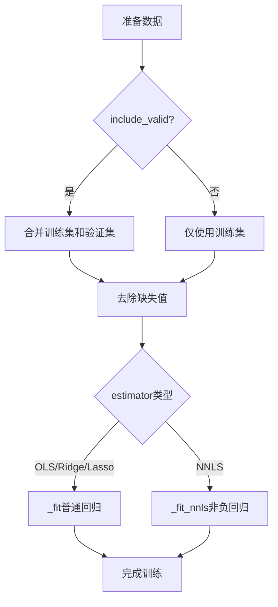

# LinearModel 模块文档

## 模块概述

`linear.py` 模块提供了多种线性回归模型的实现，包括普通最小二乘法（OLS）、非负最小二乘法（NNLS）、岭回归（Ridge）和Lasso回归。

支持的回归问题类型：
- **OLS**: `min_w |y - Xw|²₂`
- **NNLS**: `min_w |y - Xw|²₂`, s.t. `w >= 0`
- **Ridge**: `min_w |y - Xw|²₂ + α|w|²₂`
- **Lasso**: `min_w |y - Xw|²₂ + α|w|₁`

## 核心类

### LinearModel

线性回归模型，继承自 `Model` 基类。

#### 构造方法

```python
def __init__(
    self,
    estimator="ols",
    alpha=0.0,
    fit_intercept=False,
    include_valid: bool = False
)
```

**参数说明：**

| 参数名 | 类型 | 默认值 | 说明 |
|--------|------|--------|------|
| estimator | str | "ols" | 估计器类型，支持 "ols", "nnls", "ridge", "lasso" |
| alpha | float | 0.0 | L1或L2正则化系数（仅用于ridge和lasso） |
| fit_intercept | bool | False | 是否拟合截距项 |
| include_valid | bool | False | 是否将验证集包含在训练中 |

**异常：**
- `AssertionError`: 当传入不支持的估计器类型或alpha设置不当时

#### fit 方法

```python
def fit(self, dataset: DatasetH, reweighter: Reweighter = None)
```

训练线性模型。

**参数说明：**

| 参数名 | 类型 | 默认值 | 说明 |
|--------|------|--------|------|
| dataset | DatasetH | 必需 | Qlib 数据集对象 |
| reweighter | Reweighter | None | 样本重加权器 |

**返回值：**
- `self`: 返回模型实例，支持链式调用

**训练流程：**



**异常：**
- `ValueError`: 当数据为空时抛出
- `NotImplementedError`: 当NNLS使用样本权重时抛出（待实现）

#### predict 方法

```python
def predict(self, dataset: DatasetH, segment: Union[Text, slice] = "test")
```

使用训练好的模型进行预测。

**参数说明：**

| 参数名 | 类型 | 默认值 | 说明 |
|--------|------|--------|------|
| dataset | DatasetH | 必需 | Qlib 数据集对象 |
| segment | Union[Text, slice] | "test" | 要预测的数据片段 |

**返回值：**
- `pd.Series`: 预测结果序列，索引与输入数据保持一致

**预测公式：**
```python
pred = X @ coef_ + intercept_
```

**异常：**
- `ValueError`: 当模型尚未训练时抛出

## 使用示例

### 基本使用

```python
from qlib.contrib.model.linear import LinearModel
from qlib.data.dataset import DatasetH

# 1. 创建线性模型
model = LinearModel(
    estimator="ols",          # 使用普通最小二乘法
    fit_intercept=False,     # 不拟合截距
    include_valid=True        # 包含验证集
)

# 2. 准备数据集
dataset = DatasetH(config=dataset_config)

# 3. 训练模型
model.fit(dataset)

# 4. 进行预测
preds = model.predict(dataset, segment="test")
```

### 岭回归

```python
# 岭回归：添加L2正则化
model = LinearModel(
    estimator="ridge",
    alpha=1.0,                # L2正则化系数
    fit_intercept=True
)

model.fit(dataset)
preds = model.predict(dataset)
```

### Lasso回归

```python
# Lasso回归：添加L1正则化，可以产生稀疏解
model = LinearModel(
    estimator="lasso",
    alpha=0.1,                # L1正则化系数
    fit_intercept=True
)

model.fit(dataset)
preds = model.predict(dataset)

# 查看稀疏系数
print("非零系数数量:", (model.coef_ != 0).sum())
```

### 非负最小二乘法

```python
# NNLS：约束系数为非负
model = LinearModel(
    estimator="nnls",
    fit_intercept=False        # NNLS暂时不支持截距
)

model.fit(dataset)
preds = model.predict(dataset)

# 查看系数是否都非负
print("系数最小值:", model.coef_.min())
```

### 使用样本重加权

```python
from qlib.data.dataset.weight import InstanceReweighter

# 创建重加权器
reweighter = InstanceReweighter(weight_method="exp")

# 训练时应用重加权
model = LinearModel(estimator="ridge", alpha=1.0)
model.fit(dataset, reweighter=reweighter)
```

## 各估计器特点对比

| 估计器 | 特点 | 适用场景 | 优点 | 缺点 |
|--------|------|----------|------|------|
| OLS | 无约束 | 线性关系明显 | 计算快速，无偏估计 | 对异常值敏感，易过拟合 |
| NNLS | 非负约束 | 资产组合优化 | 结果可解释性强 | 可能无解 |
| Ridge | L2正则化 | 共线性数据 | 防止过拟合，数值稳定 | 系数不为零 |
| Lasso | L1正则化 | 特征选择 | 产生稀疏解 | 可能欠拟合 |

## 参数调优建议

### 1. OLS参数

```python
# 适合特征相关性低、数据噪声小的情况
model = LinearModel(
    estimator="ols",
    fit_intercept=False,
    include_valid=True
)
```

### 2. Ridge参数

```python
# alpha需要通过交叉验证选择
model = LinearModel(
    estimator="ridge",
    alpha=1.0,              # 典型值范围：0.1-10.0
    fit_intercept=True
)

# alpha越大，正则化越强，模型越简单
```

### 3. Lasso参数


```python
# alpha需要仔细调优
model = LinearModel(
    estimator="lasso",
    alpha=0.01,             # 典型值范围：0.001-1.0
    fit_intercept=True
)

# 较小的alpha保留更多特征
# 较大的alpha产生更稀疏的解
```

### 4. 是否拟合截距

```python
# 如果特征已经归一化，可以不拟合截距
model = LinearModel(fit_intercept=False)

# 如果特征未归一化，建议拟合截距
model = LinearModel(fit_intercept=True)
```

### 5. 是否包含验证集

```python
# 数据量小时，包含验证集可以增加训练样本
model = LinearModel(include_valid=True)

# 数据量大时，可以不包含验证集
model = LinearModel(include_valid=False)
```

## 模型评估

```python
# 训练模型
model.fit(dataset)

# 获取预测结果
train_preds = model.predict(dataset, segment="train")
valid_preds = model.predict(dataset, segment="valid")
test_preds = model.predict(dataset, segment="test")

# 计算评估指标
import numpy as np

train_labels = dataset.prepare("train", col_set="label").squeeze()
valid_labels = dataset.prepare("valid", col_set="label").squeeze()
test_labels = dataset.prepare("test", col_set="label").squeeze()

train_mse = np.mean((train_preds - train_labels) ** 2)
valid_mse = np.mean((valid_preds - valid_labels) ** 2)
test_mse = np.mean((test_preds - test_labels) ** 2)

print(f"Train MSE: {train_mse:.6f}")
print(f"Valid MSE: {valid_mse:.6f}")
print(f"Test MSE: {test_mse:.6f}")
```

## 系数分析

### 查看系数

```python
# 查看回归系数
print("回归系数:")
for i, coef in enumerate(model.coef_):
    print(f"  Feature {i}: {coef:.6f}")

if hasattr(model, 'intercept_'):
    print(f"截距: {model.intercept_:.6f}")
```

### 特征重要性排序

```python
# 按系数绝对值排序
feature_importance = pd.Series(
    np.abs(model.coef_),
    index=dataset.prepare("train", col_set="feature").columns
).sort_values(ascending=False)

print("特征重要性（按系数绝对值）:")
print(feature_importance.head(10))
```

### Lasso特征选择

```python
# Lasso可以自动进行特征选择
if model.estimator == model.LASSO:
    selected_features = dataset.prepare("train", col_set="feature").columns[model.coef_ != 0]
    print(f"选择的特征数量: {len(selected_features)}")
    print(f"总特征数量: {len(model.coef_)}")
    print("选择的特征:")
    print(selected_features)
```

## 注意事项

1. **数据预处理**：建议对特征进行标准化（z-score）或归一化
2. **异常值处理**：线性模型对异常值敏感，考虑使用鲁棒回归
3. **特征相关性**：如果特征高度相关，使用Ridge回归
4. **NNLS限制**：NNLS暂不支持样本重加权
5. **intercept参数**：fit_intercept=True时，特征应包含常数项或已中心化
6. **alpha选择**：正则化参数alpha需要通过交叉验证选择

## 常见问题

### Q1: OLS和Ridge如何选择？

**A:**
- 如果特征数量远大于样本数量，使用Ridge
- 如果特征之间高度相关，使用Ridge
- 如果数值不稳定（标准误很大），使用Ridge
- 其他情况可以使用OLS

### Q2: 如何选择正则化参数alpha？

**A:** 使用交叉验证：
```python
from sklearn.model_selection import cross_val_score

best_alpha = None
best_score = -np.inf

for alpha in [0.01, 0.1, 1.0, 10.0]:
    model = LinearModel(estimator="ridge", alpha=alpha)
    score = cross_val_score(..., X, y, cv=5).mean()
    if score > best_score:
        best_score = score
        best_alpha = alpha

print(f"Best alpha: {best_alpha}")
```

### Q3: Lasso和Ridge如何选择？

**A:**
- 如果希望进行特征选择：使用Lasso
- 如果希望所有特征都有贡献：使用Ridge
- 如果特征稀疏性很重要：使用Lasso
- 如果希望数值更稳定：使用Ridge

### Q4: NNLS的典型应用场景？

**A:**
- 资产组合优化（权重非负）
- 非负矩阵分解
- 光谱分解
- 任何物理上要求非负的场景

## 相关文档

- [Scikit-learn Linear Regression](https://scikit-learn.org/stable/modules/linear_model.html)
- [Scipy NNLS](https://docs.scipy.org/doc/scipy/reference/generated/scipy.optimize.nnls.html)
- [Qlib 模型基类](../../model/base.py)

## 版本历史

- 支持四种线性回归方法：OLS, NNLS, Ridge, Lasso
- 支持样本重加权（OLS, Ridge, Lasso）
- 支持包含验证集训练
- 支持拟合截距
