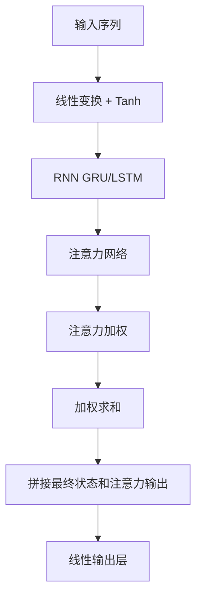

# ALSTM (Attention LSTM) 模块文档

## 模块概述

`pytorch_alstm.py` 模块实现了注意力LSTM（Attention LSTM，ALSTM）模型，该模型在LSTM基础上引入了注意力机制，用于时序预测。

### 核心特性

1. **注意力机制**：自动关注重要的时间步
2. **GRU/LSTM支持**：支持GRU和LSTM作为基础RNN
3. **多头输出**：结合最终隐藏状态和注意力输出
4. **早停机制**：支持基于验证集的早停

## 模型架构



## 核心类

### ALSTM

注意力LSTM模型，继承自 `Model` 基类。

#### 构造方法参数表

| 参数名 | 类型 | 默认值 | 说明 |
|--------|------|--------|------|
| d_feat | int | 6 | 每个时间步的输入维度 |
| hidden_size | int | 64 | 隐藏层大小 |
| num_layers | int | 2 | RNN层数 |
| dropout | float | 0.0 | Dropout比率 |
| n_epochs | int | 200 | 训练轮数 |
| lr | float | 0.001 | 学习率 |
| metric | str | "" | 早停使用的评估指标 |
| batch_size | int | 2000 | 批次大小 |
| early_stop | int | 20 | 早停轮数 |
| loss | str | "mse" | 损失函数类型 |
| optimizer | str | "adam" | 优化器类型 |
| n_jobs | int | 10 | 数据加载的工作线程数 |
| GPU | int | 0 | GPU ID |
| seed | int | None | 随机种子 |

#### ALSTMModel

注意力LSTM的PyTorch模型实现。

**网络结构：**
1. 输入层：Linear(d_feat, hidden_size) + Tanh
2. RNN层：GRU或LSTM（num_layers层）
3. 注意力网络：Linear(hidden_size, hidden_size/2) + Tanh + Linear(1)
4. 输出层：Linear(hidden_size * 2, 1)

## 使用示例

### 基本使用

```python
from qlib.contrib.model.pytorch_alstm import ALSTM

model = ALSTM(
    d_feat=6,
    hidden_size=64,
    num_layers=2,
    dropout=0.2,
    n_epochs=200,
    lr=0.001,
    batch_size=2000,
    early_stop=20,
    loss="mse",
    optimizer="adam",
    GPU=0,
    seed=42
)

model.fit(dataset)
preds = model.predict(dataset)
```

## 注意事项

1. 输入数据格式为：[batch, seq_len, feature_dim+1]，最后一列为标签
2. 模型会自动处理NaN值
3. 支持GPU训练，自动检测可用GPU

## 版本历史

- 支持GRU和LSTM
- 支持注意力机制
- 支持早停和模型保存
