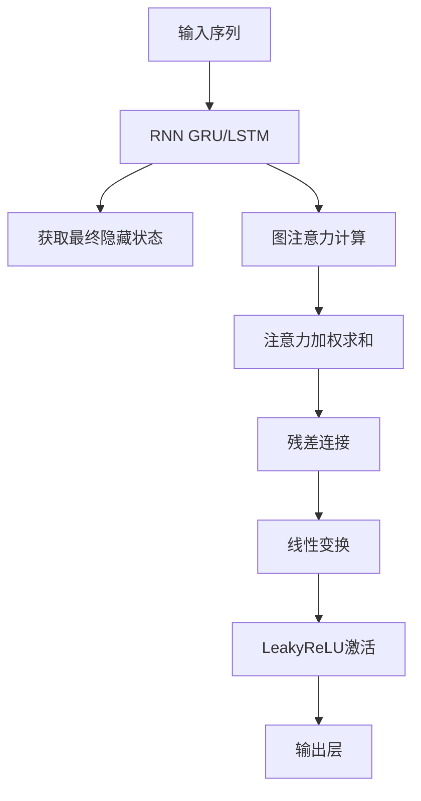

# GATs (Graph Attention Networks) 模块文档

## 模块概述

`pytorch_gats.py` 模块实现了图注意力网络（Graph Attention Networks，GATs）模型，该模型将注意力机制应用于时序预测中的时间步建模。

### 核心特性

1. **图注意力机制**：计算时间步之间的注意力权重
2. **自注意力**：每个时间步都与其他时间步进行交互
3. **残差连接**：保留原始RNN输出信息
4. **预训练支持**：支持从预训练的LSTM/GRU模型初始化

## 模型架构



## 核心类

### GATs

图注意力网络模型，继承自 `Model` 基类。

#### 构造方法参数表

| 参数名 | 类型 | 默认值 | 说明 |
|--------|------|--------|------|
| d_feat | int | 6 | 输入特征维度 |
| hidden_size | int | 64 | 隐藏层大小 |
| num_layers | int | 2 | RNN层数 |
| dropout | float | 0.0 | Dropout比率 |
| n_epochs | int | 200 | 训练轮数 |
| lr | float | 0.001 | 学习率 |
| metric | str | "" | 早停使用的评估指标 |
| early_stop | int | 20 | 早停轮数 |
| loss | str | "mse" | 损失函数类型 |
| base_model | str | "GRU" | 基础RNN类型 |
| model_path | str | None | 预训练模型路径 |
| optimizer | str | "adam" | 优化器类型 |
| GPU | int | 0 | GPU ID |
| seed | int | None | 随机种子 |

#### GATModel

图注意力网络的PyTorch模型实现。

**注意力机制：**
```python
# 计算注意力权重
attention_score = attention_net(hidden)
attention_weight = softmax(attention_score)

# 加权聚合
aggregated = attention_weight @ hidden

# 残差连接
output = fc(LeakyReLU(aggregated + hidden))
```

## 使用示例

### 基本使用

```python
from qlib.contrib.model.pytorch_gats import GATs

model = GATs(
    d_feat=6,
    hidden_size=64,
    num_layers=2,
    dropout=0.2,
    n_epochs=200,
    lr=0.001,
    early_stop=20,
    loss="mse",
    base_model="GRU",
    optimizer="adam",
    GPU=0,
    seed=42
)

model.fit(dataset)
preds = model.predict(dataset)
```

### 使用预训练模型

```python
model = GATs(
    base_model="LSTM",
    model_path="./pretrained_lstm.pth"
)

model.fit(dataset)
```

### 使用LSTM作为基础

```python
model = GATs(
    base_model="LSTM",  # 使用LSTM
    hidden_size=128,
    num_layers=2
)

model.fit(dataset)
```

## 注意事项

1. 输入数据格式为：[batch, feature_dim * seq_len]
2. 模型会自动将数据重塑为[batch, seq_len, feature_dim]
3. 注意力计算在所有时间步之间进行
4. 支持GPU训练，自动检测可用GPU

## 算法原理

### 图注意力机制

GATs使用自注意力机制建模时间步之间的依赖关系：

1. **特征变换**：对隐藏状态进行线性变换
2. **注意力计算**：计算所有时间步对的注意力得分
3. **归一化**：使用softmax归一化注意力
4. **加权聚合**：根据注意力权重聚合时间步信息
5. **残差连接**：保留原始信息

### 残差连接

```python
# 原始隐藏状态
h_original = hidden[:, -1, :]

# 注意力加权输出
h_attention = attention_weight @ hidden

# 残差连接
h_combined = h_attention + h_original

# 最终输出
output = fc_out(LeakyReLU(fc(h_combined)))
```

## 参数调优建议

### 1. 隐藏层大小

```python
# 更大的隐藏层可以捕捉更复杂的模式
model = GATs(
    hidden_size=128,
    num_layers=2
)
```

### 2. RNN层数

```python
# 更深的RNN可以学习长期依赖
model = GATs(
    hidden_size=64,
    num_layers=3,
    dropout=0.3
)
```

### 3. Dropout

```python
# 增加Dropout防止过拟合
model = GATs(
    dropout=0.3,
    hidden_size=64
)
```

### 4. 学习率

```python
# 根据训练情况调整学习率
model = GATs(
    lr=0.001,  # 标准学习率
    n_epochs=200
)
```

## 常见问题

### Q1: GATs和ALSTM有什么区别？

**A:** 
- **GATs**: 使用图注意力，所有时间步之间相互计算注意力
- **ALSTM**: 使用序列注意力，计算时间步对目标的注意力权重

### Q2: 如何选择base_model？

**A:** 
- **GRU**: 训练更快，参数更少，适合大多数场景
- **LSTM**: 参数更多，可能表现更好，但训练更慢

### Q3: 训练很慢怎么办？

**A:** 尝试以下方法：
- 减小batch_size
- 减小hidden_size
- 使用CPU训练（如果GPU内存不足）
- 减少RNN层数

### Q4: 如何保存和加载模型？

**A:** 
```python
# 保存
torch.save(model.GAT_model.state_dict(), "gats_model.pth")

# 加载
model = GATs(...)
model.GAT_model.load_state_dict(torch.load("gats_model.pth"))
```

## 相关文献

GATs模型基于以下研究：
- [Graph Attention Networks](https://arxiv.org/abs/1710.10903)
- [Temporal Attention Mechanism for Time Series](https://arxiv.org/abs/1801.02103)

## 相关文档

- [Qlib 模型基类](../../model/base.py)
- [PyTorch 官方文档](https://pytorch.org/docs/)

## 版本历史

- 支持LSTM和GRU作为基础RNN
- 支持图注意力机制
- 支持预训练模型加载
- 支持残差连接
