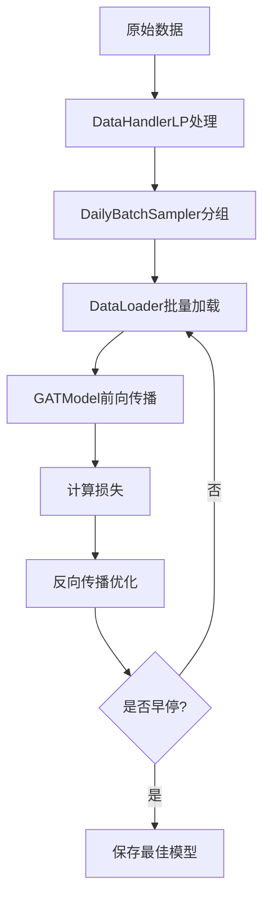
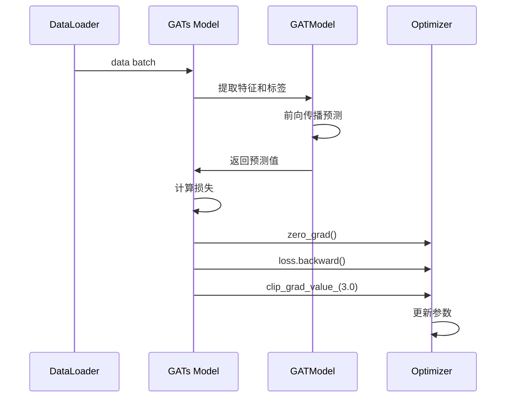
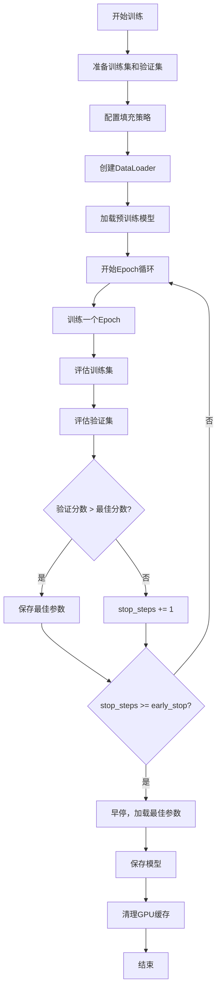
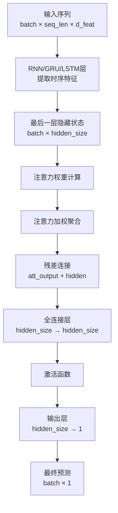
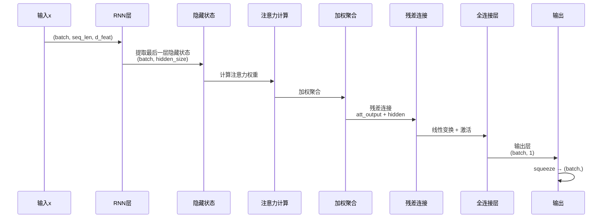

# pytorch_gats_ts 模块文档

## 模块概述

`pytorch_gats_ts.py` 模块实现了基于图注意力网络（GAT）的时间序列预测模型。该模块结合了循环神经网络（RNN）和图注意力机制，用于量化投资中的股价预测任务。

该模块包含两个主要组件：
- `GATs`：完整的模型包装类，提供训练、预测和评估接口
- `GATModel`：基于PyTorch的神经网络实现，包含RNN层和注意力机制

### 核心特性

1. **混合架构**：结合LSTM/GRU序列建模和图注意力机制
2. **批量采样**：支持按交易日批量处理数据
3. **预训练加载**：支持加载预训练的RNN模型作为基础模型
4. **早停机制**：内置早停策略防止过拟合
5. **多GPU支持**：支持CUDA加速训练

---

## 核心类定义

### 1. DailyBatchSampler

**类说明：** 按日期分批的数据采样器，用于组织训练数据。

该采样器确保同一交易日的所有样本在同一个批次中处理，这对于金融时间序列数据特别重要，因为这样可以避免未来信息泄露。

**方法：**

| 方法名 | 说明 |
|--------|------|
| `__init__(data_source)` | 初始化采样器，计算每日样本数量 |
| `__iter__()` | 返回迭代器，按日期生成批次索引 |
| `__len__()` | 返回数据源的总样本数 |

### 2. GATs

**类说明：** GATs模型的主类，继承自`Model`基类。该类提供了完整的模型训练、预测和评估功能。

**继承关系：**
```
Model (基类)
  └── GATs
```

**架构流程图：**



---

### GATs 构造方法参数

| 参数名 | 类型 | 默认值 | 说明 |
|--------|------|--------|------|
| `d_feat` | int | 20 | 每个时间步的特征维度 |
| `hidden_size` | int | 64 | 隐藏层大小 |
| `num_layers` | int | 2 | RNN层数 |
| `dropout` | float | 0.0 | Dropout丢弃率 |
| `n_epochs` | int | 200 | 训练轮数 |
| `lr` | float | 0.001 | 学习率 |
| `metric` | str | "" | 评估指标（用于早停） |
| `early_stop` | int | 20 | 早停耐心值（轮数） |
| `loss` | str | "mse" | 损失函数类型 |
| `base_model` | str | "GRU" | 基础RNN模型类型（"GRU"或"LSTM"） |
| `model_path` | str | None | 预训练模型路径 |
| `optimizer` | str | "adam" | 优化器名称 |
| `GPU` | int | 0 | GPU设备ID |
| `n_jobs` | int | 10 | 数据加载工作进程数 |
| `seed` | int | None | 随机种子 |

---

### GATs 核心方法

#### 1. `use_gpu` 属性

**说明：** 只读属性，返回是否使用GPU进行训练。

**返回值：**
- `bool`：True表示使用GPU，False表示使用CPU

#### 2. `mse(pred, label)`

**说明：** 计算均方误差（MSE）损失。

**参数：**
- `pred` (torch.Tensor)：预测值
- `label` (torch.Tensor)：真实标签

**返回值：**
- `torch.Tensor`：MSE损失值

**示例：**
```python
pred = torch.tensor([1.0, 2.0, 3.0])
label = torch.tensor([1.5, 2.5, 3.5])
loss = model.mse(pred, label)  # 返回 (0.25 + 0.25 + 0.25) / 3 = 0.25
```

#### 3. `loss_fn(pred, label)`

**说明：** 计算指定类型的损失函数，自动处理NaN值。

**参数：**
- `pred` (torch.Tensor)：预测值
- `label` (torch.Tensor)：真实标签

**返回值：**
- `torch.Tensor`：损失值

**支持的损失类型：**
- `"mse"`：均方误差

**示例：**
```python
# 模型初始化时设置 loss="mse"
model = GATs(loss="mse")
pred = model.GAT_model(features)
loss = model.loss_fn(pred, labels)  # 自动忽略NaN标签
```

#### 4. `metric_fn(pred, label)`

**说明：** 计算评估指标，用于模型选择和早停判断。

**参数：**
- `pred` (torch.Tensor)：预测值
- `label` (torch.Tensor)：真实标签

**返回值：**
- `torch.Tensor`：评估指标值（越大越好，所以损失取负）

**支持的指标：**
- `""` 或 `"loss"`：返回负损失值（因为早停希望值越大越好）

#### 5. `get_daily_inter(df, shuffle=False)`

**说明：** 组织数据为每日批次，返回每日批次的起始索引和样本数量。

**参数：**
- `df` (pd.DataFrame)：输入数据，索引包含datetime
- `shuffle` (bool)：是否打乱每日批次顺序

**返回值：**
- `tuple`：(daily_index, daily_count)
  - `daily_index`：每日批次的起始索引数组
  - `daily_count`：每日批次的样本数量数组

**示例：**
```python
df = pd.DataFrame(...)  # 索引为 MultiIndex(datetime, instrument)
daily_index, daily_count = model.get_daily_inter(df, shuffle=True)
# daily_index = [0, 150, 300, ...]  每日起始位置
# daily_count = [150, 150, 100, ...]  每日样本数
```

#### 6. `train_epoch(data_loader)`

**说明：** 执行一个训练epoch，遍历所有训练数据并更新模型参数。

**参数：**
- `data_loader` (DataLoader)：数据加载器

**训练流程：**



**代码示例：**
```python
# 内部实现逻辑
def train_epoch(self, data_loader):
    self.GAT_model.train()  # 设置为训练模式

    for data in data_loader:
        data = data.squeeze()
        feature = data[:, :, 0:-1].to(self.device)  # 特征
        label = data[:, -1, -1].to(self.device)    # 标签

        pred = self.GAT_model(feature.float())  # 前向传播
        loss = self.loss_fn(pred, label)        # 计算损失

        self.train_optimizer.zero_grad()        # 梯度清零
        loss.backward()                        # 反向传播
        torch.nn.utils.clip_grad_value_(self.GAT_model.parameters(), 3.0)  # 梯度裁剪
        self.train_optimizer.step()            # 参数更新
```

#### 7. `test_epoch(data_loader)`

**说明：** 执行一个验证/测试epoch，返回平均损失和评估指标。

**参数：**
- `data_loader` (DataLoader)：数据加载器

**返回值：**
- `tuple`：(mean_loss, mean_score)
  - `mean_loss` (float)：平均损失值
  - `mean_score` (float)：平均评估指标值

**代码示例：**
```python
# 使用示例
val_loss, val_score = model.test_epoch(valid_loader)
print(f"验证损失: {val_loss:.6f}, 验证分数: {val_score:.6f}")
```

#### 8. `fit(dataset, evals_result=dict(), save_path=None)`

**说明：** 训练模型的主方法，支持早停和模型保存。

**参数：**
- `dataset` (Dataset)：包含训练集、验证集的数据集对象
- `evals_result` (dict)：用于记录训练和验证历史的字典
- `save_path` (str)：模型保存路径

**训练流程图：**



**关键步骤说明：**

1. **数据准备**：
   ```python
   dl_train = dataset.prepare("train", col_set=["feature", "label"], data_key=DataHandlerLP.DK_L)
   dl_valid = dataset.prepare("valid", col_set=["feature", "label"], data_key=DataHandlerLP.DK_L)
   dl_train.config(fillna_type="ffill+bfill")  # 前向和后向填充NaN
   ```

2. **预训练模型加载**：
   ```python
   # 创建基础模型
   if self.base_model == "LSTM":
       pretrained_model = LSTMModel(d_feat=self.d_feat, ...)
   elif self.base_model == "GRU":
       pretrained_model = GRUModel(d_feat=self.d_feat, ...)

   # 加载预训练权重
   if self.model_path is not None:
       pretrained_model.load_state_dict(torch.load(self.model_path))

   # 将预训练权重迁移到GAT模型
   model_dict = self.GAT_model.state_dict()
   pretrained_dict = {k: v for k, v in pretrained_model.state_dict().items() if k in model_dict}
   model_dict.update(pretrained_dict)
   self.GAT_model.load_state_dict(model_dict)
   ```

3. **早停逻辑**：
   ```python
   if val_score > best_score:
       best_score = val_score
       stop_steps = 0
       best_epoch = step
       best_param = copy.deepcopy(self.GAT_model.state_dict())
   else:
       stop_steps += 1
       if stop_steps >= self.early_stop:
           break  # 早停
   ```

**使用示例：**
```python
from qlib.data.dataset import DatasetH
from qlib.contrib.data.handler import Alpha158

# 准备数据集
handler = {
    "class": "Alpha158",
    "module_path": "qlib.contrib.data.handler",
}
dataset = DatasetH(handler=handler, segments={"train": train_df, "valid": valid_df, "test": test_df})

# 训练模型
evals_result = {}
model.fit(
    dataset=dataset,
    evals_result=evals_result,
    save_path="./gats_model.pt"
)

# 查看训练历史
print(evals_result["train"])  # 训练集分数历史
print(evals_result["valid"])  # 验证集分数历史
```

#### 9. `predict(dataset)`

**说明：** 对测试集进行预测。

**参数：**
- `dataset` (Dataset)：包含测试集的数据集对象

**返回值：**
- `pd.Series`：预测值序列，索引与测试集一致

**预测流程图：**


**使用示例：**
```python
# 准备测试数据集
dataset = DatasetH(handler=handler, segments={"test": test_df})

# 进行预测
predictions = model.predict(dataset)

# 查看预测结果
print(predictions.head())
# datetime    instrument
# 2020-01-01  stock1       0.0234
#             stock2      -0.0123
# ...

# 计算预测准确率等指标
from sklearn.metrics import mean_squared_error
mse = mean_squared_error(test_labels, predictions)
```

---

### 3. GATModel

**类说明：** 基于PyTorch的神经网络实现，结合RNN和注意力机制。

**网络架构图：**



---

### GATModel 构造方法参数

| 参数名 | 类型 | 默认值 | 说明 |
|--------|------|--------|------|
| `d_feat` | int | 6 | 输入特征维度 |
| `hidden_size` | int | 64 | 隐藏层大小 |
| `num_layers` | int | 2 | RNN层数 |
| `dropout` | float | 0.0 | Dropout丢弃率 |
| `base_model` | str | "GRU" | 基础RNN类型（"GRU"或"LSTM"） |

---

### GATModel 核心方法

#### 1. `cal_attention(x, y)`

**说明：** 计算样本间的注意力权重。

**参数：**
- `x` (torch.Tensor)：查询向量，shape为 (sample_num, dim)
- `y` (torch.Tensor)：键向量，shape为 (sample_num, dim)

**返回值：**
- `torch.Tensor`：注意力权重矩阵，shape为 (sample_num, sample_num)，已通过softmax归一化

**注意力计算过程：**

```mermaid
flowchart LR
    A[x, y] --> B[线性变换<br/>transformation]
    B --> C[扩展维度<br/>expand和transpose]
    C --> D[拼接<br/>concat]
    D --> E[计算注意力分数<br/>a^T · [x; y]]
    E --> F[LeakyReLU激活]
    F --> G[Softmax归一化]
    G --> H[注意力权重]
```

**计算公式：**

```
1. x' = transformation(x)  # (sample_num, dim)
2. y' = transformation(y)  # (sample_num, dim)

3. 对于所有 i, j：
   attention_score(i, j) = LeakyReLU(a^T · [x'_i; y'_j])

4. attention_weight(i, j) = softmax(attention_score(i, j), dim=1)
```

**代码实现：**
```python
def cal_attention(self, x, y):
    # 1. 线性变换
    x = self.transformation(x)  # (sample_num, dim)
    y = self.transformation(y)

    # 2. 扩展为所有样本对
    sample_num = x.shape[0]
    dim = x.shape[1]
    e_x = x.expand(sample_num, sample_num, dim)  # 复制为 (sample_num, sample_num, dim)
    e_y = torch.transpose(e_x, 0, 1)              # 转置得到所有组合

    # 3. 计算注意力分数
    attention_in = torch.cat((e_x, e_y), 2).view(-1, dim * 2)
    self.a_t = torch.t(self.a)
    attention_out = self.a_t.mm(torch.t(attention_in)).view(sample_num, sample_num)

    # 4. 激活和归一化
    attention_out = self.leaky_relu(attention_out)
    att_weight = self.softmax(attention_out)

    return att_weight
```

#### 2. `forward(x)`

**说明：** 前向传播，从输入序列到预测输出。

**参数：**
- `x` (torch.Tensor)：输入序列，shape为 (batch, seq_len, d_feat)

**返回值：**
- `torch.Tensor`：预测输出，shape为 (batch,)

**前向传播步骤：**



**详细代码：**
```python
def forward(self, x):
    # 第一步：RNN提取时序特征
    out, _ = self.rnn(x)  # out: (batch, seq_len, hidden_size)

    # 第二步：取最后一层的隐藏状态
    hidden = out[:, -1, :]  # (batch, hidden_size)

    # 第三步：计算注意力权重和加权聚合
    att_weight = self.cal_attention(hidden, hidden)  # (batch, batch)
    hidden = att_weight.mm(hidden) + hidden           # 残差连接 (batch, hidden_size)

    # 第四步：全连接层和激活
    hidden = self.fc(hidden)          # (batch, hidden_size)
    hidden = self.leaky_relu(hidden) # (batch, hidden_size)

    # 第五步：输出预测
    return self.fc_out(hidden).squeeze()  # (batch,)
```

**示例：**
```python
import torch

# 创建模型
model = GATModel(d_feat=20, hidden_size=64, num_layers=2)

# 准备输入：batch=3, seq_len=10, d_feat=20
x = torch.randn(3, 10, 20)

# 前向传播
output = model(x)
print(output.shape)  # torch.Size([3])
print(output)        # 预测值
```

---

## 完整使用示例

### 示例1：基础训练和预测

```python
import torch
import pandas as pd
from qlib import init
from qlib.data.dataset import DatasetH
from qlib.data import D
from qlib.contrib.data.handler import Alpha158
from qlib.contrib.model.pytorch_gats_ts import GATs

# 初始化QLib
init(provider_uri="~/.qlib/qlib_data/cn_data", region="cn")

# 准备数据
handler = {
    "class": "Alpha158",
    "module_path": "qlib.contrib.data.handler",
}

# 加载数据集（示例，实际使用时替换为真实数据）
train_df = D.features(
    instruments="csi300",
    fields=["$close", "$volume"],
    start_time="2010-01-01",
    end_time="2015-12-31",
)
test_df = D.features(
    instruments="csi300",
    fields=["$close", "$volume"],
    start_time="2016-01-01",
    end_time="2016-12-31",
)

# 创建数据集
dataset = DatasetH(
    handler=handler,
    segments={"train": train_df, "valid": train_df, "test": test_df}
)

# 创建GATs模型
model = GATs(
    d_feat=20,
    hidden_size=64,
    num_layers=2,
    dropout=0.0,
    n_epochs=200,
    lr=0.001,
    metric="",
    early_stop=20,
    loss="mse",
    base_model="GRU",
    optimizer="adam",
    GPU=0,
    seed=42
)

# 训练模型
evals_result = {}
model.fit(
    dataset=dataset,
    evals_result=evals_result,
    save_path="./gats_model.pt"
)

# 查看训练历史
print("训练历史:")
for epoch, (train_score, valid_score) in enumerate(zip(evals_result["train"], evals_result["valid"])):
    print(f"Epoch {epoch}: train={train_score:.6f}, valid={valid_score:.6f}")

# 预测
predictions = model.predict(dataset)
print("\n预测结果:")
print(predictions.head())
```

### 示例2：使用预训练模型

```python
from qlib.contrib.model.pytorch_gats_ts import GATs
from qlib.contrib.model.pytorch_gru import GRUModel

# 步骤1：训练一个基础GRU模型
gru_model = GRUModel(d_feat=20, hidden_size=64, num_layers=2)
# ... 训练gru_model ...
# torch.save(gru_model.state_dict(), "./gru_pretrained.pt")

# 步骤2：使用预训练模型初始化GATs
model = GATs(
    d_feat=20,
    hidden_size=64,
    num_layers=2,
    base_model="GRU",
    model_path="./gru_pretrained.pt",  # 加载预训练模型
    GPU=0
)

# 训练GATs模型（会加载预训练权重作为初始值）
model.fit(dataset=dataset, save_path="./gats_with_pretrained.pt")
```

### 示例3：自定义训练配置

```python
# 创建模型，使用LSTM作为基础模型，调整学习率
model = GATs(
    d_feat=20,
    hidden_size=128,       # 更大的隐藏层
    num_layers=3,          # 更深的网络
    dropout=0.2,           # 添加dropout
    n_epochs=500,          # 更多训练轮数
    lr=0.0001,             # 更小的学习率
    early_stop=50,         # 更长的早停耐心
    base_model="LSTM",     # 使用LSTM
    optimizer="adam",      # Adam优化器
    GPU=0,
    n_jobs=8,              # 8个工作进程
    seed=12345
)

# 训练
evals_result = {}
model.fit(
    dataset=dataset,
    evals_result=evals_result,
    save_path="./gats_custom.pt"
)

# 绘制训练曲线
import matplotlib.pyplot as plt

plt.figure(figsize=(10, 6))
plt.plot(evals_result["train"], label="Train")
plt.plot(evals_result["valid"], label="Valid")
plt.xlabel("Epoch")
plt.ylabel("Score")
plt.title("GATs Training Curve")
plt.legend()
plt.savefig("training_curve.png")
```

### 示例4：批量预测和评估

```python
from sklearn.metrics import mean_squared_error, mean_absolute_error
import numpy as np

# 加载已训练的模型
model = GATs(d_feat=20, hidden_size=64, GPU=0)
model.GAT_model.load_state_dict(torch.load("./gats_model.pt"))
model.fitted = True
model.GAT_model.to(model.device)

# 批量预测
predictions = model.predict(dataset)

# 提取真实标签（假设标签在最后一列）
test_data = dataset.prepare("test", col_set=["feature", "label"], data_key=DataHandlerLP.DK_I)
true_labels = test_data.get_index().to_series()
# 从原始数据中提取真实标签...

# 计算评估指标
mse = mean_squared((true_labels, predictions)
mae = mean_absolute_error(true_labels, predictions)
ic = np.corrcoef(true_labels, predictions)[0, 1]

print(f"MSE: {mse:.6f}")
print(f"MAE: {mae:.6f}")
print(f"IC: {ic:.6f}")

# 分析预测结果
print("\n预测统计:")
print(f"均值: {predictions.mean():.6f}")
print(f"标准差: {predictions.std():.6f}")
print(f"最小值: {predictions.min():.6f}")
print(f"最大值: {predictions.max():.6f}")
```

---

## 注意事项

### 1. 数据准备

- **数据格式**：数据集应包含feature和label列
- **缺失值处理**：使用`fillna_type="ffill+bfill"`进行前后填充
- **批量采样**：确保同一交易日的数据在同一批次中

### 2. 模型配置

- **GPU使用**：设置`GPU=-1`可强制使用CPU
- **随机种子**：设置`seed`以确保结果可复现
- **早停**：合理的`early_stop`值可以防止过拟合

### 3. 内存管理

- **多进程加载**：`n_jobs`参数控制数据加载的并行度
- **GPU缓存**：训练结束后会自动清理GPU缓存
- **大批次**：对于大数据集，可以调整`num_workers`以优化性能

### 4. 预训练模型

- 预训练模型的基础类型必须与`base_model`参数匹配
- 只有权重名称匹配的层才会被加载
- 建议使用相同`d_feat`、`hidden_size`、`num_layers`的预训练模型

---

## 参考文献

1. Veličković, P., et al. (2018). "Graph Attention Networks." ICLR 2018.
2. Hochreiter, S., & Schmidhuber, J. (1997). "Long Short-Term Memory." Neural Computation.
3. Cho, K., et al. (2014). "Learning Phrase Representations using RNN Encoder-Decoder." EMNLP 2014.
