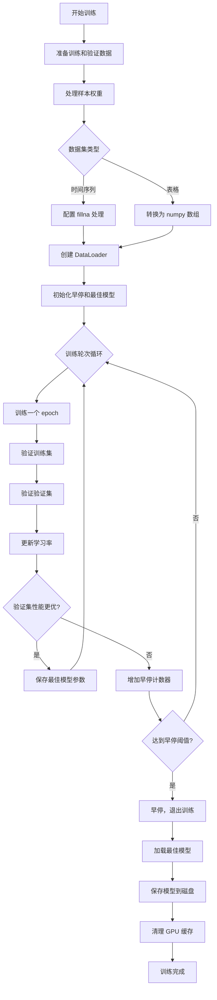
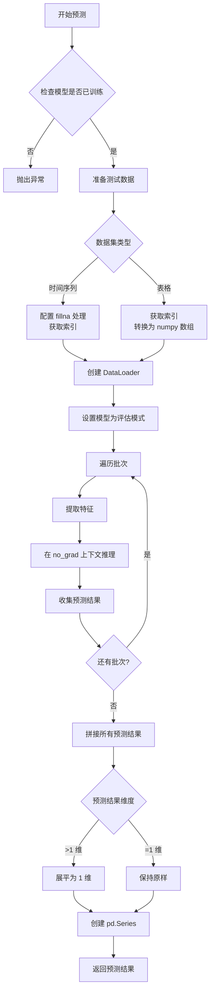
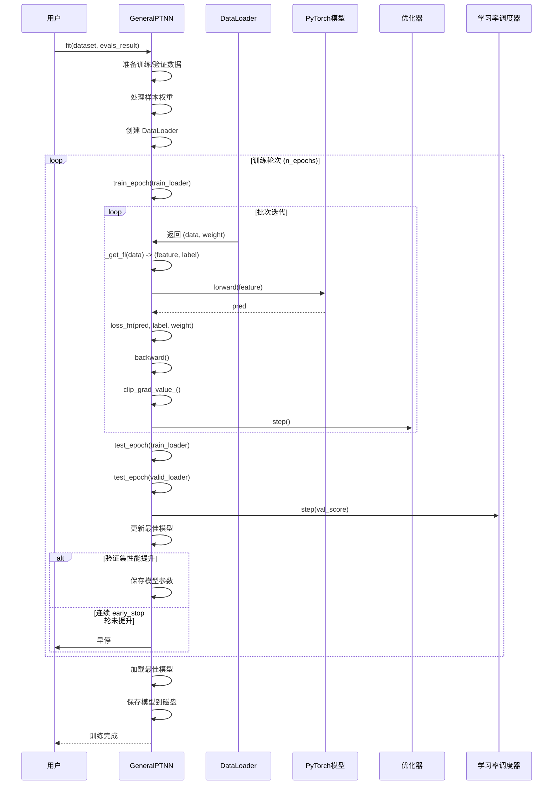
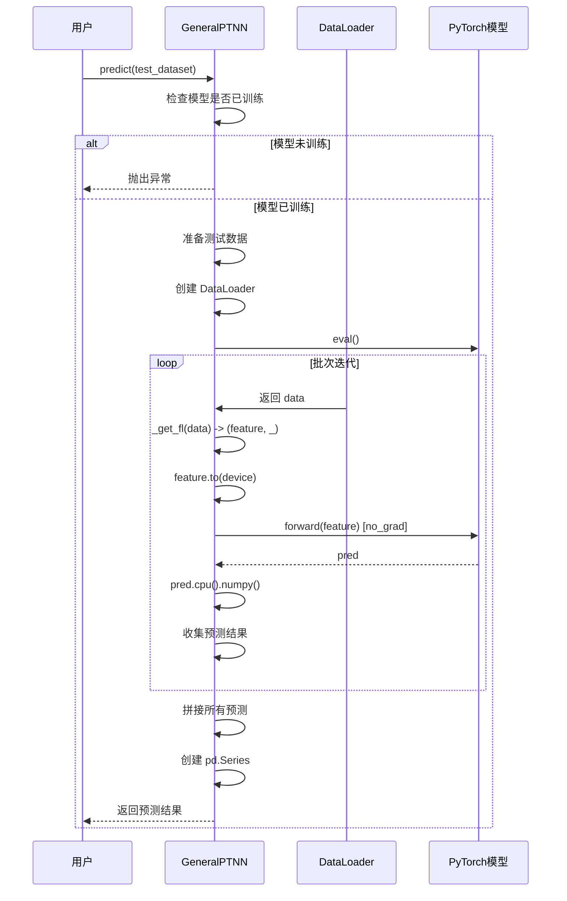

# PyTorch通用神经网络模型 (GeneralPTNN)

## 模块概述

`GeneralPTNN` 是 Qlib 提供的一个通用 PyTorch 模型适配器。它的设计目标是提供一个统一的接口，可以复用各种类型的 PyTorch 模型进行训练和预测。

该模块的主要特点包括：

- **模型通用性**：可以包装任何符合接口规范的 PyTorch 模型
- **完整训练流程**：内置训练、验证、早停机制
- **灵活配置**：支持自定义优化器、损失函数、学习率调度器
- **数据适配**：自动处理时间序列数据和表格数据两种格式
- **GPU 支持**：支持单 GPU 训练
- **早停机制**：基于验证集性能的自动早停

## 核心类定义

### GeneralPTNN

```python
class GeneralPTNN(Model)
```

**继承关系**：`GeneralPTNN` 继承自 `qlib.model.base.Model`

**类说明**：通用 PyTorch 神经网络模型适配器，提供了完整的训练和预测功能，支持各种 PyTorch 模型的集成。

## 构造方法参数

| 参数名 | 类型 | 默认值 | 说明 |
|--------|------|--------|------|
| `n_epochs` | int | 200 | 训练轮数 |
| `lr` | float | 0.001 | 学习率 |
| `metric` | str | "" | 评估指标名称，用于早停和模型选择 |
| `batch_size` | int | 2000 | 批次大小 |
| `early_stop` | int | 20 | 早停等待轮数 |
| `loss` | str | "mse" | 损失函数类型，当前仅支持 "mse" |
| `weight_decay` | float | 0.0 | 权重衰减（L2 正则化系数） |
| `optimizer` | str | "adam" | 优化器名称，支持 "adam" 或 "gd"（SGD） |
| `n_jobs` | int | 10 | 数据加载的工作线程数 |
| `GPU` | str/int | 0 | GPU ID，-1 表示使用 CPU |
| `seed` | int 或 None | None | 随机种子，用于可复现训练 |
| `pt_model_uri` | str | "qlib.contrib.model.pytorch_gru_ts.GRUModel" | PyTorch 模型的类路径 |
| `pt_model_kwargs` | dict | {"d_feat": 6, "hidden_size": 64, "num_layers": 2, "dropout": 0.0} | 传递给 PyTorch 模型的参数 |

**支持的优化器**：
- `"adam"`：Adam 优化器
- `"gd"`：SGD（梯度下降）优化器

**支持的损失函数**：
- `"mse"`：均方误差损失

## 重要方法详解

### 1. `use_gpu` 属性

```python
@property
def use_gpu(self) -> bool
```

**说明**：只读属性，返回当前是否使用 GPU。

**返回值**：
- `True`：正在使用 GPU
- `False`：使用 CPU

### 2. `mse` 方法

```python
def mse(self, pred, label, weight) -> torch.Tensor
```

**说明**：计算加权均方误差损失。

**参数**：
- `pred` (torch.Tensor)：模型预测值
- `label` (torch.Tensor)：真实标签值
- `weight` (torch.Tensor)：样本权重

**返回值**：
- `torch.Tensor`：加权均方误差值

**计算公式**：
```
loss = weight * (pred - label)^2
return mean(loss)
```

### 3. `loss_fn` 方法

```python
def loss_fn(self, pred, label, weight=None) -> torch.Tensor
```

**说明**：计算损失函数，自动处理 NaN 值。

**参数**：
- `pred` (torch.Tensor)：模型预测值
- `label` (torch.Tensor)：真实标签值
- `weight` (torch.Tensor 或 None)：样本权重，为 None 时使用全 1 权重

**返回值**：
- `torch.Tensor`：损失值

**处理逻辑**：
1. 创建非 NaN 标签的掩码
2. 如果没有提供权重，创建全 1 权重
3. 根据配置的损失类型（当前仅支持 MSE）计算损失
4. 仅对有效（非 NaN）的样本计算损失

### 4. `metric_fn` 方法

```python
def metric_fn(self, pred, label) -> torch.Tensor
```

**说明**：计算评估指标。

**参数**：
- `pred` (torch.Tensor)：模型预测值
- `label` (torch.Tensor)：真实标签值

**返回值**：
- `torch.Tensor`：评估指标值

**处理逻辑**：
1. 创建有限值的掩码（过滤 NaN 和 Inf）
2. 如果指标为空字符串或 "loss"，返回损失值
3. 否则抛出异常（当前仅支持损失作为指标）

### 5. `_get_fl` 方法

```python
def _get_fl(self, data: torch.Tensor) -> Tuple[torch.Tensor, torch.Tensor]
```

**说明**：从数据张量中提取特征和标签。该方法自动适配时间序列数据和表格数据两种格式。

**参数**：
- `data` (torch.Tensor)：输入数据张量
  - 3 维：`[batch_size, time_step, feature_dim]` - 时间序列数据
  - 2 维：`[batch_size, feature_dim]` - 表格数据

**返回值**：
- `Tuple[torch.Tensor, torch.Tensor]`：
  - 第一个元素：特征张量
  - 第二个元素：标签张量

**数据格式处理**：

时间序列数据（3 维）：
- 特征：`data[:, :, 0:-1]` - 取所有时间步，除最后一列外的所有特征
- 标签：`data[:, -1, -1]` - 取最后一个时间步的最后一列（通常是标签）

表格数据（2 维）：
- 特征：`data[:, 0:-1]` - 取除最后一列外的所有列
- 标签：`data[:, -1]` - 取最后一列（标签）

### 6. `train_epoch` 方法

```python
def train_epoch(self, data_loader: DataLoader)
```

**说明**：执行一个训练轮次。

**参数**：
- `data_loader` (DataLoader)：训练数据加载器

**训练流程**：
1. 将模型设置为训练模式
2. 遍历数据加载器中的每个批次
3. 提取特征和标签
4. 前向传播获取预测值
5. 计算损失
6. 反向传播计算梯度
7. 梯度裁剪（最大值为 3.0）以防止梯度爆炸
8. 更新模型参数

**梯度裁剪**：使用 `clip_grad_value_` 将梯度值限制在 [-3.0, 3.0] 范围内，提高训练稳定性。

### 7. `test_epoch` 方法

```python
def test_epoch(self, data_loader: DataLoader) -> Tuple[float, float]
```

**说明**：执行一个验证/测试轮次，计算损失和评估指标。

**参数**：
- `data_loader` (DataLoader)：验证/测试数据加载器

**返回值**：
- `Tuple[float, float]`：
  - 平均损失值
  - 平均评估指标值

**验证流程**：
1. 将模型设置为评估模式（禁用 Dropout 等）
2. 初始化损失和指标列表
3. 遍历数据加载器中的每个批次
4. 提取特征和标签
5. 在 `torch.no_grad()` 上下文中进行推理（不计算梯度）
6. 计算损失和指标
7. 返回所有批次的平均损失和指标

### 8. `fit` 方法

```python
def fit(
    self,
    dataset: Union[DatasetH, TSDatasetH],
    evals_result: dict = dict(),
    save_path: str = None,
    reweighter: Reweighter = None
)
```

**说明**：训练模型，支持时间序列数据集（TSDatasetH）和表格数据集（DatasetH）。

**参数**：
- `dataset` (Union[DatasetH, TSDatasetH])：数据集对象
- `evals_result` (dict)：用于存储训练过程的评估结果，格式为 `{"train": [], "valid": []}`
- `save_path` (str)：模型保存路径
- `reweighter` (Reweighter)：权重重计算器，用于样本加权

**训练流程示意图**：



**详细步骤**：

1. **数据准备**
   - 准备训练集和验证集数据
   - 检查数据是否为空

2. **权重处理**
   - 如果没有提供 reweighter，使用均匀权重
   - 如果提供了 reweighter，调用其 `reweight` 方法计算权重

3. **数据预处理**
   - 时间序列数据：配置 `fillna_type="ffill+bfill"` 处理缺失值
   - 表格数据：转换为 numpy 数组

4. **创建 DataLoader**
   - 使用 `ConcatDataset` 包装数据和权重
   - 训练集：shuffle=True
   - 验证集：shuffle=False
   - 设置批次大小和工作线程数

5. **训练循环**
   - 迭代 `n_epochs` 轮
   - 每轮执行：
     - 训练（`train_epoch`）
     - 验证训练集（`test_epoch`）
     - 验证验证集（`test_epoch`）
     - 记录评估结果
     - 更新学习率调度器

6. **早停机制**
   - 保存验证集上性能最好的模型参数
   - 如果验证集性能连续 `early_stop` 轮没有提升，提前终止训练

7. **模型保存**
   - 加载最佳模型参数
   - 保存模型到指定路径
   - 清理 GPU 缓存

**学习率调度**：
使用 `ReduceLROnPlateau` 调度器：
- 模式：`min`（最小化指标）
- 衰减因子：0.5（每触发一次学习率减半）
- 耐心值：5（连续 5 轮无改善才降低学习率）
- 最小学习率：1e-6
- 阈值：1e-5（改善小于此值不计入改善）

### 9. `predict` 方法

```python
def predict(
    self,
    dataset: Union[DatasetH, TSDatasetH],
    batch_size: int = None,
    n_jobs: int = None
) -> pd.Series
```

**说明**：使用训练好的模型进行预测。

**参数**：
- `dataset` (Union[DatasetH, TSDatasetH])：测试数据集对象
- `batch_size` (int)：预测批次大小，为 None 时使用训练时的批次大小
- `n_jobs` (int)：工作线程数，为 None 时使用训练时的线程数

**返回值**：
- `pd.Series`：预测结果，索引与测试数据集的索引对应

**预测流程示意图**：



**详细步骤**：

1. **模型检查**
   - 如果模型未训练（`self.fitted = False`），抛出异常

2. **数据准备**
   - 准备测试集数据
   - 时间序列数据：配置 `fillna_type="ffill+bfill"` 并获取索引
   - 表格数据：转换为 numpy 数组并获取索引

3. **批量预测**
   - 创建 DataLoader
   - 将模型设置为评估模式
   - 遍历测试数据加载器
   - 在 `torch.no_grad()` 上下文中进行推理
   - 收集所有批次的预测结果

4. **结果后处理**
   - 拼接所有批次的预测结果
   - 如果预测结果是多维数组，展平为一维
   - 创建带索引的 pandas Series 返回

## 使用示例

### 示例 1：使用默认 GRU 模型

```python
from qlib.contrib.model.pytorch_general_nn import GeneralPTNN
from qlib.data.dataset import DatasetH

# 创建模型实例
model = GeneralPTNN(
    n_epochs=100,
    lr=0.001,
    batch_size=2000,
    early_stop=20,
    optimizer="adam",
    GPU=0
)

# 训练模型
evals_result = {}
model.fit(
    dataset=dataset,
    evals_result=evals_result,
    save_path="./model.pt"
)

# 进行预测
predictions = model.predict(dataset=test_dataset)
```

### 示例 2：使用自定义 LSTM 模型

```python
# 创建使用 LSTM 的模型
model = GeneralPTNN(
    n_epochs=200,
    lr=0.0001,
    batch_size=1024,
    early_stop=30,
    weight_decay=1e-4,
    optimizer="adam",
    GPU=0,
    seed=42,
    pt_model_uri="qlib.contrib.model.pytorch_lstm_ts.LSTMModel",
    pt_model_kwargs={
        "d_feat": 20,        # 特征维度
        "hidden_size": 128,  # 隐藏层大小
        "num_layers": 3,      # LSTM 层数
        "dropout": 0.2        # Dropout 比例
    }
)

# 训练
evals_result = {}
model.fit(
    dataset=dataset,
    evals_result=evals_result,
    save_path="./lstm_model.pt"
)
```

### 示例 3：使用样本权重重计算器

```python
from qlib.data.dataset.weight import Reweighter

# 创建权重重计算器
class MyReweighter(Reweighter):
    def reweight(self, df):
        # 自定义权重计算逻辑
        # 例如：根据某些特征分配不同权重
        weights = np.ones(len(df))
        # ... 权重计算逻辑 ...
        return weights

reweighter = MyReweighter()

# 训练时使用权重
model.fit(
    dataset=dataset,
    reweighter=reweighter,
    save_path="./weighted_model.pt"
)
```

### 示例 4：在 Qlib 工作流中使用

```python
from qlib.workflow import R
from qlib.contrib.model.pytorch_general_nn import GeneralPTNN

# 在 Qlib 实验记录器中使用
with R.start(experiment_name="my_experiment"):
    # 配置数据集
    dataset = prepare_dataset()

    # 配置模型
    model = GeneralPTNN(
        n_epochs=100,
        lr=0.001,
        batch_size=2000,
        pt_model_uri="qlib.contrib.model.pytorch_gru_ts.GRUModel",
        pt_model_kwargs={
            "d_feat": 6,
            "hidden_size": 64,
            "num_layers": 2,
            "dropout": 0.0
        }
    )

    # 训练模型
    model.fit(dataset)

    # 保存模型
    R.save_objects(model=model)
    recorder = R.get_recorder()
    print(f"实验 ID: {recorder.id}")
```

### 示例 5：处理训练过程

```python
model = GeneralPTNN(n_epochs=200, batch_size=2000)

# 创建用于记录训练结果的字典
evals_result = {
    "train": [],  # 训练集指标
    "valid": []   # 验证集指标
}

# 训练模型
model.fit(
    dataset=dataset,
    evals_result=evals_result,
    save_path="./model.pt"
)

# 分析训练过程
import matplotlib.pyplot as plt

plt.figure(figsize=(10, 5))
plt.plot(evals_result["train"], label="Train")
plt.plot(evals_result["valid"], label="Valid")
plt.xlabel("Epoch")
plt.ylabel("Loss")
plt.title("Training History")
plt.legend()
plt.savefig("training_history.png")
```

## 训练流程图



## 预测流程图



## 注意事项

1. **数据格式要求**
   - 时间序列数据：形状应为 `[batch_size, time_step, feature_dim]`，最后一列必须是标签
   - 表格数据：形状应为 `[batch_size, feature_dim]`，最后一列必须是标签

2. **GPU 使用**
   - `GPU >= 0` 时尝试使用对应的 GPU
   - `GPU < 0` 或 CUDA 不可用时使用 CPU
   - 训练结束后会自动清理 GPU 缓存

3. **早停机制**
   - 基于验证集的性能指标
   - 连续 `early_stop` 轮性能没有提升则停止训练
   - 始终保留验证集上性能最好的模型

4. **学习率调度**
   - 使用 `ReduceLROnPlateau` 自动调整学习率
   - 默认配置：每次触发学习率减半，最小学习率为 1e-6

5. **梯度裁剪**
   - 训练时将梯度值裁剪到 [-3.0, 3.0]
   - 有助于提高训练稳定性，防止梯度爆炸

6. **缺失值处理**
   - 时间序列数据：使用 `ffill+bfill` 策略填充
   - 表格数据：转换为 numpy 数组时需确保无缺失值

7. **随机种子**
   - 设置 `seed` 参数可以确保训练的可复现性
   - 同时设置 numpy 和 torch 的随机种子

8. **模型保存**
   - 训练完成后自动保存最佳模型参数
   - 可通过 `save_path` 指定保存路径
