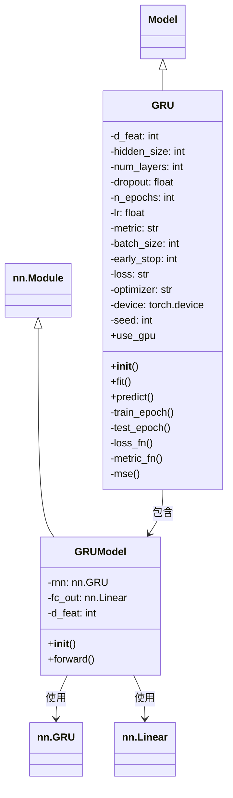
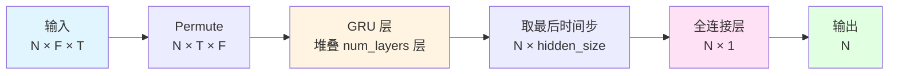

# PyTorch GRU 模型文档

## 模块概述

`pytorch_gru.py` 模块实现了基于 PyTorch 框架的 GRU (Gated Recurrent Unit) 模型，用于量化投资中的股票收益率预测。该模型继承了 Qlib 的 `Model` 基类，提供了完整的训练、预测和评估功能。

该模块包含两个核心类：
- **`GRU`**: Qlib 模型包装器，负责数据预处理、模型训练、预测和评估
- **`GRUModel`**: PyTorch 神经网络模型，定义 GRU 网络结构和前

向传播

## 模块架构



## 核心类说明

### 1. GRU 类

**GRU** 类是一个完整的 GRU 模型实现，支持自定义网络结构、训练参数和评估指标。

#### 构造方法参数表

| 参数名 | 类型 | 默认值 | 说明 |
|--------|------|--------|------|
| `d_feat` | int | 6 | 每个时间步的输入特征维度 |
| `hidden_size` | int | 64 | GRU 隐藏层大小 |
| `num_layers` | int | 2 | GRU 堆叠层数 |
| `dropout` | float | 0.0 | Dropout 比例，用于防止过拟合 |
| `n_epochs` | int | 200 | 训练轮数 |
| `lr` | float | 0.001 | 学习率 |
| `metric` | str | "" | 评估指标，用于早停 |
| `batch_size` | int | 2000 | 批量大小 |
| `early_stop` | int | 20 | 早停轮数，验证集性能不提升时停止训练 |
| `loss` | str | "mse" | 损失函数类型，支持 "mse" |
| `optimizer` | str | "adam" | 优化器名称，支持 "adam" 或 "gd" (SGD) |
| `GPU` | int | 0 | GPU ID，-1 表示使用 CPU |
| `seed` | int | None | 随机种子，用于结果可复现 |

#### 重要方法说明

##### `__init__(self, d_feat=6, hidden_size=64, num_layers=2, dropout=0.0, n_epochs=200, lr=0.001, metric="", batch_size=2000, early_stop=20, loss="mse", optimizer="adam", GPU=0, seed=None, **kwargs)`

初始化 GRU 模型。

**功能说明**：
- 设置模型超参数
- 初始化日志记录器
- 创建 GRU 神经网络模型
- 初始化优化器
- 配置计算设备（CPU 或 GPU）

**参数说明**：见上方构造方法参数表

**返回值**：无

---

##### `fit(self, dataset: DatasetH, evals_result=dict(), save_path=None)`

训练 GRU 模型。

**功能说明**：
- 准备训练数据和验证数据
- 使用早停机制防止过拟合
- 在每个 epoch 后在训练集和验证集上评估模型
- 保存验证集表现最好的模型参数
- 记录训练指标到 Qlib 的 Recorder

**参数说明**：

| 参数名 | 类型 | 说明 |
|--------|------|------|
| `dataset` | DatasetH | Qlib 数据集对象，包含训练集和验证集 |
| `evals_result` | dict | 用于存储训练和验证指标的字典 |
| `save_path` | str | 模型参数保存路径 |

**返回值**：无

**训练流程**：

```mermaid
flowchart TD
    A[开始训练] --> B[准备训练和验证集数据]
    B --> C{验证集是否为空?}
    C -->|是| D[仅使用训练集训练]
    C -->|否| E[使用训练集和验证集训练]
    D --> F[初始化最佳参数]
    E --> F
    F --> G{训练轮数 < n_epochs?}
    G -->|是| H[训练一个 epoch]
    H --> I[在训练集上评估]
    I --> J{验证集存在?}
    J -->|是| K[在验证集上评估]
    K --> L{验证分数 > 最佳分数?}
    L -->|是| M[更新最佳参数和分数<br>重置早停计数器]
    L -->|否| N[增加早停计数器<br>{早停计数 >= 早期停止轮数?}]
    N -->|是| O[早停，结束训练]
    N -->|否| P[继续训练]
    M --> P
    J -->|否| P
    P --> G
    G -->|否| Q[加载最佳参数]
    Q --> R[保存模型参数]
    R --> S[记录训练指标]
    S --> T[清理 GPU 缓存]
    T --> U[训练完成]
```

---

##### `predict(self, dataset: DatasetH, segment: Union[Text, slice] = "test")`

使用训练好的模型进行预测。

**功能说明**：
- 检查模型是否已训练
- 准备测试数据
- 使用批量推理提高效率
- 返回预测结果的 Series

**参数说明**：

| 参数名 | 类型 | 默认值 | 说明 |
|--------|------|--------|------|
| `dataset` | DatasetH | - | Qlib 数据集对象 |
| `segment` | Union[Text, slice] | "test" | 数据集片段名称，默认为 "test" |

**返回值**：
- `pd.Series`: 预测结果，索引为测试数据的索引，值为预测的收益率

**异常**：
- `ValueError`: 如果模型未训练时调用预测

---

##### `train_epoch(self, x_train, y_train)`

训练一个 epoch。

**功能说明**：
- 将模型设置为训练模式
- 随机打乱训练数据
- 分批次训练模型
- 使用梯度裁剪防止梯度爆炸
- 更新模型参数

**参数说明**：

| 参数名 | 类型 | 说明 |
|--------|------|------|
| `x_train` | pd.DataFrame | 训练特征数据 |
| `y_train` | pd.Series | 训练标签数据 |

**返回值**：无

---

##### `test_epoch(self, data_x, data_y)`

在给定数据集上评估模型。

**功能说明**：
- 将模型设置为评估模式
- 在无梯度模式下计算预测和损失
- 计算损失和评估指标
- 返回平均损失和平均指标分数

**参数说明**：

| 参数名 | 类型 | 说明 |
|--------|------|------|
| `data_x` | pd.DataFrame | 评估特征数据 |
| `data_y` | pd.Series | 评估标签数据 |

**返回值**：
- `tuple[float, float]`: (平均损失, 平均指标分数)

---

##### `loss_fn(self, pred, label)`

计算预测损失。

**功能说明**：
- 忽略标签中的 NaN 值
- 根据配置的损失类型计算损失
- 目前支持 MSE (均方误差)

**参数说明**：

| 参数名 | 类型 | 说明 |
|--------|------|------|
| `pred` | torch.Tensor | 预测值 |
| `label` | torch.Tensor | 真实标签 |

**返回值**：
- `torch.Tensor`: 损失值

**异常**：
- `ValueError`: 当损失类型不支持时

---

##### `metric_fn(self, pred, label)`

计算评估指标。

**功能说明**：
- 仅考虑有限的标签值
- 根据配置的指标类型计算指标
- 默认使用负损失值作为指标（越大越好）

**参数说明**：

| 参数名 | 类型 | 说明 |
|--------|------|------|
| `pred` | torch.Tensor | 预测值 |
| `label` | torch.Tensor | 真实标签 |

**返回值**：
- `torch.Tensor`: 指标值

**异常**：
- `ValueError`: 当指标类型不支持时

---

##### `mse(self, pred, label)`

计算均方误差。

**功能说明**：
- 计算 (pred - label)² 的平均值

**参数说明**：

| 参数名 | 类型 | 说明 |
|--------|------|------|
| `pred` | torch.Tensor | 预测值 |
| `label` | torch.Tensor | 真实标签 |

**返回值**：
- `torch.Tensor`: MSE 损失值

---

##### `use_gpu` (属性)

检查是否使用 GPU。

**返回值**：
- `bool`: True 表示使用 GPU，False 表示使用 CPU

---

### 2. GRUModel 类

**GRUModel** 类是 PyTorch 的神经网络模块，定义了 GRU 的网络结构。

#### 构造方法参数表

| 参数名 | 类型 | 默认值 | 说明 |
|--------|------|--------|------|
| `d_feat` | int | 6 | 每个时间步的输入特征维度 |
| `hidden_size` | int | 64 | GRU 隐藏层大小 |
| `num_layers` | int | 2 | GRU 堆叠层数 |
| `dropout` | float | 0.0 | Dropout 比例 |

#### 网络结构



#### 重要方法说明

##### `__init__(self, d_feat=6, hidden_size=64, num_layers=2, dropout=0.0)`

初始化 GRU 神经网络模型。

**功能说明**：
- 创建 GRU 层
- 创建输出全连接层

**参数说明**：见上方构造方法参数表

**返回值**：无

---

##### `forward(self, x)`

前向传播。

**功能说明**：
- 将输入重塑为 [N, T, F] 格式
- 通过 GRU 层提取序列特征
- 取最后一个时间步的隐藏状态
- 通过全连接层输出预测值

**参数说明**：

| 参数名 | 类型 | 说明 |
|--------|------|------|
| `x` | torch.Tensor | 输入张量，形状为 [N, F*T]，其中 N 为样本数，F 为特征数，T 为时间步数 |

**返回值**：
- `torch.Tensor`: 预测值，形状为 [N]

**数据流转换**：

```
输入: [N, F*T]
  ↓ reshape
[N, F, T]
  ↓ permute (0, 2, 1)
[N, T, F]
  ↓ GRU
[N, T, hidden_size]
  ↓ 取最后时间步
[N, hidden_size]
  ↓ Linear
[N, 1]
  ↓ squeeze
[N]
```

## 使用示例

### 基础使用示例

```python
import qlib
from qlib.workflow import R
from qlib.data.dataset import DatasetH
from qlib.contrib.model.pytorch_gru import GRU

# 1. 初始化 Qlib
qlib.init(provider_uri="~/.qlib/qlib_data/cn_data", region="cn")

# 2. 加载数据集
# 假设已经配置好了数据集
dataset = DatasetH(handler=your_data_handler)

# 3. 创建 GRU 模型
model = GRU(
    d_feat=6,           # 输入特征维度
    hidden_size=64,     # 隐藏层大小
    num_layers=2,       # GRU 层数
    dropout=0.1,        # Dropout 比例
    n_epochs=100,       # 训练轮数
    lr=0.001,           # 学习率
    metric="",          # 使用损失作为评估指标
    batch_size=2000,    # 批量大小
    early_stop=20,      # 早停轮数
    loss="mse",         # 损失函数
    optimizer="adam",   # 优化器
    GPU=0,              # 使用 GPU 0
    seed=42             # 随机种子
)

# 4. 训练模型
evals_result = {}
model.fit(
    dataset=dataset,
    evals_result=evals_result,
    save_path="path/to/save/model.pth"
)

# 5. 进行预测
predictions = model.predict(dataset, segment="test")

# 6. 查看预测结果
print(predictions.head())
```

### 使用验证集进行训练

```python
# 创建包含训练集和验证集的数据集
dataset = DatasetH(
    handler=your_data_handler,
    segments={
        "train": ("2015-01-01", "2018-12-31"),
        "valid": ("2019-01-01", "2019-12-31"),
        "test": ("2020-01-01", "2020-12-31")
    }
)

# 创建模型（启用早停机制）
model = GRU(
    d_feat=6,
    hidden_size=64,
    n_epochs=200,
    early_stop=20,  # 验证集性能 20 轮不提升则早停
    GPU=0
)

# 训练模型（会自动使用验证集进行早停）
evals_result = {}
model.fit(
    dataset=dataset,
    evals_result=evals_result,
    save_path="gru_model.pth"
)

# 查看训练和验证曲线
import matplotlib.pyplot as plt

plt.figure(figsize=(10, 6))
plt.plot(evals_result["train"], label="Train Score")
plt.plot(evals_result["valid"], label="Valid Score")
plt.xlabel("Epoch")
plt.ylabel("Score")
plt.title("Training and Validation Score")
plt.legend()
plt.show()
```

### 使用不同的优化器

```python
# 使用 SGD 优化器
model_sgd = GRU(
    d_feat=6,
    hidden_size=64,
    optimizer="gd",  # 使用 SGD
    lr=0.01,         # SGD 通常需要较大的学习率
    GPU=0
)

model_sgd.fit(dataset=dataset, save_path="gru_sgd.pth")

# 使用 Adam 优化器（默认）
model_adam = GRU(
    d_feat=6,
    hidden_size=64,
    optimizer="adam",  # 使用 Adam
    lr=0.001,
    GPU=0
)

model_adam.fit(dataset=dataset, save_path="gru_adam.pth")
```

### 使用 CPU 训练

```python
# 在没有 GPU 或想要使用 CPU 时
model_cpu = GRU(
    d_feat=6,
    hidden_size=64,
    GPU=-1  # -1 表示使用 CPU
)

model_cpu.fit(dataset=dataset, save_path="gru_cpu.pth")
```

### 批量预测多个数据集片段

```python
# 训练完成后，对多个数据集片段进行预测
predictions_train = model.predict(dataset, segment="train")
predictions_valid = model.predict(dataset, segment="valid")
predictions_test = model.predict(dataset, segment="test")

print(f"训练集预测: {len(predictions_train)} 条")
print(f"验证集预测: {len(predictions_valid)} 条")
print(f"测试集预测: {len(predictions_test)} 条")
```

## 数据格式要求

### 输入数据格式

GRU 模型期望输入数据具有以下格式：

- **特征数据** (`x_train`): DataFrame，形状为 `[N, F]`
  - N: 样本数量
  - F: 特征维度，必须为 `d_feat * T`，其中 T 为时间步数
  - 示例：如果 `d_feat=6` 且 T=60，则 F=360

- **标签数据** (`y_train`): Series，形状为 `[N]`
  - 每个样本对应一个标签值（通常为收益率预测）

### 数据预处理建议

```python
import numpy as np
import pandas as pd

# 假设原始数据形状为 [N, T, F]
# N: 样本数, T: 时间步数, F: 特征数
raw_data = np.random.randn(1000, 60, 6)  # 1000 个样本，60 个时间步，6 个特征

# 展平时间维度和特征维度: [N, T, F] -> [N, T*F]
flattened_data = raw_data.reshape(1000, 60 * 6)  # [1000, 360]

# 创建 DataFrame
x_train = pd.DataFrame(flattened_data)

# 创建标签
y_train = pd.Series(np.random.randn(1000))

# 现在可以用于训练
model.fit(dataset=dataset, evals_result={}, save_path="model.pth")
```

## 模型性能优化建议

### 1. 批量大小调整

```python
# 根据 GPU 内存调整批量大小
model_large_batch = GRU(
    d_feat=6,
    hidden_size=64,
    batch_size=8000,  # 更大的批量，GPU 内存充足时使用
    GPU=0
)

model_small_batch = GRU(
    d_feat=6,
    hidden_size=64,
    batch_size=500,   # 更小的批量，GPU 内存不足时使用
    GPU=0
)
```

### 2. 网络结构调整

```python
# 更深的网络（更多的 GRU 层）
model_deep = GRU(
    d_feat=6,
    hidden_size=64,
    num_layers=4,  # 4 层 GRU
    dropout=0.2,   # 增加 Dropout 防止过拟合
    GPU=0
)

# 更宽的网络（更大的隐藏层）
model_wide = GRU(
    d_feat=6,
    hidden_size=256,  # 更大的隐藏层
    num_layers=2,
    dropout=0.1,
    GPU=0
)
```

### 3. 学习率调整

```python
# 较大的学习率（需要监控训练稳定性）
model_high_lr = GRU(
    d_feat=6,
    hidden_size=64,
    lr=0.01,  # 较大的学习率
    GPU=0
)

# 较小的学习率（更稳定的训练）
model_low_lr = GRU(
    d_feat=6,
    hidden_size=64,
    lr=0.0001,  # 较小的学习率
    GPU=0
)
```

## 常见问题

### 1. CUDA 内存不足

如果遇到 CUDA 内存不足错误，可以尝试：

```python
# 减小批量大小
model = GRU(
    d_feat=6,
    hidden_size=64,
    batch_size=500,  # 减小批量大小
    GPU=0
)

# 或者使用 CPU
model = GRU(
    d_feat=6,
    hidden_size=64,
    GPU=-1  # 使用 CPU
)
```

### 2. 模型未训练错误

如果调用 `predict()` 前未调用 `fit()`，会抛出 `ValueError`：

```python
try:
    model = GRU(d_feat=6, GPU=0)
    predictions = model.predict(dataset)  # 会报错
except ValueError as e:
    print(f"错误: {e}")
    # 输出: model is not fitted yet!
```

### 3. 不支持的优化器

如果指定了不支持的优化器，会抛出 `NotImplementedError`：

```python
try:
    model = GRU(optimizer="rmsprop", GPU=0)  # 不支持
except NotImplementedError as e:
    print(f"错误: {e}")
    # 输出: optimizer rmsprop is not supported!
```

## 参考链接

- [PyTorch GRU 文档](https://pytorch.org/docs/stable/generated/torch.nn.GRU.html)
- [Qlib 模型基类](https://qlib.readthedocs.io/en/latest/api/qlib.model.base.html)
- [Qlib 数据集文档](https://qlib.readthedocs.io/en/latest/component/data/dataset.html)
