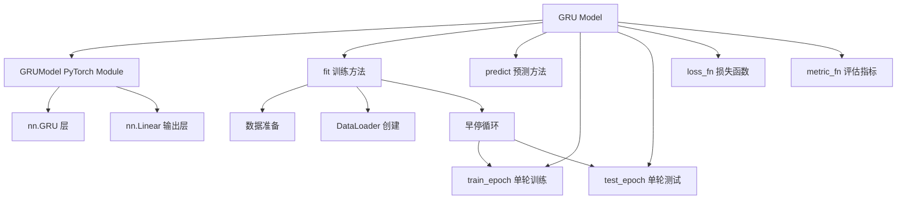
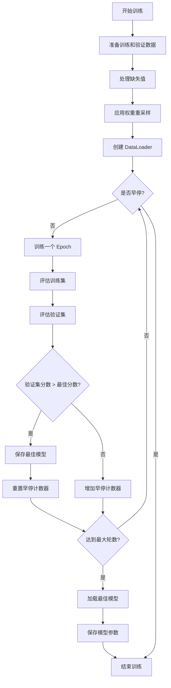
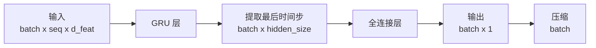

# PyTorch GRU 时间序列模型

## 模块概述

`pytorch_gru_ts.py` 模块实现了一个基于 PyTorch 的门控循环单元（GRU，Gated Recurrent Unit）时间序列预测模型。该模型主要用于量化投资领域的时间序列预测任务，能够处理序列化的特征数据并预测未来收益或价格走势。

### 主要特性

- **基于 PyTorch 框架**：利用 PyTorch 的自动微分和 GPU 加速功能
- **GRU 架构**：使用多层 GRU 网络处理时间序列数据
- **早停机制**：支持基于验证集性能的早停，防止过拟合
- **灵活的损失函数和优化器**：支持多种损失函数和优化器配置
- **权重重采样**：支持样本权重调整，处理不平衡数据
- **GPU 加速**：支持单 GPU 训练和推理

### 模块结构



## 核心类定义

### 1. GRU 类

`GRU` 是主模型类，继承自 `Model` �基类，提供了完整的训练和预测接口。

#### 类签名

```python
class GRU(Model):
    """GRU Model

    Parameters
    ----------
    d_feat : int
        input dimension for each time step
    metric: str
        the evaluation metric used in early stop
    optimizer : str
        optimizer name
    GPU : str
        the GPU ID(s) used for training
    """
```

#### 构造方法参数表

| 参数名 | 类型 | 默认值 | 必选 | 说明 |
|--------|------|--------|------|------|
| `d_feat` | int | 6 | 否 | 每个时间步的输入特征维度 |
| `hidden_size` | int | 64 | 否 | GRU 隐藏层大小 |
| `num_layers` | int | 2 | 否 | GRU 层数 |
| `dropout` | float | 0.0 | 否 | Dropout 比例，用于防止过拟合 |
| `n_epochs` | int | 200 | 否 | 训练轮数 |
| `lr` | float | 0.001 | 否 | 学习率 |
| `metric` | str | "" | 否 | 用于早停的评估指标 |
| `batch_size` | int | 2000 | 否 | 批次大小 |
| `early_stop` | int | 20 | 否 | 早停等待轮数 |
| `loss` | str | "mse" | 否 | 损失函数类型（目前仅支持 "mse"） |
| `optimizer` | str | "adam" | 否 | 优化器名称（"adam" 或 "gd"） |
| `n_jobs` | int | 10 | 否 | 数据加载的工作线程数 |
| `GPU` | int | 0 | 否 | | GPU ID，-1 表示使用 CPU |
| `seed` | int | None | 否 | 随机种子，用于结果复现 |

#### 核心属性

| 属性名 | 类型 | 说明 |
|--------|------|------|
| `device` | torch.device | 计算设备（CPU 或 CUDA） |
| `fitted` | bool | 模型是否已训练 |
| `use_gpu` | bool | 是否使用 GPU（只读属性） |
| `GRU_model` | GRUModel | PyTorch GRU 神经网络模型 |

---

### 2. GRUModel 类

`GRUModel` 是 PyTorch 神经网络模块，实现了实际的 GRU 网络结构。

#### 类签名

```python
class GRUModel(nn.Module):
    def __init__(self, d_feat=6, hidden_size=64, num_layers=2, dropout=0.0):
```

#### 构造方法参数表

| 参数名 | 类型 | 默认值 | 说明 |
|--------|------|--------|------|
| `d_feat` | int | 6 | 输入特征维度 |
| `hidden_size` | int | 64 | 隐藏层维度 |
| `num_layers` | int | 2 | GRU 层数 |
| `dropout` | float | 0.0 | Dropout 比例 |

#### 网络结构

- **rnn**: `nn.GRU` - 多层 GRU 循环神经网络
- **fc_out**: `nn.Linear` - 全连接输出层，将隐藏状态映射到单个输出

---

## 方法详细说明

### GRU 类方法

#### 1. `__init__()`

初始化 GRU 模型。

**参数**：见构造方法参数表

**功能**：
- 设置日志记录器
- 初始化超参数
- 配置计算设备（CPU 或 GPU）
- 设置随机种子（如果提供）
- 创建 GRU 神经网络模型
- 初始化优化器

**示例**：
```python
model = GRU(
    d_feat=20,           # 20维特征
    hidden_size=128,     # 128维隐藏层
    num_layers=3,        # 3层GRU
    dropout=0.2,         # 20% dropout
    n_epochs=100,        # 训练100轮
    lr=0.0001,           # 较小的学习率
    early_stop=30,        # 30轮早停
    optimizer="adam",     # 使用Adam优化器
    GPU=0,               # 使用GPU 0
    seed=42              # 固定随机种子
)
```

---

#### 2. `fit()`

训练模型。

**函数签名**：
```python
def fit(
    self,
    dataset,
    evals_result=dict(),
    save_path=None,
    reweighter=None,
):
```

**参数**：

| 参数名 | 类型 | 默认值 | 必选 | 说明 |
|--------|------|--------|------|------|
| `dataset` | Dataset | - | 是 | 训练数据集，需包含 train 和 'valid' 分割 |
| `evals_result` | dict | dict() | 否 | 用于存储训练和验证结果 |
| `save_path` | str | None | 否 | 模型保存路径 |
| `reweighter` | Reweighter | None | 否 | 样本权重重采样器 |

**返回值**：None

**功能**：
1. 准备训练和验证数据
2. 应用前向填充和后向填充处理缺失值
3. 应用权重重采样（如果提供）
4. 创建 DataLoader 进行批量训练
5. 执行训练循环，包含早停机制
6. 保存最佳模型参数

**训练流程**：



**示例**：
```python
from qlib.data.dataset import DatasetH
from qlib.data.dataset.handler import DataHandlerLP

# 准备数据集
dataset = DatasetH(
    handler=DataHandlerLP(),
    segments={
        "train": ("2010-01-01", "2016-12-31"),
        "valid": ("2017-01-01", "2018-12-31"),
        "test": ("2019-01-01", "2020-12-31"),
    }
)

# 训练模型
evals_result = {}
model.fit(
    dataset=dataset,
    evals_result=evals_result,
    save_path="./gru_model.pth",
    reweighter=None
)

# 查看训练过程
import matplotlib.pyplot as plt
plt.plot(evals_result["train"], label="Train")
plt.plot(evals_result["valid"], label="Valid")
plt.legend()
plt.show()
```

---

#### 3. `predict()`

使用训练好的模型进行预测。

**函数签名**：
```python
def predict(self, dataset):
```

**参数**：

| 参数名 | 类型 | 必选 | 说明 |
|--------|------|------|------|
| `dataset` | Dataset | 是 | 测试数据集，需包含 test 分割 |

**返回值**：
- `pd.Series`：预测结果，索引为数据的时间索引

**功能**：
1. 检查模型是否已训练
2. 准备测试数据
3. 处理缺失值
4. 批量预测
5. 返回预测结果

**示例**：
```python
# 预测
predictions = model.predict(dataset)

# 查看预测结果
print(predictions.head())
print(f"预测数量: {len(predictions)}")

# 保存预测结果
predictions.to_csv("gru_predictions.csv")
```

---

#### 4. `train_epoch()`

执行单个训练轮次。

**函数签名**：
```python
def train_epoch(self, data_loader):
```

**参数**：

| 参数名 | 类型 | 必选 | 说明 |
|--------|------|------|------|
| `data_loader` | DataLoader | 是 | 训练数据加载器 |

**返回值**：None

**功能**：
1. 设置模型为训练模式
2. 遍历所有批次
3. 前向传播计算预测
4. 计算损失
5. 反向传播计算梯度
6. 梯度裁剪（防止梯度爆炸）
7. 更新模型参数

**内部实现**：
- 从数据中提取特征（除最后一列外）和标签（最后一列的最后一个时间步）
- 使用 MSE 损失函数
- 梯度裁剪阈值为 3.0

---

#### 5. `test_epoch()`

执行单个验证/测试轮次。

**函数签名**：
```python
def test_epoch(self, data_loader):
```

**参数**：

| 参数名 | 类型 | 必选 | 说明 |
|--------|------|------|------|
| `data_loader` | DataLoader | 是 | 验证/测试数据加载器 |

**返回值**：
- `tuple[float, float]`：(平均损失, 平均分数)

**功能**：
1. 设置模型为评估模式（关闭 Dropout）
2. 遍历所有批次
3. 前向传播计算预测（不计算梯度）
4. 计算损失和评估指标
5. 返回平均损失和分数

---

#### 6. `loss_fn()`

计算损失函数。

**函数签名**：
```python
def loss_fn(self, pred, label, weight=None):
```

**参数**：

| 参数名 | 类型 | 默认值 | 必选 | 说明 |
|--------|------|--------|------|------|
| `pred` | torch.Tensor | - | 是 | 模型预测值 |
| `label` | torch.Tensor | - | 是 | 真实标签 |
| `weight` | torch.Tensor | None | 否 | 样本权重 |

**返回值**：
- `torch.Tensor`：损失值

**功能**：
1. 过滤掉 NaN 标签
2. 如果未提供权重，使用全 1 权重
3. 根据配置计算相应的损失函数
4. 支持 MSE 损失

---

#### 7. `metric_fn()`

计算评估指标。

**函数签名**：
```python
def metric_fn(self, pred, label):
```

**参数**：

| 参数名 | 类型 | 必选 | 说明 |
|--------|------|------|------|
| `pred` | torch.Tensor | 是 | 模型预测值 |
| `label` | torch.Tensor | 是 | 真实标签 |

**返回值**：
- `float`：评估分数

**功能**：
1. 过滤掉无限值标签
2. 根据配置计算相应的指标
3. 返回负损失值（因为我们希望最大化分数）

---

#### 8. `mse()`

计算 MSE 损失。

**函数签名**：
```python
def mse(self, pred, label, weight):
```

**参数**：

| 参数名 | 类型 | 必选 | 说明 |
|--------|------|------|------|
| `pred` | torch.Tensor | 是 | 预测值 |
| `label` | torch.Tensor | 是 | 真实标签 |
| `weight` | torch.Tensor | 是 | 样本权重 |

**返回值**：
- `torch.Tensor`：加权 MSE 损失

---

### GRUModel 类方法

#### 1. `__init__()`

初始化 GRU 神经网络。

**参数**：见 GRUModel 构造方法参数表

**功能**：
- 创建多层 GRU 层
- 创建输出全连接层

---

#### 2. `forward()`

前向传播。

**函数签名**：
```python
def forward(self, x):
```

**参数**：

| 参数名 | 类型 | 必选 | 说明 |
|--------|------|------|------|
| `x` | torch.Tensor | 是 | 输入张量，形状为 (batch_size, sequence_length, d_feat) |

**返回值**：
- `torch.Tensor`：输出预测值，形状为 (batch_size,)

**功能**：
1. 通过 GRU 层处理序列输入
2. 提取最后一个时间步的隐藏状态
3. 通过全连接层生成最终预测

**数据流**：



---

## 完整使用示例

### 基础示例

```python
import qlib
from qlib.data import D
from qlib.data.dataset import DatasetH
from qlib.data.dataset.handler import DataHandlerLP
from qlib.contrib.model.pytorch_gru_ts import GRU

# 初始化 Qlib
qlib.init(provider_uri="~/.qlib/qlib_data/cn_data", region="cn")

# 准备数据集
dataset = DatasetH(
    handler=DataHandlerLP(),
    segments={
        "train": ("2010-01-01", "2016-12-31"),
        "valid": ("2017-01-01", "2018-12-31"),
        "test": ("2019-01-01", "2020-12-31"),
    }
)

# 创建并配置模型
model = GRU(
    d_feat=20,
    hidden_size=64,
    num_layers=2,
    dropout=0.0,
    n_epochs=200,
    lr=0.001,
    metric="",
    batch_size=2000,
    early_stop=20,
    loss="mse",
    optimizer="adam",
    n_jobs=10,
    GPU=0,
)

# 训练模型
evals_result = {}
model.fit(
    dataset=dataset,
    evals_result=evals_result,
    save_path="./gru_model.pkl"
)

# 预测
predictions = model.predict(dataset)

# 评估
import pandas as pd
df = dataset.prepare("test", col_set=["feature", "label"], data_key=DataHandlerLP.DK_I)
labels = df.get_index().to_series(index=df.get_index()).map(df.get_label())
```

### 高级示例（带权重重采样）

```python
from qlib.data.dataset.weight import Reweighter

# 创建权重重采样器
reweighter = Reweighter(
    method="exp",
    exponential=0.5  # 指数衰减权重
)

# 训练带权重的模型
model.fit(
    dataset=dataset,
    evals_result=evals_result,
    save_path="./gru_model_weighted.pkl",
    reweighter=reweighter
)
```

### 配置文件集成

可以在 Qlib 的 workflow 配置文件中使用：

```yaml
# workflow_config_gru.yaml
qlib_init:
    provider_uri: "~/.qlib/qlib_data/cn_data"
    region: "cn"

task:
    model:
        class: GRU
        module_path: qlib.contrib.model.pytorch_gru_ts
        kwargs:
            d_feat: 20
            hidden_size: 64
            num_layers: 2
            dropout: 0.0
            n_epochs: 200
            lr: 0.001
            batch_size: 2000
            early_stop: 20
            optimizer: adam
            GPU: 0

    dataset:
        class: DatasetH
        module_path: qlib.data.dataset
        kwargs:
            handler:
                class: DataHandlerLP
                module_path: qlib.data.dataset.handler
            segments:
                train: ["2010-01-01", "2016-12-31"]
                valid: ["2017-01-01", "2018-12-31"]
                test: ["2019-01-01", "2020-12-31"]
```

运行配置：
```bash
qrun workflow_config_gru.yaml
```

---

## 性能优化建议

### 1. 批次大小选择

```python
# 小批次（内存受限时）
batch_size=500

# 大批次（GPU 内存充足时）
batch_size=4096
```

### 2. 学习率调整

```python
# 较大学习率（快速收敛）
lr=0.001

# 较小学习率（精确收敛）
lr=0.0001
```

### 3. 网络架构优化

```python
# 浅层网络（简单任务）
num_layers=1
hidden_size=32

# 深层网络（复杂任务）
num_layers=3
hidden_size=256
```

### 4. Dropout 使用

```python
# 训练时启用 Dropout
dropout=0.2

# 简单任务可关闭
dropout=0.0
```

---

## 注意事项

### 1. GPU 配置

- 确保 CUDA 可用：`torch.cuda.is_available()`
- 检查 GPU 内存：`torch.cuda.get_device_properties(0).total_memory`
- 使用 CPU 时设置 `GPU=-1`

### 2. 数据准备

- 数据必须包含特征和标签
- 特征维度必须与 `d_feat` 参数匹配
- 使用 `DataHandlerLP` 处理数据

### 3. 早停机制

- `early_stop` 参数控制早停轮数
- 验证集分数不再提升时触发早停
- 模型会保存验证集上表现最好的参数

### 4. 缺失值处理

- 数据加载器会自动处理缺失值
- 使用前向填充和后向填充（`ffill+bfill`）
- 确保数据中没有过多缺失值

### 5. 多线程加载

- `n_jobs` 参数控制数据加载线程数
- 根据 CPU 核心数调整：通常设置为 CPU 核心数
- 过多的线程可能导致性能下降

---

## 常见问题

### Q1: 如何处理内存不足？

**A**：
```python
# 减小批次大小
batch_size=500

# 减少网络参数
hidden_size=32
num_layers=1

# 使用 CPU
GPU=-1
```

### Q2: 如何提高训练速度？

**A**：
```python
# 增大批次大小
batch_size=4096

# 使用 GPU
GPU=0

# 增加 DataLoader 工作线程
n_jobs=16
```

### Q3: 模型不收敛怎么办？

**A**：
```python
# 降低学习率
lr=0.0001

# 增加训练轮数
n_epochs=500

# 检查数据质量和标签分布
```

### Q4: 如何保存和加载模型？

**A**：
```python
# 保存模型参数
torch.save(model.GRU_model.state_dict(), "model_params.pth")

# 加载模型参数
model.GRU_model.load_state_dict(torch.load("model_params.pth"))
```

---

## 参考文献

1. PyTorch 官方文档: https://pytorch.org/docs/
2. GRU 论文: Cho et al., "Learning Phrase Representations using RNN Encoder-Decoder", 2014
3. Qlib 文档: https://qlib.readthedocs.io/
