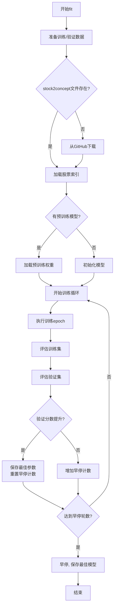
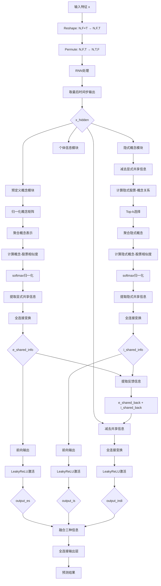

# pytorch_hist.py 模块文档

## 模块概述

`pytorch_hist.py` 模块实现了 **HIST（Historical Information-based Stock Trend）模型**，这是一个基于历史信息和概念信息的深度学习股票趋势预测模型。

HIST模型通过整合三种类型的信息来预测股票趋势：
1. **显式共享信息（Explicit Shared Information）**：基于预定义的概念类别
2. **隐式共享信息（Implicit Shared Information）**：通过计算股票间的相似度自动发现
3. **个体信息（Individual Information）**：股票独有的特征信息

### 核心特性

- 支持LSTM和GRU作为基础序列模型
- 利用预定义的概念矩阵进行股票关系建模
- 通过余弦相似度计算隐式股票关系
- 支持GPU加速训练
- 提供早停机制防止过拟合

### 相关依赖

```python
import torch
import torch.nn as nn
import torch.optim as optim
from qlib.contrib.model.pytorch_lstm import LSTMModel
from qlib.contrib.model.pytorch_gru import GRUModel
```

---

## 核心类定义

### 1. HIST 类

**继承自**: `qlib.model.base.Model`

**功能**: HIST模型的高层接口，负责模型的训练、预测和管理。

#### 构造方法

```python
def __init__(
    self,
    d_feat=6,
    hidden_size=64,
    num_layers=2,
    dropout=0.0,
    n_epochs=200,
    lr=0.001,
    metric="",
    early_stop=20,
    loss="mse",
    base_model="GRU",
    model_path=None,
    stock2concept=None,
    stock_index=None,
    optimizer="adam",
    GPU=0,
    seed=None,
    **kwargs,
)
```

#### 构造参数表

| 参数名 | 类型 | 默认值 | 说明 |
|--------|------|--------|------|
| `d_feat` | int | 6 | 每个时间步的输入特征维度 |
| `hidden_size` | int | 64 | 隐藏层大小 |
| `num_layers` | int | 2 | RNN层数 |
| `dropout` | float | 0.0 | Dropout比率 |
| `n_epochs` | int | 200 | 训练轮数 |
| `lr` | float | 0.001 | 学习率 |
| `metric` | str | "" | 评估指标（支持"ic"或""） |
| `early_stop` | int | 20 | 早停轮数 |
| `loss` | str | "mse" | 损失函数类型（支持"mse"） |
| `base_model` | str | "GRU" | 基础模型类型（"GRU"或"LSTM"） |
| `model_path` | str | None | 预训练模型路径 |
| `stock2concept` | str | None | 股票-概念矩阵文件路径 |
| `stock_index` | str | None | 股票索引字典文件路径 |
| `optimizer` | str | "adam" | 优化器类型（"adam"或"gd"） |
| `GPU` | int | 0 | GPU ID，-1表示使用CPU |
| `seed` | int | None | 随机种子 |

#### 主要方法

##### `use_gpu` 属性

```python
@property
def use_gpu(self):
    return self.device != torch.device("cpu")
```

**功能**: 返回是否使用GPU的布尔值

**返回值**: `bool` - 如果使用GPU返回True，否则返回False

##### `mse` 方法

```python
def mse(self, pred, label):
    loss = (pred - label) ** 2
    return torch.mean(loss)
```

**功能**: 计算均方误差损失

**参数**:
- `pred` (torch.Tensor): 预测值
- `label` (torch.Tensor): 真实标签

**返回值**: `torch.Tensor` - 平均均方误差

##### `loss_fn` 方法

```python
def loss_fn(self, pred, label):
    mask = ~torch.isnan(label)

    if self.loss == "mse":
        return self.mse(pred[mask], label[mask])

    raise ValueError("unknown loss `%s`" % self.loss)
```

**功能**: 计算损失函数，自动忽略NaN标签

**参数**:
- `pred` (torch.Tensor): 预测值
- `label` (torch.Tensor): 真实标签

**返回值**: `torch.Tensor` - 损失值

##### `metric_fn` 方法

```python
def metric_fn(self, pred, label):
    mask = torch.isfinite(label)

    if self.metric == "ic":
        x = pred[mask]
        y = label[mask]

        vx = x - torch.mean(x)
        vy = y - torch.mean(y)
        return torch.sum(vx * vy) / (torch.sqrt(torch.sum(vx**2)) * torch.sqrt(torch.sum(vy**2)))

    if self.metric == ("", "loss"):
        return -self.loss_fn(pred[mask], label[mask])

    raise ValueError("unknown metric `%s`" % self.metric)
```

**功能**: 计算评估指标

**参数**:
- `pred` (torch.Tensor): 预测值
- `label` (torch.Tensor): 真实标签

**返回值**: `torch.Tensor` - 评估指标值
- 当`metric="ic"`时，返回信息系数（IC）
- 当`metric=""`时，返回负损失值

##### `get_daily_inter` 方法

```python
def get_daily_inter(self, df, shuffle=False):
    # organize the train data into daily batches
    daily_count = df.groupby(level=0, group_keys=False).size().values
    daily_index = np.roll(np.cumsum(daily_count), 1)
    daily_index[0] = 0
    if shuffle:
        # shuffle data
        daily_shuffle = list(zip(daily_index, daily_count))
        np.random.shuffle(daily_shuffle)
        daily_index, daily_count = zip(*daily_shuffle)
    return daily_index, daily_count
```

**功能**: 将数据按日期组织成批次，可选择是否打乱顺序

**参数**:
- `df` (pd.DataFrame): 数据框，索引包含日期和股票代码
- `shuffle` (bool): 是否打乱日期顺序

**返回值**: `tuple` - (daily_index, daily_count)
- `daily_index`: 每日数据的起始索引
- `daily_count`: 每日数据的数量

##### `train_epoch` 方法

```python
def train_epoch(self, x_train, y_train, stock_index):
    stock2concept_matrix = np.load(self.stock2concept)
    x_train_values = x_train.values
    y_train_values = np.squeeze(y_train.values)
    stock_index = stock_index.values
    stock_index[np.isnan(stock_index)] = 733
    self.train_model.train()

    # organize the train data into daily batches
    daily_index, daily_count = self.get_daily_inter(x_train, shuffle=True)

    for idx, count in zip(daily_index, daily_count):
        batch = slice(idx, idx + count)
        feature = torch.from_numpy(x_train_values[batch]).float().to(self.device)
        concept_matrix = torch.from_numpy(stock2concept_matrix[stock_index[batch]]).float().to(self.device)
        label = torch.from_numpy(y_train_values[batch]).float().to(self.device)
        pred = self.train_model(feature, concept_matrix)
        loss = self.loss_fn(pred, label)

        self.train_optimizer.zero_grad()
        loss.backward()
        torch.nn.utils.clip_grad_value_(self.train_model.parameters(), 3.0)
        self.train_optimizer.step()
```

**功能**: 执行一个训练epoch，按日期批次训练模型

**参数**:
- `x_train` (pd.Series): 训练特征
- `y_train` (pd.Series): 训练标签
- `stock_index` (pd.Series): 股票索引

**返回值**: `None`

**训练流程**:
1. 加载股票-概念矩阵
2. 按日期组织数据并打乱顺序
3. 对每个日期批次：
   - 前向传播计算预测
   - 计算损失
   - 反向传播更新参数
   - 梯度裁剪（最大值3.0）

##### `test_epoch` 方法

```python
def test_epoch(self, data_x, data_y, stock_index):
    # prepare training data
    stock2concept_matrix = np.load(self.stock2concept)
    x_values = data_x.values
    y_values = np.squeeze(data_y.values)
    stock_index = stock_index.values
    stock_index[np.isnan(stock_index)] = 733
    self.train_model.eval()

    scores = []
    losses = []

    # organize the test data into daily batches
    daily_index, daily_count = self.get_daily_inter(data_x, shuffle=False)

    for idx, count in zip(daily_index, daily_count):
        batch = slice(idx, idx + count)
        feature = torch.from_numpy(x_values[batch]).float().to(self.device)
        concept_matrix = torch.from_numpy(stock2concept_matrix[stock_index[batch]]).float().to(self.device)
        label = torch.from_numpy(y_values[batch]).float().to(self.device)
        with torch.no_grad():
            pred = self.train_model(feature, concept_matrix)
            loss = self.loss_fn(pred, label)
            losses.append(loss.item())

            score = self.metric_fn(pred, label)
            scores.append(score.item())

    return np.mean(losses), np.mean(scores)
```

**功能**: 执行一个验证/测试epoch，计算平均损失和指标

**参数**:
- `data_x` (pd.Series): 测试特征
- `data_y` (pd.Series): 测试标签
- `stock_index` (pd.Series): 股票索引

**返回值**: `tuple` - (平均损失, 平均指标值)

##### `fit` 方法

```python
def fit(
    self,
    dataset: DatasetH,
    evals_result=dict(),
    save_path=None,
):
    df_train, df_valid, df_test = dataset.prepare(
        ["train", "valid", "test"],
        col_set=["feature", "label"],
        data_key=DataHandlerLP.DK_L,
    )
    if df_train.empty or df_valid.empty:
        raise ValueError("Empty data from dataset, please check your dataset config.")

    if not os.path.exists(self.stock2concept):
        url = "https://github.com/SunsetWolf/qlib_dataset/releases/download/v0/qlib_csi300_stock2concept.npy"
        urllib.request.urlretrieve(url, self.stock2concept)

    stock_index = np.load(self.stock_index, allow_pickle=True).item()
    df_train["stock_index"] = 733
    df_train["stock_index"] = df_train.index.get_level_values("instrument").map(stock_index)
    df_valid["stock_index"] = 733
    df_valid["stock_index"] = df_valid.index.get_level_values("instrument").map(stock_index)

    x_train, y_train, stock_index_train = df_train["feature"], df_train["label"], df_train["stock_index"]
    x_valid, y_valid, stock_index_valid = df_valid["feature"], df_valid["label"], df_valid["stock_index"]

    save_path = get_or_create_path(save_path)

    stop_steps = 0
    best_score = -np.inf
    best_epoch = 0
    evals_result["train"] = []
    evals_result["valid"] = []

    # load pretrained base_model
    if self.base_model == "LSTM":
        pretrained_model = LSTMModel()
    elif self.base_model == "GRU":
        pretrained_model = GRUModel()
    else:
        raise ValueError("unknown base model name `%s`" % self.base_model)

    if self.model_path is not None:
        self.logger.info("Loading pretrained model...")
        pretrained_model.load_state_dict(torch.load(self.model_path))

    model_dict = self.train_model.state_dict()
    pretrained_dict = {
        k: v for k, v in pretrained_model.state_dict().items() if k in model_dict
    }
    model_dict.update(pretrained_dict)
    self.train_model.load_state_dict(model_dict)
    self.logger.info("Loading pretrained model Done...")

    # train
    self.logger.info("training...")
    self.fitted = True

    for step in range(self.n_epochs):
        self.logger.info("Epoch%d:", step)
        self.logger.info("training...")
        self.train_epoch(x_train, y_train, stock_index_train)

        self.logger.info("evaluating...")
        train_loss, train_score = self.test_epoch(x_train, y_train, stock_index_train)
        val_loss, val_score = self.test_epoch(x_valid, y_valid, stock_index_valid)
        self.logger.info("train %.6f, valid %.6f" % (train_score, val_score))
        evals_result["train"].append(train_score)
        evals_result["valid"].append(val_score)

        if val_score > best_score:
            best_score = val_score
            stop_steps = 0
            best_epoch = step
            best_param = copy.deepcopy(self.train_model.state_dict())
        else:
            stop_steps += 1
            if stop_steps >= self.early_stop:
                self.logger.info("early stop")
                break

    self.logger.info("best score: %.6lf @ %d" % (best_score, best_epoch))
    self.train_model.load_state_dict(best_param)
    torch.save(best_param, save_path)
```

**功能**: 训练模型，支持预训练权重加载和早停机制

**参数**:
- `dataset` (DatasetH): Qlib数据集对象
- `evals_result` (dict): 用于存储训练和验证历史的字典
- `save_path` (str): 模型保存路径

**返回值**: `None`

**训练流程图**:



##### `predict` 方法

```python
def predict(self, dataset: DatasetH, segment: Union[Text, slice] = "test"):
    if not self.fitted:
        raise ValueError("model is not fitted yet!")

    stock2concept_matrix = np.load(self.stock2concept)
    stock_index = np.load(self.stock_index, allow_pickle=True).item()
    df_test = dataset.prepare(segment, col_set="feature", data_key=DataHandlerLP.DK_I)
    df_test["stock_index"] = 733
    df_test["stock_index"] = df_test.index.get_level_values("instrument").map(stock_index)
    stock_index_test = df_test["stock_index"].values
    stock_index_test[np.isnan(stock_index_test)] = 733
    stock_index_test = stock_index_test.astype("int")
    df_test = df_test.drop(["stock_index"], axis=1)
    index = df_test.index

    self.train_model.eval()
    x_values = df_test.values
    preds = []

    # organize the data into daily batches
    daily_index, daily_count = self.get_daily_inter(df_test, shuffle=False)

    for idx, count in zip(daily_index, daily_count):
        batch = slice(idx, idx + count)
        x_batch = torch.from_numpy(x_values[batch]).float().to(self.device)
        concept_matrix = torch.from_numpy(stock2concept_matrix[stock_index_test[batch]]).float().to(self.device)

        with torch.no_grad():
            pred = self.train_model(x_batch, concept_matrix).detach().cpu().numpy()

        preds.append(pred)

    return pd.Series(np.concatenate(preds), index=index)
```

**功能**: 对数据集进行预测

**参数**:
- `dataset` (DatasetH): Qlib数据集对象
- `segment` (Union[Text, slice]): 数据集片段（"test"、"train"或"valid"）

**返回值**: `pd.Series` - 预测结果，索引为(日期, 股票代码)

**预测流程**:
1. 验证模型已训练
2. 加载测试数据和概念矩阵
3. 按日期批次预测
4. 返回预测结果

---

### 2. HISTModel 类

**继承自**: `torch.nn.Module`

**功能**: HIST模型的神经网络实现，包含核心架构。

#### 构造方法

```python
def __init__(self, d_feat=6, hidden_size=64, num_layers=2, dropout=0.0, base_model="GRU"):
    super().__init__()

    self.d_feat = d_feat
    self.hidden_size = hidden_size

    if base_model == "GRU":
        self.rnn = nn.GRU(
            input_size=d_feat,
            hidden_size=hidden_size,
            num_layers=num_layers,
            batch_first=True,
            dropout=dropout,
        )
    elif base_model == "LSTM":
        self.rnn = nn.LSTM(
            input_size=d_feat,
            hidden_size=hidden_size,
            num_layers=num_layers,
            batch_first=True,
            dropout=dropout,
        )
    else:
        raise ValueError("unknown base model name `%s`" % base_model)

    self.fc_es = nn.Linear(hidden_size, hidden_size)
    torch.nn.init.xavier_uniform_(self.fc_es.weight)
    self.fc_is = nn.Linear(hidden_size, hidden_size)
    torch.nn.init.xavier_uniform_(self.fc_is.weight)

    # ... 更多全连接层初始化
```

**参数**:
- `d_feat` (int): 输入特征维度
- `hidden_size` (int): 隐藏层大小
- `num_layers` (int): RNN层数
- `dropout` (float): Dropout比率
- `base_model` (str): 基础模型类型（"GRU"或"LSTM"）

**网络结构**:

| 模块 | 名称 | 作用 |
|------|------|------|
| RNN | `self.rnn` | 序列特征提取（GRU/LSTM） |
| 全连接层 | `self.fc_es` | 显式共享信息变换 |
| 全连接层 | `self.fc_is` | 隐式共享信息变换 |
| 全连接层 | `self.fc_indi` | 个体信息变换 |
| 全连接层 | `self.fc_out` | 最终输出层 |
| 激活函数 | `self.leaky_relu` | LeakyReLU激活 |

#### 主要方法

##### `cal_cos_similarity` 方法

```python
def cal_cos_similarity(self, x, y):  # the 2nd dimension of x and y are the same
    xy = x.mm(torch.t(y))
    x_norm = torch.sqrt(torch.sum(x * x, dim=1)).reshape(-1, 1)
    y_norm = torch.sqrt(torch.sum(y * y, dim=1)).reshape(-1, 1)
    cos_similarity = xy / (x_norm.mm(torch.t(y_norm)) + 1e-6)
    return cos_similarity
```

**功能**: 计算两组向量之间的余弦相似度矩阵

**参数**:
- `x` (torch.Tensor): 向量集合1，形状为(N, D)
- `y` (torch.Tensor): 向量集合2，形状为(M, D)

**返回值**: `torch.Tensor` - 余弦相似度矩阵，形状为(N, M)

**计算公式**:
```
cos_sim[i, j] = (x[i] · y[j]) / (||x[i]|| × ||y[j]||)
```

##### `forward` 方法

```python
def forward(self, x, concept_matrix):
    device = torch.device(torch.get_device(x))

    x_hidden = x.reshape(len(x), self.d_feat, -1)  # [N, F, T]
    x_hidden = x_hidden.permute(0, 2, 1)  # [N, T, F]
    x_hidden, _ = self.rnn(x_hidden)
    x_hidden = x_hidden[:, -1, :]

    # Predefined Concept Module

    stock_to_concept = concept_matrix

    stock_to_concept_sum = torch.sum(stock_to_concept, 0).reshape(1, -1).repeat(stock_to_concept.shape[0], 1)
    stock_to_concept_sum = stock_to_concept_sum.mul(concept_matrix)

    stock_to_concept_sum = stock_to_concept_sum + (
        torch.ones(stock_to_concept.shape[0], stock_to_concept.shape[1]).to(device)
    )
    stock_to_concept = stock_to_concept / stock_to_concept_sum
    hidden = torch.t(stock_to_concept).mm(x_hidden)

    hidden = hidden[hidden.sum(1) != 0]

    concept_to_stock = self.cal_cos_similarity(x_hidden, hidden)
    concept_to_stock = self.softmax_t2s(concept_to_stock)

    e_shared_info = concept_to_stock.mm(hidden)
    e_shared_info = self.fc_es(e_shared_info)

    e_shared_back = self.fc_es_back(e_shared_info)
    output_es = self.fc_es_fore(e_shared_info)
    output_es = self.leaky_relu(output_es)

    # Hidden Concept Module
    i_shared_info = x_hidden - e_shared_back
    hidden = i_shared_info
    i_stock_to_concept = self.cal_cos_similarity(i_shared_info, hidden)
    dim = i_stock_to_concept.shape[0]
    diag = i_stock_to_concept.diagonal(0)
    i_stock_to_concept = i_stock_to_concept * (torch.ones(dim, dim) - torch.eye(dim)).to(device)
    row = torch.linspace(0, dim - 1, dim).to(device).long()
    column = i_stock_to_concept.max(1)[1].long()
    value = i_stock_to_concept.max(1)[0]
    i_stock_to_concept[row, column] = 10
    i_stock_to_concept[i_stock_to_concept != 10] = 0
    i_stock_to_concept[row, column] = value
    i_stock_to_concept = i_stock_to_concept + torch.diag_embed((i_stock_to_concept.sum(0) != 0).float() * diag)
    hidden = torch.t(i_shared_info).mm(i_stock_to_concept).t()
    hidden = hidden[hidden.sum(1) != 0]

    i_concept_to_stock = self.cal_cos_similarity(i_shared_info, hidden)
    i_concept_to_stock = self.softmax_t2s(i_concept_to_stock)
    i_shared_info = i_concept_to_stock.mm(hidden)
    i_shared_info = self.fc_is(i_shared_info)

    i_shared_back = self.fc_is_back(i_shared_info)
    output_is = self.fc_is_fore(i_shared_info)
    output_is = self.leaky_relu(output_is)

    # Individual Information Module
    individual_info = x_hidden - e_shared_back - i_shared_back
    output_indi = individual_info
    output_indi = self.fc_indi(output_indi)
    output_indi = self.leaky_relu(output_indi)

    # Stock Trend Prediction
    all_info = output_es + output_is + output_indi
    pred_all = self.fc_out(all_info).squeeze()

    return pred_all
```

**功能**: 前向传播，计算股票趋势预测

**参数**:
- `x` (torch.Tensor): 输入特征，形状为(N, F×T)
  - N: 股票数量
  - F: 每时间步特征数
  - T: 时间步数
- `concept_matrix` (torch.Tensor): 股票-概念矩阵，形状为(N, C)
  - C: 概念类别数量

**返回值**: `torch.Tensor` - 预测结果，形状为(N,)

**前向传播流程图**:



**模块说明**:

1. **预定义概念模块**（Predefined Concept Module）:
   - 使用预定义的概念矩阵将股票分组
   - 通过注意力机制聚合概念信息
   - 提取显式共享信息

2. **隐式概念模块**（Hidden Concept Module）:
   - 从剩余信息中发现股票间的隐式关系
   - 通过余弦相似度计算Top-k相关股票
   - 提取隐式共享信息

3. **个体信息模块**（Individual Information Module）:
   - 提取股票独有的特征信息
   - 不受其他股票影响

---

## 使用示例

### 基础使用

```python
import pandas as pd
import numpy as np
from qlib.contrib.model.pytorch_hist import HIST
from qlib.workflow import R

# 1. 准备数据集
ds = R.prepare_data(
    provider_uri="~/.qlib/qlib_data/cn_data",
    region="cn",
    experiment_name="hist_exp",
)

# 2. 创建模型实例
model = HIST(
    d_feat=6,              # 特征维度
    hidden_size=64,        # 隐藏层大小
    num_layers=2,          # RNN层数
    dropout=0.0,           # Dropout比率
    n_epochs=200,          # 训练轮数
    lr=0.001,              # 学习率
    metric="ic",           # 使用IC作为评估指标
    early_stop=20,         # 早停轮数
    loss="mse",            # 损失函数
    base_model="GRU",      # 使用GRU作为基础模型
    stock2concept="path/to/stock2concept.npy",
    stock_index="path/to/stock_index.npy",
    optimizer="adam",      # 优化器
    GPU=0,                 # GPU ID
    seed=42,               # 随机种子
)

# 3. 训练模型
evals_result = {}
model.fit(
    dataset=ds,
    evals_result=evals_result,
    save_path="path/to/model.pkl",
)

# 4. 查看训练历史
print("训练历史:", evals_result)

# 5. 预测
predictions = model.predict(ds, segment="test")
print("预测结果形状:", predictions.shape)
```

### 使用预训练模型

```python
from qlib.contrib.model.pytorch_hist import HIST

# 创建模型并加载预训练权重
model = HIST(
    d_feat=6,
    hidden_size=64,
    base_model="GRU",
    model_path="path/to/pretrained/gru_model.pkl",
    stock2concept="path/to/stock2concept.npy",
    stock_index="path/to/stock_index.npy",
)

# 加载预训练权重后继续训练
model.fit(ds, evals_result=evals_result, save_path="path/to/finetuned_model.pkl")
```

### 使用LSTM基础模型

```python
from qlib.contrib.model.pytorch_hist import HIST

# 使用LSTM替代GRU
model = HIST(
    d_feat=6,
    hidden_size=64,
    base_model="LSTM",     # 使用LSTM
    n_epochs=100,
    lr=0.0005,
    metric="ic",
    stock2concept="path/to/stock2concept.npy",
    stock_index="path/to/stock_index.npy",
)

model.fit(ds, evals_result=evals_result, save_path="path/to/l/lstm_hist.pkl")
```

### 在配置文件中使用

```yaml
# workflow_config_hist.yaml
task:
    model:
        class: HIST
        module_path: qlib.contrib.model.pytorch_hist
        kwargs:
            d_feat: 6
            hidden_size: 64
            num_layers: 2
            dropout: 0.0
            n_epochs: 200
            lr: 0.001
            metric: ic
            early_stop: 20
            loss: mse
            base_model: GRU
            stock2concept: path/to/stock2concept.npy
            stock_index: path/to/stock_index.npy
            optimizer: adam
            GPU: 0
            seed: 42
```

```bash
# 运行配置
python -m qlib.workflow.cli run workflow_config_hist.yaml
```

---

## 数据要求

### 输入数据格式

**特征数据**:
- 形状: (样本数, 特征数)
- 特征维度应与`d_feat`参数匹配
- 通常包含技术指标、市场因子等

**标签数据**:
- 形状: (样本数, 1)
- 目标变量（如未来收益率）

### 股票-概念矩阵

`stock2concept.npy` 文件应包含:
- 形状: (股票数量, 概念数量)
- 类型: numpy数组
- 值域: [0, 1]，表示股票属于概念的程度

### 股票索引映射

`stock_index.npy` 文件应包含:
- 类型: Python字典
- 键: 股票代码（字符串）
- 值: 股票索引（整数，0-732）

---

## 模型架构详解

### HIST模型核心思想

HIST模型将股票信息分解为三部分：

```
股票信息 = 显式共享信息 + 隐式共享信息 + 个体信息
```

1. **显式共享信息**（Explicit Shared Information）:
   - 基于预定义的行业/概念分类
   - 例如：银行股、科技股等
   - 捕捉已知的股票关联

2. **隐式共享信息**（Implicit Shared Information）:
   - 通过余弦相似度自动发现
   - 捕捉未知的股票关联模式
   - 动态适应市场变化

3. **个体信息**（Individual Information）:
   - 股票独有的特征
   - 不受其他股票影响
   - 捕捉个性化因素

### 注意力机制

模型使用两种注意力机制：

1. **概念-股票注意力**:
   - 将概念信息聚合到股票表示
   - 使用softmax归一化

2. **股票-概念注意力**:
   - 将股票信息聚合到概念表示
   - 在隐式模块中使用Top-k选择

---

## 性能优化建议

### 训练优化

1. **批量大小**:
   - HIST模型按日期批次训练
   - 建议数据集每日股票数量适中（50-200）

2. **GPU使用**:
   - 启用GPU可显著加速训练
   - 设置`GPU=0`使用第一个GPU

3. **早停策略**:
   - 设置合理的`early_stop`参数（20-50）
   - 避免过拟合

### 模型大小

| 隐藏层大小 | 参数量（约） | 内存占用 |
|-----------|-------------|----------|
| 32 | 50K | 200 MB |
| 64 | 200K | 500 MB |
| 128 | 800K | 1.5 GB |

### 数据预处理

1. **特征归一化**:
   - 建议对特征进行标准化或归一化
   - 有助于模型收敛

2. **缺失值处理**:
   - 模型自动忽略NaN标签
   - 建议填充缺失特征值

---

## 常见问题

### Q1: 如何获取stock2concept和stock_index文件？

A: 如果`stock2concept.npy`不存在，模型会自动从GitHub下载：
```
https://github.com/SunsetWolf/qlib_dataset/releases/download/v0/qlib_csi300_stock2concept.npy
```

`stock_index.npy`需要用户提供，包含股票代码到索引的映射。

### Q2: 训练时出现CUDA out of memory错误怎么办？

A: 可以尝试以下方法：
1. 减小`hidden_size`参数
2. 减小`d_feat`（特征维度）
3. 使用CPU训练（`GPU=-1`）
4. 减小批次大小（通过减少每日股票数量）

### Q3: 模型预测结果如何解释？

A: 预测值为股票相对强度指标：
- 正值：预期上涨
- 负值：预期下跌
- 绝对值越大，预期幅度越大

### Q4: 如何选择base_model（GRU/LSTM）？

A: 两种模型各有优势：
- **GRU**: 参数更少，训练更快，通常效果相似
- **LSTM**: 捕捉长期依赖能力更强，但计算成本更高

建议先尝试GRU，如需进一步提升性能可尝试LSTM。

---

## 参考文献

HIST模型基于以下论文：
- HIST: A Historical Information-based Stock Trend Prediction Framework

模型特点融合了：
- 序列建模（RNN/LSTM）
- 图神经网络思想（股票关系建模）
- 注意力机制
- 多视图信息融合

---

## 版本历史

- **v1.0**: 初始版本，支持GRU和LSTM基础模型
- **v1.1**: 添加预训练模型支持
- **v1.2**: 优化梯度裁剪和早停机制

---

## 许可证

Copyright (c) Microsoft Corporation.
Licensed under the MIT License.
