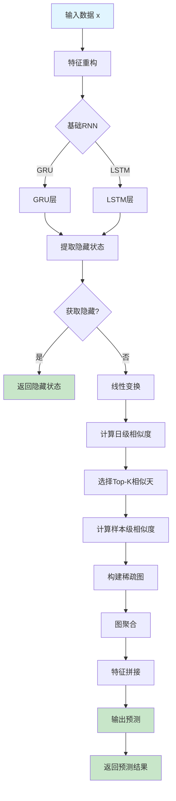
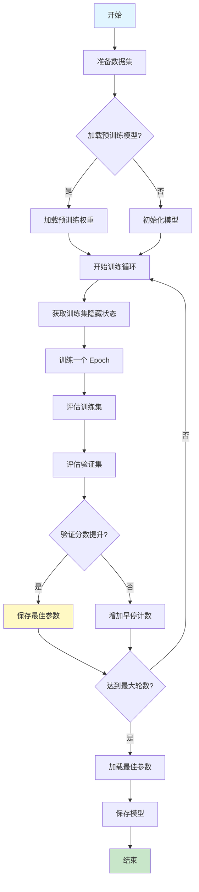

# IGMTF 模型文档

## 模块概述

IGMTF (Instance-based Graph neural network with Multi-step Task Fusion) 是一个基于 PyTorch 的量化投资预测模型。该模型结合了图神经网络（GNN）和 RNN（LSTM/GRU）的思想，通过实例级别的图构建和多步任务融合来提升预测性能。

### 主要特点

- **基础模型支持**：可选择 LSTM 或 GRU 作为基础 RNN 模型
- **实例级图构建**：使用余弦相似度构建动态图结构
- **多步任务融合**：通过训练集和测试集的隐藏状态融合提升泛化能力
- **早停机制**：支持基于验证集指标的早停
- **GPU 加速**：支持 CUDA 加速训练和推理

### 适用场景

- 金融时间序列预测
- 股票收益率预测
- 需要捕捉长期依赖关系的量化任务

## 核心类定义

### IGMTF 类

```python
class IGMTF(Model):
    """IGMTF 模型接口类"""
```

这是主要的模型接口类，继承自 `qlib.model.base.Model`，提供了完整的训练和预测功能。

### IGMTFModel 类

```python
class IGMTFModel(nn.Module):
    """IGMTF 神经网络模型"""
```

这是 PyTorch 的神经网络实现，包含了模型的具体架构和前向传播逻辑。

## 构造方法参数表

### IGMTF.__init__

| 参数名 | 类型 | 默认值 | 说明 |
|--------|------|--------|------|
| d_feat | int | 6 | 每个时间步的输入特征维度 |
| hidden_size | int | 64 | RNN 隐藏层大小 |
| num_layers | int | 2 | RNN 层数 |
| dropout | float | 0.0 | Dropout 比例 |
| n_epochs | int | 200 | 训练轮数 |
| lr | float | 0.001 | 学习率 |
| metric | str | "" | 评估指标（如 "ic"） |
| early_stop | int | 20 | 早停轮数 |
| loss | str | "mse" | 损失函数类型 |
| base_model | str | "GRU" | 基础模型类型（"GRU" 或 "LSTM"） |
| model_path | str | None | 预训练模型路径 |
| optimizer | str | "adam" | 优化器名称 |
| GPU | int | 0 | GPU ID，-1 表示使用 CPU |
| seed | int | None | 随机种子 |
| **kwargs | - | - | 其他参数 |

### IGMTFModel.__init__

| 参数名 | 类型 | 默认值 | 说明 |
|--------|------|--------|------|
| d_feat | int | 6 | 输入特征维度 |
| hidden_size | int | 64 | 隐藏层大小 |
| num_layers | int | 2 | RNN 层数 |
| dropout | float | 0.0 | Dropout 比例 |
| base_model | str | "GRU" | 基础模型类型 |

## 方法详细说明

### IGMTF 类方法

#### fit

```python
def fit(
    self,
    dataset: DatasetH,
    evals_result=dict(),
    save_path=None,
)
```

**功能**：训练 IGMTF 模型

**参数**：
- `dataset` (DatasetH): 训练数据集，必须包含 train 和 valid 分割
- `evals_result` (dict, optional): 用于存储训练和验证结果的字典
- `save_path` (str, optional): 模型保存路径

**返回值**：None

**说明**：
1. 从数据集中准备训练集和验证集
2. 加载预训练的基础模型（如果指定）
3. 在每个 epoch 中：
   - 获取训练集的隐藏状态
   - 训练一个 epoch
   - 评估训练集和验证集性能
   - 保存最佳模型参数
4. 应用早停机制防止过拟合

#### predict

```python
def predict(self, dataset: DatasetH, segment: Union[Text, slice] = "test")
```

**功能**：使用训练好的模型进行预测

**参数**：
- `dataset` (DatasetH): 数据集对象
- `segment` (Union[Text, slice], optional): 预测的数据段，默认为 "test"

**返回值**：
- `pd.Series`: 预测结果，索引与原始数据对齐

**说明**：
1. 从训练集获取隐藏状态
2. 遍历测试数据的每日批次
3. 使用训练集的隐藏状态进行注意力机制计算
4. 返回预测结果

#### get_train_hidden

```python
def get_train_hidden(self, x_train)
```

**功能**：获取训练数据的隐藏状态表示

**参数**：
- `x_train` (pd.DataFrame): 训练特征数据

**返回值**：
- `train_hidden` (np.ndarray): 每个样本的隐藏状态
- `train_hidden_day` (torch.Tensor): 每日平均隐藏状态

**说明**：
- 将训练数据按日期分批处理
- 通过基础 RNN 模型提取隐藏状态
- 计算每日的平均隐藏状态用于后续的相似度计算

#### train_epoch

```python
def train_epoch(self, x_train, y_train, train_hidden, train_hidden_day)
```

**功能**：训练一个 epoch

**参数**：
- `x_train` (pd.DataFrame): 训练特征
- `y_train` (pd.DataFrame): 训练标签
- `train_hidden` (np.ndarray): 训练集隐藏状态
- `train_hidden_day` (torch.Tensor): 训练集每日隐藏状态

**返回值**：None

**说明**：
- 每日数据随机打乱
- 使用训练集的隐藏状态计算注意力权重
- 通过梯度裁剪防止梯度爆炸
- 更新模型参数

#### test_epoch

```python
def test_epoch(self, data_x, data_y, train_hidden, train_hidden_day)
```

**功能**：评估模型性能

**参数**：
- `data_x` (pd.DataFrame): 测试特征
- `data_y` (pd.DataFrame): 测试标签
- `train_hidden` (np.ndarray): 训练集隐藏状态
- `train_hidden_day` (torch.Tensor): 训练集每日隐藏状态

**返回值**：
- `tuple`: (平均损失, 平均评估分数)

#### loss_fn

```python
def loss_fn(self, pred, label)
```

**功能**：计算预测损失

**参数**：
- `pred` (torch.Tensor): 预测值
- `label` (torch.Tensor): 真实标签

**返回值**：
- `torch.Tensor`: 损失值

**说明**：
- 支持 MSE 损失
- 自动处理标签中的 NaN 值

#### metric_fn

```python
def metric_fn(self, pred, label)
```

**功能**：计算评估指标

**参数**：
- `pred` (torch.Tensor): 预测值
- `label` (torch.Tensor): 真实标签

**返回值**：
- `torch.Tensor`: 评估分数

**说明**：
- 支持 IC (Information Coefficient) 指标
- 支持基于负损失的评估

### IGMTFModel 类方法

#### forward

```python
def forward(self, x, get_hidden=False, train_hidden=None,
            train_hidden_day=None, k_day=10, n_neighbor=10)
```

**功能**：前向传播

**参数**：
- `x` (torch.Tensor): 输入数据，形状 [N, F*T]
- `get_hidden` (bool): 是否返回隐藏状态
- `train_hidden` (np.ndarray): 训练集隐藏状态
- `train_hidden_day` (torch.Tensor): 训练集每日隐藏状态
- `k_day` (int): 选择相似的天数
- `n_neighbor` (int): 每个样本选择的邻居数

**返回值**：
- `torch.Tensor`: 预测输出或隐藏状态

**说明**：
1. 通过基础 RNN 提取特征
2. 如果 `get_hidden=True`，直接返回隐藏状态
3. 计算当前批次与训练集日级别的余弦相似度
4. 选择最相似的 k_day 天的训练数据
5. 计算样本级别的相似度，构建稀疏图
6. 通过图聚合和注意力机制融合信息
7. 输出最终预测

#### cal_cos_similarity

```python
def cal_cos_similarity(self, x, y)
```

**功能**：计算余弦相似度矩阵

**参数**：
- `x` (torch.Tensor): 第一组向量
- `y` (torch.Tensor): 第二组向量

**返回值**：
- `torch.Tensor`: 余弦相似度矩阵

**说明**：
- 计算两个向量集合之间的余弦相似度
- 用于构建图结构的边权重

#### sparse_dense_mul

```python
def sparse_dense_mul(self, s, d)
```

**功能**：稀疏矩阵与稠密矩阵的逐元素乘法

**参数**：
- `s` (torch.sparse.FloatTensor): 稀疏矩阵
- `d` (torch.Tensor): 稠密矩阵

**返回值**：
- `torch.sparse.FloatTensor`: 乘积结果

## 使用示例

### 基础使用示例

```python
import pandas as pd
from qlib.data.dataset import DatasetH
from qlib.contrib.model.pytorch_igmtf import IGMTF

# 初始化模型
model = IGMTF(
    d_feat=6,          # 特征维度
    hidden_size=64,    # 隐藏层大小
    num_layers=2,      # RNN 层数
    dropout=0.0,       # Dropout
    n_epochs=100,      # 训练轮数
    lr=0.001,          # 学习率
    metric="ic",       # 使用 IC 作为评估指标
    early_stop=20,     # 早停轮数
    loss="mse",        # 使用 MSE 损失
    base_model="GRU",  # 使用 GRU 作为基础模型
    optimizer="adam",  # 使用 Adam 优化器
    GPU=0,             # 使用第一个 GPU
    seed=2023          # 随机种子
)

# 准备数据集
dataset = DatasetH(
    handler=your_data_handler,
    segments=["train", "valid", "test"]
)

# 训练模型
evals_result = {}
model.fit(
    dataset=dataset,
    evals_result=evals_result,
    save_path="./igmtf_model.bin"
)

# 查看训练历史
print("训练分数:", evals_result["train"])
print("验证分数:", evals_result["valid"])

# 进行预测
predictions = model.predict(dataset, segment="test")
print("预测结果:", predictions)
```

### 使用预训练模型

```python
# 从预训练的 GRU 模型加载权重
model = IGMTF(
    d_feat=6,
    hidden_size=64,
    base_model="GRU",
    model_path="./pretrained_gru.pth",  # 预训练模型路径
    GPU=0
)

model.fit(dataset, evals_result={}, save_path="./igmtf_finetuned.bin")
```

### 使用 LSTM 作为基础模型

```python
# 使用 LSTM 替代 GRU
model = IGMTF(
    d_feat=6,
    hidden_size=128,    # 更大的隐藏层
    num_layers=3,       # 更深的网络
    dropout=0.1,        # 增加 Dropout
    base_model="LSTM",  # 使用 LSTM
    n_epochs=200,
    metric="ic",
    early_stop=30,
    GPU=0
)

model.fit(dataset(dataset))
```

### 自定义评估和预测

```python
import numpy as np

# 训练
model.fit(dataset)

# 预测多个数据段
train_pred = model.predict(dataset, segment="train")
valid_pred = model.predict(dataset, segment="valid")
test_pred = model.predict(dataset, segment="test")

# 计算自定义指标
def calculate_ic(pred, label):
    corr = pred.corr(label)
    return corr

# 假设我们有真实的标签数据
train_label = dataset.prepare("train", col_set="label", data_key="label")
ic_score = calculate_ic(train_pred, train_label)
print(f"IC 分数: {ic_score:.4f}")
```

## 模型架构流程图



## 训练流程图



## 注意事项

### 1. 内存管理
- 训练时需要存储整个训练集的隐藏状态，对于大数据集可能消耗大量内存
- 建议在训练完成后调用 `torch.cuda.empty_cache()` 清理 GPU 缓存

### 2. 数据格式
- 输入数据应为 MultiIndex 格式，第一层为日期，第二层为资产 ID
- 特征维度必须与 `d_feat` 参数一致

### 3. 模型性能调优
- `k_day` 和 `n_neighbor` 参数影响图的构建，可根据数据特性调整
- 对于高噪声数据，适当增加 Dropout 比例
- IC 指标通常适用于金融时间序列预测

### 4. 预训练模型
- 预训练模型的基础类型必须与 `base_model` 参数一致
- 预训练模型的隐藏层大小应与当前模型配置匹配

### 5. GPU 使用
- 确保系统安装了 CUDA 和 PyTorch 的 CUDA 版本
- 如果 GPU 不可用，模型会自动降级到 CPU 运行
- 多 GPU 训练需要修改代码以支持 DataParallel

## 参考文献

该模型的实现基于图神经网络和 RNN 的结合，用于量化投资中的时间序列预测任务。核心思想是通过实例级别的图构建，利用历史样本的隐藏状态来增强当前预测的表达能力。

## 版本历史

- 支持 PyTorch 框架
- 集成到 Qlib 量化投资平台
