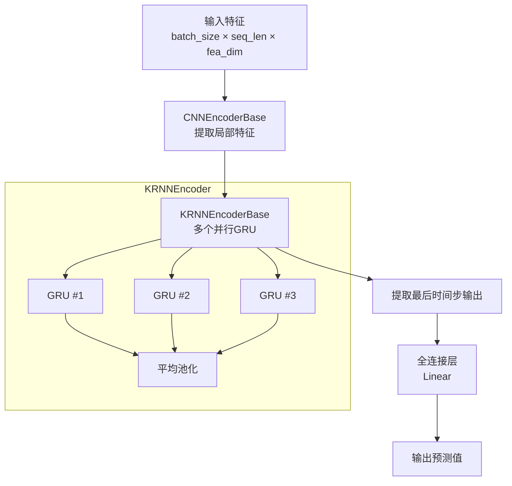
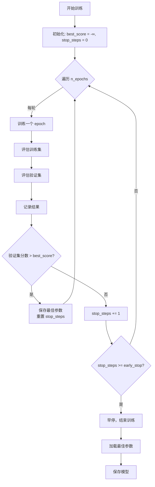

# PyTorch KRNN 模型文档

## 模块概述

`pytorch_krnn.py` 实现了基于 PyTorch 的 KRNN（Kernel Recurrent Neural Network）模型，用于时间序列预测任务。该模型结合了 CNN 和多个并行 RNN（KRNN）的优势，通过以下架构实现高性能的时间序列建模：

- **CNN 编码器**：使用一维卷积提取局部时间序列特征
- **KRNN 编码器**：通过多个并行的 GRU 网络捕捉长期依赖关系
- **模型继承**：实现了 Qlib 的 `Model` 基类，可直接用于量化投资回测框架

该模型特别适合处理具有时序依赖特征的金融数据，能够有效地从历史数据中学习预测模式。

## 模型架构



## 核心类说明

### 1. CNNEncoderBase

CNN 编码器基类，使用一维卷积层提取时间序列的局部特征。

#### 构造方法

`__init__(self, input_dim, output_dim, kernel_size, device)`

| 参数 | 类型 | 说明 | 默认值 |
|------|------|------|--------|
| `input_dim` | int | 输入特征维度 | 必填 |
| `output_dim` | int | 输出特征维度（卷积核数量） | 必填 |
| `kernel_size` | int | 卷积核大小 | 必填 |
| `device` | torch.device | 运行设备（CPU 或 GPU） | 必填 |

**设计说明**：
- 使用 padding 确保输出序列长度与输入相同
- padding 计算公式：`(kernel_size - 1) // 2`
- 仅在 `kernel_size` 为奇数、`dilation=1`、`stride=1` 时保持长度不变

#### forward 方法

`forward(self, x)`

对输入数据进行 CNN 编码。

| 参数 | 类型 | 说明 |
|------|------|------|
| `x` | torch.Tensor | 输入张量，形状为 `[batch_size, seq_len * input_dim]` |

**返回值**：
- 类型：`torch.Tensor`
- 形状：`[batch_size, seq_len, output_dim]`

**处理流程**：
1. 将输入重塑为 `[batch_size, seq_len, input_dim]`
2. 调整维度顺序为 `[batch_size, input_dim, seq_len]` 以适应 Conv1d
3. 应用一维卷积
4. 恢复维度顺序为 `[batch_size, seq_len, output_dim]`

---

### 2. KRNNEncoderBase

KRNN 编码器基类，使用多个并行的 GRU 网络捕捉时间序列的长期依赖。

#### 构造方法

`__init__(self, input_dim, output_dim, dup_num, rnn_layers, dropout, device)`

| 参数 | 类型 | 说明 | 默认值 |
|------|------|------|--------|
| `input_dim` | int | 输入特征维度 | 必填 |
| `output_dim` | int | 每个 RNN 的输出维度 | 必填 |
| `dup_num` | int | 并行 RNN 的数量 | 必填 |
| `rnn_layers` | int | 每个 RNN 的层数 | 必填 |
| `dropout` | float | Dropout 比例（用于多层 RNN） | 必填 |
| `device` | torch.device | 运行设备 | 必填 |

**设计说明**：
- 创建 `dup_num` 个独立的 GRU 模型
- 每个 GRU 具有相同的架构参数
- 多个 GRU 并行运行，输出结果进行平均池化

#### forward 方法

`forward(self, x)`

对输入数据进行多路 GRN 编码并聚合结果。

| 参数 | 类型 | 说明 |
|------|------|------|
| `x` | torch.Tensor | 输入张量，形状为 `[batch_size, seq_len, input_dim]` |

**返回值**：
- 类型：`torch.Tensor`
- 形状：`[batch_size, seq_len, output_dim]`

**处理流程**：
1. 调整输入维度顺序为 `[seq_len, batch_size, input_dim]` 以适应 GRU
2. 对每个并行的 GRU 进行前向传播
3. 将所有 GRU 的输出堆叠为 `[seq_len, batch_size, output_dim, dup_num]`
4. 对 `dup_num` 维度取平均值
5. 恢复维度顺序为 `[batch_size, seq_len, output_dim]`

---

### 3. CNNKRNNEncoder

组合 CNN 和 KRNN 的编码器，先通过 CNN 提取局部特征，再通过 KRNN 捕捉长期依赖。

#### 构造方法

`__init__(self, cnn_input_dim, cnn_output_dim, cnn_kernel_size, rnn_output_dim, rnn_dup_num, rnn_layers, dropout, device)`

| 参数 | 类型 | 说明 | 默认值 |
|------|------|------|--------|
| `cnn_input_dim` | int | CNN 输入维度 | 必填 |
| `cnn_output_dim` | int | CNN 输出维度（也是 KRNN 输入） | 必填 |
| `cnn_kernel_size` | int | CNN 卷积核大小 | 必填 |
| `rnn_output_dim` | int | KRNN 输出维度 | 必填 |
| `rnn_dup_num` | int | KRNN 并行 RNN 数量 | 必填 |
| `rnn_layers` | int | KRNN 每个 RNN 的层数 | 必填 |
| `dropout` | float | Dropout 比例 | 必填 |
| `device` | torch.device | 运行设备 | 必填 |

#### forward 方法

`forward(self, x)`

级联：先 CNN 编码，再 KRNN 编码。

| 参数 | 类型 | 说明 |
|------|------|------|
| `x` | torch.Tensor | 输入张量 |

**返回值**：
- 类型：`torch.Tensor`
- KRNN 编码后的输出

---

### 4. KRNNModel

完整的 KRNN 模型，包含编码器和输出投影层。

#### 构造方法

`__init__(self, fea_dim, cnn_dim, cnn_kernel_size, rnn_dim, rnn_dups, rnn_layers, dropout, device, **params)`

| 参数 | 类型 | 说明 | 默认值 |
|------|------|------|--------|
| `fea_dim` | int | 输入特征维度 | 必填 |
| `cnn_dim` | int | CNN 隐藏维度 | 必填 |
| `cnn_kernel_size` | int | CNN 卷积核大小 | 必填 |
| `rnn_dim` | int | KRNN 隐藏维度 | 必填 |
| `rnn_dups` | int | KRNN 并行 RNN 数量 | 必填 |
| `rnn_layers` | int | KRNN 每个 RNN 的层数 | 必填 |
| `dropout` | float | Dropout 比例 | 必填 |
| `device` | torch.device | 运行设备 | 必填 |
| `**params` | dict | 额外参数（未使用） | - |

#### forward 方法

`forward(self, x)`

模型前向传播。

| 参数 | | 说明 |
|------|------|------|
| `x` | torch.Tensor | 输入张量，形状为 `[batch_size, seq_len * fea_dim]` |

**返回值**：
- 类型：`torch.Tensor`
- 形状：`[batch_size]`
- 说明：取最后时间步的编码，经过线性层输出预测值

---

### 5. KRNN

实现了 Qlib `Model` 接口的 KRNN 模型包装类，提供完整的训练、预测功能。

#### 构造方法

`__init__(self, fea_dim=6, cnn_dim=64, cnn_kernel_size=3, rnn_dim=64, rnn_dups=3, rnn_layers=2, dropout=0, n_epochs=200, lr=0.001, metric="", batch_size=2000, early_stop=20, loss="mse", optimizer="adam", GPU=0, seed=None, **kwargs)`

| 参数 | 类型 | 说明 | 默认值 |
|------|------|------|--------|
| `fea_dim` | int | 每个时间步的输入特征维度 | 6 |
| `cnn_dim` | int | CNN 隐藏维度 | 64 |
| `cnn_kernel_size` | int | CNN 卷积核大小 | 3 |
| `rnn_dim` | int | KRNN 隐藏维度 | 64 |
| `rnn_dups` | int | KRNN 并行 RNN 数量 | 3 |
| `rnn_layers` | int | KRNN 每个 RNN 的层数 | 2 |
| `dropout` | float | Dropout 比例 | 0 |
| `n_epochs` | int | 训练轮数 | 200 |
| `lr` | float | 学习率 | 0.001 |
| `metric` | str | 评估指标（用于早停） | "" |
| `batch_size` | int | 批次大小 | 2000 |
| `early_stop` | int | 早停轮数 | 20 |
| `loss` | str | 损失函数类型（"mse"） | "mse" |
| `optimizer` | str | 优化器（"adam" 或 "gd"） | "adam" |
| `GPU` | int | GPU ID（-1 表示使用 CPU） | 0 |
| `seed` | int | 随机种子 | None |

**支持的优化器**：
- `adam`：Adam 优化器
- `gd`：随机梯度下降（SGD）

**设备自动选择**：
- 如果 `torch.cuda.is_available()`()` 为 `True` 且 `GPU >= 0`，使用 `cuda:{GPU}`
- 否则使用 CPU

#### 属性

**use_gpu**

```python
@property
def use_gpu(self)
```

返回是否使用 GPU。

- 返回值：`bool`
- 说明：判断 `device` 是否为 CPU 设备

---

## 方法详细说明

### mse 方法

`mse(self, pred, label)`

计算均方误差（MSE）损失。

| 参数 | 类型 | 说明 |
|------|------|------|
| `pred` | torch.Tensor | 预测值 |
| `label` | torch.Tensor | 真实标签 |

**返回值**：
- 类型：`torch.Tensor`
- 说明：MSE 损失值（标量）

**公式**：
$$ \text{MSE} = \frac{1}{n} \sum_{i=1}^{n} (pred_i - label_i)^2 $$

---

### loss_fn 方法

`loss_fn(self, pred, label)`

计算损失函数，自动处理 NaN 标签。

| 参数 | 类型 | 说明 |
|------|------|------|
| `pred` | torch.Tensor | 预测值 |
| `label` | torch.Tensor | 真实标签 |

**返回值**：
- 类型：`torch.Tensor`
- 说明：损失值

**处理逻辑**：
1. 创建非 NaN 标签的掩码
2. 仅对有效标签计算损失
3. 目前支持 `mse` 损失

---

### metric_fn 方法

`metric_fn(self, pred, label)`

计算评估指标。

| 参数 | 类型 | 说明 |
|------|------|------|
| `pred` | torch.Tensor | 预测值 |
| `label` | torch.Tensor | 真实标签 |

**返回值**：
- 类型：`torch.Tensor`
- 说明：评估指标值（用于早停判断）

**支持的指标**：
- `""` 或 `"loss"`：返回负的损失值（越大越好）

**注意**：
- 仅对有限（finite）标签进行评估
- 返回负损失是因为早停机制通常寻找指标的最大值

---

### get_daily_inter 方法

`get_daily_inter(self, df, shuffle=False)`

将训练数据组织为每日批次的索引。

| 参数 | 类型 | 说明 | 默认值 |
|------|------|------|--------|
| `df` | pandas.DataFrame | 多层索引的数据（第一层为日期） | 必填 |
| `shuffle` | bool | 是否打乱每日数据顺序 | False |

**返回值**：
- 类型：`tuple(np.ndarray, np.ndarray)`
- 说明：
  - 第一个元素：每日数据的起始索引数组
  - 第二个元素：每日数据的样本数量数组

**示例**：
假设数据有 3 天，每天分别有 2, 3, 2 个样本：
```
daily_index = [0, 2, 5]
daily_count = [2, 3, 2]
```

---

### train_epoch 方法

`train_epoch(self, x_train, y_train)`

训练一个 epoch。

| 参数 | 类型 | 说明 |
|------|------|------|
| `x_train` | pandas.DataFrame | 训练特征 |
| `y_train` | pandas.Series | 训练标签 |

**处理流程**：
1. 将数据转换为 NumPy 数组
2. 设置模型为训练模式
3. 打乱训练索引
4. 按批次迭代：
   - 前向传播计算预测
   - 计算损失
   - 反向传播计算梯度
   - 梯度裁剪（最大值为 3.0）
   - 更新模型参数

---

### test_epoch 方法

`test_epoch(self, data_x, data_y)`

在验证/测试集上评估一个 epoch。

| 参数 | 类型 | 说明 |
|------|------|------|
| `data_x` | pandas.DataFrame | 数据特征 |
| `data_y` | pandas.Series | 数据标签 |

**返回值**：
- 类型：`tuple(float, float)`
- 说明：
  - 平均损失
  - 平均评估指标

**处理流程**：
1. 设置模型为评估模式
2. 按批次迭代
3. 累计损失和指标
4. 返回平均值

---

### fit 方法

`fit(self, dataset: DatasetH, evals_result=dict(), save_path=None)`

训练模型。

| 参数 | 类型 | 说明 | 默认值 |
|------|------|------|--------|
| `dataset` | DatasetH | Qlib 数据集对象 | 必填 |
| `evals_result` | dict | 用于记录训练过程的字典 | {} |
| `save_path` | str | 模型保存路径 | None |

**数据准备**：
- 从数据集准备训练、验证、测试集
- 使用 `DataHandlerLP.DK_L` 数据键

**训练流程**：


**早停机制**：
- 验证集评分不再提升时增加计数
- 计数达到 `early_stop` 时停止训练
- 保存评分最高的模型参数

**模型保存**：
- 保存最佳参数到 `save_path`
- 如果使用 GPU，清空缓存

---

### predict 方法

`predict(self, dataset: DatasetH, segment: Union[Text, slice] = "test")`

使用训练好的模型进行预测。

| 参数 | 类型 | 说明 | 默认值 |
|------|------|------|--------|
| `dataset` | DatasetH | Qlib 数据集对象 | 必填 |
| `segment` | str 或 slice | 数据集分段（"test"、"train"、"valid"） | "test" |

**返回值**：
- 类型：`pandas.Series`
- 说明：预测值序列，索引与输入数据一致

**处理流程**：
1. 检查模型是否已训练
`2. 从数据集准备特征数据
3. 设置模型为评估模式
4. 按批次进行预测（使用 `torch.no_grad()`）
5. 拼接所有批次的预测结果
6. 返回带索引的预测序列

---

## 使用示例

### 基础使用

```python
import qlib
from qlib.data.dataset import DatasetH
from qlib.contrib.model.pytorch_krnn import KRNN

# 初始化 Qlib
qlib.init(provider_uri="~/.qlib/qlib_data/cn_data", region="cn")

# 配置数据加载器
dataset = DatasetH(handler=config_handler, segments=["train", "valid", "test"])

# 创建 KRNN 模型
model = KRNN(
    fea_dim=6,           # 输入特征维度
    cnn_dim=64,          # CNN 隐藏维度
    cnn_kernel_size=3,   # CNN 卷积核大小
    rnn_dim=64,          # KRNN 隐藏维度
    rnn_dups=3,          # 并行 RNN 数量
    rnn_layers=2,        # RNN 层数
    dropout=0.0,         # Dropout 比例
    n_epochs=200,        # 训练轮数
    lr=0.001,            # 学习率
    batch_size=2000,     # 批次大小
    early_stop=20,       # 早停轮数
    GPU=0                # 使用 GPU 0
)

# 训练模型
model.fit(dataset, save_path="model_params.pth")

# 进行预测
predictions = model.predict(dataset, segment="test")
print(predictions)
```

### 自定义训练配置

```python
# 使用自定义优化器和学习率
model = KRNN(
    fea_dim=10,
    cnn_dim=128,
    cnn_kernel_size=5,
    rnn_dim=128,
    rnn_dups=5,          # 更多的并行 RNN
    rnn_layers=3,
    dropout=0.2,
    n_epochs=300,
    lr=0.0005,           # 更小的学习率
    optimizer="adam",
    early_stop=30,
    batched_size=1000,
    GPU=0,
    seed=42              # 固定随机种子以确保可重复性
)

# 记录训练过程
evals_result = {}
model.fit(dataset, evals_result=evals_result, save_path="my_model.pth")

# 绘制训练曲线
import matplotlib.pyplot as plt
plt.plot(evals_result["train"], label="Train")
plt.plot(evals_result["valid"], label="Valid")
plt.legend()
plt.show()
```

### 在 CPU 上运行

```python
# 在 CPU 上运行
model = KRNN(
    fea_dim=6,
    cnn_dim=64,
    rnn_dim=64,
    GPU=-1  # 使用 CPU
)

model.fit(dataset)
predictions = model.predict(dataset)
```

### 使用不同的损失函数

```python
# 使用 MSE 损失（默认）
model = KRNN(
    fea_dim=6,
    cnn_dim=64,
    rnn_dim=64,
    loss="mse",  # 均方误差
    metric="loss"
)
```

### 与 Qlib 工作流集成

```python
# 在工作流配置文件中使用
import yaml

workflow_config = {
    "task": {
        "model": {
            "class": "KRNN",
            "module_path": "qlib.contrib.model.pytorch_krnn",
            "kwargs": {
                "fea_dim": 6,
                "cnn_dim": 64,
                "rnn_dim": 64,
                "rnn_dups": 3,
                "n_epochs": 200,
                "lr": 0.001,
                "batch_size": 2000,
                "early_stop": 20,
                "GPU": 0
            }
        }
    }
}

# 运行工作流
from qlib.workflow import R
with R.start(experiment_name="krnn_exp"):
    model = R.get_model(**workflow_config["task"]["model"])
    model.fit(dataset)
    pred = model.predict(dataset)
```

---

## 模型特点

### 优势

1. **混合架构**：结合 CNN 和 RNN 的优势，同时捕捉局部和长期依赖
2. **多样性学习**：多个并行 RNN 提供多样化的表示
3. **灵活配置**：丰富的超参数支持细粒度调优
4. **早停机制**：防止过拟合，提高训练效率
5. **GPU 支持**：自动检测并使用 GPU 加速训练
6. **梯度裁剪**：防止梯度爆炸，提高训练稳定性

### 适用场景

- 具有明显时间序列特征的数据
- 需要同时捕捉局部和长期依赖关系的任务
- 金融时间序列预测（股票价格、收益率等）
- 其他时序预测任务

### 超参数调优建议

| 参数 | 调优建议 | 影响 |
|------|----------|------|
| `cnn_dim` | 32-128 | CNN 特征提取能力 |
| `rnn_dim` | 32-128 | RNN 记忆容量 |
| `rnn_dups` | 2-5 | 模型多样性与训练时间的权衡 |
| `rnn_layers` | 1-3 | 更深层可捕捉更复杂模式但易过拟合 |
| `dropout` | 0.0-0.5 | 正则化强度，防止过拟合 |
| `lr` | 0.0001-0.01 | 收敛速度和稳定性 |
| `batch_size` | 根据内存调整 | 影响训练速度和梯度估计质量 |

---

## 注意事项

1. **卷积核大小**：`cnn_kernel_size` 必须为奇数，以确保序列长度保持不变
2. **内存管理**：大批次和大量并行 RNN 需要较多 GPU 内存
3. **数据预处理**：确保输入数据已正确归一化
4. **早停阈值**：根据数据特点调整 `early_stop` 参数
5. **随机种子**：设置 `seed` 以确保实验可重复性

---

## 依赖

- `torch` >= 1.0
- `numpy`
- `pandas`
- `qlib` 核心模块（Model、DatasetH、DataHandlerLP）

---

## 引用

如果使用此模型，请引用相关论文和 Qlib 项目。
