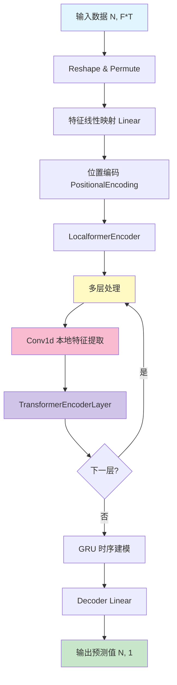
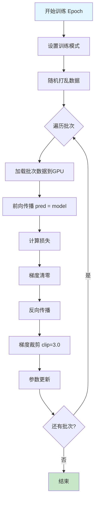
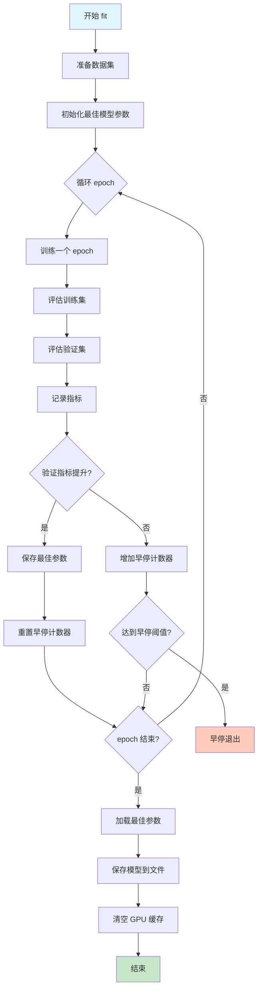
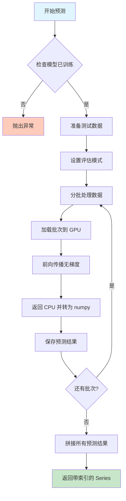
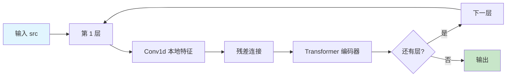

# pytorch_localformer.py 模块文档

## 模块概述

`pytorch_localformer.py` 实现了一个基于 Transformer 的量化预测模型，结合了局部卷积特征提取和全局 Transformer 编码能力。该模型专门用于时序金融数据的预测任务，通过融合 RNN（GRU）和 Transformer 架构来捕捉时间序列中的长期依赖关系。

### 核心特性

- **本地-全局特征融合**：使用卷积层提取局部特征，Transformer 编码器捕获全局依赖
- **位置编码**：通过正弦/余弦函数注入序列位置信息
- **GRU 时序建模**：在 Transformer 编码后使用 GRU 进一步建模时序动态
- **多层数据并行**：支持 GPU 加速训练和推理
- **早停机制**：自动防止过拟合
- **灵活的损失函数和评估指标**：支持 MSE 等多种损失函数

### 模型架构流程图



---

## 核心类定义

### 1. LocalformerModel

**继承关系**：`Model` ← `LocalformerModel`

**类说明**：主模型类，实现完整的训练、预测和评估流程，符合 Qlib 框架的 Model 接口规范。

#### 构造方法参数

| 参数名 | 类型 | 默认值 | 说明 |
|--------|------|--------|------|
| `d_feat` | int | 20 | 输入特征维度 |
| `d_model` | int | 64 | 模型隐藏层维度 |
| `batch_size` | int | 2048 | 批次大小 |
| `nhead` | int | 2 | Transformer 注意力头数 |
| `num_layers` | int | 2 | Transformer 编码器层数 |
| `dropout` | float | 0 | Dropout 比例 |
| `n_epochs` | int | 100 | 训练轮数 |
| `lr` | float | 0.0001 | 学习率 |
| `metric` | str | "" | 评估指标类型 |
| `early_stop` | int | 5 | 早停等待轮数 |
| `loss` | str | "mse" | 损失函数类型 |
| `optimizer` | str | "adam" | 优化器类型 |
| `reg` | float | 1e-3 | L2 正则化系数 |
| `n_jobs` | int | 10 | 并行任务数 |
| `GPU` | int | 0 | GPU 设备 ID（-1 为 CPU） |
| `seed` | int | None | 随机种子 |

#### 核心方法

##### `use_gpu` (属性)

**返回值**：`bool`

**说明**：判断模型是否使用 GPU 进行计算。

```python
@property
def use_gpu(self):
    return self.device != torch.device("cpu")
```

---

##### `mse(pred, label)`

**参数**：
- `pred` (torch.Tensor)：模型预测值
- `label` (torch.Tensor)：真实标签值

**返回值**：`torch.Tensor` - 均方误差损失

**说明**：计算均方误差损失函数。

```python
def mse(self, pred, label):
    loss = (pred.float() - label.float()) ** 2
    return torch.mean(loss)
```

---

##### `loss_fn(pred, label)`

**参数**：
- `pred` (torch.Tensor)：模型预测值
- `label` (torch.Tensor)：真实标签值

**返回值**：`torch.Tensor` - 计算得到的损失值

**说明**：根据配置的损失函数类型计算损失。自动忽略标签中的 NaN 值。

**支持的损失函数**：
- `mse`：均方误差

```python
def loss_fn(self, pred, label):
    mask = ~torch.isnan(label)
    if self.loss == "mse":
        return self.mse(pred[mask], label[mask])
    raise ValueError("unknown loss `%s`" % self.loss)
```

---

##### `metric_fn(pred, label)`

**参数**：
- `pred` (torch.Tensor)：模型预测值
- `label` (torch.Tensor)：真实标签值

**返回值**：`torch.Tensor` - 评估指标值

**说明**：计算模型评估指标。默认使用负损失值作为指标（值越大越好）。

**支持的指标**：
- `""` 或 `"loss"`：负损失值

```python
def metric_fn(self, pred, label):
    mask = torch.isfinite(label)
    if self.metric in ("", "loss"):
        return -self.loss_fn(pred[mask], label[mask])
    raise ValueError("unknown metric `%s`" % self.metric)
```

---

##### `train_epoch(x_train, y_train)`

**参数**：
- `x_train` (pd.DataFrame)：训练特征数据
- `y_train` (pd.DataFrame)：训练标签数据

**返回值**：`None`

**说明**：执行一个 epoch 的训练过程。包含以下步骤：
1. 将模型设置为训练模式
2. 随机打乱训练数据
3. 分批前向传播和反向传播
4. 应用梯度裁剪（clip_grad_value_）
5. 更新模型参数

**训练流程图**：



```python
def train_epoch(self, x_train, y_train):
    x_train_values = x_train.values
    y_train_values = np.squeeze(y_train.values)
    self.model.train()

    indices = np.arange(len(x_train_values))
    np.random.shuffle(indices)

    for i in range(len(indices))[:: self.batch_size]:
        if len(indices) - i < self.batch_size:
            break

        feature = torch.from_numpy(x_train_values[indices[i : i + self.batch_size]]).float().to(self.device)
        label = torch.from_numpy(y_train_values[indices[i : i + self.batch_size]]).float().to(self.device)

        pred = self.model(feature)
        loss = self.loss_fn(pred, label)

        self.train_optimizer.zero_grad()
        loss.backward()
        torch.nn.utils.clip_grad_value_(self.model.parameters(), 3.0)
        self.train_optimizer.step()
```

---

##### `test_epoch(data_x, data_y)`

**参数**：
- `data_x` (pd.DataFrame)：验证/测试特征数据
- `data_y` (pd.DataFrame)：验证/测试标签数据

**返回值**：`(float, float)` - 平均损失和平均指标得分

**说明**：执行一个 epoch 的验证/测试过程。在评估模式下计算损失和指标，不更新梯度。

```python
def test_epoch(self, data_x, data_y):
    x_values = data_x.values
    y_values = np.squeeze(data_y.values)
    self.model.eval()

    scores = []
    losses = []
    indices = np.arange(len(x_values))

    for i in range(len(indices))[:: self.batch_size]:
        if len(indices) - i < self.batch_size:
            break

        feature = torch.from_numpy(x_values[indices[i : i + self.batch_size]][]).float().to(self.device)
        label = torch.from_numpy(y_values[indices[i : i + self.batch_size]]).float().to(self.device)

        with torch.no_grad():
            pred = self.model(feature)
            loss = self.loss_fn(pred, label)
            losses.append(loss.item())
            score = self.metric_fn(pred, label)
            scores.append(score.item())

    return np.mean(losses), np.mean(scores)
```

---

##### `fit(dataset, evals_result=dict(), save_path=None)`

**参数**：
- `dataset` (DatasetH)：Qlib 数据集对象
- `evals_result` (dict)：用于记录训练和验证指标的字典
- `save_path` (str, optional)：模型保存路径

**返回值**：`None`

**说明**：训练模型的完整流程。包含以下关键步骤：
1. 准备训练、验证和测试数据
2. 循环训练多个 epoch
3. 每个 epoch 后评估模型性能
4. 实现早停机制防止过拟合
5. 保存最佳模型参数

**训练流程图**：



```python
def fit(
    self,
    dataset: DatasetH,
    evals_result=dict(),
    save_path=None,
):
    df_train, df_valid, df_test = dataset.prepare(
        ["train", "valid", "test"],
        col_set=["feature", "label"],
        data_key=DataHandlerLP.DK_L,
    )
    if df_train.empty or df_valid.empty:
        raise ValueError("Empty data from dataset, please check your dataset config.")

    x_train, y_train = df_train["feature"], df_train["label"]
    x_valid, y_valid = df_valid["feature"], df_valid["label"]

    save_path = get_or_create_path(save_path)
    stop_steps = 0
    train_loss = 0
    best_score = -np.inf
    best_epoch = 0
    evals_result["train"] = []
    evals_result["valid"] = []

    self.logger.info("training...")
    self.fitted = True

    for step in range(self.n_epochs):
        self.logger.info("Epoch%d:", step)
        self.logger.info("training...")
        self.train_epoch(x_train, y_train)
        self.logger.info("evaluating...")
        train_loss, train_score = self.test_epoch(x_train, y_train)
        val_loss, val_score = self.test_epoch(x_valid, y_valid)
        self.logger.info("train %.6f, valid %.6f" % (train_score, val_score))
        evals_result["train"].append(train_score)
        evals_result["valid"].append(val_score)

        if val_score > best_score:
            best_score = val_score
            stop_steps = 0
            best_epoch = step
            best_param = copy.deepcopy(self.model.state_dict())
        else:
            stop_steps += 1
            if stop_steps >= self.early_stop:
                self.logger.info("early stop")
                break

    self.logger.info("best score: %.6lf @ %d" % (best_score, best_epoch))
    self.model.load_state_dict(best_param)
    torch.save(best_param, save_path)

    if self.use_gpu:
        torch.cuda.empty_cache()
```

---

##### `predict(dataset, segment="test")`

**参数**：
- `dataset` (DatasetH)：Qlib 数据集对象
- `segment` (Union[Text, slice])：预测的数据段（默认为 "test"）

**返回值**：`pd.Series` - 预测结果序列，索引与输入数据对应

**说明**：使用训练好的模型对数据进行预测。在评估模式下分批进行推理，避免内存溢出。

**推理流程图**：



```python
def predict(self, dataset: DatasetH, segment: Union[Text, slice] = "test"):
    if not self.fitted:
        raise ValueError("model is not fitted yet!")

    x_test = dataset.prepare(segment, col_set="feature", data_key=DataHandlerLP.DK_I)
    index = x_test.index
    self.model.eval()
()
    x_values = x_test.values
    sample_num = x_values.shape[0]
    preds = []

    for begin in range(sample_num)[:: self.batch_size]:
        if sample_num - begin < self.batch_size:
            end = sample_num
        else:
            end = begin + self.batch_size

        x_batch = torch.from_numpy(x_values[begin:end]).float().to(self.device)

        with torch.no_grad():
            pred = self.model(x_batch).detach().cpu().numpy()

        preds.append(pred)

    return pd.Series(np.concatenate(preds), index=index)
```

---

### 2. PositionalEncoding

**继承关系**：`nn.Module` ← `PositionalEncoding`

**类说明**：实现 Transformer 的正弦/余弦位置编码，为序列注入位置信息。

#### 构造方法参数

| 参数名 | 类型 | 默认值 | 说明 |
|--------|------|--------|------|
| `d_model` | int | - | 模型维度 |
| `max_len` | int | 1000 | 最大序列长度 |

#### 核心方法

##### `forward(x)`

**参数**：
- `x` (torch.Tensor)：输入张量，形状为 [T, N, F]

**返回值**：`torch.Tensor` - 添加位置编码后的张量

**说明**：将位置编码加到输入张量上。位置编码使用正弦（奇数位）和余弦（偶数位）函数生成。

**位置编码公式**：

对于位置 `pos` 和维度 `i`：

```
PE(pos, 2i)   = sin(pos / 10000^(2i/d_model))
PE(pos, 2i+1) = cos(pos / 10000^(2i/d_model))
```

```python
def forward(self, x):
    # [T, N, F]
    return x + self.pe[: x.size(0), :]
```

---

### 3. LocalformerEncoder

**继承关系**：`nn.Module` ← `LocalformerEncoder`

**类说明**：实现 Localformer 的编码器，在标准 Transformer 编码器基础上增加了局部卷积特征提取能力。

#### 构造方法参数

| 参数名 | 类型 | 默认值 | 说明 |
|--------|------|--------|------|
| `encoder_layer` | nn.TransformerEncoderLayer | - | Transformer 编码器层 |
| `num_layers` | int | - | 编码器层数 |
| `d_model` | int | - | 模型维度 |

#### 核心方法

##### `forward(src, mask)`

**参数**：
- `src` (torch.Tensor)：源序列张量，形状为 [T, N, F]
- `mask` (torch.Tensor, optional)：注意力掩码

**返回值**：`torch.Tensor` - 编码后的张量

**说明**：执行多层编码，每层包含：
1. 卷积层提取局部特征
2. Transformer 编码器层捕获全局依赖
3. 残差连接

**编码器结构图**：



```python
def forward(self, src, mask):
    output = src
    out = src

    for i, mod in enumerate(self.layers):
        # [T, N, F] --> [N, T, F] --> [N, F, T]
        out = output.transpose(1, 0).transpose(2, 1)
        out = self.conv[i](out).transpose(2, 1).transpose(1, 0)

        output = mod(output + out, src_mask=mask)

    return output + out
```

---

### 4. Transformer

**继承关系**：`nn.Module` ← `Transformer`

**类说明**：完整的 Transformer 网络，包含特征映射、位置编码、Localformer 编码器、GRU 和解码层。

#### 构造方法参数

| 参数名 | 类型 | 默认值 | 说明 |
|--------|------|--------|------|
| `d_feat` | int | 6 | 输入特征维度 |
| `d_model` | int | 8 | 模型隐藏层维度 |
| `nhead` | int | 4 | 注意力头数 |
| `num_layers` | int | 2 | 编码器层数 |
| `dropout` | float | 0.5 | Dropout 比例 |
| `device` | torch.device | None | 计算设备 |

#### 网络结构

```
输入 [N, F*T]
    ↓
Reshape & Permute [N, T, F]
    ↓
Linear 特征映射 [N, T, d_model]
    ↓
Transpose [T, N, d_model]
    ↓
PositionalEncoding 位置编码
    ↓
LocalformerEncoder 多层编码
    ├─ Conv1d (局部特征)
    ├─ TransformerEncoderLayer (全局依赖)
    └─ 残差连接
    ↓
GRU 时序建模
    ↓
Linear 解码层 [N, 1]
    ↓
输出 [N]
```

#### 核心方法

##### `forward(src)`

**参数**：
- `src` (torch.Tensor)：输入张量，形状为 [N, F*T]，其中 N 为批次大小，F 为特征数，T 为时间步

**返回值**：`torch.Tensor` - 预测结果，形状为 [N]

**说明**：完整的前向传播过程，包含数据预处理、特征提取、编码、时序建模和输出解码。

```python
def forward(self, src):
    # src [N, F*T] --> [N, T, F]
    src = src.reshape(len(src), self.d_feat, -1).permute(0, 2, 1)
    src = self.feature_layer(src)

    # src [N, T, F] --> [T, N, F], [60, 512, 8]
    src = src.transpose(1, 0)  # not batch first

    mask = None

    src = self.pos_encoder(src)
    output = self.transformer_encoder(src, mask)  # [60, 512, 8]

    output, _ = self.rnn(output)

    # [T, N, F] --> [N, T*F]
    output = self.decoder_layer(output.transpose(1, 0)[:, -1, :])  # [512, 1]

    return output.squeeze()
```

---

### 5. 辅助函数

#### `_get_clones(module, N)`

**参数**：
- `module` (nn.Module)：要克隆的模块
- `N` (int)：克隆数量

**返回值**：`ModuleList` - 包含 N 个克隆模块的列表

**说明**：创建模块的 N 个深拷贝，用于构建多层网络。

```python
def _get_clones(module, N):
    return ModuleList([copy.deepcopy(module) for i in range(N)])
```

---

## 使用示例

### 基本训练和预测

```python
import pandas as pd
import numpy as np
from qlib.contrib.model.pytorch_localformer import LocalformerModel

# 创建模型实例
model = LocalformerModel(
    d_feat=20,          # 特征维度
    d_model=64,         # 模型维度
    batch_size=2048,    # 批次大小
    nhead=2,            # 注意力头数
    num_layers=2,       # 编码器层数
    dropout=0.0,        # Dropout 比例
    n_epochs=100,       # 训练轮数
    lr=0.0001,          # 学习率
    early_stop=5,       # 早停轮数
    loss="mse",         # 损失函数
    optimizer="adam",   # 优化器
    GPU=0,              # GPU 设备
    seed=42             # 随机种子
)

# 假设已经准备好了 Qlib 数据集
# from qlib.data.dataset import DatasetH
# dataset = DatasetH(...)

# 训练模型
evals_result = {}
model.fit(
    dataset=dataset,
    evals_result=evals_result,
    save_path="./checkpoints/localformer_model.pth"
)

# 打印训练历史
print("Training scores:", evals_result["train"])
print("Validation scores:", evals_result["valid"])

# 预测
predictions = model.predict(dataset, segment="test")
print(predictions.head())
```

### 使用 CPU 训练

```python
model = LocalformerModel(
    d_feat=20,
    d_model=64,
    GPU=-1  # 使用 CPU
)

model.fit(dataset=dataset, save_path="./model_cpu.pth")
```

### 使用 SGD 优化器

```python
model = LocalformerModel(
    d_feat=20,
    d_model=64,
    optimizer="sgd",  # 使用随机梯度下降
    lr=0.01           # SGD 通常需要较大的学习率
)

model.fit(dataset=dataset)
```

### 自定义早停机制

```python
model = LocalformerModel(
    d_feat=20,
    d_model=64,
    early_stop=10  # 连续 10 轮验证指标不提升则停止
)

model.fit(dataset=dataset)
```

---

## 完整工作流示例

```python
from qlib import init
from qlib.data import D
from qlib.config import REG_CN
from qlib.workflow import R
from qlib.contrib.model.pytorch_localformer import LocalformerModel
from qlib.contrib.evaluate import accident_rank_ic

# 初始化 Qlib
qlib.init(provider_uri="~/.qlib/qlib_data/cn_data", region=REG_CN)

# 准备数据
market = "csi300"
benchmark = "SH000300"

# 创建数据集
dataset_config = {
    "class": "qlib.data.dataset.DatasetH",
    "module_path": "qlib.data.dataset",
    "kwargs": {
        "handler": {
            "class": "qlib.contrib.data.handler.Alpha360",
            "module_path": "qlib.contrib.data.handler",
            "kwargs": {
                "start_time": "2018-01-01",
                "end_time": "2020-12-31",
                "fit_start_time": "2018-01-01",
                "fit_end_time": "2019-12-31",
            },
        },
        "segments": {
            "train": ("2018-01-01", "2019-12-31"),
            "valid": ("2020-01-01", "2020-06-30"),
            "test": ("2020-07-01", "2020-12-31"),
        },
    },
}

dataset = R.get_dataset(**dataset_config)

# 创建模型
model = LocalformerModel(
    d_feat=360,
    d_model=64,
    nhead=4,
    num_layers=2,
    dropout=0.2,
    n_epochs=100,
    lr=0.0001,
    batch_size=2048,
    early_stop=10,
    GPU=0,
)

# 训练
model.fit(dataset, save_path="./localformer_csi300.pth")

# 预测
pred = model.predict(dataset, segment="test")

# 评估
from qlib.contrib.evaluate import risk_analysis
from qlib.backtest import backtest

# IC 分析
df_index = D.features(
    D.instruments(market),
    ["$close/$close-1"],
    start_time="2020-07-01",
    end_time="2020-12-31",
    freq="day"
)

analysis = risk_analysis(
    pred,
    df_index["$close/$close-1"],
    n_groups=5
)
print(analysis)
```

---

## 模型设计原理

### Localformer 的核心思想

Localformer 结合了卷积神经网络（CNN）和 Transformer 的优势：

1. **局部特征提取（CNN）**：
   - 使用 Conv1d 捕捉局部时间窗口内的特征
   - 参数少，计算高效
   - 适合捕捉短期模式

2. **全局依赖建模（Transformer）**：
   - 自注意力机制捕获长距离依赖
   - 位置编码保留时序信息
   - 适合理解全局上下文

3. **时序动态建模（GRU）**：
   - 在编码后进一步建模时序演变
   - 处理序列状态转换

### 为什么选择这种架构

| 需求 | 解决方案 |
|------|----------|
| 短期模式识别 | Conv1d 局部卷积 |
| 长期依赖关系 | Transformer 自注意力 |
| 时序动态变化 | GRU 状态建模 |
| 位置信息保持 | 正弦/余弦位置编码 |
| 残差信息传递 | 多层残差连接 |

---

## 性能优化建议

### 训练优化

1. **批次大小调整**：
   - GPU 内存充足时增大 batch_size（如 4096、8192）
   - 数据量较小时减小 batch_size（如 512、1024）

2. **学习率调整**：
   - Adam 推荐范围：1e-5 ~ 1e-3
   - SGD 推荐范围：1e-2 ~ 1e-1

3. **早停设置**：
   - 数据量大时：early_stop=5~10
   - 数据量小时：early_stop=15~20

### 模型配置优化

```python
# 高性能配置（适合大数据集）
model = LocalformerModel(
    d_model=128,        # 增大模型容量
    nhead=8,            # 增加注意力头数
    num_layers=4,       # 增加编码器层数
    dropout=0.3,        # 提高 dropout 防止过拟合
    batch_size=4096,
)

# 快速实验配置
model = LocalformerModel(
    d_model=32,
    nhead=2,
    num_layers=1,
    batch_size=512,
    n_epochs=20,
)
```

---

## 常见问题

### Q1: 训练时遇到 CUDA Out of Memory 错误

**解决方案**：
1. 减小 `batch_size`
2. 减小 `d_model`
3. 减少 `num_layers`
4. 使用 CPU（GPU=-1）

```python
model = LocalformerModel(
    batch_size=512,     # 减小批次
    d_model=32,         # 减小模型维度
    num_layers=1,       # 减少层数
)
```

### Q2: 预测时提示 "model is not fitted yet"

**解决方案**：确保在预测前调用 `fit()` 方法训练模型。

```python
model.fit(dataset)
predictions = model.predict(dataset)  # 可以正常预测
```

### Q3: 验证指标不提升导致早停

**解决方案**：
1. 增大 `early_stop` 阈值
2. 调整学习率（可能过大或过小）
3. 检查数据质量和标签
4. 尝试不同的优化器

```python
model = LocalformerModel(
    early_stop=20,      # 增加早停等待轮数
    lr=0.0005,          # 调整学习率
    optimizer="adam",
)
```

### Q4: 如何保存和加载模型

**保存**：
```python
model.fit(dataset, save_path="./my_model.pth")
```

**加载**（需要重新创建模型实例并加载参数）：
```python
model = LocalformerModel(d_feat=20, d_model=64)
model.model.load_state_dict(torch.load("./my_model.pth"))
model.model.eval()
```

---

## 参考资料

- [Transformer 论文](https://arxiv.org/abs/1706.03762)
- [Qlib 官方文档](https://qlib.readthedocs.io/)
- [PyTorch Transformer 文档](https://pytorch.org/docs/stable/nn.html#transformer)

---

## 更新日志

| 版本 | 日期 | 说明 |
|------|------|------|
| 1.0 | 2026-03-30 | 初始文档生成 |
