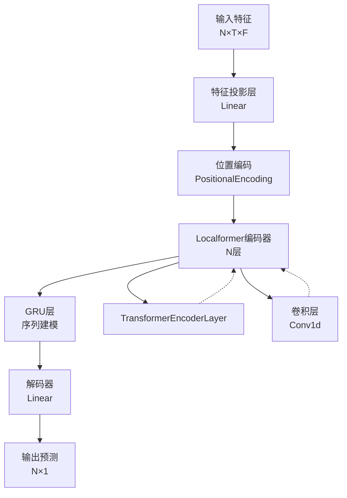
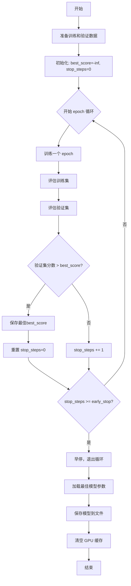
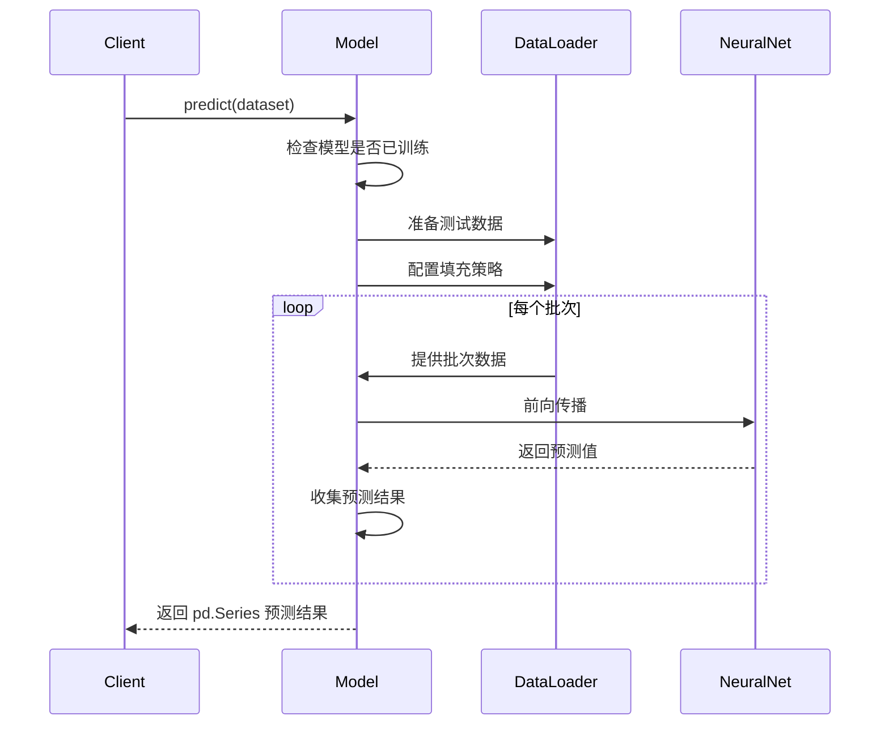
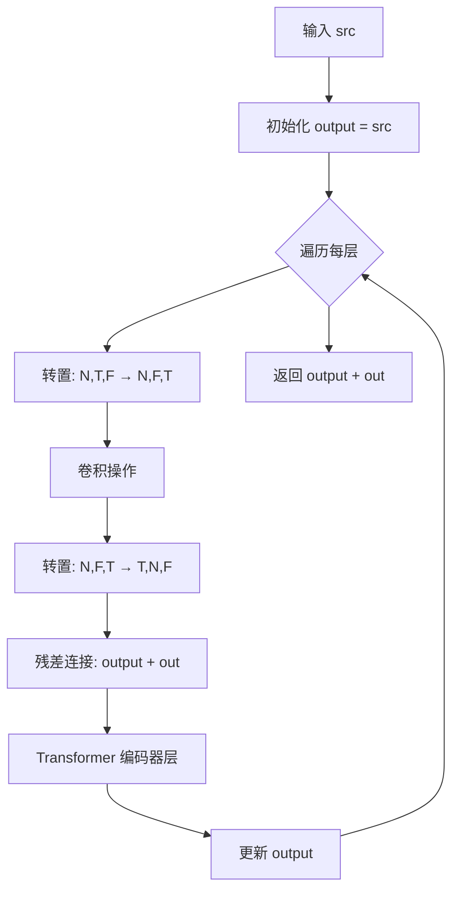
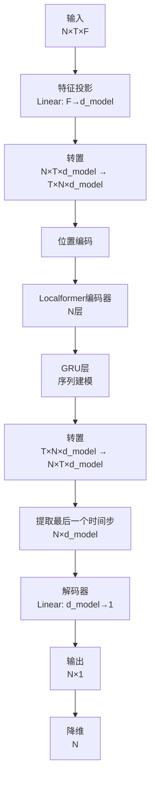

# PyTorch Localformer 时间序列模型

## 模块概述

`pytorch_localformer_ts.py` 实现了一个基于 PyTorch 的时间序列预测模型，结合了 Transformer 和局部卷积特征提取的优势。该模型适用于量化投资中的时间序列预测任务，特别是股票价格、收益率等金融时间序列的预测。

### 主要特性

- **混合架构**：结合了 Transformer 的全局注意力机制和 CNN 的局部特征提取能力
- **位置编码**：使用正弦余弦位置编码捕获时间序列的位置信息
- **局部增强**：通过卷积层增强局部时间窗口的特征表示
- **序列建模**：使用 GRU 捕获时间依赖关系
- **早停机制**：支持训练过程中的早停，防止过拟合
- **GPU 加速**：支持 CUDA 加速训练和推理

### 模型架构图



## 核心类定义

### 1. LocalformerModel

**类说明**：主模型类，继承自 `Model` 基类，实现了完整的训练、验证和预测流程。

#### 构造方法参数

| 参数名 | 类型 | 默认值 | 说明 |
|--------|------|--------|------|
| `d_feat` | int | 20 | 输入特征维度 |
| `d_model` | int | 64 | 模型隐藏层维度 |
| `batch_size` | int | 8192 | 批次大小 |
| `nhead` | int | 2 | 多头注意力的头数 |
| `num_layers` | int | 2 | Transformer 编码器层数 |
| `dropout` | float | 0 | Dropout 比例 |
| `n_epochs` | int | 100 | 训练轮数 |
| `lr` | float | 0.0001 | 学习率 |
| `metric` | str | "" | 评估指标 |
| `early_stop` | int | 5 | 早停容忍轮数 |
| `loss` | str | "mse" | 损失函数类型 |
| `optimizer` | str | "adam" | 优化器类型 |
| `reg` | float | 1e-3 | L2 正则化系数 |
| `n_jobs` | int | 10 | 数据加载的工作线程数 |
| `GPU` | int | 0 | GPU 设备编号（-1 表示使用 CPU） |
| `seed` | int | None | 随机种子 |

#### 方法详解

##### `use_gpu` (属性)

**说明**：判断当前是否使用 GPU 进行计算

**返回值**：
- `bool`：如果使用 GPU 返回 True，否则返回 False

##### `mse(pred, label)`

**说明**：计算均方误差（Mean Squared Error）

**参数**：
- `pred` (torch.Tensor)：预测值
- `label` (torch.Tensor)：真实标签

**返回值**：
- `torch.Tensor`：均方误差值

**示例代码**：
```python
pred = torch.tensor([1.0, 2.0, 3.0])
label = torch.tensor([1.1, 2.2, 3.3])
loss = model.mse(pred, label)  # 计算MSE
```

##### `loss_fn(pred, label)`

**说明**：计算损失函数，支持自动处理缺失值

**参数**：
- `pred` (torch.Tensor)：预测值
- `label` (torch.Tensor)：真实标签

**返回值**：
- `torch.Tensor`：损失值

**说明**：
- 自动忽略 `NaN` 值
- 目前仅支持 MSE 损失

##### `metric_fn(pred, label)`

**说明**：计算评估指标

**参数**：
- `pred` (torch.Tensor)：预测值
- `label` (torch.Tensor)：真实标签

**返回值**：
- `torch.Tensor`：指标值（负损失，值越大越好）

**说明**：
- 仅计算有限值（finite）的样本
- 默认返回负损失

##### `train_epoch(data_loader)`

**说明**：训练一个 epoch

**参数**：
- `data_loader` (DataLoader)：训练数据加载器

**训练流程**：
1. 模型设置为训练模式
2. 遍历数据批次
3. 前向传播计算预测值
4. 计算损失
5. 反向传播更新参数
6. 应用梯度裁剪（梯度值限制在 3.0 以内）

**数据格式**：
- 输入：`[N, T, F]`，其中最后一维为标签
- 特征：`data[:, :, 0:-1]`
- 标签：`data[:, -1, -1]`（最后一个时间步的标签）

##### `test_epoch(data_loader)`

**说明**：验证一个 epoch，返回损失和指标

**参数**：
- `data_loader` (DataLoader)：验证数据加载器

**返回值**：
- `tuple[float, float]`：(平均损失, 平均指标)

**说明**：
- 模型设置为评估模式
- 不计算梯度
- 返回所有批次的平均值

##### `fit(dataset, evals_result, save_path)`

**说明**：训练模型

**参数**：
- `dataset` (DatasetH)：训练数据集，需包含训练集和验证集
- `evals_result` (dict)：用于存储训练过程的评估结果
- `save_path` (str)：模型保存路径

**训练流程图**：



**关键步骤**：

1. **数据准备**：
   ```python
   dl_train = dataset.prepare("train", col_set=["feature", "label"], data_key=DataHandlerLP.DK_L)
   dl_valid = dataset.prepare("valid", col_set=["feature", "label"], data_key=DataHandlerLP.DK_L)
   ```

2. **数据填充配置**：
   - 使用 `ffill+bfill` 处理缺失值

3. **早停机制**：
   - 当验证集分数不再提升时增加计数
   - 达到 `early_stop` 次后停止训练

4. **模型保存**：
   - 保存最佳模型参数到指定路径

**示例代码**：
```python
from qlib.contrib.model.pytorch_localformer_ts import LocalformerModel
from qlib.data.dataset import DatasetH

# 创建模型
model = LocalformerModel(
    d_feat=20,
    d_model=64,
    batch_size=2048,
    n_epochs=100,
    lr=0.0001,
    early_stop=5,
    GPU=0
)

# 准备数据集
dataset = DatasetH(handler=handler, segments={"train": train_ds, "valid": valid_ds})

# 训练模型
evals_result = {}
model.fit(dataset, evals_result=evals_result, save_path="./models/localformer.pt")
```

##### `predict(dataset)`

**说明**：使用训练好的模型进行预测

**参数**：
- `dataset` (DatasetH)：测试数据集

**返回值**：
- `pd.Series`：预测结果，索引为测试集的时间索引

**预测流程**：



**说明**：
- 必须先调用 `fit()` 方法训练模型
- 不计算梯度，提高推理速度
- 结果为 pandas Series，便于后续分析

**示例代码**：
```python
# 准备测试数据集
test_ds = pd.DataFrame(...)
dataset = DatasetH(handler=handler, segments={"test": test_ds})

# 进行预测
preds = model.predict(dataset)

print(f"预测结果数量: {len(preds)}")
print(f"前5个预测值: {preds.head()}")
```

---

### 2. PositionalEncoding

**类说明**：位置编码模块，为 Transformer 提供位置信息。

#### 构造方法参数

| 参数名 | 类型 | 默认值 | 说明 |
|--------|------|--------|------|
| `d_model` | int | 必需 | 模型维度 |
| `max_len` | int | 1000 | 最大序列长度 |

#### 方法详解

##### `forward(x)`

**说明**：添加位置编码到输入

**参数**：
- `x` (torch.Tensor)：输入张量，形状为 `[T, N, F]`

**返回值**：
- `torch.Tensor`：添加位置编码后的张量

**数学原理**：

位置编码使用正弦和余弦函数：

```
PE(pos, 2i) = sin(pos / 10000^(2i/d_model))
PE(pos, 2i+1) = cos(pos / 10000^(2i/d_model))
```

其中：
- `pos`：位置索引
- `i`：维度索引

**优势**：
- 允许模型学习相对位置关系
- 可以外推到训练时未见过的序列长度

---

### 3. LocalformerEncoder

**类说明**：Localformer 编码器，结合了 Transformer 和卷积层。

#### 构造方法参数

| 参数名 | 类型 | 默认值 | 说明 |
|--------|------|--------|------|
| `encoder_layer` | TransformerEncoderLayer | 必需 | Transformer 编码器层 |
| `num_layers` | int | 必需 | 编码器层数 |
| `d_model` | int | 必需 | 模型维度 |

#### 属性

- `layers` (ModuleList)：Transformer 编码器层列表
- `conv` (ModuleList)：卷积层列表（每层一个）
- `num_layers` (int)：层数

#### 方法详解

##### `forward(src, mask)`

**说明**：前向传播，执行 Localformer 编码

**参数**：
- `src` (torch.Tensor)：源序列张量
- `mask` (torch.Tensor)：注意力掩码

**返回值**：
- `torch.Tensor`：编码后的张量

**处理流程**：



**关键操作**：
1. 每层先应用 1D 卷积提取局部特征
2. 将卷积输出与 Transformer 输出进行残差连接
3. 逐层堆叠，形成深度特征提取

**数据变换**：
```
原始: [T, N, F]
转置1: [N, T, F] → [N, F, T]
卷积: [N, F, T]
转置2: [N, F, T] → [N, T, F] → [T, N, F]
```

---

### 4. Transformer

**类说明**：完整的 Transformer 模型，包含特征投影、位置编码、Localformer 编码器、GRU 和解码器。

#### 构造方法参数

| 参数名 | 类型 | 默认值 | 说明 |
|--------|------|--------|------|
| `d_feat` | int | 6 | 输入特征维度 |
| `d_model` | int | 8 | 模型隐藏层维度 |
| `nhead` | int | 4 | 多头注意力头数 |
| `num_layers` | int | 2 | 编码器层数 |
| `dropout` | float | 0.5 | Dropout 比例 |
| `device` | torch.device | None | 计算设备 |

#### 模型组件

| 组件 | 类型 | 说明 |
|------|------|------|
| `rnn` | nn.GRU | GRU 循环神经网络，用于序列建模 |
| `feature_layer` | nn.Linear | 特征投影层，将输入特征映射到模型维度 |
| `pos_encoder` | PositionalEncoding | 位置编码模块 |
| `encoder_layer` | nn.TransformerEncoderLayer | 标准 Transformer 编码器层 |
| `transformer_encoder` | LocalformerEncoder | Localformer 编码器 |
| `decoder_layer` | nn.Linear | 解码器，输出预测值 |

#### 方法详解

##### `forward(src)`

**说明**：完整的前向传播

**参数**：
- `src` (torch.Tensor)：输入张量，形状为 `[N, T, F]`

**返回值**：
- `torch.Tensor`：预测值，形状为 `[N]`

**完整流程图**：



**详细步骤**：

1. **特征投影**：
   ```python
   src = self.feature_layer(src)  # [N, T, F] → [N, T, d_model]
   ```

2. **维度调整**：
   ```python
   src = src.transpose(1, 0)  # [N, T, d_model] → [T, N, d_model]
   ```

3. **位置编码**：
   ```python
   src = self.pos_encoder(src)  # 添加位置信息
   ```

4. **Localformer 编码**：
   ```python
   output = self.transformer_encoder(src, mask)  # [T, N, d_model]
   ```

5. **GRU 序时建模**：
   ```python
   output, _ = self.rnn(output)  # [T, N, d_model]
   ```

6. **解码并输出**：
   ```python
   output = self.decoder_layer(output.transpose(1, 0)[:, -1, :])  # [N, 1]
   return output.squeeze()  # [N]
   ```

---

## 辅助函数

### `_get_clones(module, N)`

**说明**：深度复制模块 N 次，创建模块列表

**参数**：
- `module` (nn.Module)：要复制的模块
- `N` (int)：复制次数

**返回值**：
- `ModuleList`：包含 N 个独立模块的列表

**用途**：为 LocalformerEncoder 的每层创建独立的卷积层和 Transformer 层

**示例代码**：
```python
# 创建 3 个相同的卷积层
conv_layers = _get_clones(nn.Conv1d(64, 64, 3, 1, 1), 3)
```

---

## 完整使用示例

### 示例 1：基本训练和预测

```python
import pandas as pd
import numpy as np
from qlib.contrib.model.pytorch_localformer_ts import LocalformerModel
from qlib.data.dataset import DatasetH
from qlib.data.dataset.handler import DataHandlerLP
from qlib.workflow import R
from qlib.workflow.record_temp import SigAnaRecord

# 1. 准备数据
# 假设已有特征和标签数据
train_df = pd.DataFrame(...)  # 训练数据
valid_df = pd.DataFrame(...)  # 验证数据
test_df = pd.DataFrame(...)   # 测试数据

# 2. 创建数据处理器
handler = {
    "class": "Alpha360",
    "module_path": "qlib.contrib.data.handler",
    "kwargs": {
        "fit_start": "2010-01-01",
        "fit_end": "2015-12-31",
        "instruments": "all",
    }
}

# 3. 创建数据集
dataset = DatasetH(
    handler=handler,
    segments={
        "train": train_df,
        "valid": valid_df,
        "test": test_df
    }
)

# 4. 创建模型
model = LocalformerModel(
    d_feat=20,          # 特征维度
    d_model=64,         # 隐藏层维度
    batch_size=2048,    # 批次大小
    nhead=2,            # 注意力头数
    num_layers=2,       # 编码器层数
    dropout=0.2,        # Dropout
    n_epochs=100,       # 训练轮数
    lr=0.0001,          # 学习率
    early_stop=5,       # 早停
    loss="mse",         # 损失函数
    optimizer="adam",  # 优化器
    reg=1e-3,           # 正则化
    n_jobs=10,          # 工作线程
    GPU=0               # GPU设备
)

# 5. 训练模型
print("开始训练...")
evals_result = {}
model.fit(
    dataset,
    evals_result=evals_result,
    save_path="./models/localformer_model.pt"
)

# 6. 查看训练过程
import matplotlib.pyplot as plt

plt.figure(figsize=(12, 6))
plt.plot(evals_result["train"], label="Train Score")
plt.plot(evals_result["valid"], label="Valid Score")
plt.xlabel("Epoch")
plt.ylabel("Score")
plt.title("Training Progress")
plt.legend()
plt.savefig("training_curve.png")

# 7. 预测
print("开始预测...")
preds = model.predict(dataset)

# 8. 评估结果
from qlib.evaluate import risk_analysis

analysis = risk_analysis(preds, test_df["label"].values)
print("IC:", analysis["IC"])
print("Rank IC:", analysis["Rank IC"])
print("ICIR:", analysis["ICIR"])
```

### 示例 2：超参数调优

```python
from itertools import product

# 定义超参数搜索空间
param_grid = {
    "d_model": [32, 64, 128],
    "num_layers": [2, 3, 4],
    "lr": [0.0001, 0.001, 0.01],
    "batch_size": [1024, 2048, 4096]
}

best_score = -np.inf
best_params = None

# 网格搜索
for params in product(*param_grid.values()):
    param_dict = dict(zip(param_grid.keys(), params))

    print(f"尝试参数: {param_dict}")

    model = LocalformerModel(
        d_feat=20,
        **param_dict,
        n_epochs=50,      # 减少训练轮数以加速搜索
        early_stop=3,
        GPU=0
    )

    evals_result = {}
    model.fit(dataset, evals_result=evals_result)

    best_valid_score = max(evals_result["valid"])

    if best_valid_score > best_score:
        best_score = best_valid_score
        best_params = param_dict
        print(f"发现更好的参数组合！分数: {best_score}")

print(f"最佳参数: {best_params}")
print(f"最佳分数: {best_score}")
```

### 示例 3：集成训练和回测

```python
from qlib.backtest import backtest_executor
from qlib.backtest.executor import SimulatorExecutor
from qlib.contrib.strategy import TopkDropoutStrategy

# 使用最佳参数训练模型
model = LocalformerModel(
    d_feat=20,
    d_model=64,
    batch_size=2048,
    nhead=2,
    num_layers=2,
    n_epochs=100,
    lr=0.0001,
    early_stop=5,
    GPU=0
)

model.fit(
    dataset,
    evals_result={},
    save_path="./models/final_localformer.pt"
)

# 生成预测信号
preds = model.predict(dataset)

# 配置回测
backtest_config = {
    "executor": {
        "class": "SimulatorExecutor",
        "module_path": "qlib.backtest.executor",
        "kwargs": {
            "time_per_step": "day",
            "generate_portfolio_metrics": True
        }
    },
    "strategy": {
        "class": "TopkDropoutStrategy",
        "module_path": "qlib.contrib.strategy",
        "kwargs": {
            "signal": preds,
            "topk": 50,
            "n_drop": 5
        }
    },
    "backtest": {
        "start_time": "2016-01-01",
        "end_time": "2020-12-31",
        "account": 100000000,
        "exchange": {
            "class": "Exchange",
            "module_path": "qlib.backtest.exchange",
            "kwargs": {
                "freq": "day",
                "limit_threshold": 0.095,
                "deal_price": "close",
                "open_cost": 0.0005,
                "close_cost": 0.0015,
                "min_cost": 5
            }
        }
    }
}

# 运行回测
portfolio = backtest_executor(backtest_config)

# 分析结果
print(f"总收益率: {portfolio.get_cumulative_return():.2%}")
print(f"年化收益率: {portfolio.get_annualized_return():.2%}")
print(f"夏普比率: {portfolio.get_sharpe_ratio():.2f}")
print(f"最大回撤: {portfolio.get_max_drawdown():.2%}")
```

### 示例 4：模型导出和加载

```python
import torch

# 训练并保存模型
model = LocalformerModel(
    d_feat=20,
    d_model=64,
    batch_size=2048,
    n_epochs=100,
    early_stop=5,
    GPU=0
)

model.fit(
    dataset,
    evals_result={},
    save_path="./models/localformer_model.pt"
)

# 保存完整的模型配置
import pickle
with open("./models/localformer_config.pkl", "wb") as f:
    pickle.dump({
        "d_feat": 20,
        "d_model": 64,
        "batch_size": 2048,
        "nhead": 2,
        "num_layers": 2,
        "dropout": 0.2,
        "n_epochs": 100,
        "lr": 0.0001,
        "early_stop": 5,
        "loss": "mse",
        "optimizer": "adam",
        "reg": 1e-3,
        "n_jobs": 10,
        "GPU": 0
    }, f)

# 加载模型
with open("./models/localformer_config.pkl", "rb") as f:
    config = pickle.load(f)

loaded_model = LocalformerModel(**config)
loaded_model.model.load_state_dict(torch.load("./models/localformer_model.pt"))
loaded_model.fitted = True

# 使用加载的模型进行预测
preds = loaded_model.predict(test_dataset)
```

---

## 模型架构详解

### Localformer 的创新点

Localformer 结合了以下三种技术的优势：

1. **Transformer**：全局注意力机制，捕获长程依赖
2. **CNN**：卷积层提取局部时间窗口的特征
3. **RNN (GRU)**：序列建模，捕获时序动态

### 计算复杂度

| 组件 | 复杂度 | 说明 |
|------|--------|------|
| 特征投影 | O(N×T×F×d_model) | 线性变换 |
| 位置编码 | O(T×d_model) | 预计算 |
| Transformer | O(N×T²×d_model) | 注意力计算 |
| 卷积层 | O(N×T×d_model) | 1D卷积 |
| GRU | O(N×T×d_model²) | 序列建模 |
| 解码器 | O(N×d_model) | 线性输出 |

### 内存优化建议

1. **梯度累积**：对于大模型，使用梯度累积以减少内存占用
2. **混合精度训练**：使用 FP16 加速训练并减少内存
3. **数据加载优化**：调整 `n_jobs` 参数平衡速度和内存
4. **早停机制**：尽早停止训练，避免无效计算

### 性能调优建议

1. **批次大小**：
   - GPU 内存充足时增大批次大小
   - 训练不稳定时减小批次大小

2. **学习率**：
   - 使用学习率调度器（如 CosineAnnealingLR）
   - 监控损失曲线，适时调整

3. **模型维度**：
   - `d_model` 控制模型容量
   - 更大的模型需要更多数据和正则化

4. **层数和头数**：
   - `num_layers` 控制深度
   - `nhead` 控制多头注意力的并行度
   - 一般设置 `d_model % nhead == 0`

---

## 常见问题

### Q1: 如何处理不同长度的序列？

**A**: Localformer 使用固定的序列长度处理。如果输入序列长度不一致，需要：
- 填充（padding）到相同长度
- 使用 DataHandlerLP 的 `fillna_type` 配置
- 推荐使用 `"ffill+bfill"` 填充策略

### Q2: 训练时显存不足怎么办？

**A**: 可以尝试以下方法：
1. 减小 `batch_size`
2. 减小 `d_model` 或 `num_layers`
3. 使用梯度检查点（gradient checkpointing）
4. 减少 `n_jobs`（数据加载线程数）
5. 使用混合精度训练

### Q3: 如何监控训练过程？

**A**:
1. 使用 `evals_result` 参数记录训练和验证分数
2. 可视化训练曲线
3. 设置适当的 `early_stop` 参数
4. 定期保存模型检查点

### Q4: 模型预测结果如何解释？

**A**:
- 输出为预测值（如预期收益率）
- 正值表示预测上涨，负值表示预测下跌
- 绝对值大小表示置信度
- 可以与其他特征组合构建交易策略

### Q5: 如何与 Qlib 工作流集成？

**A**:
```python
# 在 workflow config 中使用
{
    "class": "LocalformerModel",
    "module_path": "qlib.contrib.model.pytorch_localformer_ts",
    "kwargs": {
        "d_feat": 20,
        "d_model": 64,
        "batch_size": 2048,
        "n_epochs": 100,
        "early_stop": 5,
        "GPU": 0
    }
}
```

---

## 参考文献

1. Vaswani et al. "Attention Is All You Need", 2017
2. Wu et al. "Localformer: Transformers with Localized Attention", 2021
3. Qlib Documentation: https://qlib.readthedocs.io/

---

## 版本信息

- Qlib 版本: 0.9.0+
- Python 版本: 3.8+
- PyTorch 版本: 1.7+
