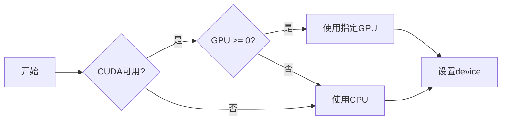
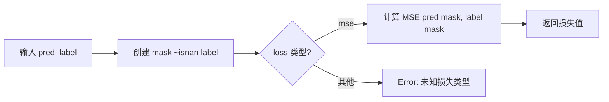
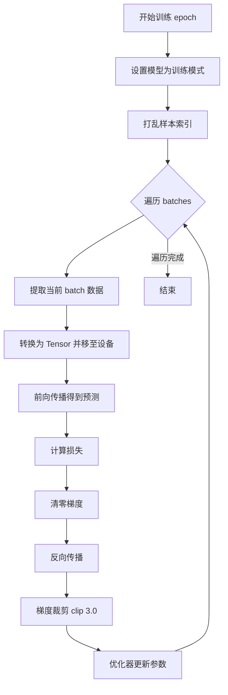
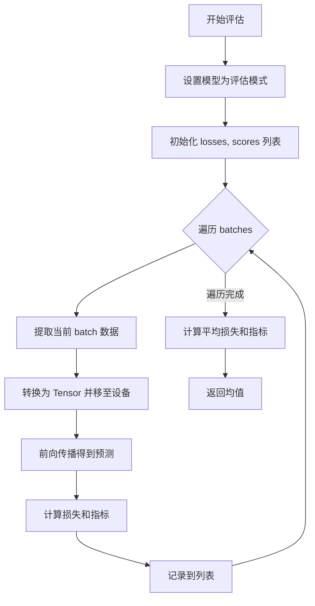
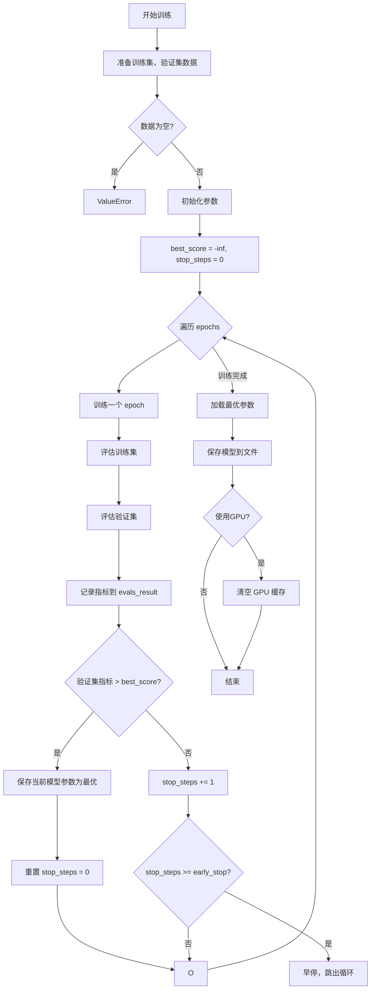
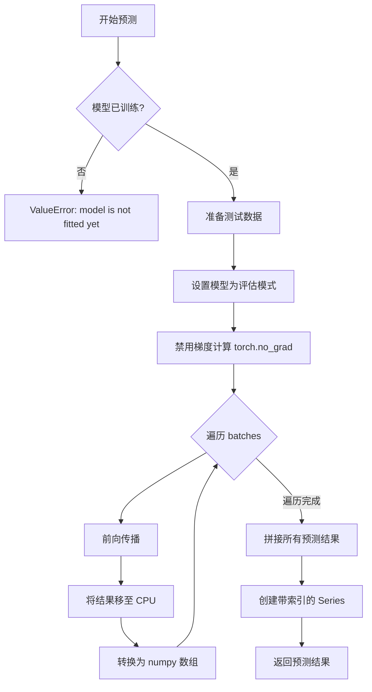
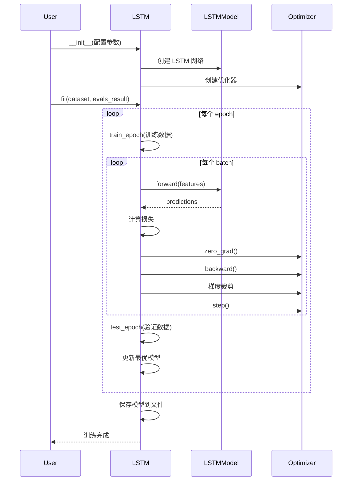

# PyTorch LSTM 模型文档

## 模块概述

`pytorch_lstm.py` 模块提供了基于 PyTorch 的 LSTM（长短期记忆网络）模型实现，用于量化投资中的时间序列预测任务。该模块包含两个核心类：

- **LSTM**：主模型类，继承自 Qlib 的 `Model` 基类，负责模型的训练、验证和预测流程管理
- **LSTMModel**：PyTorch 神经网络模块，定义 LSTM 网络结构和前向传播逻辑

该模块支持 GPU 加速、早停机制、多种优化器（Adam、SGD）和自定义损失函数，适用于股票收益预测等金融时间序列任务。

## 核心类定义

### 1. LSTM 类

LSTM 类是模型的主要封装类，继承自 `qlib.model.base.Model`，提供了完整的训练和预测接口。

```python
class LSTM(Model)
```

**功能说明**：
- 封装 PyTorch LSTM 模型的完整训练流程
- 支持训练集、验证集和测试集的划分
- 实现早停（Early Stop）机制防止过拟合
- 支持 GPU 加速训练
- 自动保存最优模型参数

---

## 构造方法参数

### LSTM.__init__()

| 参数名 | 类型 | 默认值 | 说明 |
|--------|------|--------|------|
| `d_feat` | int | 6 | 输入特征维度，每个时间步的特征数量 |
| `hidden_size` | int | 64 | LSTM 隐藏层大小 |
| `num_layers` | int | 2 | LSTM 层数 |
| `dropout` | float | 0.0 | Dropout 比例，用于防止过拟合 |
| `n_epochs` | int | 200 | 训练轮数（epochs） |
| `lr` | float | 0.001 | 学习率 |
| `metric` | str | "" | 评估指标，用于早停判断 |
| `batch_size` | int | 2000 | 批处理大小 |
| `early_stop` | int | 20 | 早停耐心值，验证集指标不提升的容忍轮数 |
| `loss` | str | "mse" | 损失函数类型，目前支持 "mse" |
| `optimizer` | str | "adam" | 优化器类型，支持 "adam" 或 "gd"（SGD） |
| `GPU` | str/int | 0 | GPU ID，-1 或负数表示使用 CPU |
| `seed` | int/None | None | 随机种子，用于结果复现 |
| `**kwargs` | dict | - | 其他参数 |

**设备自动选择逻辑**：


---

## 方法详细说明

### use_gpu（属性）

**类型**：`@property`

**返回值**：`bool`

**说明**：返回当前是否使用 GPU 进行训练

**示例**：
```python
if model.use_gpu:
    print("模型正在使用 GPU 训练")
```

---

### mse(pred, label)

计算均方误差（Mean Squared Error）损失。

**参数**：
- `pred` (torch.Tensor)：模型预测值
- `label` (torch.Tensor)：真实标签值

**返回值**：
- `torch.Tensor`：标量损失值

**公式**：
$$MSE = \frac{1}{n} \sum_{i=1}^{n} (pred_i - label_i)^2$$

**示例**：
```python
pred = torch.tensor([1.0, 2.0, 3.0])
label = torch.tensor([1.5, 2.5, 3.5])
loss = model.mse(pred, label)
# loss ≈ 0.25
```

---

### loss_fn(pred, label)

统一的损失函数接口，支持处理缺失值。

**参数**：
- `pred` (torch.Tensor)：模型预测值
- `label` (torch.Tensor)：真实标签值

**返回值**：
- `torch.Tensor`：标量损失值

**说明**：
- 自动过滤标签为 NaN 的样本
- 目前仅支持 "mse" 损失函数

**实现逻辑**：


---

### metric_fn(pred, label)

评估指标函数，用于模型性能评估。

**参数**：
- `pred` (torch.Tensor)：模型预测值
- `label` (torch.Tensor)：真实标签值

**返回值**：
- `torch.Tensor`：标量指标值（注意：返回负值，因为指标越高越好，但优化时最小化）

**说明**：
- 只计算标签为有限值（非 NaN 且非 Inf）的样本
- 当 metric 为空字符串或 "loss" 时，返回负损失值

---

### train_epoch(x_train, y_train)

训练一个完整的 epoch。

**参数**：
- `x_train` (pd.DataFrame)：训练特征数据
- `y_train` (pd.Series/pd.DataFrame)：训练标签数据

**返回值**：
- `None`（原地更新模型参数）

**训练流程**：


**关键操作**：
1. 将模型设置为训练模式（`model.train()`）
2. 打乱训练数据顺序
3. 批量前向传播和反向传播
4. 梯度裁剪（clip_grad_value_）防止梯度爆炸
5. 优化器参数更新

---

### test_epoch(data_x, data_y)

在验证集或测试集上评估模型。

**参数**：
- `data_x` (pd.DataFrame)：特征数据
- `data_y` (pd.Series/pd.DataFrame)：标签数据

**返回值**：
- `tuple`：(平均损失, 平均指标值)

**评估流程**：


---

### fit(dataset, evals_result, save_path)

训练模型的主方法，包含完整的训练、验证和早停逻辑。

**参数**：
- `dataset` (DatasetH)：Qlib 数据集对象
- `evals_result` (dict)：用于记录训练历史的字典，默认为空
- `save_path` (str/None)：模型保存路径

**返回值**：
- `None`（训练完成后模型参数已保存）

**完整训练流程**：


**早停机制说明**：
- 当验证集指标连续 `early_stop` 轮没有提升时，停止训练
- 自动保存验证集指标最高的模型参数
- 训练结束后加载最优参数并保存到文件

**日志输出示例**：
```
LSTM pytorch version...
LSTM parameters setting:
d_feat : 6
hidden_size : 64
num_layers : 2
...
training...
Epoch0:
training...
evaluating...
train -0.123456, valid -0.234567
Epoch1:
...
best score: -0.123456 @ 10
early stop
```

---

### predict(dataset, segment)

使用训练好的模型进行预测。

**参数**：
- `dataset` (DatasetH)：Qlib 数据集对象
- `segment` (Union[Text, slice])：数据集分段，默认为 "test"

**返回值**：
- `pd.Series`：预测结果，索引与数据集一致

**预测流程**：


**使用示例**：
```python
# 预测测试集
predictions = model.predict(dataset, segment="test")

# 预测训练集
train_preds = model.predict(dataset, segment="train")

# 预测验证集
valid_preds = model.predict(dataset, segment="valid")
```

---

### 2. LSTMModel 类

LSTMModel 类是 PyTorch 神经网络模块，定义具体的网络结构。

```python
class LSTMModel(nn.Module)
```

**网络结构**：
```
输入: [N, F*T]
  ↓ reshape [N, F, T]
  ↓ permute [N, T, F]
  ↓ LSTM(num_layers)
  ↓ 取最后时间步输出 [:, -1, :]
  ↓ Linear(hidden_size → 1)
输出: [N]
```

其中：
- N：batch size
- F：特征数量 (d_feat)
- T：时间步数

---

## LSTMModel 方法

### LSTMModel.__init__(d_feat, hidden_size, num_layers, dropout)

构造 LSTM 神经网络。

**参数**：
- `d_feat` (int)：输入特征维度
- `hidden_size` (int)：LSTM 隐藏层大小
- `num_layers` (int)：LSTM 层数
- `dropout` (float)：层间 dropout 比例

**网络组件**：
- `self.rnn`：`nn.LSTM` 层
- `self.fc_out`：`nn.Linear` 全连接输出层

---

### LSTMModel.forward(x)

前向传播计算。

**参数**：
- `x` (torch.Tensor)：输入张量，形状为 `[N, F*T]`

**返回值**：
- `torch.Tensor`：输出张量，形状为 `[N]`

**数据变换过程**：


**示例**：
```python
# 假设 d_feat=6, T=10, batch_size=100
x = torch.randn(100, 60)  # [100, 6×10]
output = model.forward(x)  # [100]
```

---

## 完整使用示例

### 示例 1：基本使用

```python
import pandas as pd
import numpy as np
from qlib.contrib.model.pytorch_lstm import LSTM

# 创建模型实例
model = LSTM(
    d_feat=6,           # 输入特征维度
    hidden_size=64,     # LSTM 隐藏层大小
    num_layers=2,       # LSTM 层数
    dropout=0.0,        # Dropout 比例
    n_epochs=200,       # 训练轮数
    lr=0.001,           # 学习率
    metric="",          # 评估指标
    batch_size=2000,    # 批大小
    early_stop=20,      # 早停耐心值
    loss="mse",         # 损失函数
    optimizer="adam",   # 优化器
    GPU=0,              # GPU ID
    seed=42,            # 随机种子
)

# 假设已有 Qlib 数据集对象
# model.fit(dataset)

# 预测
# predictions = model.predict(dataset, segment="test")
```

### 示例 2：使用 CPU 训练

```python
# 设置 GPU=-1 使用 CPU
model = LSTM(
    d_feat=6,
    hidden_size=64,
    GPU=-1,  # 使用 CPU
    n_epochs=100,
)

print(f"使用 GPU: {model.use_gpu}")  # False
```

### 示例 3：自定义优化器

```python
# 使用 SGD 优化器
model = LSTM(
    d_feat=6,
    hidden_size=64,
    optimizer="gd",  # SGD
    lr=0.01,         # SGD 通常需要较大的学习率
)
```

### 示例 4：记录训练历史

```python
model = LSTM(d_feat=6, hidden_size=64, n_epochs=200)

# 创建字典记录训练历史
evals_result = {}

# 训练模型
# model.fit(dataset, evals_result=evals_result, save_path="./lstm_model.pt")

# 分析训练历史
train_scores = evals_result["train"]
valid_scores = evals_result["valid"]

import matplotlib.pyplot as plt

plt.figure(figsize=(10, 6))
plt.plot(train_scores, label="Train Score")
plt.plot(valid_scores, label="Valid Score")
plt.xlabel("Epoch")
plt.ylabel("Score")
plt.title("Training History")
plt.legend()
plt.grid(True)
plt.show()
```

### 示例 5：使用不同 Dropout 防止过拟合

```python
model = LSTM(
    d_feat=6,
    hidden_size=64,
    num_layers=2,
    dropout=0.5,  # 较高的 dropout 防止过拟合
    n_epochs=200,
    early_stop=30,  # 增加早停耐心值
)
```

### 示例 6：加载已保存的模型

```python
import torch

# 训练模型
model = LSTM(d_feat=6, hidden_size=64)
# model.fit(dataset, save_path="./lstm_model.pt")

# 加载模型参数
model_params = torch.load("./lstm_model.pt")
model.lstm_model.load_state_dict(model_params)
model.fitted = True  # 标记为已训练

# 现在可以进行预测
# predictions = model.predict(dataset)
```

---

## 训练流程图



---

## 注意事项

1. **GPU 使用**：
   - 确保 CUDA 环境正确安装
   - 使用 `nvidia-smi` 检查 GPU 状态
   - 大数据集建议使用 GPU 加速

2. **内存管理**：
   - 训练结束后会自动清理 GPU 缓存
   - 大 batch_size 可能导致显存不足

3. **早停机制**：
   - `metric` 参数用于确定评估指标
   - 验证集指标不提升超过 `early_stop` 轮时停止

4. **数据格式**：
   - 输入特征形状应为 `[N, F×T]`，其中 F 是特征数，T 是时间步数
   - 模型内部会自动 reshape 和 permute

5. **随机性控制**：
   - 设置 `seed` 参数可复现结果
   - 同时影响 numpy 和 PyTorch 的随机种子

6. **模型保存**：
   - 默认保存模型参数（state_dict）
   - 保存路径通过 `save_path` 指定

7. **梯度裁剪**：
   - 训练时自动裁剪梯度到 [-3.0, 3.0]
   - 防止梯度爆炸导致的训练不稳定

---

## 性能优化建议

1. **Batch Size 选择**：
   - 较大的 batch_size 可提高训练速度
   - 受 GPU 显存限制
   - 建议值：1000-5000

2. **隐藏层大小**：
   - 增大 `hidden_size` 可提高模型容量
   - 但也增加计算量和过拟合风险
   - 建议值：32-256

3. **学习率调整**：
   - Adam 默认学习率 0.001 通常适用
   - SGD 需要更大的学习率（如 0.01）
   - 可根据训练曲线动态调整

4. **Early Stop 设置**：
   - 较大的 `early_stop` 值给予模型更多收敛机会
   - 过大可能导致过拟合
   - 建议值：10-50

5. **数据预处理**：
   - 确保输入数据已标准化或归一化
   - 处理缺失值（模型会自动忽略 NaN 标签）
