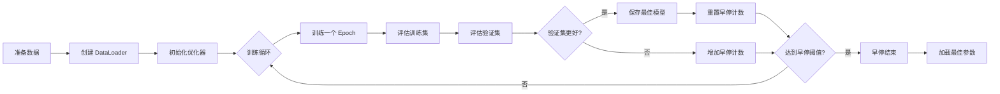

# pytorch_lstm_ts 模块文档

## 模块概述

`pytorch_lstm_ts` 模块实现了一个基于 PyTorch 的 LSTM 时间序列预测模型。该模型专门用于处理时间序列数据，采用 LSTM 网络结构来捕捉时间依赖关系，适用于量化金融预测任务。

## 模块结构

该模块包含两个主要类：
- **LSTM**: 封装的 LSTM 模型类，继承自 Qlib 的 Model 基类
- **LSTMModel**: LSTM 神经网络架构的 PyTorch 实现

---

## LSTM 类

### 类说明

`LSTM` 是一个完整的 LSTM 模型实现，提供了训练、评估和预测的完整流程。该模型支持多线程数据加载、早停机制、样本重权重等功能。

### 构造方法参数

| 参数名 | 类型 | 默认值 | 说明 |
|--------|------|---------|------|
| d_feat | int | 6 | 每个时间步的输入特征维度 |
| hidden_size | int | 64 | LSTM 隐藏层大小 |
| num_layers | int | 2 | LSTM 堆叠层数 |
| dropout | float | 0.0 | Dropout 比率 |
| n_epochs | int | 200 | 训练轮数 |
| lr | float | 0.001 | 学习率 |
| metric | str | "" | 早停使用的评估指标 |
| batch_size | int | 2000 | 批处理大小 |
| early_stop | int | 20 | 早停轮数阈值 |
| loss | str | "mse" | 损失函数类型（mse） |
| optimizer | str | "adam" | 优化器名称（adam 或 gd） |
| n_jobs | int | 10 | 数据加载的工作线程数 |
| GPU | int | 0 | 使用的 GPU ID |
| seed | int | None | 随机种子 |

### 重要方法

#### fit(dataset, evals_result=dict(), save_path=None, reweighter=None)

训练 LSTM 模型。

**参数说明：**
- `dataset`: 训练数据集，必须是 DatasetH 类型
- `evals_result`: 用于记录训练和验证结果的字典
- `save_path`: 模型保存路径
- `reweighter`: 样本权重调整器，用于不平衡数据处理

**训练流程：**
1. 准备训练和验证数据
2. 使用 DataLoader 进行批量数据加载
3. 迭代训练，每个 epoch 后进行验证
4. 应用早停机制防止过拟合
5. 保存最佳模型参数

#### predict(dataset)

使用训练好的模型进行预测。

**参数说明：**
- `dataset`: 预测数据集

**返回：**
- `pd.Series`: 预测结果，索引与输入数据对齐

#### train_epoch(data_loader)

执行一个 epoch 的训练。

**参数说明：**
- `data_loader`: 训练数据加载器

**训练步骤：**
1. 设置模型为训练模式
2. 遍历数据批次
3. 前向传播计算预测值
4. 计算损失并反向传播
5. 更新模型参数

#### test_epoch(data_loader)

在验证集或测试集上评估模型。

**参数说明：**
- `data_loader`: 测试数据加载器

**返回：**
- `tuple`: (平均损失, 平均得分)

---

## LSTMModel 类

### 类说明

`LSTMModel` 是 LSTM 神经网络架构的 PyTorch nn.Module 实现，包含 LSTM 层和输出层。

### 构造方法参数

| 参数名 | 类型 | 默认值 | 说明 |
|--------|------|---------|------|
| d_feat | int | 6 | 输入特征维度 |
| hidden_size | int | 64 | LSTM 隐藏层大小 |
| num_layers | int | 2 | LSTM 层数 |
| dropout | float | 0.0 | Dropout 比率 |

### 网络结构

```
输入: [batch_size, seq_len, d_feat]
    ↓
LSTM 层 (num_layers 层)
    ↓
取最后一个时间步的隐藏状态
    ↓
全连接层: hidden_size → 1
    ↓
输出: [batch_size]
```

### forward(x)

前向传播方法。

**参数说明：**
- `x`: 输入张量，形状为 [batch_size, seq_len, d_feat]

**返回：**
- 输出预测值，形状为 [batch_size]

---

## 使用示例

### 基本使用

```python
from qlib.contrib.model.pytorch_lstm_ts import LSTM

# 创建模型实例
model = LSTM(
    d_feat=6,           # 输入特征维度
    hidden_size=64,      # 隐藏层大小
    num_layers=2,        # LSTM 层数
    dropout=0.0,         # Dropout 比率
    n_epochs=200,        # 训练轮数
    lr=0.001,           # 学习率
    batch_size=2000,     # 批处理大小
    early_stop=20,      # 早停轮数
    optimizer="adam",     # 优化器
    GPU=0               # 使用 GPU 0
)

# 训练模型
model.fit(
    dataset=dataset,
    evals_result=evals_result,
    save_path="./model.bin"
)

# 进行预测
predictions = model.predict(test_dataset)
```

### 使用样本重权重

```python
from qlib.contrib.model.pytorch_lstm_ts import LSTM
from qlib.contrib.data.dataset.handler import DataHandlerLP

# 创建带样本权重的模型
model = LSTM(
    d_feat=6,
    hidden_size=64,
    n_jobs=10
)

# 使用 reweighter 处理样本不平衡
model.fit(
    dataset=dataset,
    reweighter=reweighter  # Reweighter 实例
)
```

---

## 模型架构图

```mermaid
graph TB
    A[输入序列<br/>[batch, seq_len, d_feat]] --> B[LSTM层<br/>hidden_size=64<br/>num_layers=2]
    B --> C[取最后时间步<br/>hidden状态]
    C --> D[全连接层<br/>64 → 1]
    D --> E[输出预测<br/>[batch]]

    style A fill: #e1f5fe
    style B fill: #fff9c4
    style C fill: #e8f5e9
    style D fill: #fff9c4
    style E fill: #e1f5fe
```

---

## 训练流程图



---

## 注意事项

1. **数据格式要求**：
   - 数据集必须包含 "feature" 和 "label" 列
   - 特征数据形状应为 [样本数, 时间步长, 特征数]

2. **内存管理**：
   - 使用 DataLoader 时会消耗较多内存
   - 大数据集建议使用较小的 batch_size

3. **GPU 使用**：
   - 自动检测 CUDA 可用性
   - 当 GPU 不可用时自动切换到 CPU

4. **早停机制**：
   - 基于验证集评分
   - 默认使用损失函数的负值作为评分

5. **随机种子**：
   - 设置 seed 可保证结果可复现
   - 同时设置 numpy 和 torch 的随机种子

---

## 性能优化建议

1. **数据加载优化**：
   - 调整 `n_jobs` 参数以优化数据加载速度
   - 典型值为 CPU 核心数

2. **批处理大小**：
   - 较大的 batch_size 可提高训练速度
   - 但会增加内存消耗

3. **学习率调整**：
   - Adam 优化器通常使用 0.001
   - SGD 优化器可能需要更小的学习率

4. **模型复杂度**：
   - 增加 hidden_size 可提升模型容量
   - 增加 num_layers 可捕捉更复杂的时序依赖
   - 但也会增加过拟合风险
