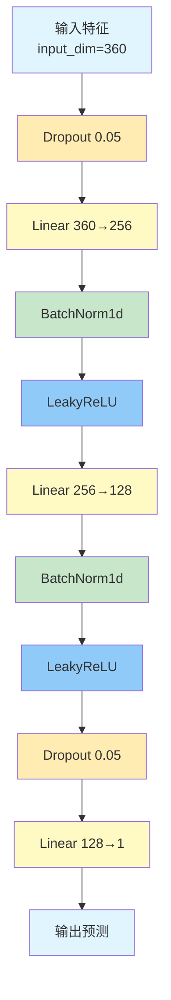
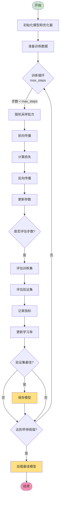

# pytorch_nn 模块文档

## 模块概述

`pytorch_nn` 模块实现了一个基于 PyTorch 的深度神经网络（DNN）模型。该模块提供了一个灵活的深度学习框架，支持自定义网络架构、多种优化器、学习率调度器和样本重权重等功能。适用于处理高维特征数据的量化预测任务。

## 模块结构

该模块包含三个主要类：
- **DNNModelPytorch**: 完整的 DNN 模型类，继承自 Qlib 的 Model 基类
- **Net**: 神经网络架构的 PyTorch 实现
- **AverageMeter**: 用于计算和存储平均值的辅助类

---

## DNNModelPytorch 类

### 类说明

`DNNModelPytorch` 是一个功能完整的深度神经网络模型实现。它支持自定义网络结构、多种优化器、学习率调度、早停机制，并集成了模型保存和加载功能。

### 构造方法参数

| 参数名 | 类型 | 默认值 | 说明 |
|--------|------|---------|------|
| lr | float | 0.001 | 学习率 |
| max_steps | int | 300 | 最大训练步数 |
| batch_size | int | 2000 | 批处理大小 |
| early_stop_rounds | int | 50 | 早停轮数 |
| eval_steps | int | 20 | 评估间隔步数 |
| optimizer | str | "gd" | 优化器名称（adam 或 gd） |
| loss | str | "mse" | 损失函数类型（mse 或 binary） |
| GPU | int 或 str | 0 | 使用的 GPU 设备 |
| seed | int | None | 随机种子 |
| weight_decay | float | 0.0 | 权重衰减（L2 正则化） |
| data_parall | bool | False | 是否使用数据并行 |
| scheduler | Callable 或 str | "default" | 学习率调度器 |
| init_model | nn.Module | None | 预训练模型 |
| eval_train_metric | bool | False | 是否评估训练集指标 |
| pt_model_uri | str | "qlib.contrib.model.pytorch_nn.Net" | 模型类的 URI |
| pt_model_kwargs | dict | {"input_dim": 360, "layers": (256,)} | 模型初始化参数 |
| valid_key | str | DataHandlerLP.DK_L | 验证集的数据键 |

### 重要方法

#### fit(dataset, evals_result=dict(), verbose=True, save_path=None, reweighter=None)

训练 DNN 模型。

**参数说明：**
- `dataset`: 训练数据集，必须是 DatasetH 类型
- `evals_result`: 用于记录训练和验证结果的字典
- `verbose`: 是否打印训练信息
- `save_path`: 模型保存路径
- `reweighter`: 样本权重调整器，用于不平衡数据处理

**训练流程：**
1. 准备训练和验证数据（使用 valid_key 区分数据键）
2. 将数据转换为 PyTorch 张量并移至 GPU
3. 迭代训练，每 eval_steps 步评估一次
4. 应用早停机制防止过拟合
5. 使用学习率调度器动态调整学习率
6. 保存最佳模型参数

**数据流图：**
```
DatasetH → 准备特征和标签 → 转换为张量 →
应用重权重 → 批量训练 → 评估 → 更新模型
```

#### predict(dataset, segment="test")

使用训练好的模型进行预测。

**参数说明：**
- `dataset`: 数据集
- `segment`: 数据段名称（默认 "test"）

**返回：**
- `pd.Series`: 预测结果，索引与输入数据对齐

#### get_loss(pred, w, target, loss_type)

计算损失值。

**参数说明：**
- `pred`: 模型预测值
- `w`: 样本权重
- `target`: 真实标签
- `loss_type`: 损失函数类型（mse 或 binary）

**支持的损失：**
- `mse`: 均方误差，用于回归任务
- `binary`: 二元交叉熵，用于分类任务

#### get_metric(pred, target, index)

计算评估指标（信息系数 IC）。

**参数说明：**
- `pred`: 预测值
- `target`: 真实标签
- `index`: 数据索引（用于 IC 计算）

**返回：**
- `torch.Tensor`: IC 指标的负值（用于最大化）

#### get_lr()

获取当前学习率。

**返回：**
- `float`: 当前学习率

#### save(filename, **kwargs)

保存模型到文件。

**参数说明：**
- `filename`: 保存路径

#### load(buffer, **kwargs)

从缓冲区加载模型。

**参数说明：**
- `buffer`: 模型数据缓冲区

---

## Net 类

### 类说明

`Net` 是一个灵活的神经网络架构，支持自定义层数、激活函数和批量归一化。

### 构造方法参数

| 参数名 | 类型 | 默认值 | 说明 |
|--------|------|---------|------|
| input_dim | int | - | 输入维度 |
| output_dim | int | 1 | 输出维度 |
| layers | tuple | (256,) | 隐藏层大小列表 |
| act | str | "LeakyReLU" | 激活函数类型（LeakyReLU 或 SiLU） |

### 网络结构

```python
输入层 (input_dim)
    ↓ Dropout(0.05)
    ↓
隐藏层 1: Linear → BatchNorm1d → LeakyReLU
    ↓
隐藏层 2: Linear → BatchNorm1d → LeakyReLU
    ↓
...
    ↓ Dropout(0.05)
    ↓
输出层: Linear (output_dim)
```

### forward(x)

前向传播方法。

**参数说明：**
- `x`: 输入张量

**返回：**
- 输出张量

---

## AverageMeter 类

### 类说明

`AverageMeter` 是一个辅助类，用于计算和存储当前值及平均值，常用于训练过程中的损失和指标统计。

### 方法

| 方法 | 说明 |
|------|------|
| `reset()` | 重置所有统计值 |
| `update(val, n=1)` | 更新统计值，val 为新值，n 为权重 |

---

## 使用示例

### 基本使用

```python
from qlib.contrib.model.pytorch_nn import DNNModelPytorch

# 创建模型实例
model = DNNModelPytorch(
    lr=0.001,
    max_steps=300,
    batch_size=2000,
    early_stop_rounds=50,
    eval_steps=20,
    optimizer="adam",
    loss="mse",
    GPU=0
)

# 训练模型
model.fit(
    dataset=dataset,
    evals_result=evals_result,
    save_path="./model.bin"
)

# 进行预测
predictions = model.predict(test_dataset)
```

### 自定义网络架构

```python
# 定义自定义网络层结构
model = DNNModelPytorch(
    pt_model_kwargs={
        "input_dim": 360,
        "layers": (512, 256, 128, 64),  # 多层网络
    },
    optimizer="adam",
    max_steps=500
)
```

### 使用自定义激活函数

```python
# 使用 SiLU 激活函数
model = DNNModelPytorch(
    pt_model_kwargs={
        "input_dim": 360,
        "layers": (256,),
        "act": "SiLU"  # 使用 SiLU 激活函数
    }
)
```

### 使用样本重权重

```python
from qlib.contrib.data.dataset.weight import Reweighter

# 创建重权重器
reweighter = Reweighter(...)

# 训练时应用重权重
model.fit(
    dataset=dataset,
    reweighter=reweighter
)
```

### 使用数据并行

```python
# 启用多 GPU 数据并行
model = DNNModelPytorch(
    data_parall=True,
    GPU=[0, 1]  # 使用 GPU 0 和 1
)
```

### 自定义学习率调度器

```python
# 创建自定义调度器函数
def custom_scheduler(optimizer):
    return torch.optim.lr_scheduler.CosineAnnealingLR(
        optimizer, T_max=100
    )

model = DNNModelPytorch(
    scheduler=custom_scheduler
)
```

---

## 模型架构图



---

## 训练流程图



---

## 学习率调度器

### 默认调度器（ReduceLROnPlateau）

当验证损失不再下降时自动降低学习率：

```python
ReduceLROnPlateau(
    mode="min",          # 最小化模式
    factor=0.5,         # 学习率乘以 0.5
    patience=10,         # 等待 10 个 epoch
    threshold=0.0001,    # 变化阈值
    threshold_mode="rel", # 相对变化
    cooldown=0,          # 冷却期
    min_lr=0.00001,     # 最小学习率
    eps=1e-08           # 最小变化
)
```

### 自定义调度器

可以传入任何接受 optimizer 参数的可调用对象：

```python
def my_scheduler(optimizer):
    return torch.optim.lr_scheduler.StepLR(
        optimizer, step_size=50, gamma=0.1
    )
```

---

## 损失函数详解

### MSE（均方误差）

用于回归任务，计算预测值与真实值的均方误差：

```python
loss = ((pred - target) ** 2) * weight
return loss.mean()
```

### Binary（二元交叉熵）

用于二分类任务，内置权重支持：

```python
loss = nn.BCEWithLogitsLoss(weight=weight)
return loss(pred, target)
```

---

## 性能优化建议

1. **批处理大小**：
   - 较大的 batch_size 可提高 GPU 利用率
   - 典型值：2000-8192

2. **学习率**：
   - Adam 优化器：0.001-0.01
   - SGD 优化器：0.01-0.1

3. **网络深度**：
   - 增加层数可提升模型容量
   - 但也增加过拟合风险和训练时间

4. **正则化**：
   - 使用 `weight_decay` 参数添加 L2 正则化
   - 典型值：0.0001-0.001

5. **评估频率**：
   - `eval_steps` 控制评估频率
   - 太频繁会增加开销，太少会错过最佳点

---

## 注意事项

1. **数据格式要求**：
   - 数据集必须包含 "feature" 和 "label" 列
   - 特征数据形状应为 [样本数, 特征数]

2. **内存管理**：
   - 大数据集会消耗大量内存
   - 建议使用较小的 batch_size

3. **早停机制**：
   - 基于验证集损失
   - 可通过 `early_stop_rounds` 调整

4. **模型保存**：
   - 自动保存最佳模型
   - 训练完成后恢复最佳参数

5. **GPU 兼容性**：
   - 支持单 GPU 和多 GPU 数据并行
   - 自动检测 CUDA 可用性

6. **随机种子**：
   - 设置 seed 可保证结果可复现
   - 同时设置 numpy 和 torch 的随机种子
