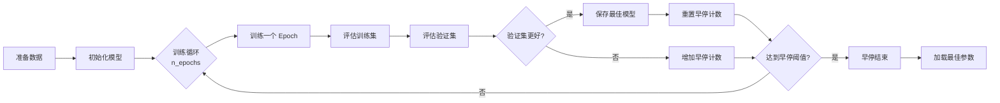

# pytorch_sandwich 模块文档

## 模块概述

`pytorch_sandwich` 模块实现了一个独特的 Sandwich 模型架构。该模型采用"三明治"式堆叠结构，通过两个 CNN+KRNN 编码器的级联来捕捉时间序列数据的多层次特征。适用于需要深层特征提取的量化预测任务。

## 模块结构

该模块包含两个主要类：
- **SandwichModel**: 三明治神经网络架构的 PyTorch 实现
- **Sandwich**: 封装的 Sandwich 模型类，继承自 Qlib 的 Model 基类

---

## SandwichModel 类

### 类说明

`SandwichModel` 是三明治结构的神经网络实现。它由两个 CNN+KRNN 编码器串联而成，第一个编码器处理原始输入，第二个编码器进一步提取特征，最后通过全连接层输出预测结果。

### 构造方法参数

| 参数名 | 类型 | 默认值 | 说明 |
|--------|------|---------|------|
| fea_dim | int | - | 特征维度 |
| cnn_dim_1 | int | - | 第一个 CNN 的隐藏维度 |
| cnn_dim_2 | int | - | 第二个 CNN 的隐藏维度 |
| cnn_kernel_size | int | - | 卷积核大小 |
| rnn_dim_1 | int | - | 第一个 KRNN 的隐藏维度 |
| rnn_dim_2 | int | - | 第二个 KRNN 的隐藏维度 |
| rnn_dups | int | - | KRNN 并行重复次数 |
| rnn_layers | int | - | RNN 层数 |
| dropout | float | - | Dropout 比率 |
| device | torch.device | - | 运行设备（CPU 或 GPU） |

### 网络结构

```
输入: [batch_size, node_num, seq_len, input_dim]
    ↓
第一个 CNN+KRNN 编码器
    ├─ CNN: 提取局部特征
    └─ KRNN: 捕捉时间依赖
    ↓
第二个 CNN+KRNN 编码器
    ├─ CNN: 进一步提取特征
    └─ KRNN: 捕捉深层依赖
    ↓
取最后一个时间步
    ↓
全连接层: rnn_dim_2 → 1
    ↓
输出: [batch_size]
```

### forward(x)

前向传播方法。

**参数说明：**
- `x`: 输入张量，形状为 [batch_size, node_num, seq_len, input_dim]

**返回：**
- 输出预测值，形状为 [batch_size]

---

## Sandwich 类

### 类说明

`Sandwich` 是完整的 Sandwich 模型实现，提供了训练、评估和预测的完整流程。

### 构造方法参数

| 参数名 | 类型 | 默认值 | 说明 |
|--------|------|---------|------|
| fea_dim | int | 6 | 特征维度 |
| cnn_dim_1 | int | 64 | 第一个 CNN 的隐藏维度 |
| cnn_dim_2 | int | 32 | 第二个 CNN 的隐藏维度 |
| cnn_kernel_size | int | 3 | 卷积核大小 |
| rnn_dim_1 | int | 16 | 第一个 KRNN 的隐藏维度 |
| rnn_dim_2 | int | 8 | 第二个 KRNN 的隐藏维度 |
| rnn_dups | int | 3 | KRNN 并行重复次数 |
| rnn_layers | int | 2 | RNN 层数 |
| dropout | float | 0 | Dropout 比率 |
| n_epochs | int | 200 | 训练轮数 |
| lr | float | 0.001 | 学习率 |
| metric | str | "" | 早停使用的评估指标 |
| batch_size | int | 2000 | 批处理大小 |
| early_stop | int | 20 | 早停轮数阈值 |
| loss | str | "mse" | 损失函数类型 |
| optimizer | str | "adam" | 优化器名称 |
| GPU | int | 0 | 使用的 GPU ID |
| seed | int | None | 随机种子 |

### 重要方法

#### fit(dataset, evals_result=dict(), save_path=None)

训练 Sandwich 模型。

**参数说明：**
- `dataset`: 训练数据集，必须是 DatasetH 类型
- `evals_result`: 用于记录训练和验证结果的字典
- `save_path`: 模型保存路径

**训练流程：**
1. 准备训练、验证和测试数据
2. 迭代训练，每个 epoch 后验证
3. 应用早停机制防止过拟合
4. 保存最佳模型参数

#### predict(dataset, segment="test")

使用训练好的模型进行预测。

**参数说明：**
- `dataset`: 数据集
- `segment`: 数据段名称（默认 "test"）

**返回：**
- `pd.Series`: 预测结果，索引与输入数据对齐

#### train_epoch(x_train, y_train)

执行一个 epoch 的训练。

**参数说明：**
- `x_train`: 训练特征数据
- `y_train`: 训练标签数据

#### test_epoch(data_x, data_y)

在数据集上评估模型。

**参数说明：**
- `data_x`: 特征数据
- `data_y`: 标签数据

**返回：**
- `tuple`: (平均损失, 平均得分)

---

## 使用示例

### 基本使用

```python
from qlib.contrib.model.pytorch_sandwich import Sandwich

# 创建模型实例
model = Sandwich(
    fea_dim=6,              # 特征维度
    cnn_dim_1=64,          # 第一个 CNN 隐藏维度
    cnn_dim_2=32,          # 第二个 CNN 隐藏维度
    cnn_kernel_size=3,       # 卷积核大小
    rnn_dim_1=16,          # 第一个 KRNN 隐藏维度
    rnn_dim_2=8,           # 第二个 KRNN 隐藏维度
    rnn_dups=3,            # KRNN 并行重复次数
    rnn_layers=2,           # RNN 层数
    dropout=0,             # Dropout 比率
    n_epochs=200,          # 训练轮数
    lr=0.001,             # 学习率
    batch_size=2000,        # 批处理大小
    early_stop=20,         # 早停轮数
    optimizer="adam",       # 优化器
    GPU=0                 # 使用 GPU 0
)

# 训练模型
model.fit(
    dataset=dataset,
    evals_result=evals_result,
    save_path="./model.bin"
)

# 进行预测
predictions = model.predict(test_dataset)
```

### 自定义模型架构

```python
# 创建更深层的模型
model = Sandwich(
    fea_dim=10,
    cnn_dim_1=128,        # 更大的 CNN
    cnn_dim_2=64,        # 更大的第二个 CNN
    rnn_dim_1=32,        # 更大的 KRNN
    rnn_dim_2=16,
    rnn_dups=5,          # 更多并行 KRNN
    rnn_layers=3,         # 更深的 RNN
    cnn_kernel_size=5      # 更大的卷积核
)
```

---

## 模型架构图

```mermaid
graph TB
    A[输入<br/>[batch, node, seq, dim]] --> B[第一个编码器<br/>CNN + KRNN]
    B --> C[第二个编码器<br/>CNN + KRNN]
    C --> D[取最后时间步]
    D --> E[全连接层<br/>rnn_dim_2 → 1]
    E --> F[输出预测<br/>[batch]]

    B1[CNN 层] --> B2[KRNN 层]
    B --> B1
    B --> B2

    C1[CNN 层] --> C2[KRNN 层]
    C --> C1
    C --> C2

    style A fill: #e1f5fe
    style B fill: #fff9c4
    style C fill: #fff9c4
    style D fill: #e8f5e9
    style E fill: #fff9c4
    style F fill: #e1f5fe
```

---

## 编码器结构详解

### CNN+KRNN 编码器

每个编码器由 CNN 和 KRNN 组成：

1. **CNN（卷积神经网络）**：
   - 提取局部时间模式
   - 卷积核大小可配置
   - 输出维度可配置

2. **KRNN（Key-Recurrent Neural Network）**：
   - 捕捉长期时间依赖
   - 支持并行重复以增强表达能力
   - 多层堆叠加深网络深度

### 三明治优势

1. **层次特征提取**：
   - 第一个编码器：提取原始特征
   - 第二个编码器：提取深层特征

2. **局部与全局结合**：
   - CNN：捕捉局部模式
   - KRNN：捕捉全局依赖

3. **并行重复机制**：
   - 提高模型鲁棒性
   - 增强特征表达能力

---

## 训练流程图



---

## 性能优化建议

1. **CNN 维度配置**：
   - `cnn_dim_1`: 第一个编码器通常使用较大值（64-128）
   - `cnn_dim_2`: 第二个编码器可以较小（32-64）

2. **KRNN 维度配置**：
   - `rnn_dim_1`: 通常设置为 CNN 输出的 1/4 到 1/2
   - `rnn_dim_2`: 进一步减小以聚焦重要特征

3. **并行重复次数**：
   - `rnn_dups` 增加可以提高模型表达能力
   - 但也会增加计算量和内存消耗
   - 典型值：3-5

4. **卷积核大小**：
   - 较小（3-5）：捕捉短时模式
   - 较大（7-11）：捕捉长时模式
   - 可根据数据特性调整

5. **批处理大小**：
   - 较大的 batch_size 提高训练速度
   - 但会增加内存消耗
   - 典型值：2000-5000

---

## 注意事项

1. **数据格式要求**：
   - 数据集必须包含 "feature" 和 "label" 列
   - 特征数据形状应为 [样本数, 节点数, 序列长度, 特征数]

2. **内存消耗**：
   - 双编码器结构会消耗较多内存
   - 大模型可能需要减小 batch_size

3. **GPU 使用**：
   - 自动检测 CUDA 可用性
   - 当 GPU 不可用时自动切换到 CPU

4. **早停机制**：
   - 基于验证集评分
   - 默认使用损失函数的负值作为评分

5. **随机种子**：
   - 设置 seed 可保证结果可复现
   - 同时设置 numpy 和 torch 的随机种子

6. **模型复杂度**：
   - 三明治结构参数较多
   - 建议从小规模开始逐步调优

---

## 依赖模块

该模块依赖以下组件：
- `pytorch_krnn.CNNKRNNEncoder`: CNN+KRNN 编码器实现
- `qlib.model.base.Model`: Qlib 模型基类
- `qlib.data.dataset.DatasetH`: 数据集处理类
- `qlib.data.dataset.handler.DataHandlerLP`: 数据处理器
